http://web.ift.uib.no/Teori/KURS/WRK/TeX/symALL.html 有常用的数学符号的LaTex 写法，下面的 PDF 文件来自该网站

[Latex Math Symbols.pdf](images/EB05AB5AD4CB7E32C5966244916FA959.pdf)

同时我把网站内容复制到这里，方便查询

## 希腊字母(Greek symbols)


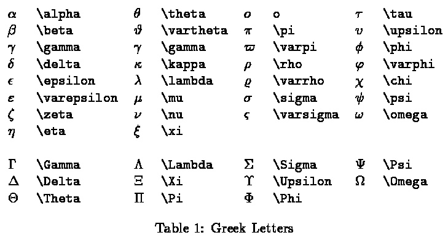

## 二进制操作符(binary operation symbols)


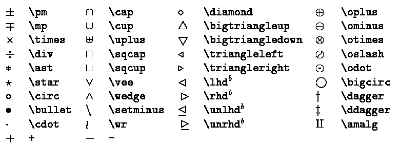


## 关系符号（Relation Symbols)


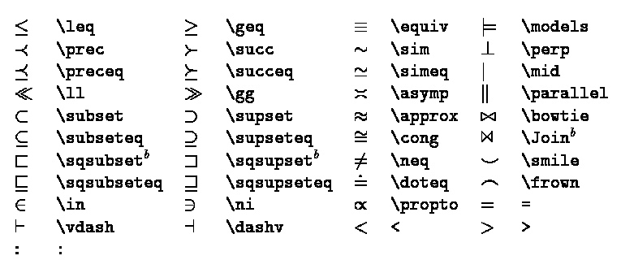

## 标记符号(Punctuation Symbols）


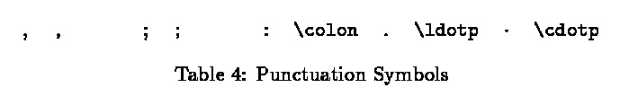

## 箭头符号（Arrow Symbols）


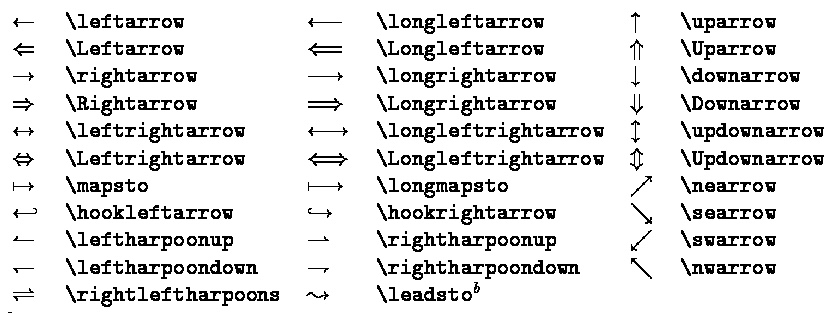


## 其他符号（Miscellaneous Symbols）


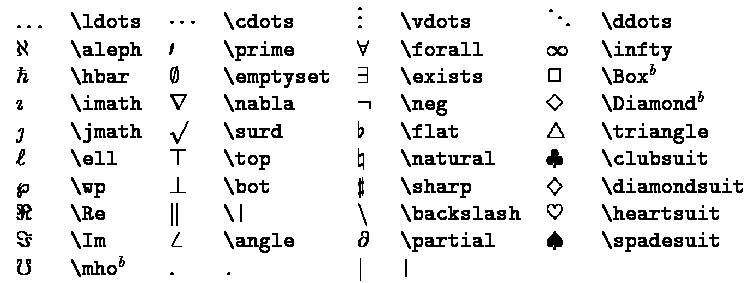

## 可变大小符号(Variable-sized  Symbols)


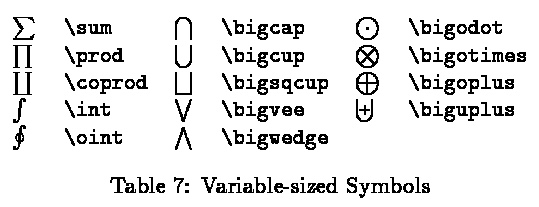


## 对数相似符号(Log-like Symbols)

LaTex 指令

```
 \arccos     \cos       \csc      \exp      \ker         \limsup      \min      \sinh  
 \arcsin     \cosh      \deg      \gcd      \lg          \ln	      \Pr       \sup 
 \arctan     \cot       \det      \hom      \lim         \log	      \sec      \tan
 \arg        \coth      \dim      \inf      \liminf      \max	      \sin      \tanh
```

对应的符号

## 界定符(Delimiters)


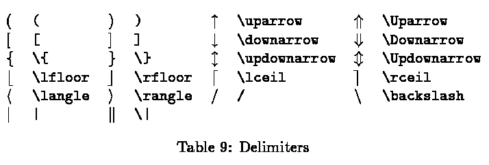

## 大界定符(Large Delimiters)


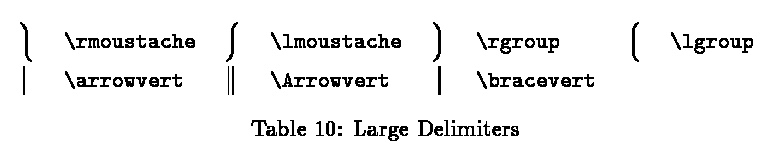

## 数学模式变音符(Math mode accents)


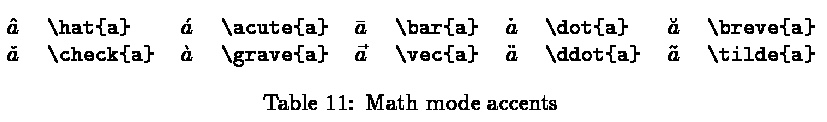

## 其他结构(Some other constructions)


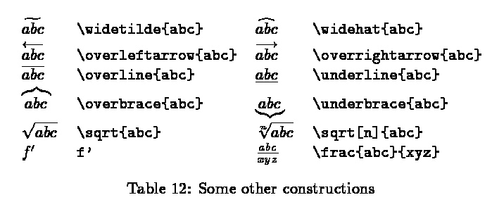


同样的上述文档是从以下的 LaTex 代码生成

```latex
--8<-- "latex-symbol.tex"
```