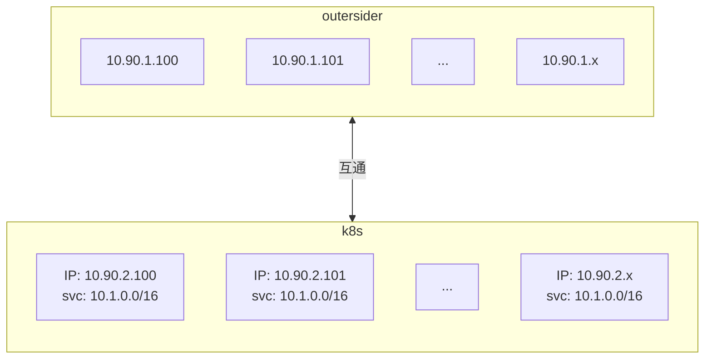

# 外部机器如何直接直接访问 kubernetes 集群内服务


需求大致是这样的，有一个 kubernetes 集群（以下简称 k8s 集群），运行的程序（pod）在集群内或者集群节点之间是可以直接访问的，但是集群外的机器不可以直接访问。

一种简单的解决办法是把程序的端口通过 [nodePort](https://kubernetes.io/docs/concepts/services-networking/service/#type-nodeport) 的方式把服务监听端口暴露在主机上，这样外部机器就可以通过集群主机上对应的端口来访问程序(pod) 了。

但这种方式的一个麻烦在于端口需要管理，而且基本上很难做到集群内外端口一致（比如多个程序运行的端口都是8080，但暴露的端口又不能重复）。

所以想找一个合适的方式，使得集群外部程序能像在集群节点甚至集群内部访问程序那样无锋，这对开发者而言无疑极大的减少了环境部署的时间，也能快速debug。

[Telpresence](https://www.telepresence.io) 是一种解决方案，但要对外部机器和集群机器的侵入性太高，其实很难管理的。

最后受[这篇文章](https://cloud.tencent.com/developer/article/1671825) 的启发，在测试环境进行了验证可行性，这应该是成本最低的一个解决方案了。不过这个方案有一个前提，那就是 **外部机器**要能直接访问集群的节点，可以不在一个网段，但必须能互通。否则这个方案没戏。

整个方案分成两个部分，一个是解决网络互通问题，一个是解决名称解析问题


## 解决网络互通问题


比如这样的网络拓扑结构：




集群外部机器的网段是 `10.90.1.0/24`， k8s 集群节点的网段是  `10.90.2.0/24` ，集群内 Service 配置的网段是 `10.1.0.0/16`，其中 `10.90.1.0` 和 `10.90.2.0` 是互通的。

但是我们知道从 `10.90.1.0/24` 肯定直接访问 `10.1.0.0/16` 这个网段的。

一个简单的办法，就是在 `10.90.1.0/24` 机器上增加一条静态路由，使得访问 `10.1.0.0/16` 网段的请求都转到 `10.90.2.0/24` 中的任何一台。当然一般我都指定一台，比如这里就指定 `10.90.2.100`

Linux 系统通过如下指令增加路由

```shell
# route add -net 10.1.0.0/16 gw 10.90.2.100
```

Windows 系统通过下面的指令增加路由

```powershell
c:\> ROUTE -p ADD 10.1.0.0 MASK 255.255.0.0 10.90.2.100
```

增加路由后，再尝试在 `10.90.1.0/24` 机器上访问 `10.1.0.0/16` 的服务试下（有可能 `ping` 命令并不生效，至少我的环境是如此）

## 解决名称解析问题

网络通了后，我们还希望能直接访 Service 的名字来访问对应的服务，那这样就真的和集群内访问毫无二致了，这个到比较容易解决，只需要在 k8s 集群 `10.90.2.0/24` 任意节点上部署一个 DNS 服务，仅作转发，转发到 k8s 集群内部的 DNS 里（比如 `kube-dns` 或 `coredns` 之类的）

假定你 k8s 集群内的 DNS 地址为 `10.1.0.10` 。我们可以通过如下步骤来完成


### 部署转发 DNS

在 `10.90.2.100` 上安装 bind 套件

```shell
# yum install -y bind bind-utils
```

修改 `/etc/named.conf` 文件，在 `options` 段增加下面的配置：

```shell
forwarders {
	10.1.0.10;
};
forward only;
```

然后启动服务

```shell
# systemctl start named
```

测试下是否正常

```shell
$ dig @10.90.2.100 redis.default.svc.cluster.local

; <<>> DiG 9.9.4-RedHat-9.9.4-72.el7 <<>> @10.90.2.100 redis.default.svc.cluster.local
; (1 server found)
;; global options: +cmd
;; Got answer:
;; ->>HEADER<<- opcode: QUERY, status: NOERROR, id: 62948
;; flags: qr rd ra; QUERY: 1, ANSWER: 1, AUTHORITY: 0, ADDITIONAL: 1

;; OPT PSEUDOSECTION:
; EDNS: version: 0, flags:; udp: 4096
;; QUESTION SECTION:
;minio.default.svc.cluster.local. IN    A

;; ANSWER SECTION:
redis.default.svc.cluster.local. 30 IN  A       10.1.130.208

;; Query time: 2 msec
;; SERVER: 10.90.2.100#53(10.90.2.100)
;; WHEN: 五 2月 17 23:28:26 CST 2023
;; MSG SIZE  rcvd: 76
```

看来已经成功解析了。

接下来就是在外部机器 (`10.90.1.0/16` )的机器上配置上这个 DNS

Linux 系统，修改 `/etc/resolv.conf` 文件，增加以下内容

```
nameserver 10.90.2.100
search default.svc.cluster.local svc.cluster.local
```

Windows 系统参考官方文档。

到这里，基本上集群外机器访问 k8s 集群内的服务就和在集群内访问无疑了。Happy :-)

