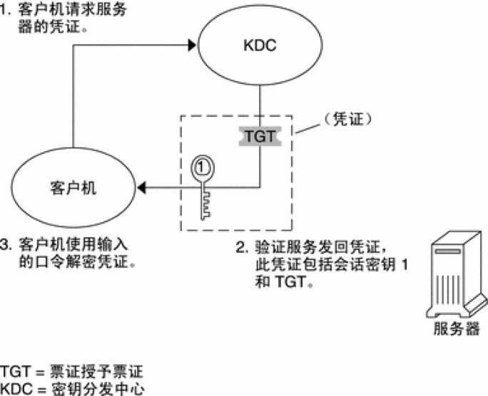

## 概述

维护 Kerberos 需要对 Kerberos 的基本概念和常见的几个术语有所了解，以下是几个重要的概念

- Principal（安全个体，主体）：被认证的个体，有一个名字(name)和口令(password)
- KDC(Key Distribution Center)： 一个网络服务，提供票据(ticket)和临时会话密钥
- Ticket（票据）：一个记录，客户可以用它来向服务器证明自己的身份，包括客户标识、会话密钥、时间戳等
- Credentials（凭证）： 一个 Ticket 加上一个秘密的会话密钥

认证原理如下：





## 部署 KDC Server

### 安装软件包

用 root 账号登陆服务，然后安装需要的软件包

`yum install krb5-server krb5-libs krb5-workstation`

编辑 `/etc/krb5.conf` ,修改 `[realms]` 部分，改成符合自己环境的配置，类似如下：

```
includedir /etc/krb5.conf.d/

[libdefaults]
  renew_lifetime = 7d
  forwardable = true
  default_realm = WGZHAO.COM
  ticket_lifetime = 24h
  dns_lookup_realm = false
  dns_lookup_kdc = false
  default_ccache_name = /tmp/krb5cc_%{uid}
  #default_tgs_enctypes = aes des3-cbc-sha1 rc4 des-cbc-md5
  #default_tkt_enctypes = aes des3-cbc-sha1 rc4 des-cbc-md5

[domain_realm]
  WGZHAO.com = WGZHAO.COM

[logging]
  default = FILE:/var/log/krb5kdc.log
  admin_server = FILE:/var/log/kadmind.log
  kdc = FILE:/var/log/krb5kdc.log

[realms]
  WGZHAO.COM = {
    admin_server = hadoop2.WGZHAO.com
    kdc = hadoop2.WGZHAO.com
  }
```

### 创建数据库

在服务端服务器上执行下面的命令

`kdb5_util create -s`

提示输入密码时，输入密码，一定要牢牢记住该密码

### 启动 KDC

```bash
systemctl start krb5kdc
systemctl start kadmin
```

### 配置 Kerberos Admin 账号 

1. 创建 KDC admin账号 `kadmin.local -q "addprinc admin/admin" `
2. 编辑 `/var/kerberos/krb5kdc/kadm5.acl` 文件，增加配置的realms的认证，类似如下 `*/admin@WGZHAO.COM    *`
3. 重启 kadmin `systemctl start kadmin`

## kadmin

kadmin是 KDC的管理命令，用来管理 Kerberos 数据库，具有以下功能：

- 显示 Principal 的属性
- 获得 Principal 列表
- 增加、删除或者修改 principal
- 修改口令
- 策略管理

以下是 kadmin 的一个基本输出

```shell
% kadmin
kadmin: getprinc hive/hadoop1.WGZHAO.com
Principal: hive/hadoop1.WGZHAO.com@WGZHAO.COM
Key version: 3
Maximum life: 1 day 00:00:00
Maximum renewable life: 7 days 00:00:00
Master key version: 1
Expires: Mon Jan 18 22:14:07 EDT 2038
Password expires: Mon Sep 19 14:40:00 EDT 1996
Password last changed: Mon Jan 31 02:06:40 EDT 1996
Last modified: by joeadmin/admin@ATHENA.MIT.EDU
	on Wed Jul 13 18:27:08 EDT 1996
Attributes: DISALLOW_FORWARDABLE, DISALLOW_PROXIABLE,REQUIRES_HW_AUTH
Salt type: DEFAULT
```

## 日常维护

### 列出凭证

klist 命令可以列出一个凭证的日常信息，例如：

```bash
 klist  -kt /etc/security/keytabs/hive.service.keytab 
Keytab name: FILE:/etc/security/keytabs/hive.service.keytab
KVNO Timestamp           Principal
---- ------------------- ------------------------------------------------------
   1 08/04/2017 09:12:48 hive/hadoop5.wgzhao.com@WGZHAO.COM
   1 08/04/2017 09:12:48 hive/hadoop5.wgzhao.com@WGZHAO.COM
   1 08/04/2017 09:12:48 hive/hadoop5.wgzhao.com@WGZHAO.COM
   1 08/04/2017 09:12:48 hive/hadoop5.wgzhao.com@WGZHAO.COM
   1 08/04/2017 09:12:48 hive/hadoop5.wgzhao.com@WGZHAO.COM
```

### 获得凭据

获得凭据可以通过账号密码方式向服务器获取，也可以通过指定凭证文件获取，这里给出第二种方式：

```shell
# klist
klist: Credentials cache file '/tmp/krb5cc_0' not found
# kinit  -kt /etc/security/keytabs/hive.service.keytab hive/hadoop5.wgzhao.com@WGZHAO.COM
# klist
Ticket cache: FILE:/tmp/krb5cc_0
Default principal: hive/hadoop5.wgzhao.com@WGZHAO.COM

Valid starting       Expires              Service principal
12/20/2018 14:32:17  12/21/2018 14:32:17  krbtgt/WGZHAO.COM@WGZHAO.COM
```

### 创建凭证

创建凭证需要用 root 账号登陆到 KDC 服务器，然后使用kadmin.local命令进行操作，该命令可以交互式进行操作，也可以批处理方式，这里给出批处理的方式。
首先我们创建一个凭证

```shell
kadmin.local -q "addprinc -randkey gphdfs/bjzxsdw3@WGZHAO.COM"
```

创建完成后，我们需要导出凭证文件并拷贝到对应的服务器上，使用下面的命令进行导出：

`kadmin.local -q "xst -k gphdfs.service.keytab  gphdfs/bjzxsdw3@WGZHAO.COM"`

### 修改凭证

修改凭证需要用 root 账号登陆到 KDC 服务器，然后使用 `kadmin.local` 命令进行操作，该命令可以交互式进行操作，也可以批处理方式，这里给出批处理的方式

```shell
kadmin.local -q "modprinc -maxlife 7days -maxrenewlife 7days +allow_renewable infa/bjzx-etl-infa1@WGZHAO.COM"
```

### 增加 KDC 服务并发

在大规模集群下，默认的 KDC 配置会导致请求没有响应，会出现诡异的 "UnKnown Hostname" 异常，我们可以通过修改配置文件的方式来增加 KDC 的服务进程。

用 root 账号登陆 KDC 服务器，编辑 _/etc/sysconfig/krb5kdc_ 文件，修改 `KRB5KDC_ARGS` 选项，增加`-w 32`参数，类似如下：

`KRB5KDC_ARGS=-w 32`

然后重启服务

```shell
systemctl restart kadmin
systemctl restart krb5kdc
```

