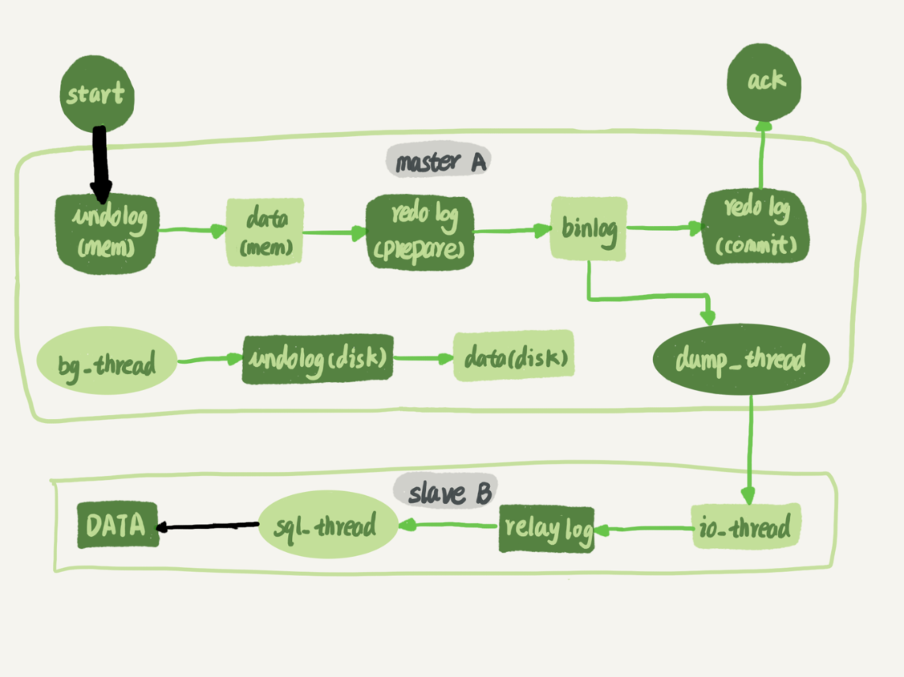

# 《MySQL 实战45讲》节选第三部分

[Source](http://learn.lianglianglee.com/%E6%9E%81%E5%AE%A2%E6%97%B6%E9%97%B4/MySQL%E5%AE%9E%E6%88%9845%E8%AE%B2.md "Permalink to MySQL实战45讲.md")

以下内容节选自 “丁奇” 在极客时间的 《MySQL实战45讲》的内容，这是第三部分


## 20 幻读是什么，幻读有什么问题？

在上一篇文章最后，我给你留了一个关于加锁规则的问题。今天，我们就从这个问题说起吧。

为了便于说明问题，这一篇文章，我们就先使用一个小一点儿的表。建表和初始化语句如下（为了便于本期的例子说明，我把上篇文章中用到的表结构做了点儿修改）：

```sql
CREATE TABLE `t` (
  `id` int(11) NOT NULL,
  `c` int(11) DEFAULT NULL,
  `d` int(11) DEFAULT NULL,
  PRIMARY KEY (`id`),
  KEY `c` (`c`)
) ENGINE=InnoDB; 
insert into t values(0,0,0),(5,5,5),
(10,10,10),(15,15,15),(20,20,20),(25,25,25);
```

这个表除了主键 id 外，还有一个索引 c，初始化语句在表中插入了 6 行数据。

上期我留给你的问题是，下面的语句序列，是怎么加锁的，加的锁又是什么时候释放的呢？

```sql
begin;
select * from t where d=5 for update;
commit;
```

比较好理解的是，这个语句会命中 d=5 的这一行，对应的主键 id=5，因此在 select 语句执行完成后，id=5 这一行会加一个写锁，而且由于两阶段锁协议，这个写锁会在执行 commit 语句的时候释放。

由于字段 d 上没有索引，因此这条查询语句会做全表扫描。那么，其他被扫描到的，但是不满足条件的 5 行记录上，会不会被加锁呢？

我们知道，InnoDB 的默认事务隔离级别是可重复读，所以本文接下来没有特殊说明的部分，都是设定在可重复读隔离级别下。

### 幻读是什么？

现在，我们就来分析一下，如果只在 id=5 这一行加锁，而其他行的不加锁的话，会怎么样。

下面先来看一下这个场景（注意：这是我假设的一个场景）：

|      | Session A                                                    | Session B                    | Session C                    |
| ---- | ------------------------------------------------------------ | ---------------------------- | ---------------------------- |
| T1   | begin;<br />select * from t where d=5 fro update; /*Q1*/<br />//result: (5,5,5) |                              |                              |
| T2   |                                                              | update t set d=5 where id=0; |                              |
| T3   | select * from t where d=5 fro update; /*Q2*/<br />//result: (0,0,5), (5,5,5) |                              |                              |
| T4   |                                                              |                              | insert into t values(1,1,5); |
| T5   | select * from t where d=5 fro update; /*Q3*/<br />//result: (0,0,5),(1,1,5),(5,5,5) |                              |                              |
| T6   | commit;                                                      |                              |                              |

可以看到，session A 里执行了三次查询，分别是 Q1、Q2 和 Q3。它们的 SQL 语句相同，都是 `select * from t where d=5 for update`。这个语句的意思你应该很清楚了，查所有 d=5 的行，而且使用的是当前读，并且加上写锁。现在，我们来看一下这三条 SQL 语句，分别会返回什么结果。

1. Q1 只返回 id=5 这一行；
2. 在 T2 时刻，session B 把 id=0 这一行的 d 值改成了 5，因此 T3 时刻 Q2 查出来的是 id=0 和 id=5 这两行；
3. 在 T4 时刻，session C 又插入一行`（1,1,5）`，因此 T5 时刻 Q3 查出来的是 id=0、id=1 和 id=5 的这三行。

其中，Q3 读到 id=1 这一行的现象，被称为“幻读”。也就是说，幻读指的是一个事务在前后两次查询同一个范围的时候，后一次查询看到了前一次查询没有看到的行。

这里，我需要对“幻读”做一个说明：

1. 在可重复读隔离级别下，普通的查询是快照读，是不会看到别的事务插入的数据的。因此，幻读在“当前读”下才会出现。
2. 上面 session B 的修改结果，被 session A 之后的 select 语句用“当前读”看到，不能称为幻读。幻读仅专指“新插入的行”。

如果只从第 8 篇文章[《事务到底是隔离的还是不隔离的？》]我们学到的事务可见性规则来分析的话，上面这三条 SQL 语句的返回结果都没有问题。

因为这三个查询都是加了 for update，都是当前读。而当前读的规则，就是要能读到所有已经提交的记录的最新值。并且，session B 和 sessionC 的两条语句，执行后就会提交，所以 Q2 和 Q3 就是应该看到这两个事务的操作效果，而且也看到了，这跟事务的可见性规则并不矛盾。

但是，这是不是真的没问题呢？

不，这里还真就有问题。

### 幻读有什么问题？

**首先是语义上的。**session A 在 T1 时刻就声明了，“我要把所有 d=5 的行锁住，不准别的事务进行读写操作”。而实际上，这个语义被破坏了。

如果现在这样看感觉还不明显的话，我再往 session B 和 session C 里面分别加一条 SQL 语句，你再看看会出现什么现象。

|      | Session A                                                    | Session B                                                    | Session C                                                    |
| ---- | ------------------------------------------------------------ | ------------------------------------------------------------ | ------------------------------------------------------------ |
| T1   | begin;<br />select * from t where d=5 fro update; /*Q1*/<br />//result: (5,5,5) |                                                              |                                                              |
| T2   |                                                              | update t set d=5 where id=0;<br />update t set c=5 where id=0; |                                                              |
| T3   | select * from t where d=5 fro update; /*Q2*/<br />//result: (0,0,5), (5,5,5) |                                                              |                                                              |
| T4   |                                                              |                                                              | insert into t values(1,1,5);<br />update t set c=5 where id=1; |
| T5   | select * from t where d=5 fro update; /*Q3*/<br />//result: (0,0,5),(1,1,5),(5,5,5) |                                                              |                                                              |
| T6   | commit;                                                      |                                                              |                                                              |

session B 的第二条语句 `update t set c=5 where id=0`，语义是“我把 id=0、d=5 这一行的 c 值，改成了 5”。

由于在 T1 时刻，session A 还只是给 id=5 这一行加了行锁， 并没有给 id=0 这行加上锁。因此，session B 在 T2 时刻，是可以执行这两条 update 语句的。这样，就破坏了 session A 里 Q1 语句要锁住所有 d=5 的行的加锁声明。

session C 也是一样的道理，对 id=1 这一行的修改，也是破坏了 Q1 的加锁声明。

**其次，是数据一致性的问题。**

我们知道，锁的设计是为了保证数据的一致性。而这个一致性，不止是数据库内部数据状态在此刻的一致性，还包含了数据和日志在逻辑上的一致性。

为了说明这个问题，我给 session A 在 T1 时刻再加一个更新语句，即：`update t set d=100 where d=5`。

|      | Session A                                                    | Session B                                                    | Session C                                                    |
| ---- | ------------------------------------------------------------ | ------------------------------------------------------------ | ------------------------------------------------------------ |
| T1   | begin;<br />select * from t where d=5 fro update; /*Q1*/<br />update t set d=100 where d=5; |                                                              |                                                              |
| T2   |                                                              | update t set d=5 where id=0;<br />update t set c=5 where id=0; |                                                              |
| T3   | select * from t where d=5 fro update; /*Q2*/               |                                                              |                                                              |
| T4   |                                                              |                                                              | insert into t values(1,1,5);<br />update t set c=5 where id=1; |
| T5   | select * from t where d=5 fro update; /*Q3*/               |                                                              |                                                              |
| T6   | commit;                                                      |                                                              |                                                              |

update 的加锁语义和 `select …for update` 是一致的，所以这时候加上这条 update 语句也很合理。session A 声明说“要给 d=5 的语句加上锁”，就是为了要更新数据，新加的这条 update 语句就是把它认为加上了锁的这一行的 d 值修改成了 100。

现在，我们来分析一下图 3 执行完成后，数据库里会是什么结果。

1. 经过 T1 时刻，id=5 这一行变成 (5,5,100)，当然这个结果最终是在 T6 时刻正式提交的 ;
2. 经过 T2 时刻，id=0 这一行变成 (0,5,5);
3. 经过 T4 时刻，表里面多了一行 (1,5,5);
4. 其他行跟这个执行序列无关，保持不变。

这样看，这些数据也没啥问题，但是我们再来看看这时候 binlog 里面的内容。

1. T2 时刻，session B 事务提交，写入了两条语句；
2. T4 时刻，session C 事务提交，写入了两条语句；
3. T6 时刻，session A 事务提交，写入了 update t set d=100 where d=5 这条语句。

我统一放到一起的话，就是这样的：

```sql
update t set d=5 where id=0; /*(0,0,5)*/
update t set c=5 where id=0; /*(0,5,5)*/ 
insert into t values(1,1,5); /*(1,1,5)*/
update t set c=5 where id=1; /*(1,5,5)*/ 
update t set d=100 where d=5;/* 所有 d=5 的行，d 改成 100*/
```

好，你应该看出问题了。这个语句序列，不论是拿到备库去执行，还是以后用 binlog 来克隆一个库，这三行的结果，都变成了 (0,5,100)、(1,5,100) 和 (5,5,100)。

也就是说，id=0 和 id=1 这两行，发生了数据不一致。这个问题很严重，是不行的。

到这里，我们再回顾一下，**这个数据不一致到底是怎么引入的？**

我们分析一下可以知道，这是我们假设 `select * from t where d=5 for update` 这条语句只给 d=5 这一行，也就是 id=5 的这一行加锁”导致的。

所以我们认为，上面的设定不合理，要改。

那怎么改呢？我们把扫描过程中碰到的行，也都加上写锁，再来看看执行效果。

|      | Session A                                                    | Session B                                                    | Session C                                                    |
| ---- | ------------------------------------------------------------ | ------------------------------------------------------------ | ------------------------------------------------------------ |
| T1   | begin;<br />select * from t where d=5 fro update; /*Q1*/<br />update t set d=100 where d=5; |                                                              |                                                              |
| T2   |                                                              | update t set d=5 where id=0;<br />(blocked)<br />update t set c=5 where id=0; |                                                              |
| T3   | select * from t where d=5 fro update; /*Q2*/               |                                                              |                                                              |
| T4   |                                                              |                                                              | insert into t values(1,1,5);<br />update t set c=5 where id=1; |
| T5   | select * from t where d=5 fro update; /*Q3*/               |                                                              |                                                              |
| T6   | commit;                                                      |                                                              |                                                              |

由于 session A 把所有的行都加了写锁，所以 session B 在执行第一个 update 语句的时候就被锁住了。需要等到 T6 时刻 session A 提交以后，session B 才能继续执行。

这样对于 id=0 这一行，在数据库里的最终结果还是 (0,5,5)。在 binlog 里面，执行序列是这样的：

```sql
insert into t values(1,1,5); /*(1,1,5)*/
update t set c=5 where id=1; /*(1,5,5)*/ 
update t set d=100 where d=5;/* 所有 d=5 的行，d 改成 100*/ 
update t set d=5 where id=0; /*(0,0,5)*/
update t set c=5 where id=0; /*(0,5,5)*/
```

可以看到，按照日志顺序执行，id=0 这一行的最终结果也是 (0,5,5)。所以，id=0 这一行的问题解决了。

但同时你也可以看到，id=1 这一行，在数据库里面的结果是 (1,5,5)，而根据 binlog 的执行结果是 (1,5,100)，也就是说幻读的问题还是没有解决。为什么我们已经这么“凶残”地，把所有的记录都上了锁，还是阻止不了 id=1 这一行的插入和更新呢？

原因很简单。在 T3 时刻，我们给所有行加锁的时候，id=1 这一行还不存在，不存在也就加不上锁。

**也就是说，即使把所有的记录都加上锁，还是阻止不了新插入的记录，**这也是为什么“幻读”会被单独拿出来解决的原因。

到这里，其实我们刚说明完文章的标题 ：幻读的定义和幻读有什么问题。

接下来，我们再看看 InnoDB 怎么解决幻读的问题。

### 如何解决幻读？

现在你知道了，产生幻读的原因是，行锁只能锁住行，但是新插入记录这个动作，要更新的是记录之间的“间隙”。因此，为了解决幻读问题，InnoDB 只好引入新的锁，也就是间隙锁 (Gap Lock)。

顾名思义，间隙锁，锁的就是两个值之间的空隙。比如文章开头的表 t，初始化插入了 6 个记录，这就产生了 7 个间隙。


图 5 表 t 主键索引上的行锁和间隙锁

这样，当你执行 `select * from t where d=5 for update` 的时候，就不止是给数据库中已有的 6 个记录加上了行锁，还同时加了 7 个间隙锁。这样就确保了无法再插入新的记录。

也就是说这时候，在一行行扫描的过程中，不仅将给行加上了行锁，还给行两边的空隙，也加上了间隙锁。

现在你知道了，数据行是可以加上锁的实体，数据行之间的间隙，也是可以加上锁的实体。但是间隙锁跟我们之前碰到过的锁都不太一样。

比如行锁，分成读锁和写锁。下图就是这两种类型行锁的冲突关系。

|      | 读锁                            | 写锁                          |
| ---- | ------------------------------- | ----------------------------- |
| 读锁 | <font color='green'>兼容</font> | <font color='red'>冲突</font> |
| 写锁 | <font color='red'>冲突</font>   | <font color='red'>冲突</font> |

也就是说，跟行锁有冲突关系的是“另外一个行锁”。

但是间隙锁不一样，**跟间隙锁存在冲突关系的，是“往这个间隙中插入一个记录”这个操作。**间隙锁之间都不存在冲突关系。

这句话不太好理解，我给你举个例子：

| Session A                                                 | Session B                                           |
| --------------------------------------------------------- | --------------------------------------------------- |
| begin;<br />select * from t where c=7 lock in share mode; |                                                     |
|                                                           | begin;<br />select * from t where c = 7 for update; |

这里 session B 并不会被堵住。因为表 t 里并没有 c=7 这个记录，因此 session A 加的是间隙锁 (5,10)。而 session B 也是在这个间隙加的间隙锁。它们有共同的目标，即：保护这个间隙，不允许插入值。但，它们之间是不冲突的。

间隙锁和行锁合称 next-key lock，每个 next-key lock 是前开后闭区间。也就是说，我们的表 t 初始化以后，如果用 `select * from t for update` 要把整个表所有记录锁起来，就形成了 7 个 next-key lock，分别是 `(-∞,0]、(0,5]、(5,10]、(10,15]、(15,20]、(20, 25]、(25, +supremum]`。

> 备注：这篇文章中，如果没有特别说明，我们把间隙锁记为开区间，把 next-key lock 记为前开后闭区间。

你可能会问说，这个 supremum 从哪儿来的呢？

这是因为 `+∞` 是开区间。实现上，InnoDB 给每个索引加了一个不存在的最大值 supremum，这样才符合我们前面说的“都是前开后闭区间”。

**间隙锁和 next-key lock 的引入，帮我们解决了幻读的问题，但同时也带来了一些“困扰”。**

在前面的文章中，就有同学提到了这个问题。我把他的问题转述一下，对应到我们这个例子的表来说，业务逻辑这样的：任意锁住一行，如果这一行不存在的话就插入，如果存在这一行就更新它的数据，代码如下：

```sql
begin;
select * from t where id=N for update; 
/* 如果行不存在 */
insert into t values(N,N,N);
/* 如果行存在 */
update t set d=N set id=N; 
commit;
```

可能你会说，这个不是 `insert … on duplicate key update` 就能解决吗？但其实在有多个唯一键的时候，这个方法是不能满足这位提问同学的需求的。至于为什么，我会在后面的文章中再展开说明。

现在，我们就只讨论这个逻辑。

这个同学碰到的现象是，这个逻辑一旦有并发，就会碰到死锁。你一定也觉得奇怪，这个逻辑每次操作前用 for update 锁起来，已经是最严格的模式了，怎么还会有死锁呢？

这里，我用两个 session 来模拟并发，并假设 N=9。

| session A                                                    | session B                                                    |
| ------------------------------------------------------------ | ------------------------------------------------------------ |
| begin;<br />select * from t where id=9 for update;           |                                                              |
|                                                              | begin;<br />select * from t where id=9 for update;           |
|                                                              | insert into t values(9,9,9);<br /><font color='red'>(blocked)</font> |
| insert into t values(9,9,9);<br /><font color='red'>(Error 1213(40001): Deadlock found)</font> |                                                              |

你看到了，其实都不需要用到后面的 update 语句，就已经形成死锁了。我们按语句执行顺序来分析一下：

1. session A 执行 `select … for update` 语句，由于 id=9 这一行并不存在，因此会加上间隙锁 (5,10);
2. session B 执行 `select … for update` 语句，同样会加上间隙锁 (5,10)，间隙锁之间不会冲突，因此这个语句可以执行成功；
3. session B 试图插入一行 (9,9,9)，被 session A 的间隙锁挡住了，只好进入等待；
4. session A 试图插入一行 (9,9,9)，被 session B 的间隙锁挡住了。

至此，两个 session 进入互相等待状态，形成死锁。当然，InnoDB 的死锁检测马上就发现了这对死锁关系，让 session A 的 insert 语句报错返回了。

你现在知道了，**间隙锁的引入，可能会导致同样的语句锁住更大的范围，这其实是影响了并发度的**。其实，这还只是一个简单的例子，在下一篇文章中我们还会碰到更多、更复杂的例子。

你可能会说，为了解决幻读的问题，我们引入了这么一大串内容，有没有更简单一点的处理方法呢。

我在文章一开始就说过，如果没有特别说明，今天和你分析的问题都是在 **可重复读** 隔离级别下的，间隙锁是在可重复读隔离级别下才会生效的。所以，你如果把隔离级别设置为 **读已提交**的话，就没有间隙锁了。但同时，你要解决可能出现的数据和日志不一致问题，需要把 binlog 格式设置为 row。这，也是现在不少公司使用的配置组合。

前面文章的评论区有同学留言说，他们公司就使用的是读提交隔离级别加 `binlog_format=row` 的组合。他曾问他们公司的 DBA 说，你为什么要这么配置。DBA 直接答复说，因为大家都这么用呀。

所以，这个同学在评论区就问说，这个配置到底合不合理。

关于这个问题本身的答案是，如果读提交隔离级别够用，也就是说，业务不需要可重复读的保证，这样考虑到读提交下操作数据的锁范围更小（没有间隙锁），这个选择是合理的。

但其实我想说的是，配置是否合理，跟业务场景有关，需要具体问题具体分析。

但是，如果 DBA 认为之所以这么用的原因是“大家都这么用”，那就有问题了，或者说，迟早会出问题。

比如说，大家都用读提交，可是逻辑备份的时候，mysqldump 为什么要把备份线程设置成可重复读呢？（这个我在前面的文章中已经解释过了，你可以再回顾下第 6 篇文章[《全局锁和表锁 ：给表加个字段怎么有这么多阻碍？》]的内容）

然后，在备份期间，备份线程用的是可重复读，而业务线程用的是读提交。同时存在两种事务隔离级别，会不会有问题？

进一步地，这两个不同的隔离级别现象有什么不一样的，关于我们的业务，“用读提交就够了”这个结论是怎么得到的？

如果业务开发和运维团队这些问题都没有弄清楚，那么“没问题”这个结论，本身就是有问题的。

### 小结

今天我们从上一篇文章的课后问题说起，提到了全表扫描的加锁方式。我们发现即使给所有的行都加上行锁，仍然无法解决幻读问题，因此引入了间隙锁的概念。

我碰到过很多对数据库有一定了解的业务开发人员，他们在设计数据表结构和业务 SQL 语句的时候，对行锁有很准确的认识，但却很少考虑到间隙锁。最后的结果，就是生产库上会经常出现由于间隙锁导致的死锁现象。

行锁确实比较直观，判断规则也相对简单，间隙锁的引入会影响系统的并发度，也增加了锁分析的复杂度，但也有章可循。下一篇文章，我就会为你讲解 InnoDB 的加锁规则，帮你理顺这其中的“章法”。

作为对下一篇文章的预习，我给你留下一个思考题。

| session A                                                    | session B                      | session C                    |
| ------------------------------------------------------------ | ------------------------------ | ---------------------------- |
| begin;<br />select * from t where c>=15 <br />and c<=20 order by c desc for update; |                                |                              |
|                                                              | insert into t values(11,11,11) |                              |
|                                                              |                                | insert into t values(6,6,6); |

如果你之前没有了解过本篇文章的相关内容，一定觉得这三个语句简直是风马牛不相及。但实际上，这里 session B 和 session C 的 insert 语句都会进入锁等待状态。

你可以试着分析一下，出现这种情况的原因是什么？

## 21 为什么我只改一行的语句，锁这么多？

在上一篇文章中，我和你介绍了间隙锁和 next-key lock 的概念，但是并没有说明加锁规则。间隙锁的概念理解起来确实有点儿难，尤其在配合上行锁以后，很容易在判断是否会出现锁等待的问题上犯错。

所以今天，我们就先从这个加锁规则开始吧。

首先说明一下，这些加锁规则我没在别的地方看到过有类似的总结，以前我自己判断的时候都是想着代码里面的实现来脑补的。这次为了总结成不看代码的同学也能理解的规则，是我又重新刷了代码临时总结出来的。所以，**这个规则有以下两条前提说明：**

1. MySQL 后面的版本可能会改变加锁策略，所以这个规则只限于截止到现在的最新版本，即 5.x 系列 \<=5.7.24，8.0 系列 \<=8.0.13。
2. 如果大家在验证中有发现 bad case 的话，请提出来，我会再补充进这篇文章，使得一起学习本专栏的所有同学都能受益。

因为间隙锁在可重复读隔离级别下才有效，所以本篇文章接下来的描述，若没有特殊说明，默认是可重复读隔离级别。

**我总结的加锁规则里面，包含了两个“原则”、两个“优化”和一个“bug”。**

1. 原则 1：加锁的基本单位是 next-key lock。希望你还记得，next-key lock 是前开后闭区间。
2. 原则 2：查找过程中访问到的对象才会加锁。
3. 优化 1：索引上的等值查询，给唯一索引加锁的时候，next-key lock 退化为行锁。
4. 优化 2：索引上的等值查询，向右遍历时且最后一个值不满足等值条件的时候，next-key lock 退化为间隙锁。
5. 一个 bug：唯一索引上的范围查询会访问到不满足条件的第一个值为止。

我还是以上篇文章的表 t 为例，和你解释一下这些规则。表 t 的建表语句和初始化语句如下。

```sql
CREATE TABLE `t` (
  `id` int(11) NOT NULL,
  `c` int(11) DEFAULT NULL,
  `d` int(11) DEFAULT NULL,
  PRIMARY KEY (`id`),
  KEY `c` (`c`)
) ENGINE=InnoDB; 
insert into t values(0,0,0),(5,5,5),
(10,10,10),(15,15,15),(20,20,20),(25,25,25);
```

接下来的例子基本都是配合着图片说明的，所以我建议你可以对照着文稿看，有些例子可能会“毁三观”，也建议你读完文章后亲手实践一下。

### 案例一：等值查询间隙锁

第一个例子是关于等值条件操作间隙：

| session A                                       | session B                                                    | session C                                                    |
| ----------------------------------------------- | ------------------------------------------------------------ | ------------------------------------------------------------ |
| begin;<br />update t set d = d + 1 where id =7; |                                                              |                                                              |
|                                                 | insert into t values(8,8,8);<br /><font color='red'>(blocked)</font> |                                                              |
|                                                 |                                                              | update t set d=d+1 where id=10;<br /><font color='green'>(Query OK)</font> |


由于表 t 中没有 id=7 的记录，所以用我们上面提到的加锁规则判断一下的话：

1. 根据原则 1，加锁单位是 next-key lock，session A 加锁范围就是 (5,10]；
2. 同时根据优化 2，这是一个等值查询 (id=7)，而 id=10 不满足查询条件，next-key lock 退化成间隙锁，因此最终加锁的范围是 (5,10)。

所以，session B 要往这个间隙里面插入 id=8 的记录会被锁住，但是 session C 修改 id=10 这行是可以的。

### 案例二：非唯一索引等值锁

第二个例子是关于覆盖索引上的锁：

| session A                                                  | session B                                                    | session C                                                    |
| ---------------------------------------------------------- | ------------------------------------------------------------ | ------------------------------------------------------------ |
| begin;<br />select id from t where c=5 lock in share mode; |                                                              |                                                              |
|                                                            | update t set d=d+1 where id=5;<br /><font color='green'>(Query OK)</font> |                                                              |
|                                                            |                                                              | insert into t values(7,7,7);<br /><font color='red'>(blocked)</font> |

看到这个例子，你是不是有一种“该锁的不锁，不该锁的乱锁”的感觉？我们来分析一下吧。

这里 session A 要给索引 c 上 c=5 的这一行加上读锁。

1. 根据原则 1，加锁单位是 next-key lock，因此会给 (0,5] 加上 next-key lock。
2. 要注意 c 是普通索引，因此仅访问 c=5 这一条记录是不能马上停下来的，需要向右遍历，查到 c=10 才放弃。根据原则 2，访问到的都要加锁，因此要给 (5,10] 加 next-key lock。
3. 但是同时这个符合优化 2：等值判断，向右遍历，最后一个值不满足 c=5 这个等值条件，因此退化成间隙锁 (5,10)。
4. 根据原则 2 ，**只有访问到的对象才会加锁**，这个查询使用覆盖索引，并不需要访问主键索引，所以主键索引上没有加任何锁，这就是为什么 session B 的 update 语句可以执行完成。

但 session C 要插入一个 (7,7,7) 的记录，就会被 session A 的间隙锁 (5,10) 锁住。

需要注意，在这个例子中，lock in share mode 只锁覆盖索引，但是如果是 for update 就不一样了。 执行 for update 时，系统会认为你接下来要更新数据，因此会顺便给主键索引上满足条件的行加上行锁。

这个例子说明，锁是加在索引上的；同时，它给我们的指导是，如果你要用 lock in share mode 来给行加读锁避免数据被更新的话，就必须得绕过覆盖索引的优化，在查询字段中加入索引中不存在的字段。比如，将 session A 的查询语句改成 `select d from t where c=5 lock in share mode`。你可以自己验证一下效果。

### 案例三：主键索引范围锁

第三个例子是关于范围查询的。

举例之前，你可以先思考一下这个问题：对于我们这个表 t，下面这两条查询语句，加锁范围相同吗？

```sql
mysql> select * from t where id=10 for update;
mysql> select * from t where id>=10 and id<11 for update;
```

你可能会想，id 定义为 int 类型，这两个语句就是等价的吧？其实，它们并不完全等价。

在逻辑上，这两条查语句肯定是等价的，但是它们的加锁规则不太一样。现在，我们就让 session A 执行第二个查询语句，来看看加锁效果。

| session A                                                    | session B                                                    | session C                                                    |
| ------------------------------------------------------------ | ------------------------------------------------------------ | ------------------------------------------------------------ |
| begin;<br />select * from t where id>=10 and id<11 for update; |                                                              |                                                              |
|                                                              | insert into t values(8,8,8);<br /><font color='green'>(Query OK)</font><br />insert into t values(13,13,13);<br /><font color='red'>(blocked)</font> |                                                              |
|                                                              |                                                              | update t set d =d+1 where id=15;<br /><font color='red'>(blocked)</font> |

现在我们就用前面提到的加锁规则，来分析一下 session A 会加什么锁呢？

1. 开始执行的时候，要找到第一个 id=10 的行，因此本该是 next-key lock(5,10]。 根据优化 1， 主键 id 上的等值条件，退化成行锁，只加了 id=10 这一行的行锁。
2. 范围查找就往后继续找，找到 id=15 这一行停下来，因此需要加 next-key lock(10,15]。

所以，session A 这时候锁的范围就是主键索引上，行锁 id=10 和 next-key lock(10,15]。这样，session B 和 session C 的结果你就能理解了。

这里你需要注意一点，首次 session A 定位查找 id=10 的行的时候，是当做等值查询来判断的，而向右扫描到 id=15 的时候，用的是范围查询判断。

### 案例四：非唯一索引范围锁

接下来，我们再看两个范围查询加锁的例子，你可以对照着案例三来看。

需要注意的是，与案例三不同的是，案例四中查询语句的 where 部分用的是字段 c。

| session A                                                    | session B                                                    | session C                                                    |
| ------------------------------------------------------------ | ------------------------------------------------------------ | ------------------------------------------------------------ |
| begin;<br />select * from t where c>=10 and c<11 for update; |                                                              |                                                              |
|                                                              | insert into t values(8,8,8);<br /><font color='red'>(blocked)</font> |                                                              |
|                                                              |                                                              | update t set d =d+1 where c=15;<br /><font color='red'>(blocked)</font> |

这次 session A 用字段 c 来判断，加锁规则跟案例三唯一的不同是：在第一次用 c=10 定位记录的时候，索引 c 上加了 (5,10] 这个 next-key lock 后，由于索引 c 是非唯一索引，没有优化规则，也就是说不会蜕变为行锁，因此最终 sesion A 加的锁是，索引 c 上的 (5,10] 和 (10,15] 这两个 next-key lock。

所以从结果上来看，sesson B 要插入（8,8,8) 的这个 insert 语句时就被堵住了。

这里需要扫描到 c=15 才停止扫描，是合理的，因为 InnoDB 要扫到 c=15，才知道不需要继续往后找了。

### 案例五：唯一索引范围锁 bug

前面的四个案例，我们已经用到了加锁规则中的两个原则和两个优化，接下来再看一个关于加锁规则中 bug 的案例。

| session A                                                    | session B                                                    | session C                                                    |
| ------------------------------------------------------------ | ------------------------------------------------------------ | ------------------------------------------------------------ |
| begin;<br />select * from t where id>10 and id<=11 for update; |                                                              |                                                              |
|                                                              | update t set d=d+1 where id=20;<br /><font color='red'>(blocked)</font> |                                                              |
|                                                              |                                                              | insert into t values(16,16,16);<br /><font color='red'>(blocked)</font> |

session A 是一个范围查询，按照原则 1 的话，应该是索引 id 上只加 (10,15] 这个 next-key lock，并且因为 id 是唯一键，所以循环判断到 id=15 这一行就应该停止了。

但是实现上，InnoDB 会往前扫描到第一个不满足条件的行为止，也就是 id=20。而且由于这是个范围扫描，因此索引 id 上的 (15,20] 这个 next-key lock 也会被锁上。

所以你看到了，session B 要更新 id=20 这一行，是会被锁住的。同样地，session C 要插入 id=16 的一行，也会被锁住。

照理说，这里锁住 id=20 这一行的行为，其实是没有必要的。因为扫描到 id=15，就可以确定不用往后再找了。但实现上还是这么做了，因此我认为这是个 bug。

我也曾找社区的专家讨论过，官方 bug 系统上也有提到，但是并未被 verified。所以，认为这是 bug 这个事儿，也只能算我的一家之言，如果你有其他见解的话，也欢迎你提出来。

### 案例六：非唯一索引上存在"等值"的例子

接下来的例子，是为了更好地说明“间隙”这个概念。这里，我给表 t 插入一条新记录。

```sql
mysql> insert into t values(30,10,30);
```

新插入的这一行 c=10，也就是说现在表里有两个 c=10 的行。那么，这时候索引 c 上的间隙是什么状态了呢？你要知道，由于非唯一索引上包含主键的值，所以是不可能存在“相同”的两行的。


图 6 非唯一索引等值的例子

可以看到，虽然有两个 c=10，但是它们的主键值 id 是不同的（分别是 10 和 30），因此这两个 c=10 的记录之间，也是有间隙的。

图中我画出了索引 c 上的主键 id。为了跟间隙锁的开区间形式进行区别，我用 `(c=10,id=30)` 这样的形式，来表示索引上的一行。

现在，我们来看一下案例六。

这次我们用 delete 语句来验证。注意，delete 语句加锁的逻辑，其实跟 `select ... for update` 是类似的，也就是我在文章开始总结的两个“原则”、两个“优化”和一个“bug”。

| session A                             | session B                                                    | session C                                                    |
| ------------------------------------- | ------------------------------------------------------------ | ------------------------------------------------------------ |
| begin;<br />delete from t where c=10; |                                                              |                                                              |
|                                       | insert into t values(12,12,12);<br /><font color='red'>(blocked)</font> |                                                              |
|                                       |                                                              | update t set d =d+1 where c=15;<br /><font color='green'>(Query OK)</font> |

这时，session A 在遍历的时候，先访问第一个 c=10 的记录。同样地，根据原则 1，这里加的是 `(c=5,id=5)` 到 `(c=10,id=10)` 这个 next-key lock。

然后，session A 向右查找，直到碰到 `(c=15,id=15)` 这一行，循环才结束。根据优化 2，这是一个等值查询，向右查找到了不满足条件的行，所以会退化成 `(c=10,id=10)` 到 `(c=15,id=15)` 的间隙锁。

也就是说，这个 delete 语句在索引 c 上的加锁范围，就是下图中蓝色区域覆盖的部分。

图 8 delete 加锁效果示例

这个蓝色区域左右两边都是虚线，表示开区间，即 (c=5,id=5) 和 (c=15,id=15) 这两行上都没有锁。

### 案例七：limit 语句加锁

例子 6 也有一个对照案例，场景如下所示：

| session A                                     | session B                                                    |
| --------------------------------------------- | ------------------------------------------------------------ |
| begin;<br />delete from t where c=10 limit 2; |                                                              |
|                                               | insert into t values(12,12,12);<br /><font color='green'>(Query OK)</font> |

这个例子里，session A 的 delete 语句加了 limit 2。你知道表 t 里 c=10 的记录其实只有两条，因此加不加 limit 2，删除的效果都是一样的，但是加锁的效果却不同。可以看到，session B 的 insert 语句执行通过了，跟案例六的结果不同。

这是因为，案例七里的 delete 语句明确加了 limit 2 的限制，因此在遍历到 (c=10, id=30) 这一行之后，满足条件的语句已经有两条，循环就结束了。

因此，索引 c 上的加锁范围就变成了从（c=5,id=5) 到（c=10,id=30) 这个前开后闭区间，如下图所示：

图 10 带 limit 2 的加锁效果

可以看到，(c=10,id=30）之后的这个间隙并没有在加锁范围里，因此 insert 语句插入 c=12 是可以执行成功的。

这个例子对我们实践的指导意义就是，**在删除数据的时候尽量加 limit**。这样不仅可以控制删除数据的条数，让操作更安全，还可以减小加锁的范围。

### 案例八：一个死锁的例子

前面的例子中，我们在分析的时候，是按照 next-key lock 的逻辑来分析的，因为这样分析比较方便。最后我们再看一个案例，目的是说明：next-key lock 实际上是间隙锁和行锁加起来的结果。

你一定会疑惑，这个概念不是一开始就说了吗？不要着急，我们先来看下面这个例子：

| session A                                                   | session B                                                    |
| ----------------------------------------------------------- | ------------------------------------------------------------ |
| begin;<br />select id from t where c=10 lock in share mode; |                                                              |
|                                                             | update t set d=d+1 where c=10;<br /><font color='red'>(blocked)</font> |
| insert into t values(8,8,8);                                |                                                              |
|                                                             | ERROR 1213 (40001):<br />Deadlock found where trying to get lock;<br />try restarting transaction |

现在，我们按时间顺序来分析一下为什么是这样的结果。

1. session A 启动事务后执行查询语句加 `lock in share mode`，在索引 c 上加了 next-key lock(5,10] 和间隙锁 (10,15)；
2. session B 的 update 语句也要在索引 c 上加 next-key lock(5,10] ，进入锁等待；
3. 然后 session A 要再插入 `(8,8,8)` 这一行，被 session B 的间隙锁锁住。由于出现了死锁，InnoDB 让 session B 回滚。

你可能会问，session B 的 next-key lock 不是还没申请成功吗？

其实是这样的，session B 的“加 next-key lock(5,10] ”操作，实际上分成了两步，先是加 (5,10) 的间隙锁，加锁成功；然后加 c=10 的行锁，这时候才被锁住的。

也就是说，我们在分析加锁规则的时候可以用 next-key lock 来分析。但是要知道，具体执行的时候，是要分成间隙锁和行锁两段来执行的。

### 小结

这里我再次说明一下，我们上面的所有案例都是在可重复读隔离级别 (repeatable-read) 下验证的。同时，可重复读隔离级别遵守两阶段锁协议，所有加锁的资源，都是在事务提交或者回滚的时候才释放的。

在最后的案例中，你可以清楚地知道 next-key lock 实际上是由间隙锁加行锁实现的。如果切换到读提交隔离级别 (read-committed) 的话，就好理解了，过程中去掉间隙锁的部分，也就是只剩下行锁的部分。

其实读提交隔离级别在外键场景下还是有间隙锁，相对比较复杂，我们今天先不展开。

另外，在读提交隔离级别下还有一个优化，即：语句执行过程中加上的行锁，在语句执行完成后，就要把“不满足条件的行”上的行锁直接释放了，不需要等到事务提交。

也就是说，读提交隔离级别下，锁的范围更小，锁的时间更短，这也是不少业务都默认使用读提交隔离级别的原因。

不过，我希望你学过今天的课程以后，可以对 next-key lock 的概念有更清晰的认识，并且会用加锁规则去判断语句的加锁范围。

在业务需要使用可重复读隔离级别的时候，能够更细致地设计操作数据库的语句，解决幻读问题的同时，最大限度地提升系统并行处理事务的能力。


## 22 MySQL有哪些“饮鸩止渴”提高性能的方法？

不知道你在实际运维过程中有没有碰到这样的情景：业务高峰期，生产环境的 MySQL 压力太大，没法正常响应，需要短期内、临时性地提升一些性能。

我以前做业务护航的时候，就偶尔会碰上这种场景。用户的开发负责人说，不管你用什么方案，让业务先跑起来再说。

但，如果是无损方案的话，肯定不需要等到这个时候才上场。今天我们就来聊聊这些临时方案，并着重说一说它们可能存在的风险。

### 短连接风暴

正常的短连接模式就是连接到数据库后，执行很少的 SQL 语句就断开，下次需要的时候再重连。如果使用的是短连接，在业务高峰期的时候，就可能出现连接数突然暴涨的情况。

我在第 1 篇文章[《基础架构：一条 SQL 查询语句是如何执行的？》]中说过，MySQL 建立连接的过程，成本是很高的。除了正常的网络连接三次握手外，还需要做登录权限判断和获得这个连接的数据读写权限。

在数据库压力比较小的时候，这些额外的成本并不明显。

但是，短连接模型存在一个风险，就是一旦数据库处理得慢一些，连接数就会暴涨。`max_connections` 参数，用来控制一个 MySQL 实例同时存在的连接数的上限，超过这个值，系统就会拒绝接下来的连接请求，并报错提示 “Too many connections”。对于被拒绝连接的请求来说，从业务角度看就是数据库不可用。

在机器负载比较高的时候，处理现有请求的时间变长，每个连接保持的时间也更长。这时，再有新建连接的话，就可能会超过 `max_connections` 的限制。

碰到这种情况时，一个比较自然的想法，就是调高 `max_connections` 的值。但这样做是有风险的。因为设计 `max_connections` 这个参数的目的是想保护 MySQL，如果我们把它改得太大，让更多的连接都可以进来，那么系统的负载可能会进一步加大，大量的资源耗费在权限验证等逻辑上，结果可能是适得其反，已经连接的线程拿不到 CPU 资源去执行业务的 SQL 请求。

那么这种情况下，你还有没有别的建议呢？我这里还有两种方法，但要注意，这些方法都是有损的。

**第一种方法：先处理掉那些占着连接但是不工作的线程。**

`max_connections` 的计算，不是看谁在 running，是只要连着就占用一个计数位置。对于那些不需要保持的连接，我们可以通过 `kill connection` 主动踢掉。这个行为跟事先设置 `wait_timeout` 的效果是一样的。设置 `wait_timeout` 参数表示的是，一个线程空闲 `wait_timeout` 这么多秒之后，就会被 MySQL 直接断开连接。

但是需要注意，在 show processlist 的结果里，踢掉显示为 sleep 的线程，可能是有损的。我们来看下面这个例子。

|       | session A                              | session B                   | session C         |
| ----- | -------------------------------------- | --------------------------- | ----------------- |
| T     | begin;<br />insert into t values(1,1); | select * from t where id=1; |                   |
| T+30s |                                        |                             | show processlist; |

在上面这个例子里，如果断开 session A 的连接，因为这时候 session A 还没有提交，所以 MySQL 只能按照回滚事务来处理；而断开 session B 的连接，就没什么大影响。所以，如果按照优先级来说，你应该优先断开像 session B 这样的事务外空闲的连接。

但是，怎么判断哪些是事务外空闲的呢？session C 在 T 时刻之后的 30 秒执行 show processlist，看到的结果是这样的。

```sql
mysql> show processlist;
+----+-----------------+-----------+------+---------+-------+------------------------+------------------+
| Id | User            | Host      | db   | Command | Time  | State                  | Info             |
+----+-----------------+-----------+------+---------+-------+------------------------+------------------+
|  4 | event_scheduler | localhost | NULL | Daemon  | 86184 | Waiting on empty queue | NULL             |
| 20 | root            | localhost | test | Sleep   |    13 |                        | NULL             |
| 22 | root            | localhost | test | Sleep   |     4 |                        | NULL             |
| 23 | root            | localhost | NULL | Query   |     0 | starting               | show processlist |
+----+-----------------+-----------+------+---------+-------+------------------------+------------------+
```

图中 id=20 和 id=22 的两个会话都是 Sleep 状态。而要看事务具体状态的话，你可以查 `information_schema` 库的 `innodb_trx` 表。

```sql
mysql> select * from information_schema.innodb_trx \G;
*************************** 1. row ***************************
                    trx_id: 588510
                 trx_state: RUNNING
               trx_started: 2023-02-01 14:52:57
     trx_requested_lock_id: NULL
          trx_wait_started: NULL
                trx_weight: 2
       trx_mysql_thread_id: 20
                 trx_query: NULL
       trx_operation_state: NULL
         trx_tables_in_use: 0
         trx_tables_locked: 1
          trx_lock_structs: 1
     trx_lock_memory_bytes: 1136
           trx_rows_locked: 0
         trx_rows_modified: 1
   trx_concurrency_tickets: 0
       trx_isolation_level: REPEATABLE READ
         trx_unique_checks: 1
    trx_foreign_key_checks: 1
trx_last_foreign_key_error: NULL
 trx_adaptive_hash_latched: 0
 trx_adaptive_hash_timeout: 0
          trx_is_read_only: 0
trx_autocommit_non_locking: 0
1 row in set (0.00 sec)
```

这个结果里，`trx_mysql_thread_id=20`，表示 id=20 的线程还处在事务中。

因此，如果是连接数过多，你可以优先断开事务外空闲太久的连接；如果这样还不够，再考虑断开事务内空闲太久的连接。

从服务端断开连接使用的是 `kill connection + id` 的命令， 一个客户端处于 sleep 状态时，它的连接被服务端主动断开后，这个客户端并不会马上知道。直到客户端在发起下一个请求的时候，才会收到这样的报错 `ERROR 2013 (HY000): Lost connection to MySQL server during query`。

从数据库端主动断开连接可能是有损的，尤其是有的应用端收到这个错误后，不重新连接，而是直接用这个已经不能用的句柄重试查询。这会导致从应用端看上去，“MySQL 一直没恢复”。

你可能觉得这是一个冷笑话，但实际上我碰到过不下 10 次。

所以，如果你是一个支持业务的 DBA，不要假设所有的应用代码都会被正确地处理。即使只是一个断开连接的操作，也要确保通知到业务开发团队。

**第二种方法：减少连接过程的消耗。**

有的业务代码会在短时间内先大量申请数据库连接做备用，如果现在数据库确认是被连接行为打挂了，那么一种可能的做法，是让数据库跳过权限验证阶段。

跳过权限验证的方法是：重启数据库，并使用 `–-skip-grant-tables` 参数启动。这样，整个 MySQL 会跳过所有的权限验证阶段，包括连接过程和语句执行过程在内。

但是，这种方法特别符合我们标题里说的“饮鸩止渴”，风险极高，是我特别不建议使用的方案。尤其你的库外网可访问的话，就更不能这么做了。

在 MySQL 8.0 版本里，如果你启用 `-–skip-grant-tables` 参数，MySQL 会默认把 `--skip-networking` 参数打开，表示这时候数据库只能被本地的客户端连接。可见，MySQL 官方对 `--skip-grant-tables` 这个参数的安全问题也很重视。

除了短连接数暴增可能会带来性能问题外，实际上，我们在线上碰到更多的是查询或者更新语句导致的性能问题。其中，查询问题比较典型的有两类，一类是由新出现的慢查询导致的，一类是由 QPS（每秒查询数）突增导致的。而关于更新语句导致的性能问题，我会在下一篇文章和你展开说明。

### 慢查询性能问题

在 MySQL 中，会引发性能问题的慢查询，大体有以下三种可能：

1. 索引没有设计好；
2. SQL 语句没写好；
3. MySQL 选错了索引。

接下来，我们就具体分析一下这三种可能，以及对应的解决方案。

**导致慢查询的第一种可能是，索引没有设计好。**

这种场景一般就是通过紧急创建索引来解决。MySQL 5.6 版本以后，创建索引都支持 Online DDL 了，对于那种高峰期数据库已经被这个语句打挂了的情况，最高效的做法就是直接执行 alter table 语句。

比较理想的是能够在备库先执行。假设你现在的服务是一主一备，主库 A、备库 B，这个方案的大致流程是这样的：

1. 在备库 B 上执行 `set sql_log_bin=off`，也就是不写 binlog，然后执行 alter table 语句加上索引；
2. 执行主备切换；
3. 这时候主库是 B，备库是 A。在 A 上执行 `set sql_log_bin=off`，然后执行 alter table 语句加上索引。

这是一个“古老”的 DDL 方案。平时在做变更的时候，你应该考虑类似 [gh-ost](https://github.com/github/gh-ost) 这样的方案，更加稳妥。但是在需要紧急处理时，上面这个方案的效率是最高的。

**导致慢查询的第二种可能是，语句没写好。**

比如，我们犯了在第 18 篇文章[《为什么这些 SQL 语句逻辑相同，性能却差异巨大？》]中提到的那些错误，导致语句没有使用上索引。

这时，我们可以通过改写 SQL 语句来处理。MySQL 5.7 提供了 `query_rewrite` 功能，可以把输入的一种语句改写成另外一种模式。

比如，语句被错误地写成了 `select * from t where id + 1 = 10000`，你可以通过下面的方式，增加一个语句改写规则。

```sql
mysql> insert into query_rewrite.rewrite_rules(pattern, replacement, pattern_database) values ("select * from t where id + 1 = ?", "select * from t where id = ? - 1", "test"); 
call query_rewrite.flush_rewrite_rules();
```

这里，`call query_rewrite.flush_rewrite_rules()` 这个存储过程，是让插入的新规则生效，也就是我们说的“查询重写”。你可以用图 4 中的方法来确认改写规则是否生效。

```sql
mysql> select * from t where id + 1 = 1;
+----+------+------+
| id | c    | d    |
+----+------+------+
|  0 |    0 |    0 |
+----+------+------+
1 row in set, 1 warning (0.00 sec)

mysql> show warnings;
+-------+------+--------------------------------------------------------------------------------------------------------------------+
| Level | Code | Message                                                                                                            |
+-------+------+--------------------------------------------------------------------------------------------------------------------+
| Note  | 1105 | Query 'select * from t where id + 1 = 1' rewritten to 'select * from t where id = 1 - 1' by a query rewrite plugin |
+-------+------+--------------------------------------------------------------------------------------------------------------------+
1 row in set (0.00 sec)
```

如果你在执行上述插入语句提示 `ERROR 1049 (42000): Unknown database 'query_rewrite'`，则说明你的数据库没有启用这个功能，启用方式如下，首先导入启用脚本

```sql
$ mysql -uroot -h127.0.0.1 -p < /usr/share/mysql/install_rewriter.sql
```

你可以通过下面的查询来确认已经启用了该功能

```sql
mysql> SHOW GLOBAL VARIABLES LIKE 'rewriter_enabled';
+------------------+-------+
| Variable_name    | Value |
+------------------+-------+
| rewriter_enabled | ON    |
+------------------+-------+
```

如果你不需要这个功能了，则可以执行 `/usr/share/mysql/uninstall_rewriter.sql` 这个脚本来卸载

**导致慢查询的第三种可能是MySQL 选错了索引。**

这时候，应急方案就是给这个语句加上 `force index`。

同样地，使用查询重写功能，给原来的语句加上 `force index`，也可以解决这个问题。

上面我和你讨论的由慢查询导致性能问题的三种可能情况，实际上出现最多的是前两种，即：索引没设计好和语句没写好。而这两种情况，恰恰是完全可以避免的。比如，通过下面这个过程，我们就可以预先发现问题。

1. 上线前，在测试环境，把慢查询日志（slow log）打开，并且把 `long_query_time` 设置成 0，确保每个语句都会被记录入慢查询日志；
2. 在测试表里插入模拟线上的数据，做一遍回归测试；
3. 观察慢查询日志里每类语句的输出，特别留意 `Rows_examined` 字段是否与预期一致。

不要吝啬这段花在上线前的“额外”时间，因为这会帮你省下很多故障复盘的时间。

如果新增的 SQL 语句不多，手动跑一下就可以。而如果是新项目的话，或者是修改了原有项目的 表结构设计，全量回归测试都是必要的。这时候，你需要工具帮你检查所有的 SQL 语句的返回结果。比如，你可以使用开源工具 [pt-query-digest](https://docs.percona.com/percona-toolkit/pt-query-digest.html)

### QPS 突增问题

有时候由于业务突然出现高峰，或者应用程序 bug，导致某个语句的 QPS 突然暴涨，也可能导致 MySQL 压力过大，影响服务。

我之前碰到过一类情况，是由一个新功能的 bug 导致的。当然，最理想的情况是让业务把这个功能下掉，服务自然就会恢复。

而下掉一个功能，如果从数据库端处理的话，对应于不同的背景，有不同的方法可用。

1. 一种是由全新业务的 bug 导致的。假设你的 DB 运维是比较规范的，也就是说白名单是一个个加的。这种情况下，如果你能够确定业务方会下掉这个功能，只是时间上没那么快，那么就可以从数据库端直接把白名单去掉。
2. 如果这个新功能使用的是单独的数据库用户，可以用管理员账号把这个用户删掉，然后断开现有连接。这样，这个新功能的连接不成功，由它引发的 QPS 就会变成 0。
3. 如果这个新增的功能跟主体功能是部署在一起的，那么我们只能通过处理语句来限制。这时，我们可以使用上面提到的查询重写功能，把压力最大的 SQL 语句直接重写成 `select 1` 返回。

当然，这个操作的风险很高，需要你特别细致。它可能存在两个副作用：

1. 如果别的功能里面也用到了这个 SQL 语句模板，会有误伤；
2. 很多业务并不是靠这一个语句就能完成逻辑的，所以如果单独把这一个语句以 `select 1` 的结果返回的话，可能会导致后面的业务逻辑一起失败。

所以，方案 3 是用于止血的，跟前面提到的去掉权限验证一样，应该是你所有选项里优先级最低的一个方案。

同时你会发现，其实方案 1 和 2 都要依赖于规范的运维体系：虚拟化、白名单机制、业务账号分离。由此可见，更多的准备，往往意味着更稳定的系统。

### 小结

今天这篇文章，我以业务高峰期的性能问题为背景，和你介绍了一些紧急处理的手段。

这些处理手段中，既包括了粗暴地拒绝连接和断开连接，也有通过重写语句来绕过一些坑的方法；既有临时的高危方案，也有未雨绸缪的、相对安全的预案。

在实际开发中，我们也要尽量避免一些低效的方法，比如避免大量地使用短连接。同时，如果你做业务开发的话，要知道，连接异常断开是常有的事，你的代码里要有正确地重连并重试的机制。

DBA 虽然可以通过语句重写来暂时处理问题，但是这本身是一个风险高的操作，做好 SQL 审计可以减少需要这类操作的机会。

其实，你可以看得出来，在这篇文章中我提到的解决方法主要集中在 server 层。在下一篇文章中，我会继续和你讨论一些跟 InnoDB 有关的处理方法。


## 23 MySQL是怎么保证数据不丢的？

今天这篇文章，我会继续和你介绍在业务高峰期临时提升性能的方法。从文章标题“MySQL 是怎么保证数据不丢的？”，你就可以看出来，今天我和你介绍的方法，跟数据的可靠性有关。

在专栏前面文章和答疑篇中，我都着重介绍了 WAL 机制，得到的结论是：只要 redo log 和 binlog 保证持久化到磁盘，就能确保 MySQL 异常重启后，数据可以恢复。

评论区有同学又继续追问，redo log 的写入流程是怎么样的，如何保证 redo log 真实地写入了磁盘。那么今天，我们就再一起看看 MySQL 写入 binlog 和 redo log 的流程。

### binlog 的写入机制

其实，binlog 的写入逻辑比较简单：事务执行过程中，先把日志写到 binlog cache，事务提交的时候，再把 binlog cache 写到 binlog 文件中。

一个事务的 binlog 是不能被拆开的，因此不论这个事务多大，也要确保一次性写入。这就涉及到了 binlog cache 的保存问题。

系统给 binlog cache 分配了一片内存，每个线程一个，参数 binlog_cache_size 用于控制单个线程内 binlog cache 所占内存的大小。如果超过了这个参数规定的大小，就要暂存到磁盘。

事务提交的时候，执行器把 binlog cache 里的完整事务写入到 binlog 中，并清空 binlog cache。状态如图 1 所示。


图 1 binlog 写盘状态

可以看到，每个线程有自己 binlog cache，但是共用同一份 binlog 文件。

* 图中的 write，指的就是指把日志写入到文件系统的 page cache，并没有把数据持久化到磁盘，所以速度比较快。
* 图中的 fsync，才是将数据持久化到磁盘的操作。一般情况下，我们认为 fsync 才占磁盘的 IOPS。

write 和 fsync 的时机，是由参数 `sync_binlog` 控制的：

1. `sync_binlog=0` 的时候，表示每次提交事务都只 write，不 fsync；
2. `sync_binlog=1` 的时候，表示每次提交事务都会执行 fsync；
3. `sync_binlog=N`(N\>1) 的时候，表示每次提交事务都 write，但累积 N 个事务后才 fsync。

因此，在出现 IO 瓶颈的场景里，将 `sync_binlog` 设置成一个比较大的值，可以提升性能。在实际的业务场景中，考虑到丢失日志量的可控性，一般不建议将这个参数设成 0，比较常见的是将其设置为 100~1000 中的某个数值。

但是，将 `sync_binlog` 设置为 N，对应的风险是：如果主机发生异常重启，会丢失最近 N 个事务的 binlog 日志。

### redo log 的写入机制

接下来，我们再说说 redo log 的写入机制。

在专栏的[第 15 篇答疑文章]中，我给你介绍了 redo log buffer。事务在执行过程中，生成的 redo log 是要先写到 redo log buffer 的。

然后就有同学问了，redo log buffer 里面的内容，是不是每次生成后都要直接持久化到磁盘呢？

答案是，不需要。

如果事务执行期间 MySQL 发生异常重启，那这部分日志就丢了。由于事务并没有提交，所以这时日志丢了也不会有损失。

那么，另外一个问题是，事务还没提交的时候，redo log buffer 中的部分日志有没有可能被持久化到磁盘呢？

答案是，确实会有。

这个问题，要从 redo log 可能存在的三种状态说起。这三种状态，对应的就是图 2 中的三个颜色块。


图 2 MySQL redo log 存储状态

这三种状态分别是：

1. 存在 redo log buffer 中，物理上是在 MySQL 进程内存中，就是图中的红色部分；
2. 写到磁盘 (write)，但是没有持久化（fsync)，物理上是在文件系统的 page cache 里面，也就是图中的黄色部分；
3. 持久化到磁盘，对应的是 hard disk，也就是图中的绿色部分。

日志写到 redo log buffer 是很快的，wirte 到 page cache 也差不多，但是持久化到磁盘的速度就慢多了。

为了控制 redo log 的写入策略，InnoDB 提供了 `innodb_flush_log_at_trx_commit` 参数，它有三种可能取值：

1. 设置为 0 的时候，表示每次事务提交时都只是把 redo log 留在 redo log buffer 中 ;
2. 设置为 1 的时候，表示每次事务提交时都将 redo log 直接持久化到磁盘；
3. 设置为 2 的时候，表示每次事务提交时都只是把 redo log 写到 page cache。

InnoDB 有一个后台线程，每隔 1 秒，就会把 redo log buffer 中的日志，调用 write 写到文件系统的 page cache，然后调用 fsync 持久化到磁盘。

注意，事务执行中间过程的 redo log 也是直接写在 redo log buffer 中的，这些 redo log 也会被后台线程一起持久化到磁盘。也就是说，一个没有提交的事务的 redo log，也是可能已经持久化到磁盘的。

实际上，除了后台线程每秒一次的轮询操作外，还有两种场景会让一个没有提交的事务的 redo log 写入到磁盘中。

1. **一种是，redo log buffer 占用的空间即将达到 innodb_log_buffer_size 一半的时候，后台线程会主动写盘。**注意，由于这个事务并没有提交，所以这个写盘动作只是 write，而没有调用 fsync，也就是只留在了文件系统的 page cache。
2. **另一种是，并行的事务提交的时候，顺带将这个事务的 redo log buffer 持久化到磁盘。**假设一个事务 A 执行到一半，已经写了一些 redo log 到 buffer 中，这时候有另外一个线程的事务 B 提交，如果 `innodb_flush_log_at_trx_commit` 设置的是 1，那么按照这个参数的逻辑，事务 B 要把 redo log buffer 里的日志全部持久化到磁盘。这时候，就会带上事务 A 在 redo log buffer 里的日志一起持久化到磁盘。

这里需要说明的是，我们介绍两阶段提交的时候说过，时序上 redo log 先 prepare， 再写 binlog，最后再把 redo log commit。

如果把 `innodb_flush_log_at_trx_commit` 设置成 1，那么 redo log 在 prepare 阶段就要持久化一次，因为有一个崩溃恢复逻辑是要依赖于 prepare 的 redo log，再加上 binlog 来恢复的。

每秒一次后台轮询刷盘，再加上崩溃恢复这个逻辑，InnoDB 就认为 redo log 在 commit 的时候就不需要 fsync 了，只会 write 到文件系统的 page cache 中就够了。

通常我们说 MySQL 的“双 1”配置，指的就是 `sync_binlog` 和 `innodb_flush_log_at_trx_commit` 都设置成 1。也就是说，一个事务完整提交前，需要等待两次刷盘，一次是 redo log（prepare 阶段），一次是 binlog。

这时候，你可能有一个疑问，这意味着我从 MySQL 看到的 TPS 是每秒两万的话，每秒就会写四万次磁盘。但是，我用工具测试出来，磁盘能力也就两万左右，怎么能实现两万的 TPS？

解释这个问题，就要用到组提交（group commit）机制了。

这里，我需要先和你介绍日志逻辑序列号（log sequence number，LSN）的概念。LSN 是单调递增的，用来对应 redo log 的一个个写入点。每次写入长度为 length 的 redo log， LSN 的值就会加上 length。

LSN 也会写到 InnoDB 的数据页中，来确保数据页不会被多次执行重复的 redo log。关于 LSN 和 redo log、checkpoint 的关系，我会在后面的文章中详细展开。

如图 3 所示，是三个并发事务 (trx1, trx2, trx3) 在 prepare 阶段，都写完 redo log buffer，持久化到磁盘的过程，对应的 LSN 分别是 50、120 和 160。


图 3 redo log 组提交

从图中可以看到，

1. trx1 是第一个到达的，会被选为这组的 leader；
2. 等 trx1 要开始写盘的时候，这个组里面已经有了三个事务，这时候 LSN 也变成了 160；
3. trx1 去写盘的时候，带的就是 LSN=160，因此等 trx1 返回时，所有 LSN 小于等于 160 的 redo log，都已经被持久化到磁盘；
4. 这时候 trx2 和 trx3 就可以直接返回了。

所以，一次组提交里面，组员越多，节约磁盘 IOPS 的效果越好。但如果只有单线程压测，那就只能老老实实地一个事务对应一次持久化操作了。

在并发更新场景下，第一个事务写完 redo log buffer 以后，接下来这个 fsync 越晚调用，组员可能越多，节约 IOPS 的效果就越好。

为了让一次 fsync 带的组员更多，MySQL 有一个很有趣的优化：拖时间。在介绍两阶段提交的时候，我曾经给你画了一个图，现在我把它截过来。


图 4 两阶段提交

图中，我把“写 binlog”当成一个动作。但实际上，写 binlog 是分成两步的：

1. 先把 binlog 从 binlog cache 中写到磁盘上的 binlog 文件；
2. 调用 fsync 持久化。

MySQL 为了让组提交的效果更好，把 redo log 做 fsync 的时间拖到了步骤 1 之后。也就是说，上面的图变成了这样：


图 5 两阶段提交细化

这么一来，binlog 也可以组提交了。在执行图 5 中第 4 步把 binlog fsync 到磁盘时，如果有多个事务的 binlog 已经写完了，也是一起持久化的，这样也可以减少 IOPS 的消耗。

不过通常情况下第 3 步执行得会很快，所以 binlog 的 write 和 fsync 间的间隔时间短，导致能集合到一起持久化的 binlog 比较少，因此 binlog 的组提交的效果通常不如 redo log 的效果那么好。

如果你想提升 binlog 组提交的效果，可以通过设置 `binlog_group_commit_sync_delay` 和 `binlog_group_commit_sync_no_delay_count` 来实现。

1. `binlog_group_commit_sync_delay` 参数，表示延迟多少微秒后才调用 fsync;
2. `binlog_group_commit_sync_no_delay_count` 参数，表示累积多少次以后才调用 fsync。

这两个条件是或的关系，也就是说只要有一个满足条件就会调用 fsync。

所以，当 `binlog_group_commit_sync_delay` 设置为 0 的时候，`binlog_group_commit_sync_no_delay_count` 也无效了。

之前有同学在评论区问到，WAL 机制是减少磁盘写，可是每次提交事务都要写 redo log 和 binlog，这磁盘读写次数也没变少呀？

现在你就能理解了，WAL 机制主要得益于两个方面：

1. redo log 和 binlog 都是顺序写，磁盘的顺序写比随机写速度要快；
2. 组提交机制，可以大幅度降低磁盘的 IOPS 消耗。

分析到这里，我们再来回答这个问题：**如果你的 MySQL 现在出现了性能瓶颈，而且瓶颈在 IO 上，可以通过哪些方法来提升性能呢？**

针对这个问题，可以考虑以下三种方法：

1. 设置 `binlog_group_commit_sync_delay` 和 `binlog_group_commit_sync_no_delay_count` 参数，减少 binlog 的写盘次数。这个方法是基于“额外的故意等待”来实现的，因此可能会增加语句的响应时间，但没有丢失数据的风险。
2. 将 `sync_binlog` 设置为大于 1 的值（比较常见是 100~1000）。这样做的风险是，主机掉电时会丢 binlog 日志。
3. 将 `innodb_flush_log_at_trx_commit` 设置为 2。这样做的风险是，主机掉电的时候会丢数据。

我不建议你把 `innodb_flush_log_at_trx_commit` 设置成 0。因为把这个参数设置成 0，表示 redo log 只保存在内存中，这样的话 MySQL 本身异常重启也会丢数据，风险太大。而 redo log 写到文件系统的 page cache 的速度也是很快的，所以将这个参数设置成 2 跟设置成 0 其实性能差不多，但这样做 MySQL 异常重启时就不会丢数据了，相比之下风险会更小。

### 小结

在专栏的[第 2 篇]和[第 15 篇]文章中，我和你分析了，如果 redo log 和 binlog 是完整的，MySQL 是如何保证 crash-safe 的。今天这篇文章，我着重和你介绍的是 MySQL 是“怎么保证 redo log 和 binlog 是完整的”。

希望这三篇文章串起来的内容，能够让你对 crash-safe 这个概念有更清晰的理解。

之前的第 15 篇答疑文章发布之后，有同学继续留言问到了一些跟日志相关的问题，这里为了方便你回顾、学习，我再集中回答一次这些问题。

**问题 1：**执行一个 update 语句以后，我再去执行 hexdump 命令直接查看 ibd 文件内容，为什么没有看到数据有改变呢？

回答：这可能是因为 WAL 机制的原因。update 语句执行完成后，InnoDB 只保证写完了 redo log、内存，可能还没来得及将数据写到磁盘。

**问题 2：**为什么 binlog cache 是每个线程自己维护的，而 redo log buffer 是全局共用的？

回答：MySQL 这么设计的主要原因是，binlog 是不能“被打断的”。一个事务的 binlog 必须连续写，因此要整个事务完成后，再一起写到文件里。

而 redo log 并没有这个要求，中间有生成的日志可以写到 redo log buffer 中。redo log buffer 中的内容还能“搭便车”，其他事务提交的时候可以被一起写到磁盘中。

**问题 3：**事务执行期间，还没到提交阶段，如果发生 crash 的话，redo log 肯定丢了，这会不会导致主备不一致呢？

回答：不会。因为这时候 binlog 也还在 binlog cache 里，没发给备库。crash 以后 redo log 和 binlog 都没有了，从业务角度看这个事务也没有提交，所以数据是一致的。

**问题 4：**如果 binlog 写完盘以后发生 crash，这时候还没给客户端答复就重启了。等客户端再重连进来，发现事务已经提交成功了，这是不是 bug？

回答：不是。

你可以设想一下更极端的情况，整个事务都提交成功了，redo log commit 完成了，备库也收到 binlog 并执行了。但是主库和客户端网络断开了，导致事务成功的包返回不回去，这时候客户端也会收到“网络断开”的异常。这种也只能算是事务成功的，不能认为是 bug。

实际上数据库的 crash-safe 保证的是：

1. 如果客户端收到事务成功的消息，事务就一定持久化了；
2. 如果客户端收到事务失败（比如主键冲突、回滚等）的消息，事务就一定失败了；
3. 如果客户端收到“执行异常”的消息，应用需要重连后通过查询当前状态来继续后续的逻辑。此时数据库只需要保证内部（数据和日志之间，主库和备库之间）一致就可以了。

## 24 MySQL是怎么保证主备一致的？

在前面的文章中，我不止一次地和你提到了 binlog，大家知道 binlog 可以用来归档，也可以用来做主备同步，但它的内容是什么样的呢？为什么备库执行了 binlog 就可以跟主库保持一致了呢？今天我就正式地和你介绍一下它。

毫不夸张地说，MySQL 能够成为现下最流行的开源数据库，binlog 功不可没。

在最开始，MySQL 是以容易学习和方便的高可用架构，被开发人员青睐的。而它的几乎所有的高可用架构，都直接依赖于 binlog。虽然这些高可用架构已经呈现出越来越复杂的趋势，但都是从最基本的一主一备演化过来的。

今天这篇文章我主要为你介绍主备的基本原理。理解了背后的设计原理，你也可以从业务开发的角度，来借鉴这些设计思想。

### MySQL 主备的基本原理

如图 1 所示就是基本的主备切换流程。


图 1 MySQL 主备切换流程

在状态 1 中，客户端的读写都直接访问节点 A，而节点 B 是 A 的备库，只是将 A 的更新都同步过来，到本地执行。这样可以保持节点 B 和 A 的数据是相同的。

当需要切换的时候，就切成状态 2。这时候客户端读写访问的都是节点 B，而节点 A 是 B 的备库。

在状态 1 中，虽然节点 B 没有被直接访问，但是我依然建议你把节点 B（也就是备库）设置成只读（readonly）模式。这样做，有以下几个考虑：

1. 有时候一些运营类的查询语句会被放到备库上去查，设置为只读可以防止误操作；
2. 防止切换逻辑有 bug，比如切换过程中出现双写，造成主备不一致；
3. 可以用 readonly 状态，来判断节点的角色。

你可能会问，我把备库设置成只读了，还怎么跟主库保持同步更新呢？

这个问题，你不用担心。因为 readonly 设置对超级 (super) 权限用户是无效的，而用于同步更新的线程，就拥有超级权限。

接下来，我们再看看**节点 A 到 B 这条线的内部流程是什么样的**。图 2 中画出的就是一个 update 语句在节点 A 执行，然后同步到节点 B 的完整流程图。


图 2 主备流程图

图 2 中，包含了我在上一篇文章中讲到的 binlog 和 redo log 的写入机制相关的内容，可以看到：主库接收到客户端的更新请求后，执行内部事务的更新逻辑，同时写 binlog。

备库 B 跟主库 A 之间维持了一个长连接。主库 A 内部有一个线程，专门用于服务备库 B 的这个长连接。一个事务日志同步的完整过程是这样的：

1. 在备库 B 上通过 change master 命令，设置主库 A 的 IP、端口、用户名、密码，以及要从哪个位置开始请求 binlog，这个位置包含文件名和日志偏移量。
2. 在备库 B 上执行 start slave 命令，这时候备库会启动两个线程，就是图中的 `io_thread` 和 `sql_thread`。其中 `io_thread` 负责与主库建立连接。
3. 主库 A 校验完用户名、密码后，开始按照备库 B 传过来的位置，从本地读取 binlog，发给 B。
4. 备库 B 拿到 binlog 后，写到本地文件，称为中转日志（relay log）。
5. `sql_thread` 读取中转日志，解析出日志里的命令，并执行。

这里需要说明，后来由于多线程复制方案的引入，`sql_thread` 演化成为了多个线程，跟我们今天要介绍的原理没有直接关系，暂且不展开。

分析完了这个长连接的逻辑，我们再来看一个问题：binlog 里面到底是什么内容，为什么备库拿过去可以直接执行。

### binlog 的三种格式对比

我在[第 15 篇答疑文章]中，和你提到过 binlog 有两种格式，一种是 statement，一种是 row。可能你在其他资料上还会看到有第三种格式，叫作 mixed，其实它就是前两种格式的混合。

为了便于描述 binlog 的这三种格式间的区别，我创建了一个表，并初始化几行数据。

```sql
mysql> CREATE TABLE `t` (
  `id` int(11) NOT NULL,
  `a` int(11) DEFAULT NULL,
  `t_modified` timestamp NOT NULL DEFAULT CURRENT_TIMESTAMP,
  PRIMARY KEY (`id`),
  KEY `a` (`a`),
  KEY `t_modified`(`t_modified`)
) ENGINE=InnoDB; 
insert into t values(1,1,'2018-11-13');
insert into t values(2,2,'2018-11-12');
insert into t values(3,3,'2018-11-11');
insert into t values(4,4,'2018-11-10');
insert into t values(5,5,'2018-11-09');
```

如果要在表中删除一行数据的话，我们来看看这个 delete 语句的 binlog 是怎么记录的。

注意，下面这个语句包含注释，如果你用 MySQL 客户端来做这个实验的话，要记得加 -c 参数，否则客户端会自动去掉注释。

```sql
mysql> delete from t /*comment*/  where a>=4 and t_modified<='2018-11-10' limit 1;
```

当 binlog_format=statement 时，binlog 里面记录的就是 SQL 语句的原文。你可以用

```sql
mysql> show binlog events in 'binlog.000079' from 60602403;
+---------------+----------+----------------+-----------+-------------+----------------------------------------------------------------------------------------+
| Log_name      | Pos      | Event_type     | Server_id | End_log_pos | Info                                                                                   |
+---------------+----------+----------------+-----------+-------------+----------------------------------------------------------------------------------------+
| binlog.000079 | 60602403 | Anonymous_Gtid |         1 |    60602482 | SET @@SESSION.GTID_NEXT= 'ANONYMOUS'                                                   |
| binlog.000079 | 60602482 | Query          |         1 |    60602572 | BEGIN                                                                                  |
| binlog.000079 | 60602572 | Query          |         1 |    60602731 | use `test`; delete from t /*comment*/  where a>=4 and t_modified<='2018-11-10' limit 1 |
| binlog.000079 | 60602731 | Xid            |         1 |    60602762 | COMMIT /* xid=630521 */                                                                |
+---------------+----------+----------------+-----------+-------------+----------------------------------------------------------------------------------------+
```

现在，我们来看一下输出结果。

* 第一行 `SET @@SESSION.GTID_NEXT='ANONYMOUS'`你可以先忽略，后面文章我们会在介绍主备切换的时候再提到；
* 第二行是一个 BEGIN，跟第四行的 commit 对应，表示中间是一个事务；
* 第三行就是真实执行的语句了。可以看到，在真实执行的 delete 命令之前，还有一个 `use 'test'`命令。这条命令不是我们主动执行的，而是 MySQL 根据当前要操作的表所在的数据库，自行添加的。这样做可以保证日志传到备库去执行的时候，不论当前的工作线程在哪个库里，都能够正确地更新到 test 库的表 t。 `use 'test'` 命令之后的 delete 语句，就是我们输入的 SQL 原文了。可以看到，binlog“忠实”地记录了 SQL 命令，甚至连注释也一并记录了。
* 最后一行是一个 COMMIT。你可以看到里面写着 xid=630521。

为了说明 statement 和 row 格式的区别，我们来看一下这条 delete 命令的执行效果图：

```sql
mysql> show warnings;
+-------+------+---------------------------------------------------------------------------------------------------------------------------------------------------------------------------------------------------------------------------------+
| Level | Code | Message                                                                                                                                                                                                                         |
+-------+------+---------------------------------------------------------------------------------------------------------------------------------------------------------------------------------------------------------------------------------+
| Note  | 1592 | Unsafe statement written to the binary log using statement format since BINLOG_FORMAT = STATEMENT. The statement is unsafe because it uses a LIMIT clause. This is unsafe because the set of rows included cannot be predicted. |
+-------+------+---------------------------------------------------------------------------------------------------------------------------------------------------------------------------------------------------------------------------------+
```

可以看到，运行这条 delete 命令产生了一个 warning，原因是当前 binlog 设置的是 statement 格式，并且语句中有 limit，所以这个命令可能是 unsafe 的。

为什么这么说呢？这是因为 delete 带 limit，很可能会出现主备数据不一致的情况。比如上面这个例子：

1. 如果 delete 语句使用的是索引 a，那么会根据索引 a 找到第一个满足条件的行，也就是说删除的是 a=4 这一行；
2. 但如果使用的是索引 `t_modified`，那么删除的就是 `t_modified='2018-11-09'`也就是 a=5 这一行。

由于 statement 格式下，记录到 binlog 里的是语句原文，因此可能会出现这样一种情况：在主库执行这条 SQL 语句的时候，用的是索引 a；而在备库执行这条 SQL 语句的时候，却使用了索引 `t_modified`。因此，MySQL 认为这样写是有风险的。

那么，如果我把 binlog 的格式改为 `binlog_format=‘row’`， 是不是就没有这个问题了呢？我们先来看看这时候 binog 中的内容吧。

```sql
mysql> show binlog events in 'binlog.000079' from 60603121;
+---------------+----------+----------------+-----------+-------------+--------------------------------------+
| Log_name      | Pos      | Event_type     | Server_id | End_log_pos | Info                                 |
+---------------+----------+----------------+-----------+-------------+--------------------------------------+
| binlog.000079 | 60603121 | Anonymous_Gtid |         1 |    60603200 | SET @@SESSION.GTID_NEXT= 'ANONYMOUS' |
| binlog.000079 | 60603200 | Query          |         1 |    60603283 | BEGIN                                |
| binlog.000079 | 60603283 | Table_map      |         1 |    60603333 | table_id: 154 (test.t)               |
| binlog.000079 | 60603333 | Delete_rows    |         1 |    60603381 | table_id: 154 flags: STMT_END_F      |
| binlog.000079 | 60603381 | Xid            |         1 |    60603412 | COMMIT /* xid=630541 */              |
+---------------+----------+----------------+-----------+-------------+--------------------------------------+
```

可以看到，与 statement 格式的 binlog 相比，前后的 BEGIN 和 COMMIT 是一样的。但是，row 格式的 binlog 里没有了 SQL 语句的原文，而是替换成了两个 event: `Table_map` 和 `Delete_rows`。

1. `Table_map` event，用于说明接下来要操作的表是 test 库的表 t;
2. `Delete_rows` event，用于定义删除的行为。

其实，我们通过图 5 是看不到详细信息的，还需要借助 mysqlbinlog 工具，用下面这个命令解析和查看 binlog 中的内容。因为图 5 中的信息显示，这个事务的 binlog 是从 60603121这个位置开始的，所以可以用 `--start-position` 参数来指定从这个位置的日志开始解析。

```shell
$ mysqlbinlog  -vv binlog.000079 --start-position=60603121;
```

```sql
#230201 15:51:54 server id 1  end_log_pos 60603283 CRC32 0x49b211b3 	Query	thread_id=28	exec_time=0	error_code=0
SET TIMESTAMP=1675237914/*!*/;
SET @@session.pseudo_thread_id=28/*!*/;
SET @@session.foreign_key_checks=1, @@session.sql_auto_is_null=0, @@session.unique_checks=1, @@session.autocommit=1/*!*/;
SET @@session.sql_mode=1168113696/*!*/;
SET @@session.auto_increment_increment=1, @@session.auto_increment_offset=1/*!*/;
/*!\C utf8mb4 *//*!*/;
SET @@session.character_set_client=45,@@session.collation_connection=45,@@session.collation_server=45/*!*/;
SET @@session.time_zone='SYSTEM'/*!*/;
SET @@session.lc_time_names=0/*!*/;
SET @@session.collation_database=DEFAULT/*!*/;
/*!80011 SET @@session.default_collation_for_utf8mb4=255*//*!*/;
BEGIN
/*!*/;
# at 60603283
#230201 15:51:54 server id 1  end_log_pos 60603333 CRC32 0x261dd71a 	Table_map: `test`.`t` mapped to number 154
# at 60603333
#230201 15:51:54 server id 1  end_log_pos 60603381 CRC32 0xbef257a2 	Delete_rows: table id 154 flags: STMT_END_F

BINLOG '
GhraYxMBAAAAMgAAAMW7nAMAAJoAAAAAAAEABHRlc3QAAXQAAwMDEQEAAgEBABrXHSY=
GhraYyABAAAAMAAAAPW7nAMAAJoAAAAAAAEAAgAD/wADAAAAAwAAAFvnAICiV/K+
'/*!*/;
### DELETE FROM `test`.`t`
### WHERE
###   @1=3 /* INT meta=0 nullable=0 is_null=0 */
###   @2=3 /* INT meta=0 nullable=1 is_null=0 */
###   @3=1541865600 /* TIMESTAMP(0) meta=0 nullable=0 is_null=0 */
# at 60603381
#230201 15:51:54 server id 1  end_log_pos 60603412 CRC32 0x1a408274 	Xid = 630541
COMMIT/*!*/;
SET @@SESSION.GTID_NEXT= 'AUTOMATIC' /* added by mysqlbinlog */ /*!*/;
```

从这个图中，我们可以看到以下几个信息：

* server id 1，表示这个事务是在 `server_id=1` 的这个库上执行的。
* 每个 event 都有 CRC32 的值，这是因为我把参数 `binlog_checksum` 设置成了 CRC32。
* `Table_map` event 跟之前看到的相同，显示了接下来要打开的表，map 到数字 154。现在我们这条 SQL 语句只操作了一张表，如果要操作多张表呢？每个表都有一个对应的 `Table_map` event、都会 map 到一个单独的数字，用于区分对不同表的操作。
* 在 mysqlbinlog 的命令中，使用了 `-vv` 参数是为了把内容都解析出来，所以从结果里面可以看到各个字段的值（比如，`@1=4`、 `@2=4` 这些值）。
* `binlog_row_image` 的默认配置是 FULL，因此 `Delete_event` 里面，包含了删掉的行的所有字段的值。如果把 `binlog_row_image` 设置为 MINIMAL，则只会记录必要的信息，在这个例子里，就是只会记录 `id=4` 这个信息。
* 最后的 Xid event，用于表示事务被正确地提交了。

可以看到，当 `binlog_format` 使用 row 格式的时候，binlog 里面记录了真实删除行的主键 id，这样 binlog 传到备库去的时候，就肯定会删除 id=4 的行，不会有主备删除不同行的问题。

### 为什么会有 mixed 格式的 binlog？

基于上面的信息，我们来讨论一个问题：**为什么会有 mixed 这种 binlog 格式的存在场景？**推论过程是这样的：

* 因为有些 statement 格式的 binlog 可能会导致主备不一致，所以要使用 row 格式。
* 但 row 格式的缺点是，很占空间。比如你用一个 delete 语句删掉 10 万行数据，用 statement 的话就是一个 SQL 语句被记录到 binlog 中，占用几十个字节的空间。但如果用 row 格式的 binlog，就要把这 10 万条记录都写到 binlog 中。这样做，不仅会占用更大的空间，同时写 binlog 也要耗费 IO 资源，影响执行速度。
* 所以，MySQL 就取了个折中方案，也就是有了 mixed 格式的 binlog。mixed 格式的意思是，MySQL 自己会判断这条 SQL 语句是否可能引起主备不一致，如果有可能，就用 row 格式，否则就用 statement 格式。

也就是说，mixed 格式可以利用 statment 格式的优点，同时又避免了数据不一致的风险。

因此，如果你的线上 MySQL 设置的 binlog 格式是 statement 的话，那基本上就可以认为这是一个不合理的设置。你至少应该把 binlog 的格式设置为 mixed。

比如我们这个例子，设置为 mixed 后，就会记录为 row 格式；而如果执行的语句去掉 limit 1，就会记录为 statement 格式。

当然我要说的是，现在越来越多的场景要求把 MySQL 的 binlog 格式设置成 row。这么做的理由有很多，我来给你举一个可以直接看出来的好处：**恢复数据**。

接下来，我们就分别从 delete、insert 和 update 这三种 SQL 语句的角度，来看看数据恢复的问题。

通过图 6 你可以看出来，即使我执行的是 delete 语句，row 格式的 binlog 也会把被删掉的行的整行信息保存起来。所以，如果你在执行完一条 delete 语句以后，发现删错数据了，可以直接把 binlog 中记录的 delete 语句转成 insert，把被错删的数据插入回去就可以恢复了。

如果你是执行错了 insert 语句呢？那就更直接了。row 格式下，insert 语句的 binlog 里会记录所有的字段信息，这些信息可以用来精确定位刚刚被插入的那一行。这时，你直接把 insert 语句转成 delete 语句，删除掉这被误插入的一行数据就可以了。

如果执行的是 update 语句的话，binlog 里面会记录修改前整行的数据和修改后的整行数据。所以，如果你误执行了 update 语句的话，只需要把这个 event 前后的两行信息对调一下，再去数据库里面执行，就能恢复这个更新操作了。

其实，由 delete、insert 或者 update 语句导致的数据操作错误，需要恢复到操作之前状态的情况，也时有发生。MariaDB 的[Flashback](https://mariadb.com/kb/en/library/flashback/)工具就是基于上面介绍的原理来回滚数据的。

虽然 mixed 格式的 binlog 现在已经用得不多了，但这里我还是要再借用一下 mixed 格式来说明一个问题，来看一下这条 SQL 语句：

```sql
mysql> insert into t values(10,10, now());
```

如果我们把 binlog 格式设置为 mixed，你觉得 MySQL 会把它记录为 row 格式还是 statement 格式呢？

先不要着急说结果，我们一起来看一下这条语句执行的效果。

```sql
mysql> show binlog events in 'binlog.000079' from 60603412;
+---------------+----------+----------------+-----------+-------------+------------------------------------------------+
| Log_name      | Pos      | Event_type     | Server_id | End_log_pos | Info                                           |
+---------------+----------+----------------+-----------+-------------+------------------------------------------------+
| binlog.000079 | 60603412 | Anonymous_Gtid |         1 |    60603491 | SET @@SESSION.GTID_NEXT= 'ANONYMOUS'           |
| binlog.000079 | 60603491 | Query          |         1 |    60603581 | BEGIN                                          |
| binlog.000079 | 60603581 | Query          |         1 |    60603700 | use `test`; insert into t values(10,10, now()) |
| binlog.000079 | 60603700 | Xid            |         1 |    60603731 | COMMIT /* xid=630548 */                        |
+---------------+----------+----------------+-----------+-------------+------------------------------------------------+
```

可以看到，MySQL 用的居然是 statement 格式。你一定会奇怪，如果这个 binlog 过了 1 分钟才传给备库的话，那主备的数据不就不一致了吗？

接下来，我们再用 mysqlbinlog 工具来看看：

```sql
/*!80011 SET @@session.default_collation_for_utf8mb4=255*//*!*/;
BEGIN
/*!*/;
# at 60603581
#230201 16:41:36 server id 1  end_log_pos 60603700 CRC32 0xfc0bb7ba 	Query	thread_id=28	exec_time=0	error_code=0
use `test`/*!*/;
SET TIMESTAMP=1675240896/*!*/;
insert into t values(10,10, now())
/*!*/;
# at 60603700
#230201 16:41:36 server id 1  end_log_pos 60603731 CRC32 0x554021b0 	Xid = 630548
COMMIT/*!*/;
SET @@SESSION.GTID_NEXT= 'AUTOMATIC' /* added by mysqlbinlog */ /*!*/;
DELIMITER ;
# End of log file
/*!50003 SET COMPLETION_TYPE=@OLD_COMPLETION_TYPE*/;
/*!50530 SET @@SESSION.PSEUDO_SLAVE_MODE=0*/;
```

从图中的结果可以看到，原来 binlog 在记录 event 的时候，多记了一条命令：`SET TIMESTAMP=1675240896`。它用 SET TIMESTAMP 命令约定了接下来的 now() 函数的返回时间。

因此，不论这个 binlog 是 1 分钟之后被备库执行，还是 3 天后用来恢复这个库的备份，这个 insert 语句插入的行，值都是固定的。也就是说，通过这条 SET TIMESTAMP 命令，MySQL 就确保了主备数据的一致性。

我之前看过有人在重放 binlog 数据的时候，是这么做的：用 mysqlbinlog 解析出日志，然后把里面的 statement 语句直接拷贝出来执行。

你现在知道了，这个方法是有风险的。因为有些语句的执行结果是依赖于上下文命令的，直接执行的结果很可能是错误的。

所以，用 binlog 来恢复数据的标准做法是，用 mysqlbinlog 工具解析出来，然后把解析结果整个发给 MySQL 执行。类似下面的命令：

```shell
$ mysqlbinlog binlog.000079 --start-position=60603412 | mysql -h127.0.0.1 -P13000 -u$user -p$pwd;
```

### 循环复制问题

通过上面对 MySQL 中 binlog 基本内容的理解，你现在可以知道，binlog 的特性确保了在备库执行相同的 binlog，可以得到与主库相同的状态。

因此，我们可以认为正常情况下主备的数据是一致的。也就是说，图 1 中 A、B 两个节点的内容是一致的。其实，图 1 中我画的是 M-S 结构，但实际生产上使用比较多的是双 M 结构，也就是图 9 所示的主备切换流程。


图 9 MySQL 主备切换流程 -- 双 M 结构

对比图 9 和图 1，你可以发现，双 M 结构和 M-S 结构，其实区别只是多了一条线，即：节点 A 和 B 之间总是互为主备关系。这样在切换的时候就不用再修改主备关系。

但是，双 M 结构还有一个问题需要解决。

业务逻辑在节点 A 上更新了一条语句，然后再把生成的 binlog 发给节点 B，节点 B 执行完这条更新语句后也会生成 binlog。（建议把参数 `log_slave_updates` 设置为 on，表示备库执行 relay log 后生成 binlog）。

那么，如果节点 A 同时是节点 B 的备库，相当于又把节点 B 新生成的 binlog 拿过来执行了一次，然后节点 A 和 B 间，会不断地循环执行这个更新语句，也就是循环复制了。这个要怎么解决呢？

从上面的图 6 中可以看到，MySQL 在 binlog 中记录了这个命令第一次执行时所在实例的 server id。因此，我们可以用下面的逻辑，来解决两个节点间的循环复制的问题：

1. 规定两个库的 server id 必须不同，如果相同，则它们之间不能设定为主备关系；
2. 一个备库接到 binlog 并在重放的过程中，生成与原 binlog 的 server id 相同的新的 binlog；
3. 每个库在收到从自己的主库发过来的日志后，先判断 server id，如果跟自己的相同，表示这个日志是自己生成的，就直接丢弃这个日志。

按照这个逻辑，如果我们设置了双 M 结构，日志的执行流就会变成这样：

1. 从节点 A 更新的事务，binlog 里面记的都是 A 的 server id；
2. 传到节点 B 执行一次以后，节点 B 生成的 binlog 的 server id 也是 A 的 server id；
3. 再传回给节点 A，A 判断到这个 server id 与自己的相同，就不会再处理这个日志。所以，死循环在这里就断掉了。

### 小结

今天这篇文章，我给你介绍了 MySQL binlog 的格式和一些基本机制，是后面我要介绍的读写分离等系列文章的背景知识，希望你可以认真消化理解。

binlog 在 MySQL 的各种高可用方案上扮演了重要角色。今天介绍的可以说是所有 MySQL 高可用方案的基础。在这之上演化出了诸如多节点、半同步、MySQL group replication 等相对复杂的方案。

我也跟你介绍了 MySQL 不同格式 binlog 的优缺点，和设计者的思考。希望你在做系统开发时候，也能借鉴这些设计思想。

最后，我给你留下一个思考题吧。

说到循环复制问题的时候，我们说 MySQL 通过判断 server id 的方式，断掉死循环。但是，这个机制其实并不完备，在某些场景下，还是有可能出现死循环。

你能构造出一个这样的场景吗？又应该怎么解决呢？

你可以把你的设计和分析写在评论区，我会在下一篇文章跟你讨论这个问题。感谢你的收听，也欢迎你把这篇文章分享给更多的朋友一起阅读。

### 上期问题时间

上期我留给你的问题是，你在什么时候会把线上生产库设置成“非双 1”。我目前知道的场景，有以下这些：

1. 业务高峰期。一般如果有预知的高峰期，DBA 会有预案，把主库设置成“非双 1”。
2. 备库延迟，为了让备库尽快赶上主库。@永恒记忆和 @Second Sight 提到了这个场景。
3. 用备份恢复主库的副本，应用 binlog 的过程，这个跟上一种场景类似。
4. 批量导入数据的时候。

一般情况下，把生产库改成“非双 1”配置，是设置 `innodb_flush_logs_at_trx_commit=2`、`sync_binlog=1000`。

## 25 MySQL是怎么保证高可用的？

在上一篇文章中，我和你介绍了 binlog 的基本内容，在一个主备关系中，每个备库接收主库的 binlog 并执行。

正常情况下，只要主库执行更新生成的所有 binlog，都可以传到备库并被正确地执行，备库就能达到跟主库一致的状态，这就是最终一致性。

但是，MySQL 要提供高可用能力，只有最终一致性是不够的。为什么这么说呢？今天我就着重和你分析一下。

这里，我再放一次上一篇文章中讲到的双 M 结构的主备切换流程图。


图 1 MySQL 主备切换流程 -- 双 M 结构

### 主备延迟

主备切换可能是一个主动运维动作，比如软件升级、主库所在机器按计划下线等，也可能是被动操作，比如主库所在机器掉电。

接下来，我们先一起看看主动切换的场景。

在介绍主动切换流程的详细步骤之前，我要先跟你说明一个概念，即“同步延迟”。与数据同步有关的时间点主要包括以下三个：

1. 主库 A 执行完成一个事务，写入 binlog，我们把这个时刻记为 T1;
2. 之后传给备库 B，我们把备库 B 接收完这个 binlog 的时刻记为 T2;
3. 备库 B 执行完成这个事务，我们把这个时刻记为 T3。

所谓主备延迟，就是同一个事务，在备库执行完成的时间和主库执行完成的时间之间的差值，也就是 T3-T1。

你可以在备库上执行 `show slave status` 命令，它的返回结果里面会显示 `seconds_behind_master`，用于表示当前备库延迟了多少秒。

`seconds_behind_master` 的计算方法是这样的：

1. 每个事务的 binlog 里面都有一个时间字段，用于记录主库上写入的时间；
2. 备库取出当前正在执行的事务的时间字段的值，计算它与当前系统时间的差值，得到 `seconds_behind_master`。

可以看到，其实 `seconds_behind_master` 这个参数计算的就是 `T3-T1`。所以，我们可以用 `seconds_behind_master` 来作为主备延迟的值，这个值的时间精度是秒。

你可能会问，如果主备库机器的系统时间设置不一致，会不会导致主备延迟的值不准？

其实不会的。因为，备库连接到主库的时候，会通过执行 `SELECT UNIX_TIMESTAMP()` 函数来获得当前主库的系统时间。如果这时候发现主库的系统时间与自己不一致，备库在执行 `seconds_behind_master` 计算的时候会自动扣掉这个差值。

需要说明的是，在网络正常的时候，日志从主库传给备库所需的时间是很短的，即 T2-T1 的值是非常小的。也就是说，网络正常情况下，主备延迟的主要来源是备库接收完 binlog 和执行完这个事务之间的时间差。

所以说，主备延迟最直接的表现是，备库消费中转日志（relay log）的速度，比主库生产 binlog 的速度要慢。接下来，我就和你一起分析下，这可能是由哪些原因导致的。

### 主备延迟的来源

**首先，有些部署条件下，备库所在机器的性能要比主库所在的机器性能差。**

一般情况下，有人这么部署时的想法是，反正备库没有请求，所以可以用差一点儿的机器。或者，他们会把 20 个主库放在 4 台机器上，而把备库集中在一台机器上。

其实我们都知道，更新请求对 IOPS 的压力，在主库和备库上是无差别的。所以，做这种部署时，一般都会将备库设置为“非双 1”的模式。

但实际上，更新过程中也会触发大量的读操作。所以，当备库主机上的多个备库都在争抢资源的时候，就可能会导致主备延迟了。

当然，这种部署现在比较少了。因为主备可能发生切换，备库随时可能变成主库，所以主备库选用相同规格的机器，并且做对称部署，是现在比较常见的情况。

追问 1：但是，做了对称部署以后，还可能会有延迟。这是为什么呢？

这就是**第二种常见的可能了，即备库的压力大**。一般的想法是，主库既然提供了写能力，那么备库可以提供一些读能力。或者一些运营后台需要的分析语句，不能影响正常业务，所以只能在备库上跑。

我真就见过不少这样的情况。由于主库直接影响业务，大家使用起来会比较克制，反而忽视了备库的压力控制。结果就是，备库上的查询耗费了大量的 CPU 资源，影响了同步速度，造成主备延迟。

这种情况，我们一般可以这么处理：

1. 一主多从。除了备库外，可以多接几个从库，让这些从库来分担读的压力。
2. 通过 binlog 输出到外部系统，比如 Hadoop 这类系统，让外部系统提供统计类查询的能力。

其中，一主多从的方式大都会被采用。因为作为数据库系统，还必须保证有定期全量备份的能力。而从库，就很适合用来做备份。

> 备注：这里需要说明一下，从库和备库在概念上其实差不多。在我们这个专栏里，为了方便描述，我把会在 HA 过程中被选成新主库的，称为备库，其他的称为从库。

追问 2：采用了一主多从，保证备库的压力不会超过主库，还有什么情况可能导致主备延迟吗？

**这就是第三种可能了，即大事务。**

大事务这种情况很好理解。因为主库上必须等事务执行完成才会写入 binlog，再传给备库。所以，如果一个主库上的语句执行 10 分钟，那这个事务很可能就会导致从库延迟 10 分钟。

不知道你所在公司的 DBA 有没有跟你这么说过：不要**一次性地用 delete 语句删除太多数据**。其实，这就是一个典型的大事务场景。

比如，一些归档类的数据，平时没有注意删除历史数据，等到空间快满了，业务开发人员要一次性地删掉大量历史数据。同时，又因为要避免在高峰期操作会影响业务（至少有这个意识还是很不错的），所以会在晚上执行这些大量数据的删除操作。

结果，负责的 DBA 同学半夜就会收到延迟报警。然后，DBA 团队就要求你后续再删除数据的时候，要控制每个事务删除的数据量，分成多次删除。

**另一种典型的大事务场景，就是大表 DDL。**这个场景，我在前面的文章中介绍过。处理方案就是，计划内的 DDL，建议使用 gh-ost 方案.

追问 3：如果主库上也不做大事务了，还有什么原因会导致主备延迟吗？

造成主备延迟还有一个大方向的原因，就是**备库的并行复制能力**。这个话题，我会留在下一篇文章再和你详细介绍。

其实还是有不少其他情况会导致主备延迟，如果你还碰到过其他场景，欢迎你在评论区给我留言，我来和你一起分析、讨论。

由于主备延迟的存在，所以在主备切换的时候，就相应的有不同的策略。

### 可靠性优先策略

在图 1 的双 M 结构下，从状态 1 到状态 2 切换的详细过程是这样的：

1. 判断备库 B 现在的 `seconds_behind_master`，如果小于某个值（比如 5 秒）继续下一步，否则持续重试这一步；
2. 把主库 A 改成只读状态，即把 readonly 设置为 true；
3. 判断备库 B 的 `seconds_behind_master` 的值，直到这个值变成 0 为止；
4. 把备库 B 改成可读写状态，也就是把 readonly 设置为 false；
5. 把业务请求切到备库 B。

这个切换流程，一般是由专门的 HA 系统来完成的，我们暂时称之为可靠性优先流程。


图 2 MySQL 可靠性优先主备切换流程

备注：图中的 SBM，是 `seconds_behind_master` 参数的简写。

可以看到，这个切换流程中是有不可用时间的。因为在步骤 2 之后，主库 A 和备库 B 都处于 readonly 状态，也就是说这时系统处于不可写状态，直到步骤 5 完成后才能恢复。

在这个不可用状态中，比较耗费时间的是步骤 3，可能需要耗费好几秒的时间。这也是为什么需要在步骤 1 先做判断，确保 `seconds_behind_master` 的值足够小。

试想如果一开始主备延迟就长达 30 分钟，而不先做判断直接切换的话，系统的不可用时间就会长达 30 分钟，这种情况一般业务都是不可接受的。

当然，系统的不可用时间，是由这个数据可靠性优先的策略决定的。你也可以选择可用性优先的策略，来把这个不可用时间几乎降为 0。

### 可用性优先策略

如果我强行把步骤 4、5 调整到最开始执行，也就是说不等主备数据同步，直接把连接切到备库 B，并且让备库 B 可以读写，那么系统几乎就没有不可用时间了。

我们把这个切换流程，暂时称作可用性优先流程。这个切换流程的代价，就是可能出现数据不一致的情况。

接下来，我就和你分享一个可用性优先流程产生数据不一致的例子。假设有一个表 t：

```sql
mysql> CREATE TABLE `t` (
  `id` int(11) unsigned NOT NULL AUTO_INCREMENT,
  `c` int(11) unsigned DEFAULT NULL,
  PRIMARY KEY (`id`)
) ENGINE=InnoDB; 
insert into t(c) values(1),(2),(3);
```

这个表定义了一个自增主键 id，初始化数据后，主库和备库上都是 3 行数据。接下来，业务人员要继续在表 t 上执行两条插入语句的命令，依次是：

```sql
insert into t(c) values(4);
insert into t(c) values(5);
```

假设，现在主库上其他的数据表有大量的更新，导致主备延迟达到 5 秒。在插入一条 c=4 的语句后，发起了主备切换。

图 3 是**可用性优先策略，且 binlog_format=mixed**时的切换流程和数据结果。


图 3 可用性优先策略，且 `binlog_format=mixed`

现在，我们一起分析下这个切换流程：

1. 步骤 2 中，主库 A 执行完 insert 语句，插入了一行数据（4,4），之后开始进行主备切换。
2. 步骤 3 中，由于主备之间有 5 秒的延迟，所以备库 B 还没来得及应用“插入 c=4”这个中转日志，就开始接收客户端“插入 c=5”的命令。
3. 步骤 4 中，备库 B 插入了一行数据（4,5），并且把这个 binlog 发给主库 A。
4. 步骤 5 中，备库 B 执行“插入 c=4”这个中转日志，插入了一行数据（5,4）。而直接在备库 B 执行的“插入 c=5”这个语句，传到主库 A，就插入了一行新数据（5,5）。

最后的结果就是，主库 A 和备库 B 上出现了两行不一致的数据。可以看到，这个数据不一致，是由可用性优先流程导致的。

那么，如果我还是用**可用性优先策略，但设置 binlog_format=row**，情况又会怎样呢？

因为 row 格式在记录 binlog 的时候，会记录新插入的行的所有字段值，所以最后只会有一行不一致。而且，两边的主备同步的应用线程会报错 duplicate key error 并停止。也就是说，这种情况下，备库 B 的 (5,4) 和主库 A 的 (5,5) 这两行数据，都不会被对方执行。

图 4 中我画出了详细过程，你可以自己再分析一下。


图 4 可用性优先策略，且 `binlog_format=row`

从上面的分析中，你可以看到一些结论：

1. 使用 row 格式的 binlog 时，数据不一致的问题更容易被发现。而使用 mixed 或者 statement 格式的 binlog 时，数据很可能悄悄地就不一致了。如果你过了很久才发现数据不一致的问题，很可能这时的数据不一致已经不可查，或者连带造成了更多的数据逻辑不一致。
2. 主备切换的可用性优先策略会导致数据不一致。因此，大多数情况下，我都建议你使用可靠性优先策略。毕竟对数据服务来说的话，数据的可靠性一般还是要优于可用性的。

但事无绝对，**有没有哪种情况数据的可用性优先级更高呢？**

答案是，有的。

我曾经碰到过这样的一个场景：

* 有一个库的作用是记录操作日志。这时候，如果数据不一致可以通过 binlog 来修补，而这个短暂的不一致也不会引发业务问题。
* 同时，业务系统依赖于这个日志写入逻辑，如果这个库不可写，会导致线上的业务操作无法执行。

这时候，你可能就需要选择先强行切换，事后再补数据的策略。

当然，事后复盘的时候，我们想到了一个改进措施就是，让业务逻辑不要依赖于这类日志的写入。也就是说，日志写入这个逻辑模块应该可以降级，比如写到本地文件，或者写到另外一个临时库里面。

这样的话，这种场景就又可以使用可靠性优先策略了。

接下来我们再看看，**按照可靠性优先的思路，异常切换会是什么效果？**

假设，主库 A 和备库 B 间的主备延迟是 30 分钟，这时候主库 A 掉电了，HA 系统要切换 B 作为主库。我们在主动切换的时候，可以等到主备延迟小于 5 秒的时候再启动切换，但这时候已经别无选择了。


图 5 可靠性优先策略，主库不可用

采用可靠性优先策略的话，你就必须得等到备库 B 的 `seconds_behind_master`=0 之后，才能切换。但现在的情况比刚刚更严重，并不是系统只读、不可写的问题了，而是系统处于完全不可用的状态。因为，主库 A 掉电后，我们的连接还没有切到备库 B。

你可能会问，那能不能直接切换到备库 B，但是保持 B 只读呢？

这样也不行。

因为，这段时间内，中转日志还没有应用完成，如果直接发起主备切换，客户端查询看不到之前执行完成的事务，会认为有“数据丢失”。

虽然随着中转日志的继续应用，这些数据会恢复回来，但是对于一些业务来说，查询到“暂时丢失数据的状态”也是不能被接受的。

聊到这里你就知道了，在满足数据可靠性的前提下，MySQL 高可用系统的可用性，是依赖于主备延迟的。延迟的时间越小，在主库故障的时候，服务恢复需要的时间就越短，可用性就越高。

### 小结

今天这篇文章，我先和你介绍了 MySQL 高可用系统的基础，就是主备切换逻辑。紧接着，我又和你讨论了几种会导致主备延迟的情况，以及相应的改进方向。

然后，由于主备延迟的存在，切换策略就有不同的选择。所以，我又和你一起分析了可靠性优先和可用性优先策略的区别。

在实际的应用中，我更建议使用可靠性优先的策略。毕竟保证数据准确，应该是数据库服务的底线。在这个基础上，通过减少主备延迟，提升系统的可用性。

## 26 备库为什么会延迟好几个小时？

在上一篇文章中，我和你介绍了几种可能导致备库延迟的原因。你会发现，这些场景里，不论是偶发性的查询压力，还是备份，对备库延迟的影响一般是分钟级的，而且在备库恢复正常以后都能够追上来。

但是，如果备库执行日志的速度持续低于主库生成日志的速度，那这个延迟就有可能成了小时级别。而且对于一个压力持续比较高的主库来说，备库很可能永远都追不上主库的节奏。

这就涉及到今天我要给你介绍的话题：备库并行复制能力。

为了便于你理解，我们再一起看一下第 24 篇文章[《MySQL 是怎么保证主备一致的？》]的主备流程图。



图 1 主备流程图

谈到主备的并行复制能力，我们要关注的是图中黑色的两个箭头。一个箭头代表了客户端写入主库，另一箭头代表的是备库上 `sql_thread` 执行中转日志（relay log）。如果用箭头的粗细来代表并行度的话，那么真实情况就如图 1 所示，第一个箭头要明显粗于第二个箭头。

在主库上，影响并发度的原因就是各种锁了。由于 InnoDB 引擎支持行锁，除了所有并发事务都在更新同一行（热点行）这种极端场景外，它对业务并发度的支持还是很友好的。所以，你在性能测试的时候会发现，并发压测线程 32 就比单线程时，总体吞吐量高。

而日志在备库上的执行，就是图中备库上 `sql_thread` 更新数据 (DATA) 的逻辑。如果是用单线程的话，就会导致备库应用日志不够快，造成主备延迟。

在官方的 5.6 版本之前，MySQL 只支持单线程复制，由此在主库并发高、TPS 高时就会出现严重的主备延迟问题。

从单线程复制到最新版本的多线程复制，中间的演化经历了好几个版本。接下来，我就跟你说说 MySQL 多线程复制的演进过程。

其实说到底，所有的多线程复制机制，都是要把图 1 中只有一个线程的 `sql_thread`，拆成多个线程，也就是都符合下面的这个模型：


图 2 多线程模型

图 2 中，coordinator 就是原来的 `sql_thread`, 不过现在它不再直接更新数据了，只负责读取中转日志和分发事务。真正更新日志的，变成了 worker 线程。而 work 线程的个数，就是由参数 `slave_parallel_workers` 决定的。根据我的经验，把这个值设置为 8~16 之间最好（32 核物理机的情况），毕竟备库还有可能要提供读查询，不能把 CPU 都吃光了。

接下来，你需要先思考一个问题：事务能不能按照轮询的方式分发给各个 worker，也就是第一个事务分给 `worker_1`，第二个事务发给 `worker_2` 呢？

其实是不行的。因为，事务被分发给 worker 以后，不同的 worker 就独立执行了。但是，由于 CPU 的调度策略，很可能第二个事务最终比第一个事务先执行。而如果这时候刚好这两个事务更新的是同一行，也就意味着，同一行上的两个事务，在主库和备库上的执行顺序相反，会导致主备不一致的问题。

接下来，请你再设想一下另外一个问题：同一个事务的多个更新语句，能不能分给不同的 worker 来执行呢？

答案是，也不行。举个例子，一个事务更新了表 t1 和表 t2 中的各一行，如果这两条更新语句被分到不同 worker 的话，虽然最终的结果是主备一致的，但如果表 t1 执行完成的瞬间，备库上有一个查询，就会看到这个事务“更新了一半的结果”，破坏了事务逻辑的隔离性。

所以，coordinator 在分发的时候，需要满足以下这两个基本要求：

1. 不能造成更新覆盖。这就要求更新同一行的两个事务，必须被分发到同一个 worker 中。
2. 同一个事务不能被拆开，必须放到同一个 worker 中。

各个版本的多线程复制，都遵循了这两条基本原则。接下来，我们就看看各个版本的并行复制策略。

### MySQL 5.6 版本的并行复制策略

官方 MySQL5.6 版本，支持了并行复制，只是支持的粒度是按库并行。理解了上面介绍的按表分发策略和按行分发策略，你就理解了，用于决定分发策略的 hash 表里，key 就是数据库名。

这个策略的并行效果，取决于压力模型。如果在主库上有多个 DB，并且各个 DB 的压力均衡，使用这个策略的效果会很好。

相比于按表和按行分发，这个策略有两个优势：

1. 构造 hash 值的时候很快，只需要库名；而且一个实例上 DB 数也不会很多，不会出现需要构造 100 万个项这种情况。
2. 不要求 binlog 的格式。因为 statement 格式的 binlog 也可以很容易拿到库名。

但是，如果你的主库上的表都放在同一个 DB 里面，这个策略就没有效果了；或者如果不同 DB 的热点不同，比如一个是业务逻辑库，一个是系统配置库，那也起不到并行的效果。

理论上你可以创建不同的 DB，把相同热度的表均匀分到这些不同的 DB 中，强行使用这个策略。不过据我所知，由于需要特地移动数据，这个策略用得并不多。

### MariaDB 的并行复制策略

在第 23 篇文章中，我给你介绍了 redo log 组提交 (group commit) 优化， 而 MariaDB 的并行复制策略利用的就是这个特性：

1. 能够在同一组里提交的事务，一定不会修改同一行；
2. 主库上可以并行执行的事务，备库上也一定是可以并行执行的。

在实现上，MariaDB 是这么做的：

1. 在一组里面一起提交的事务，有一个相同的 `commit_id`，下一组就是 `commit_id+1`；
2. `commit_id` 直接写到 binlog 里面；
3. 传到备库应用的时候，相同 `commit_id` 的事务分发到多个 worker 执行；
4. 这一组全部执行完成后，coordinator 再去取下一批。

当时，这个策略出来的时候是相当惊艳的。因为，之前业界的思路都是在“分析 binlog，并拆分到 worker”上。而 MariaDB 的这个策略，目标是“模拟主库的并行模式”。

但是，这个策略有一个问题，它并没有实现“真正的模拟主库并发度”这个目标。在主库上，一组事务在 commit 的时候，下一组事务是同时处于“执行中”状态的。

如图 5 所示，假设了三组事务在主库的执行情况，你可以看到在 trx1、trx2 和 trx3 提交的时候，trx4、trx5 和 trx6 是在执行的。这样，在第一组事务提交完成的时候，下一组事务很快就会进入 commit 状态。


图 5 主库并行事务

而按照 MariaDB 的并行复制策略，备库上的执行效果如图 6 所示。


图 6 MariaDB 并行复制，备库并行效果

可以看到，在备库上执行的时候，要等第一组事务完全执行完成后，第二组事务才能开始执行，这样系统的吞吐量就不够。

另外，这个方案很容易被大事务拖后腿。假设 trx2 是一个超大事务，那么在备库应用的时候，trx1 和 trx3 执行完成后，就只能等 trx2 完全执行完成，下一组才能开始执行。这段时间，只有一个 worker 线程在工作，是对资源的浪费。

不过即使如此，这个策略仍然是一个很漂亮的创新。因为，它对原系统的改造非常少，实现也很优雅。

### MySQL 5.7 的并行复制策略

在 MariaDB 并行复制实现之后，官方的 MySQL5.7 版本也提供了类似的功能，由参数 slave-parallel-type 来控制并行复制策略：

1. 配置为 DATABASE，表示使用 MySQL 5.6 版本的按库并行策略；
2. 配置为 `LOGICAL_CLOCK`，表示的就是类似 MariaDB 的策略。不过，MySQL 5.7 这个策略，针对并行度做了优化。这个优化的思路也很有趣儿。

你可以先考虑这样一个问题：同时处于“执行状态”的所有事务，是不是可以并行？

答案是，不能。

因为，这里面可能有由于锁冲突而处于锁等待状态的事务。如果这些事务在备库上被分配到不同的 worker，就会出现备库跟主库不一致的情况。

而上面提到的 MariaDB 这个策略的核心，是“所有处于 commit”状态的事务可以并行。事务处于 commit 状态，表示已经通过了锁冲突的检验了。

这时候，你可以再回顾一下两阶段提交。

其实，不用等到 commit 阶段，只要能够到达 redo log prepare 阶段，就表示事务已经通过锁冲突的检验了。

因此，MySQL 5.7 并行复制策略的思想是：

1. 同时处于 prepare 状态的事务，在备库执行时是可以并行的；
2. 处于 prepare 状态的事务，与处于 commit 状态的事务之间，在备库执行时也是可以并行的。

我在第 23 篇文章，讲 binlog 的组提交的时候，介绍过两个参数：

1. `binlog_group_commit_sync_delay` 参数，表示延迟多少微秒后才调用 fsync;
2. `binlog_group_commit_sync_no_delay_count` 参数，表示累积多少次以后才调用 fsync。

这两个参数是用于故意拉长 binlog 从 write 到 fsync 的时间，以此减少 binlog 的写盘次数。在 MySQL 5.7 的并行复制策略里，它们可以用来制造更多的“同时处于 prepare 阶段的事务”。这样就增加了备库复制的并行度。

也就是说，这两个参数，既可以“故意”让主库提交得慢些，又可以让备库执行得快些。在 MySQL 5.7 处理备库延迟的时候，可以考虑调整这两个参数值，来达到提升备库复制并发度的目的。

### MySQL 5.7.22 的并行复制策略

在 2018 年 4 月份发布的 MySQL 5.7.22 版本里，MySQL 增加了一个新的并行复制策略，基于 WRITESET 的并行复制。

相应地，新增了一个参数 `binlog-transaction-dependency-tracking`，用来控制是否启用这个新策略。这个参数的可选值有以下三种。

1. `COMMIT_ORDER`，表示的就是前面介绍的，根据同时进入 prepare 和 commit 来判断是否可以并行的策略。
2. `WRITESET`，表示的是对于事务涉及更新的每一行，计算出这一行的 hash 值，组成集合 writeset。如果两个事务没有操作相同的行，也就是说它们的 writeset 没有交集，就可以并行。
3. `WRITESET_SESSION`，是在 WRITESET 的基础上多了一个约束，即在主库上同一个线程先后执行的两个事务，在备库执行的时候，要保证相同的先后顺序。

当然为了唯一标识，这个 hash 值是通过“库名 + 表名 + 索引名 + 值”计算出来的。如果一个表上除了有主键索引外，还有其他唯一索引，那么对于每个唯一索引，insert 语句对应的 writeset 就要多增加一个 hash 值。

你可能看出来了，这跟我们前面介绍的基于 MySQL 5.5 版本的按行分发的策略是差不多的。不过，MySQL 官方的这个实现还是有很大的优势：

1. writeset 是在主库生成后直接写入到 binlog 里面的，这样在备库执行的时候，不需要解析 binlog 内容（event 里的行数据），节省了很多计算量；
2. 不需要把整个事务的 binlog 都扫一遍才能决定分发到哪个 worker，更省内存；
3. 由于备库的分发策略不依赖于 binlog 内容，所以 binlog 是 statement 格式也是可以的。

因此，MySQL 5.7.22 的并行复制策略在通用性上还是有保证的。

当然，对于“表上没主键”和“外键约束”的场景，WRITESET 策略也是没法并行的，也会暂时退化为单线程模型。

### 小结

在今天这篇文章中，我和你介绍了 MySQL 的各种多线程复制策略。

为什么要有多线程复制呢？这是因为单线程复制的能力全面低于多线程复制，对于更新压力较大的主库，备库是可能一直追不上主库的。从现象上看就是，备库上 `seconds_behind_master` 的值越来越大。

在介绍完每个并行复制策略后，我还和你分享了不同策略的优缺点：

* 如果你是 DBA，就需要根据不同的业务场景，选择不同的策略；
* 如果是你业务开发人员，也希望你能从中获取灵感用到平时的开发工作中。

从这些分析中，你也会发现大事务不仅会影响到主库，也是造成备库复制延迟的主要原因之一。因此，在平时的开发工作中，我建议你尽量减少大事务操作，把大事务拆成小事务。

官方 MySQL5.7 版本新增的备库并行策略，修改了 binlog 的内容，也就是说 binlog 协议并不是向上兼容的，在主备切换、版本升级的时候需要把这个因素也考虑进去。

最后，我给你留下一个思考题吧。

假设一个 MySQL 5.7.22 版本的主库，单线程插入了很多数据，过了 3 个小时后，我们要给这个主库搭建一个相同版本的备库。

这时候，你为了更快地让备库追上主库，要开并行复制。在 binlog-transaction-dependency-tracking 参数的 `COMMIT_ORDER`、`WRITESET` 和 `WRITE_SESSION` 这三个取值中，你会选择哪一个呢？

你选择的原因是什么？如果设置另外两个参数，你认为会出现什么现象呢？

回答：

这个问题的答案是，应该将这个参数设置为 WRITESET。

由于主库是单线程压力模式，所以每个事务的 `commit_id` 都不同，那么设置为 `COMMIT_ORDER` 模式的话，从库也只能单线程执行。

同样地，由于 `WRITESET_SESSION` 模式要求在备库应用日志的时候，同一个线程的日志必须与主库上执行的先后顺序相同，也会导致主库单线程压力模式下退化成单线程复制。

所以，应该将 binlog-transaction-dependency-tracking 设置为 WRITESET。

## 27 主库出问题了，从库怎么办？

在前面的文章中，介绍了 MySQL 主备复制的基础结构，但这些都是一主一备的结构。

大多数的互联网应用场景都是读多写少，因此你负责的业务，在发展过程中很可能先会遇到读性能的问题。而在数据库层解决读性能问题，就要涉及到接下来两篇文章要讨论的架构：一主多从。

今天这篇文章，我们就先聊聊一主多从的切换正确性。然后，我们在下一篇文章中再聊聊解决一主多从的查询逻辑正确性的方法。

如图 1 所示，就是一个基本的一主多从结构。


图 1 一主多从基本结构

图中，虚线箭头表示的是主备关系，也就是 A 和 A’互为主备， 从库 B、C、D 指向的是主库 A。一主多从的设置，一般用于读写分离，主库负责所有的写入和一部分读，其他的读请求则由从库分担。

今天我们要讨论的就是，在一主多从架构下，主库故障后的主备切换问题。

如图 2 所示，就是主库发生故障，主备切换后的结果。


图 2 一主多从基本结构 -- 主备切换

相比于一主一备的切换流程，一主多从结构在切换完成后，A’会成为新的主库，从库 B、C、D 也要改接到 A’。正是由于多了从库 B、C、D 重新指向的这个过程，所以主备切换的复杂性也相应增加了。

接下来，我们再一起看看一个切换系统会怎么完成一主多从的主备切换过程。

### 基于位点的主备切换

这里，我们需要先来回顾一个知识点。

当我们把节点 B 设置成节点 A’的从库的时候，需要执行一条 change master 命令：

```sql
mysql > CHANGE MASTER TO 
  MASTER_HOST=$host_name 
  MASTER_PORT=$port 
  MASTER_USER=$user_name 
  MASTER_PASSWORD=$password 
  MASTER_LOG_FILE=$master_log_name 
  MASTER_LOG_POS=$master_log_pos  
```

这条命令有这么 6 个参数：

* `MASTER_HOST`、`MASTER_PORT`、`MASTER_USER` 和 `MASTER_PASSWORD` 四个参数，分别代表了主库 A’的 IP、端口、用户名和密码。
* 最后两个参数 `MASTER_LOG_FILE` 和 `MASTER_LOG_POS` 表示，要从主库的 `master_log_name` 文件的 `master_log_pos` 这个位置的日志继续同步。而这个位置就是我们所说的同步位点，也就是主库对应的文件名和日志偏移量。

那么，这里就有一个问题了，节点 B 要设置成 A’的从库，就要执行 change master 命令，就不可避免地要设置位点的这两个参数，但是这两个参数到底应该怎么设置呢？

原来节点 B 是 A 的从库，本地记录的也是 A 的位点。但是相同的日志，A 的位点和 A’的位点是不同的。因此，从库 B 要切换的时候，就需要先经过“找同步位点”这个逻辑。

这个位点很难精确取到，只能取一个大概位置。为什么这么说呢？

我来和你分析一下看看这个位点一般是怎么获取到的，你就清楚其中不精确的原因了。

考虑到切换过程中不能丢数据，所以我们找位点的时候，总是要找一个“稍微往前”的，然后再通过判断跳过那些在从库 B 上已经执行过的事务。

一种取同步位点的方法是这样的：

1. 等待新主库 A’把中转日志（relay log）全部同步完成；

2. 在 A’上执行 `show master status` 命令，得到当前 A’上最新的 File 和 Position；

3. 取原主库 A 故障的时刻 T；

4. 用 mysqlbinlog 工具解析 A’的 File，得到 T 时刻的位点。

    ```shell
    $ mysqlbinlog  binlog.000079 --start-datetime='2023-02-01 16:41:36' --stop-datetime='2023-02-01 16:41:36'
    
    /*!50530 SET @@SESSION.PSEUDO_SLAVE_MODE=1*/;
    /*!50003 SET @OLD_COMPLETION_TYPE=@@COMPLETION_TYPE,COMPLETION_TYPE=0*/;
    DELIMITER /*!*/;
    # at 4
    #230131 14:56:46 server id 1  end_log_pos 124 CRC32 0x76c363e1 	Start: binlog v 4, server v 8.0.18 created 230131 14:56:46 at startup
    ```

图中，`end_log_pos` 后面的值 124，表示的就是 A’ 这个实例，在 T 时刻写入新的 binlog 的位置。然后，我们就可以把 123 这个值作为 `$master_log_pos` ，用在节点 B 的 change master 命令里。

当然这个值并不精确。为什么呢？

你可以设想有这么一种情况，假设在 T 这个时刻，主库 A 已经执行完成了一个 insert 语句插入了一行数据 R，并且已经将 binlog 传给了 A’和 B，然后在传完的瞬间主库 A 的主机就掉电了。

那么，这时候系统的状态是这样的：

1. 在从库 B 上，由于同步了 binlog， R 这一行已经存在；
2. 在新主库 A’上， R 这一行也已经存在，日志是写在 123 这个位置之后的；
3. 我们在从库 B 上执行 change master 命令，指向 A’的 File 文件的 123 位置，就会把插入 R 这一行数据的 binlog 又同步到从库 B 去执行。

这时候，从库 B 的同步线程就会报告 `Duplicate entry ‘id_of_R’ for key ‘PRIMARY’` 错误，提示出现了主键冲突，然后停止同步。

所以，**通常情况下，我们在切换任务的时候，要先主动跳过这些错误，有两种常用的方法。**

**一种做法是**，主动跳过一个事务。跳过命令的写法是：

```sql
mysql> set global sql_slave_skip_counter=1;
mysql> start slave;
```

因为切换过程中，可能会不止重复执行一个事务，所以我们需要在从库 B 刚开始接到新主库 A’时，持续观察，每次碰到这些错误就停下来，执行一次跳过命令，直到不再出现停下来的情况，以此来跳过可能涉及的所有事务。

**另外一种方式是，**通过设置 `slave_skip_errors` 参数，直接设置跳过指定的错误。

在执行主备切换时，有这么两类错误，是经常会遇到的：

* 1062 错误是插入数据时唯一键冲突；
* 1032 错误是删除数据时找不到行。

因此，我们可以把 `slave_skip_errors` 设置为 `1032,1062`，这样中间碰到这两个错误时就直接跳过。

这里需要注意的是，这种直接跳过指定错误的方法，针对的是主备切换时，由于找不到精确的同步位点，所以只能采用这种方法来创建从库和新主库的主备关系。

这个背景是，我们很清楚在主备切换过程中，直接跳过 1032 和 1062 这两类错误是无损的，所以才可以这么设置 `slave_skip_errors` 参数。等到主备间的同步关系建立完成，并稳定执行一段时间之后，我们还需要把这个参数设置为空，以免之后真的出现了主从数据不一致，也跳过了。

### GTID

通过 `sql_slave_skip_counter` 跳过事务和通过 `slave_skip_errors` 忽略错误的方法，虽然都最终可以建立从库 B 和新主库 A’的主备关系，但这两种操作都很复杂，而且容易出错。所以，MySQL 5.6 版本引入了 GTID，彻底解决了这个困难。

那么，GTID 到底是什么意思，又是如何解决找同步位点这个问题呢？现在，我就和你简单介绍一下。

GTID 的全称是 Global Transaction Identifier，也就是全局事务 ID，是一个事务在提交的时候生成的，是这个事务的唯一标识。它由两部分组成，格式是：

```ini
GTID=server_uuid:gno
```

其中：

* `server_uuid` 是一个实例第一次启动时自动生成的，是一个全局唯一的值；
* gno 是一个整数，初始值是 1，每次提交事务的时候分配给这个事务，并加 1。

这里我需要和你说明一下，在 MySQL 的官方文档里，GTID 格式是这么定义的：

```ini
GTID=source_id:transaction_id
```

这里的 source_id 就是 `server_uuid`；而后面的这个 `transaction_id`，我觉得容易造成误导，所以我改成了 gno。为什么说使用 `transaction_id` 容易造成误解呢？

因为，在 MySQL 里面我们说 `transaction_id` 就是指事务 id，事务 id 是在事务执行过程中分配的，如果这个事务回滚了，事务 id 也会递增，而 gno 是在事务提交的时候才会分配。

从效果上看，GTID 往往是连续的，因此我们用 gno 来表示更容易理解。

GTID 模式的启动也很简单，我们只需要在启动一个 MySQL 实例的时候，加上参数 `gtid_mode=on` 和 `enforce_gtid_consistency=on` 就可以了。

在 GTID 模式下，每个事务都会跟一个 GTID 一一对应。这个 GTID 有两种生成方式，而使用哪种方式取决于 session 变量 `gtid_next` 的值。

1. 如果 `gtid_next=automatic`，代表使用默认值。这时，MySQL 就会把 `server_uuid:gno` 分配给这个事务。
   1.  记录 binlog 的时候，先记录一行 `SET @@SESSION.GTID_NEXT=‘server_uuid:gno’;` 
   2. 把这个 GTID 加入本实例的 GTID 集合。

2. 如果 `gtid_next` 是一个指定的 GTID 的值，比如通过 `set gtid_next='current_gtid'`指定为 `current_gtid`，那么就有两种可能： 
   1. 如果 `current_gtid` 已经存在于实例的 GTID 集合中，接下来执行的这个事务会直接被系统忽略； 
   2. 如果 `current_gtid` 没有存在于实例的 GTID 集合中，就将这个 `current_gtid` 分配给接下来要执行的事务，也就是说系统不需要给这个事务生成新的 GTID，因此 gno 也不用加 1。


注意，一个 `current_gtid` 只能给一个事务使用。这个事务提交后，如果要执行下一个事务，就要执行 set 命令，把 `gtid_next` 设置成另外一个 gtid 或者 automatic。

这样，每个 MySQL 实例都维护了一个 GTID 集合，用来对应“这个实例执行过的所有事务”。

这样看上去不太容易理解，接下来我就用一个简单的例子，来和你说明 GTID 的基本用法。

我们在实例 X 中创建一个表 t。

```sql
CREATE TABLE `t` (
  `id` int(11) NOT NULL,
  `c` int(11) DEFAULT NULL,
  PRIMARY KEY (`id`)
) ENGINE=InnoDB; 
insert into t values(1,1);
```

```sql
mysql> show binlog events in 'binlog.000082' from 155;
+---------------+-----+------------+-----------+-------------+-------------------------------------------------------------------------------------------------------------------------------------------+
| Log_name      | Pos | Event_type | Server_id | End_log_pos | Info                                                                                                                                      |
+---------------+-----+------------+-----------+-------------+-------------------------------------------------------------------------------------------------------------------------------------------+
| binlog.000082 | 155 | Gtid       |         1 |         232 | SET @@SESSION.GTID_NEXT= 'faddd5d4-9259-11e9-8971-868e345923a2:1'                                                                         |
| binlog.000082 | 232 | Query      |         1 |         358 | use `test`; DROP TABLE `t` /* generated by server */ /* xid=630565 */                                                                     |
| binlog.000082 | 358 | Gtid       |         1 |         437 | SET @@SESSION.GTID_NEXT= 'faddd5d4-9259-11e9-8971-868e345923a2:2'                                                                         |
| binlog.000082 | 437 | Query      |         1 |         633 | use `test`; CREATE TABLE `t` (
  `id` int(11) NOT NULL,
  `c` int(11) DEFAULT NULL,
  PRIMARY KEY (`id`)
) ENGINE=InnoDB /* xid=630566 */ |
| binlog.000082 | 633 | Gtid       |         1 |         712 | SET @@SESSION.GTID_NEXT= 'faddd5d4-9259-11e9-8971-868e345923a2:3'                                                                         |
| binlog.000082 | 712 | Query      |         1 |         794 | BEGIN                                                                                                                                     |
| binlog.000082 | 794 | Query      |         1 |         896 | use `test`; insert into t values(1,1)                                                                                                     |
| binlog.000082 | 896 | Xid        |         1 |         927 | COMMIT /* xid=630567 */                                                                                                                   |
+---------------+-----+------------+-----------+-------------+-------------------------------------------------------------------------------------------------------------------------------------------+
8 rows in set (0.00 sec)
```

可以看到，事务的 BEGIN 之前有一条 `SET @@SESSION.GTID_NEXT` 命令。这时，如果实例  有从库，那么将 CREATE TABLE 和 insert 语句的 binlog 同步过去执行的话，执行事务之前就会先执行这两个 SET 命令， 这样被加入从库的 GTID 集合的，就是图中的这两个 GTID。

假设，现在这个实例 X 是另外一个实例 Y 的从库，并且此时在实例 Y 上执行了下面这条插入语句：

```sql
insert into t values(1,1);
```

并且，这条语句在实例 Y 上的 GTID 是 `aaaaaaaa-cccc-dddd-eeee-ffffffffffff:10`

那么，实例 X 作为 Y 的从库，就要同步这个事务过来执行，显然会出现主键冲突，导致实例 X 的同步线程停止。这时，我们应该怎么处理呢？

处理方法就是，你可以执行下面的这个语句序列：

```sql
set gtid_next='aaaaaaaa-cccc-dddd-eeee-ffffffffffff:10';
begin;
commit;
set gtid_next=automatic;
start slave;
```

其中，前三条语句的作用，是通过提交一个空事务，把这个 GTID 加到实例 X 的 GTID 集合中。如图 5 所示，就是执行完这个空事务之后的 `show master status` 的结果。

```sql
mysql> show master status \G;
*************************** 1. row ***************************
             File: binlog.000082
         Position: 927
     Binlog_Do_DB:
 Binlog_Ignore_DB:
Executed_Gtid_Set: faddd5d4-9259-11e9-8971-868e345923a2:1-3,aaaaaaaa-cccc-dddd-eeee-ffffffffffff:10
1 row in set (0.00 sec)
```


可以看到实例 X 的 `Executed_Gtid_set` 里面，已经加入了这个 GTID。

这样，我再执行 start slave 命令让同步线程执行起来的时候，虽然实例 X 上还是会继续执行实例 Y 传过来的事务，但是由于 `aaaaaaaa-cccc-dddd-eeee-ffffffffffff:10` 已经存在于实例 X 的 GTID 集合中了，所以实例 X 就会直接跳过这个事务，也就不会再出现主键冲突的错误。

在上面的这个语句序列中，start slave 命令之前还有一句 `set gtid_next=automatic`。这句话的作用是“恢复 GTID 的默认分配行为”，也就是说如果之后有新的事务再执行，就还是按照原来的分配方式，继续分配 gno=3。

### 基于 GTID 的主备切换

现在，我们已经理解 GTID 的概念，再一起来看看基于 GTID 的主备复制的用法。

在 GTID 模式下，备库 B 要设置为新主库 A’的从库的语法如下：

```sql
CHANGE MASTER TO 
MASTER_HOST=$host_name 
MASTER_PORT=$port 
MASTER_USER=$user_name 
MASTER_PASSWORD=$password 
master_auto_position=1
```

其中，`master_auto_position=1` 就表示这个主备关系使用的是 GTID 协议。可以看到，前面让我们头疼不已的 `MASTER_LOG_FILE` 和 `MASTER_LOG_POS` 参数，已经不需要指定了。

我们把现在这个时刻，实例 A’的 GTID 集合记为 `set_a`，实例 B 的 GTID 集合记为 `set_b`。接下来，我们就看看现在的主备切换逻辑。

我们在实例 B 上执行 start slave 命令，取 binlog 的逻辑是这样的：

1. 实例 B 指定主库 A’，基于主备协议建立连接。
2. 实例 B 把 `set_b` 发给主库 A’。
3. 实例 A’算出 `set_a` 与 `set_b` 的差集，也就是所有存在于 `set_a`，但是不存在于 `set_b` 的 GITD 的集合，判断 A’ 本地是否包含了这个差集需要的所有 binlog 事务。 
   1. 如果不包含，表示 A’ 已经把实例 B 需要的 binlog 给删掉了，直接返回错误；
   2.  如果确认全部包含，A’ 从自己的 binlog 文件里面，找出第一个不在 `set_b` 的事务，发给 B；

4. 之后就从这个事务开始，往后读文件，按顺序取 binlog 发给 B 去执行。

其实，这个逻辑里面包含了一个设计思想：在基于 GTID 的主备关系里，系统认为只要建立主备关系，就必须保证主库发给备库的日志是完整的。因此，如果实例 B 需要的日志已经不存在，A’ 就拒绝把日志发给 B。

这跟基于位点的主备协议不同。基于位点的协议，是由备库决定的，备库指定哪个位点，主库就发哪个位点，不做日志的完整性判断。

基于上面的介绍，我们再来看看引入 GTID 后，一主多从的切换场景下，主备切换是如何实现的。

由于不需要找位点了，所以从库 B、C、D 只需要分别执行 change master 命令指向实例 A’ 即可。

其实，严谨地说，主备切换不是不需要找位点了，而是找位点这个工作，在实例 A’ 内部就已经自动完成了。但由于这个工作是自动的，所以对 HA 系统的开发人员来说，非常友好。

之后这个系统就由新主库 A’ 写入，主库 A’ 的自己生成的 binlog 中的 GTID 集合格式是：`server_uuid_of_A’:1-M`。

如果之前从库 B 的 GTID 集合格式是 `server_uuid_of_A:1-N`， 那么切换之后 GTID 集合的格式就变成了 `server_uuid_of_A:1-N, server_uuid_of_A’:1-M`。

当然，主库 A’ 之前也是 A 的备库，因此主库 A’ 和从库 B 的 GTID 集合是一样的。这就达到了我们预期。

### GTID 和在线 DDL

接下来，我再举个例子帮你理解 GTID。

之前文章中，我和你提到业务高峰期的慢查询性能问题时，分析到如果是由于索引缺失引起的性能问题，我们可以通过在线加索引来解决。但是，考虑到要避免新增索引对主库性能造成的影响，我们可以先在备库加索引，然后再切换。

当时我说，在双 M 结构下，备库执行的 DDL 语句也会传给主库，为了避免传回后对主库造成影响，要通过 `set sql_log_bin=off` 关掉 binlog。

评论区有位同学提出了一个问题：这样操作的话，数据库里面是加了索引，但是 binlog 并没有记录下这一个更新，是不是会导致数据和日志不一致？

这个问题提得非常好。当时，我在留言的回复中就引用了 GTID 来说明。今天，我再和你展开说明一下。

假设，这两个互为主备关系的库还是实例 X 和实例 Y，且当前主库是 X，并且都打开了 GTID 模式。这时的主备切换流程可以变成下面这样：

* 在实例 Y 上执行 `stop slave`。

* 在实例 Y 上执行 DDL 语句。注意，这里并不需要关闭 binlog。

* 执行完成后，查出这个 DDL 语句对应的 GTID，并记为 `server_uuid_of_Y:gno`。

* 到实例 X 上执行以下语句序列：

    ```sql
    set GTID_NEXT="server_uuid_of_Y:gno";
    begin;
    commit;
    set gtid_next=automatic;
    start slave;
    ```

​		这样做的目的在于，既可以让实例 Y 的更新有 binlog 记录，同时也可以确保不会在实例 X 上执行这条更新。

* 接下来，执行完主备切换，然后照着上述流程再执行一遍即可。

### 小结

在今天这篇文章中，我先和你介绍了一主多从的主备切换流程。在这个过程中，从库找新主库的位点是一个痛点。由此，我们引出了 MySQL 5.6 版本引入的 GTID 模式，介绍了 GTID 的基本概念和用法。

可以看到，在 GTID 模式下，一主多从切换就非常方便了。

因此，如果你使用的 MySQL 版本支持 GTID 的话，我都建议你尽量使用 GTID 模式来做一主多从的切换。

在下一篇文章中，我们还能看到 GTID 模式在读写分离场景的应用。

最后，又到了我们的思考题时间。

你在 GTID 模式下设置主从关系的时候，从库执行 start slave 命令后，主库发现需要的 binlog 已经被删除掉了，导致主备创建不成功。这种情况下，你觉得可以怎么处理呢？

参考处理方案：

1. 如果业务允许主从不一致的情况，那么可以在主库上先执行 `show global variables like 'gtid_purged'`，得到主库已经删除的 GTID 集合，假设是 `gtid_purged1`；然后先在从库上执行 `reset master`，再执行 `set global gtid_purged ='gtid_purged1'`；最后执行 `start slave`，就会从主库现存的 binlog 开始同步。binlog 缺失的那一部分，数据在从库上就可能会有丢失，造成主从不一致。
2. 如果需要主从数据一致的话，最好还是通过重新搭建从库来做。
3. 如果有其他的从库保留有全量的 binlog 的话，可以把新的从库先接到这个保留了全量 binlog 的从库，追上日志以后，如果有需要，再接回主库。
4. 如果 binlog 有备份的情况，可以先在从库上应用缺失的 binlog，然后再执行 start slave。

## 28 读写分离有哪些坑？

在上一篇文章中，我和你介绍了一主多从的结构以及切换流程。今天我们就继续聊聊一主多从架构的应用场景：读写分离，以及怎么处理主备延迟导致的读写分离问题。

我们在上一篇文章中提到的一主多从的结构，其实就是读写分离的基本结构了。这里，我再把这张图贴过来，方便你理解。


图 1 读写分离基本结构

读写分离的主要目标就是分摊主库的压力。图 1 中的结构是客户端（client）主动做负载均衡，这种模式下一般会把数据库的连接信息放在客户端的连接层。也就是说，由客户端来选择后端数据库进行查询。

还有一种架构是，在 MySQL 和客户端之间有一个中间代理层 proxy，客户端只连接 proxy， 由 proxy 根据请求类型和上下文决定请求的分发路由。


图 2 带 proxy 的读写分离架构

接下来，我们就看一下客户端直连和带 proxy 的读写分离架构，各有哪些特点。

1. 客户端直连方案，因为少了一层 proxy 转发，所以查询性能稍微好一点儿，并且整体架构简单，排查问题更方便。但是这种方案，由于要了解后端部署细节，所以在出现主备切换、库迁移等操作的时候，客户端都会感知到，并且需要调整数据库连接信息。 你可能会觉得这样客户端也太麻烦了，信息大量冗余，架构很丑。其实也未必，一般采用这样的架构，一定会伴随一个负责管理后端的组件，比如 Zookeeper，尽量让业务端只专注于业务逻辑开发。
2. 带 proxy 的架构，对客户端比较友好。客户端不需要关注后端细节，连接维护、后端信息维护等工作，都是由 proxy 完成的。但这样的话，对后端维护团队的要求会更高。而且，proxy 也需要有高可用架构。因此，带 proxy 架构的整体就相对比较复杂。

理解了这两种方案的优劣，具体选择哪个方案就取决于数据库团队提供的能力了。但目前看，趋势是往带 proxy 的架构方向发展的。

但是，不论使用哪种架构，你都会碰到我们今天要讨论的问题：由于主从可能存在延迟，客户端执行完一个更新事务后马上发起查询，如果查询选择的是从库的话，就有可能读到刚刚的事务更新之前的状态。

**这种“在从库上会读到系统的一个过期状态”的现象，在这篇文章里，我们暂且称之为“过期读”。**

前面我们说过了几种可能导致主备延迟的原因，以及对应的优化策略，但是主从延迟还是不能 100% 避免的。

不论哪种结构，客户端都希望查询从库的数据结果，跟查主库的数据结果是一样的。

接下来，我们就来讨论怎么处理过期读问题。

这里，我先把文章中涉及到的处理过期读的方案汇总在这里，以帮助你更好地理解和掌握全文的知识脉络。这些方案包括：

* 强制走主库方案；
* sleep 方案；
* 判断主备无延迟方案；
* 配合 semi-sync 方案；
* 等主库位点方案；
* 等 GTID 方案。

### 强制走主库方案

强制走主库方案其实就是，将查询请求做分类。通常情况下，我们可以将查询请求分为这么两类：

1. 对于必须要拿到最新结果的请求，强制将其发到主库上。比如，在一个交易平台上，卖家发布商品以后，马上要返回主页面，看商品是否发布成功。那么，这个请求需要拿到最新的结果，就必须走主库。
2. 对于可以读到旧数据的请求，才将其发到从库上。在这个交易平台上，买家来逛商铺页面，就算晚几秒看到最新发布的商品，也是可以接受的。那么，这类请求就可以走从库。

你可能会说，这个方案是不是有点畏难和取巧的意思，但其实这个方案是用得最多的。

当然，这个方案最大的问题在于，有时候你会碰到“所有查询都不能是过期读”的需求，比如一些金融类的业务。这样的话，你就要放弃读写分离，所有读写压力都在主库，等同于放弃了扩展性。

因此接下来，我们来讨论的话题是：可以支持读写分离的场景下，有哪些解决过期读的方案，并分析各个方案的优缺点。

### Sleep 方案

主库更新后，读从库之前先 sleep 一下。具体的方案就是，类似于执行一条 `select sleep(1)` 命令。

这个方案的假设是，大多数情况下主备延迟在 1 秒之内，做一个 sleep 可以有很大概率拿到最新的数据。

这个方案给你的第一感觉，很可能是不靠谱儿，应该不会有人用吧？并且，你还可能会说，直接在发起查询时先执行一条 sleep 语句，用户体验很不友好啊。

但，这个思路确实可以在一定程度上解决问题。为了看起来更靠谱儿，我们可以换一种方式。

以卖家发布商品为例，商品发布后，用 Ajax 直接把客户端输入的内容作为“新的商品”显示在页面上，而不是真正地去数据库做查询。

这样，卖家就可以通过这个显示，来确认产品已经发布成功了。等到卖家再刷新页面，去查看商品的时候，其实已经过了一段时间，也就达到了 sleep 的目的，进而也就解决了过期读的问题。

也就是说，这个 sleep 方案确实解决了类似场景下的过期读问题。但，从严格意义上来说，这个方案存在的问题就是不精确。这个不精确包含了两层意思：

1. 如果这个查询请求本来 0.5 秒就可以在从库上拿到正确结果，也会等 1 秒；
2. 如果延迟超过 1 秒，还是会出现过期读。

看到这里，你是不是有一种“你是不是在逗我”的感觉，这个改进方案虽然可以解决类似 Ajax 场景下的过期读问题，但还是怎么看都不靠谱儿。别着急，接下来我就和你介绍一些更准确的方案。

### 判断主备无延迟方案

要确保备库无延迟，通常有三种做法。

通过前面的文章，我们知道 `show slave status` 结果里的 `seconds_behind_master` 参数的值，可以用来衡量主备延迟时间的长短。

所以**第一种确保主备无延迟的方法是，**每次从库执行查询请求前，先判断 `seconds_behind_master` 是否已经等于 0。如果还不等于 0 ，那就必须等到这个参数变为 0 才能执行查询请求。

`seconds_behind_master` 的单位是秒，如果你觉得精度不够的话，还可以采用对比位点和 GTID 的方法来确保主备无延迟，也就是我们接下来要说的第二和第三种方法。

如下是一个 `show slave status` 结果的部分内容。

```sql
      Master_Log_File: master.000012
  Read_Master_log_Pos: 1206067593
.....
Relay_Master_Log_File: master.000012
....
  Exec_Master_Log_Pos: 126067593
....
   Retrieved_Gtid_Set: 0000000-1111-000-1111-0000000000:1-10000
    Executed_Gtid_Set: 0000000-1111-000-1111-0000000000:1-10000
        Auto_Position: 1
```

**第二种方法，**对比位点确保主备无延迟：

* `Master_Log_File` 和 `Read_Master_Log_Pos`，表示的是读到的主库的最新位点；
* `Relay_Master_Log_File` 和 `Exec_Master_Log_Pos`，表示的是备库执行的最新位点。

如果 `Master_Log_File` 和 `Relay_Master_Log_File`、`Read_Master_Log_Pos` 和 `Exec_Master_Log_Pos` 这两组值完全相同，就表示接收到的日志已经同步完成。

**第三种方法，**对比 GTID 集合确保主备无延迟：

* `Auto_Position=1` ，表示这对主备关系使用了 GTID 协议。
* `Retrieved_Gtid_Set`，是备库收到的所有日志的 GTID 集合；
* `Executed_Gtid_Set`，是备库所有已经执行完成的 GTID 集合。

如果这两个集合相同，也表示备库接收到的日志都已经同步完成。

可见，对比位点和对比 GTID 这两种方法，都要比判断 `seconds_behind_master` 是否为 0 更准确。

在执行查询请求之前，先判断从库是否同步完成的方法，相比于 sleep 方案，准确度确实提升了不少，但还是没有达到“精确”的程度。为什么这么说呢？

我们现在一起来回顾下，一个事务的 binlog 在主备库之间的状态：

1. 主库执行完成，写入 binlog，并反馈给客户端；
2. binlog 被从主库发送给备库，备库收到；
3. 在备库执行 binlog 完成。

我们上面判断主备无延迟的逻辑，是“备库收到的日志都执行完成了”。但是，从 binlog 在主备之间状态的分析中，不难看出还有一部分日志，处于客户端已经收到提交确认，而备库还没收到日志的状态。

如图 4 所示就是这样的一个状态。


图 4 备库还没收到 trx3

这时，主库上执行完成了三个事务 trx1、trx2 和 trx3，其中：

1. trx1 和 trx2 已经传到从库，并且已经执行完成了；
2. trx3 在主库执行完成，并且已经回复给客户端，但是还没有传到从库中。

如果这时候你在从库 B 上执行查询请求，按照我们上面的逻辑，从库认为已经没有同步延迟，但还是查不到 trx3 的。严格地说，就是出现了过期读。

那么，这个问题有没有办法解决呢？

### 配合 semi-sync

要解决这个问题，就要引入半同步复制，也就是 semi-sync replication。

semi-sync 做了这样的设计：

1. 事务提交的时候，主库把 binlog 发给从库；
2. 从库收到 binlog 以后，发回给主库一个 ack，表示收到了；
3. 主库收到这个 ack 以后，才能给客户端返回“事务完成”的确认。

也就是说，如果启用了 semi-sync，就表示所有给客户端发送过确认的事务，都确保了备库已经收到了这个日志。

在[第 25 篇文章]的评论区，有同学问到：如果主库掉电的时候，有些 binlog 还来不及发给从库，会不会导致系统数据丢失？

答案是，如果使用的是普通的异步复制模式，就可能会丢失，但 semi-sync 就可以解决这个问题。

这样，semi-sync 配合前面关于位点的判断，就能够确定在从库上执行的查询请求，可以避免过期读。

但是，semi-sync+ 位点判断的方案，只对一主一备的场景是成立的。在一主多从场景中，主库只要等到一个从库的 ack，就开始给客户端返回确认。这时，在从库上执行查询请求，就有两种情况：

1. 如果查询是落在这个响应了 ack 的从库上，是能够确保读到最新数据；
2. 但如果是查询落到其他从库上，它们可能还没有收到最新的日志，就会产生过期读的问题。

其实，判断同步位点的方案还有另外一个潜在的问题，即：如果在业务更新的高峰期，主库的位点或者 GTID 集合更新很快，那么上面的两个位点等值判断就会一直不成立，很可能出现从库上迟迟无法响应查询请求的情况。

实际上，回到我们最初的业务逻辑里，当发起一个查询请求以后，我们要得到准确的结果，其实并不需要等到“主备完全同步”。

为什么这么说呢？我们来看一下这个时序图。


图 5 主备持续延迟一个事务

图 5 所示，就是等待位点方案的一个 bad case。图中备库 B 下的虚线框，分别表示 relaylog 和 binlog 中的事务。可以看到，图 5 中从状态 1 到状态 4，一直处于延迟一个事务的状态。

备库 B 一直到状态 4 都和主库 A 存在延迟，如果用上面必须等到无延迟才能查询的方案，select 语句直到状态 4 都不能被执行。

但是，其实客户端是在发完 trx1 更新后发起的 select 语句，我们只需要确保 trx1 已经执行完成就可以执行 select 语句了。也就是说，如果在状态 3 执行查询请求，得到的就是预期结果了。

到这里，我们小结一下，semi-sync 配合判断主备无延迟的方案，存在两个问题：

1. 一主多从的时候，在某些从库执行查询请求会存在过期读的现象；
2. 在持续延迟的情况下，可能出现过度等待的问题。

接下来，我要和你介绍的等主库位点方案，就可以解决这两个问题。

### 等主库位点方案

要理解等主库位点方案，我需要先和你介绍一条命令：

```sql
select master_pos_wait(file, pos[, timeout]);
```

这条命令的逻辑如下：

1. 它是在从库执行的；
2. 参数 file 和 pos 指的是主库上的文件名和位置；
3. timeout 可选，设置为正整数 N 表示这个函数最多等待 N 秒。

这个命令正常返回的结果是一个正整数 M，表示从命令开始执行，到应用完 file 和 pos 表示的 binlog 位置，执行了多少事务。

当然，除了正常返回一个正整数 M 外，这条命令还会返回一些其他结果，包括：

1. 如果执行期间，备库同步线程发生异常，则返回 NULL；
2. 如果等待超过 N 秒，就返回 -1；
3. 如果刚开始执行的时候，就发现已经执行过这个位置了，则返回 0。

对于图 5 中先执行 trx1，再执行一个查询请求的逻辑，要保证能够查到正确的数据，我们可以使用这个逻辑：

1. trx1 事务更新完成后，马上执行 show master status 得到当前主库执行到的 File 和 Position；
2. 选定一个从库执行查询语句；
3. 在从库上执行 `select master_pos_wait(File, Position, 1)`；
4. 如果返回值是 \>=0 的正整数，则在这个从库执行查询语句；
5. 否则，到主库执行查询语句。

我把上面这个流程画出来。


图 6 `master_pos_wait` 方案

这里我们假设，这条 select 查询最多在从库上等待 1 秒。那么，如果 1 秒内 `master_pos_wait` 返回一个大于等于 0 的整数，就确保了从库上执行的这个查询结果一定包含了 trx1 的数据。

步骤 5 到主库执行查询语句，是这类方案常用的退化机制。因为从库的延迟时间不可控，不能无限等待，所以如果等待超时，就应该放弃，然后到主库去查。

你可能会说，如果所有的从库都延迟超过 1 秒了，那查询压力不就都跑到主库上了吗？确实是这样。

但是，按照我们设定不允许过期读的要求，就只有两种选择，一种是超时放弃，一种是转到主库查询。具体怎么选择，就需要业务开发同学做好限流策略了。

### GTID 方案

如果你的数据库开启了 GTID 模式，对应的也有等待 GTID 的方案。

MySQL 中同样提供了一个类似的命令：

```sql
 select wait_for_executed_gtid_set(gtid_set, 1);
```

这条命令的逻辑是：

1. 等待，直到这个库执行的事务中包含传入的 gtid_set，返回 0；
2. 超时返回 1。

在前面等位点的方案中，我们执行完事务后，还要主动去主库执行 `show master status`。

而 MySQL 5.7.6 版本开始，允许在执行完更新类事务后，把这个事务的 GTID 返回给客户端，这样等 GTID 的方案就可以减少一次查询。

这时，等 GTID 的执行流程就变成了：

1. trx1 事务更新完成后，从返回包直接获取这个事务的 GTID，记为 gtid1；
2. 选定一个从库执行查询语句；
3. 在从库上执行 `select wait_for_executed_gtid_set(gtid1, 1)`；
4. 如果返回值是 0，则在这个从库执行查询语句；
5. 否则，到主库执行查询语句。

跟等主库位点的方案一样，等待超时后是否直接到主库查询，需要业务开发同学来做限流考虑。

我把这个流程图画出来。


图 7 `wait_for_executed_gtid_set` 方案

在上面的第一步中，trx1 事务更新完成后，从返回包直接获取这个事务的 GTID。

问题是，怎么能够让 MySQL 在执行事务后，返回包中带上 GTID 呢？

你只需要将参数 `session_track_gtids` 设置为 `OWN_GTID`，然后通过 API 接口 `mysql_session_track_get_first` 从返回包解析出 GTID 的值即可。

在第一篇文章中，我介绍 `mysql_reset_connection` 的时候，评论区有同学留言问这类接口应该怎么使用。

这里我再回答一下。其实，MySQL 并没有提供这类接口的 SQL 用法，是提供给程序的 API。

### 小结

在今天这篇文章中，我跟你介绍了一主多从做读写分离时，可能碰到过期读的原因，以及几种应对的方案。

这几种方案中，有的方案看上去是做了妥协，有的方案看上去不那么靠谱儿，但都是有实际应用场景的，你需要根据业务需求选择。

即使是最后等待位点和等待 GTID 这两个方案，虽然看上去比较靠谱儿，但仍然存在需要权衡的情况。如果所有的从库都延迟，那么请求就会全部落到主库上，这时候会不会由于压力突然增大，把主库打挂了呢？

其实，在实际应用中，这几个方案是可以混合使用的。

比如，先在客户端对请求做分类，区分哪些请求可以接受过期读，而哪些请求完全不能接受过期读；然后，对于不能接受过期读的语句，再使用等 GTID 或等位点的方案。

但话说回来，过期读在本质上是由一写多读导致的。在实际应用中，可能会有别的不需要等待就可以水平扩展的数据库方案，但这往往是用牺牲写性能换来的，也就是需要在读性能和写性能中取权衡。


## 29 如何判断一个数据库是不是出问题了？

前面文章中，介绍了主备切换流程。通过这些内容的讲解，你应该已经很清楚了：在一主一备的双 M 架构里，主备切换只需要把客户端流量切到备库；而在一主多从架构里，主备切换除了要把客户端流量切到备库外，还需要把从库接到新主库上。

主备切换有两种场景，一种是主动切换，一种是被动切换。而其中被动切换，往往是因为主库出问题了，由 HA 系统发起的。

这也就引出了我们今天要讨论的问题：怎么判断一个主库出问题了？

你一定会说，这很简单啊，连上 MySQL，执行个 select 1 就好了。但是 select 1 成功返回了，就表示主库没问题吗？

### select 1 判断

实际上，select 1 成功返回，只能说明这个库的进程还在，并不能说明主库没问题。现在，我们来看一下这个场景。

```sql
set global innodb_thread_concurrency=3; 
CREATE TABLE `t` (
  `id` int(11) NOT NULL,
  `c` int(11) DEFAULT NULL,
  PRIMARY KEY (`id`)
) ENGINE=InnoDB; 
 insert into t values(1,1)
```

| session A                 | session B                 | session C                 | session D                                                    |
| ------------------------- | ------------------------- | ------------------------- | ------------------------------------------------------------ |
| select sleep(100) from t; | select sleep(100) from t; | select sleep(100) from t; |                                                              |
|                           |                           |                           | select 1;<br />(Query OK)<br />select * from t;<br />(blocked) |

我们设置 `innodb_thread_concurrency` 参数的目的是，控制 InnoDB 的并发线程上限。也就是说，一旦并发线程数达到这个值，InnoDB 在接收到新请求的时候，就会进入等待状态，直到有线程退出。

这里，我把 `innodb_thread_concurrency` 设置成 3，表示 InnoDB 只允许 3 个线程并行执行。而在我们的例子中，前三个 session 中的 sleep(100)，使得这三个语句都处于“执行”状态，以此来模拟大查询。

你看到了， session D 里面，select 1 是能执行成功的，但是查询表 t 的语句会被堵住。也就是说，如果这时候我们用 select 1 来检测实例是否正常的话，是检测不出问题的。

在 InnoDB 中，`innodb_thread_concurrency` 这个参数的默认值是 0，表示不限制并发线程数量。但是，不限制并发线程数肯定是不行的。因为，一个机器的 CPU 核数有限，线程全冲进来，上下文切换的成本就会太高。

所以，通常情况下，我们建议把 `innodb_thread_concurrency` 设置为 64~128 之间的值。这时，你一定会有疑问，并发线程上限数设置为 128 够干啥，线上的并发连接数动不动就上千了。

产生这个疑问的原因，是搞混了**并发连接和并发查询。**

并发连接和并发查询，并不是同一个概念。你在 `show processlist` 的结果里，看到的几千个连接，指的就是并发连接。而“当前正在执行”的语句，才是我们所说的并发查询。

并发连接数达到几千个影响并不大，就是多占一些内存而已。我们应该关注的是并发查询，因为并发查询太高才是 CPU 杀手。这也是为什么我们需要设置 `innodb_thread_concurrency` 参数的原因。

实际上，**在线程进入锁等待以后，并发线程的计数会减一**，也就是说等行锁（也包括间隙锁）的线程是不算在 128 里面的。

MySQL 这样设计是非常有意义的。因为，进入锁等待的线程已经不吃 CPU 了；更重要的是，必须这么设计，才能避免整个系统锁死。

为什么呢？假设处于锁等待的线程也占并发线程的计数，你可以设想一下这个场景：

1. 线程 1 执行 `begin; update t set c=c+1 where id=1`, 启动了事务 trx1， 然后保持这个状态。这时候，线程处于空闲状态，不算在并发线程里面。
2. 线程 2 到线程 129 都执行 `update t set c=c+1 where id=1`; 由于等行锁，进入等待状态。这样就有 128 个线程处于等待状态；
3. 如果处于锁等待状态的线程计数不减一，InnoDB 就会认为线程数用满了，会阻止其他语句进入引擎执行，这样线程 1 不能提交事务。而另外的 128 个线程又处于锁等待状态，整个系统就堵住了。

下图 2 显示的就是这个状态。


图 2 系统锁死状态（假设等行锁的语句占用并发计数）

这时候 InnoDB 不能响应任何请求，整个系统被锁死。而且，由于所有线程都处于等待状态，此时占用的 CPU 却是 0，而这明显不合理。所以，我们说 InnoDB 在设计时，遇到进程进入锁等待的情况时，将并发线程的计数减 1 的设计，是合理而且是必要的。

虽然说等锁的线程不算在并发线程计数里，但如果它在真正地执行查询，就比如我们上面例子中前三个事务中的 `select sleep(100) from t`，还是要算进并发线程的计数的。

在这个例子中，同时在执行的语句超过了设置的 `innodb_thread_concurrency` 的值，这时候系统其实已经不行了，但是通过 select 1 来检测系统，会认为系统还是正常的。

因此，我们使用 select 1 的判断逻辑要修改一下。

### 查表判断

为了能够检测 InnoDB 并发线程数过多导致的系统不可用情况，我们需要找一个访问 InnoDB 的场景。一般的做法是，在系统库（mysql 库）里创建一个表，比如命名为 health_check，里面只放一行数据，然后定期执行：

```sql
mysql> select * from mysql.health_check; 
```

使用这个方法，我们可以检测出由于并发线程过多导致的数据库不可用的情况。

但是，我们马上还会碰到下一个问题，即：空间满了以后，这种方法又会变得不好使。

我们知道，更新事务要写 binlog，而一旦 binlog 所在磁盘的空间占用率达到 100%，那么所有的更新语句和事务提交的 commit 语句就都会被堵住。但是，系统这时候还是可以正常读数据的。

因此，我们还是把这条监控语句再改进一下。接下来，我们就看看把查询语句改成更新语句后的效果。

### 更新判断

既然要更新，就要放个有意义的字段，常见做法是放一个 timestamp 字段，用来表示最后一次执行检测的时间。这条更新语句类似于：

```sql
mysql> update mysql.health_check set t_modified=now();
```

节点可用性的检测都应该包含主库和备库。如果用更新来检测主库的话，那么备库也要进行更新检测。

但，备库的检测也是要写 binlog 的。由于我们一般会把数据库 A 和 B 的主备关系设计为双 M 结构，所以在备库 B 上执行的检测命令，也要发回给主库 A。

但是，如果主库 A 和备库 B 都用相同的更新命令，就可能出现行冲突，也就是可能会导致主备同步停止。所以，现在看来 `mysql.health_check` 这个表就不能只有一行数据了。

为了让主备之间的更新不产生冲突，我们可以在 mysql.health_check 表上存入多行数据，并用 A、B 的 server_id 做主键。

```sql
mysql> CREATE TABLE `health_check` (
  `id` int(11) NOT NULL,
  `t_modified` timestamp NOT NULL DEFAULT CURRENT_TIMESTAMP,
  PRIMARY KEY (`id`)
) ENGINE=InnoDB; 
/* 检测命令 */
insert into mysql.health_check(id, t_modified) values (@@server_id, now()) on duplicate key update t_modified=now();
```

由于 MySQL 规定了主库和备库的 server_id 必须不同（否则创建主备关系的时候就会报错），这样就可以保证主、备库各自的检测命令不会发生冲突。

更新判断是一个相对比较常用的方案了，不过依然存在一些问题。其中，“判定慢”一直是让 DBA 头疼的问题。

你一定会疑惑，**更新语句，如果失败或者超时，就可以发起主备切换了，为什么还会有判定慢的问题呢？**

其实，这里涉及到的是服务器 IO 资源分配的问题。

首先，所有的检测逻辑都需要一个超时时间 N。执行一条 update 语句，超过 N 秒后还不返回，就认为系统不可用。

你可以设想一个日志盘的 IO 利用率已经是 100% 的场景。这时候，整个系统响应非常慢，已经需要做主备切换了。

但是你要知道，IO 利用率 100% 表示系统的 IO 是在工作的，每个请求都有机会获得 IO 资源，执行自己的任务。而我们的检测使用的 update 命令，需要的资源很少，所以可能在拿到 IO 资源的时候就可以提交成功，并且在超时时间 N 秒未到达之前就返回给了检测系统。

检测系统一看，update 命令没有超时，于是就得到了“系统正常”的结论。

也就是说，这时候在业务系统上正常的 SQL 语句已经执行得很慢了，但是 DBA 上去一看，HA 系统还在正常工作，并且认为主库现在处于可用状态。

之所以会出现这个现象，根本原因是我们上面说的所有方法，都是基于外部检测的。外部检测天然有一个问题，就是随机性。

因为，外部检测都需要定时轮询，所以系统可能已经出问题了，但是却需要等到下一个检测发起执行语句的时候，我们才有可能发现问题。而且，如果你的运气不够好的话，可能第一次轮询还不能发现，这就会导致切换慢的问题。

所以，接下来我要再和你介绍一种在 MySQL 内部发现数据库问题的方法。

### 内部统计

针对磁盘利用率这个问题，如果 MySQL 可以告诉我们，内部每一次 IO 请求的时间，那我们判断数据库是否出问题的方法就可靠得多了。

其实，MySQL 5.6 版本以后提供的 `performance_schema` 库，就在 `file_summary_by_event_name` 表里统计了每次 IO 请求的时间。

`file_summary_by_event_name` 表里有很多行数据，我们先来看看 `event_name='wait/io/file/innodb/innodb_log_file’`这一行。

```sql
mysql> select * from performance_schema.file_summary_by_event_name 
      where event_name = 'wait/io/file/innodb/innodb_log_file' \G;
*************************** 1. row ***************************
               EVENT_NAME: wait/io/file/innodb/innodb_log_file
               COUNT_STAR: 793403
           SUM_TIMER_WAIT: 95887122719672
           MIN_TIMER_WAIT: 871382
           AVG_TIMER_WAIT: 120855468
           MAX_TIMER_WAIT: 735743606690
               COUNT_READ: 8
           SUM_TIMER_READ: 33772444588
           MIN_TIMER_READ: 1012608
           AVG_TIMER_READ: 4221555427
           MAX_TIMER_READ: 24994999638
 SUM_NUMBER_OF_BYTES_READ: 70656
              COUNT_WRITE: 415313
          SUM_TIMER_WRITE: 26836729823736
          MIN_TIMER_WRITE: 2974536
          AVG_TIMER_WRITE: 64617927
          MAX_TIMER_WRITE: 228565239606
SUM_NUMBER_OF_BYTES_WRITE: 345248256
               COUNT_MISC: 378082
           SUM_TIMER_MISC: 69016620451348
           MIN_TIMER_MISC: 871382
           AVG_TIMER_MISC: 182543981
           MAX_TIMER_MISC: 735743606690
1 row in set (0.01 sec)
```

图中这一行表示统计的是 redo log 的写入时间，第一列 EVENT_NAME 表示统计的类型。

接下来的三组数据，显示的是 redo log 操作的时间统计。

第一组五列，是所有 IO 类型的统计。其中，`COUNT_STAR` 是所有 IO 的总次数，接下来四列是具体的统计项， 单位是皮秒；前缀 SUM、MIN、AVG、MAX，顾名思义指的就是总和、最小值、平均值和最大值。

第二组六列，是读操作的统计。最后一列 `SUM_NUMBER_OF_BYTES_READ` 统计的是，总共从 redo log 里读了多少个字节。

第三组六列，统计的是写操作。

最后的第四组数据，是对其他类型数据的统计。在 redo log 里，你可以认为它们就是对 fsync 的统计。

在 `performance_schema` 库的 `file_summary_by_event_name` 表里，binlog 对应的是 `event_name = 'wait/io/file/sql/binlog'`这一行。各个字段的统计逻辑，与 redo log 的各个字段完全相同。这里，我就不再赘述了。

因为我们每一次操作数据库，`performance_schema` 都需要额外地统计这些信息，所以我们打开这个统计功能是有性能损耗的。

我的测试结果是，如果打开所有的 `performance_schema` 项，性能大概会下降 10% 左右。所以，我建议你只打开自己需要的项进行统计。你可以通过下面的方法打开或者关闭某个具体项的统计。

如果要打开 redo log 的时间监控，你可以执行这个语句：

```sql
mysql> update setup_instruments set ENABLED='YES', Timed='YES' where name like '%wait/io/file/innodb/innodb_log_file%';
```

假设，现在你已经开启了 redo log 和 binlog 这两个统计信息，那要怎么把这个信息用在实例状态诊断上呢？

很简单，你可以通过 MAX_TIMER 的值来判断数据库是否出问题了。比如，你可以设定阈值，单次 IO 请求时间超过 200 毫秒属于异常，然后使用类似下面这条语句作为检测逻辑。

```sql
mysql> select event_name,MAX_TIMER_WAIT  FROM performance_schema.file_summary_by_event_name where event_name in ('wait/io/file/innodb/innodb_log_file','wait/io/file/sql/binlog') and MAX_TIMER_WAIT>200*1000000000;
```

发现异常后，取到你需要的信息，再通过下面这条语句：

```sql
mysql> truncate table performance_schema.file_summary_by_event_name;
```

把之前的统计信息清空。这样如果后面的监控中，再次出现这个异常，就可以加入监控累积值了。

### 小结

今天，我和你介绍了检测一个 MySQL 实例健康状态的几种方法，以及各种方法存在的问题和演进的逻辑。

你看完后可能会觉得，select 1 这样的方法是不是已经被淘汰了呢，但实际上使用非常广泛的 MHA（Master High Availability），默认使用的就是这个方法。

MHA 中的另一个可选方法是只做连接，就是 “如果连接成功就认为主库没问题”。不过据我所知，选择这个方法的很少。

其实，每个改进的方案，都会增加额外损耗，并不能用“对错”做直接判断，需要你根据业务实际情况去做权衡。

我个人比较倾向的方案，是优先考虑 update 系统表，然后再配合增加检测 `performance_schema` 的信息。
