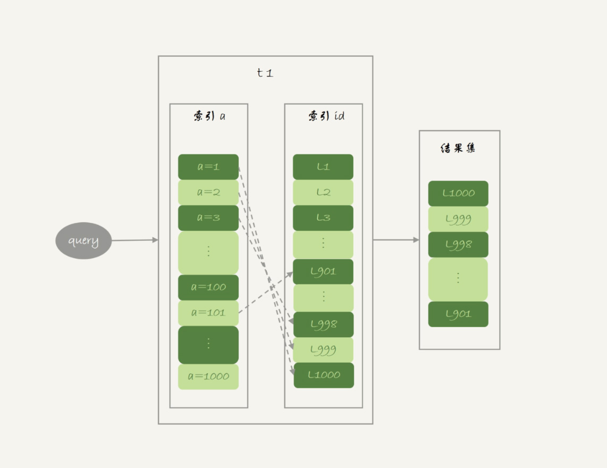

# 《MySQL 实战45讲》节选第四部分

[Source](http://learn.lianglianglee.com/%E6%9E%81%E5%AE%A2%E6%97%B6%E9%97%B4/MySQL%E5%AE%9E%E6%88%9845%E8%AE%B2.md "Permalink to MySQL实战45讲.md")

以下内容节选自 “丁奇” 在极客时间的 《MySQL实战45讲》的内容，这是第四部分


## 30 答疑文章（二）：用动态的观点看加锁

前面的文章介绍了 InnoDB 的间隙锁、next-key lock，以及加锁规则。在这两篇文章的评论区，出现了很多高质量的留言。我觉得通过分析这些问题，可以帮助你加深对加锁规则的理解。

所以，我就从中挑选了几个有代表性的问题，构成了今天这篇答疑文章的主题，即：用动态的观点看加锁。

**为了方便你理解，我们再一起复习一下加锁规则。这个规则中，包含了两个“原则”、两个“优化”和一个“bug”：**

* 原则 1：加锁的基本单位是 next-key lock。希望你还记得，next-key lock 是前开后闭区间。
* 原则 2：查找过程中访问到的对象才会加锁。
* 优化 1：索引上的等值查询，给唯一索引加锁的时候，next-key lock 退化为行锁。
* 优化 2：索引上的等值查询，向右遍历时且最后一个值不满足等值条件的时候，next-key lock 退化为间隙锁。
* 一个 bug：唯一索引上的范围查询会访问到不满足条件的第一个值为止。

接下来，我们的讨论还是基于下面这个表 t：

```sql
CREATE TABLE `t` (
  `id` int(11) NOT NULL,
  `c` int(11) DEFAULT NULL,
  `d` int(11) DEFAULT NULL,
  PRIMARY KEY (`id`),
  KEY `c` (`c`)
) ENGINE=InnoDB; 
insert into t values(0,0,0),(5,5,5),(10,10,10),(15,15,15),(20,20,20),(25,25,25);
```

### 不等号条件里的等值查询

有同学对“等值查询”提出了疑问：等值查询和“遍历”有什么区别？为什么我们文章的例子里面，where 条件是不等号，这个过程里也有等值查询？

我们一起来看下这个例子，分析一下这条查询语句的加锁范围：

```sql
begin;
select * from t where id>9 and id<12 order by id desc for update;
```

利用上面的加锁规则，我们知道这个语句的加锁范围是主键索引上的 (0,5]、(5,10] 和 (10, 15)。也就是说，id=15 这一行，并没有被加上行锁。为什么呢？

我们说加锁单位是 next-key lock，都是前开后闭区间，但是这里用到了优化 2，即索引上的等值查询，向右遍历的时候 id=15 不满足条件，所以 next-key lock 退化为了间隙锁 (10, 15)。

但是，我们的查询语句中 where 条件是大于号和小于号，这里的“等值查询”又是从哪里来的呢？

要知道，加锁动作是发生在语句执行过程中的，所以你在分析加锁行为的时候，要从索引上的数据结构开始。这里，我再把这个过程拆解一下。

如图 1 所示，是这个表的索引 id 的示意图。


图 1 索引 id 示意图

1. 首先这个查询语句的语义是 order by id desc，要拿到满足条件的所有行，优化器必须先找到“第一个 id\<12 的值”。
2. 这个过程是通过索引树的搜索过程得到的，在引擎内部，其实是要找到 id=12 的这个值，只是最终没找到，但找到了 (10,15) 这个间隙。
3. 然后向左遍历，在遍历过程中，就不是等值查询了，会扫描到 id=5 这一行，所以会加一个 next-key lock (0,5]。

也就是说，在执行过程中，通过树搜索的方式定位记录的时候，用的是“等值查询”的方法。

### 等值查询的过程

与上面这个例子对应的，是 @发条橙子同学提出的问题：下面这个语句的加锁范围是什么？

```sql
begin;
select id from t where c in(5,20,10) lock in share mode;
```

这条查询语句里用的是 in，我们先来看这条语句的 explain 结果。

```sql
mysql> explain select id from t where c in(5,20,10) lock in share mode;
+----+-------------+-------+------------+-------+---------------+------+---------+------+------+----------+--------------------------+
| id | select_type | table | partitions | type  | possible_keys | key  | key_len | ref  | rows | filtered | Extra                    |
+----+-------------+-------+------------+-------+---------------+------+---------+------+------+----------+--------------------------+
|  1 | SIMPLE      | t     | NULL       | range | c             | c    | 5       | NULL |    3 |   100.00 | Using where; Using index |
+----+-------------+-------+------------+-------+---------------+------+---------+------+------+----------+--------------------------+
```

可以看到，这条 in 语句使用了索引 c 并且 rows=3，说明这三个值都是通过 B+ 树搜索定位的。

在查找 c=5 的时候，先锁住了 (0,5]。但是因为 c 不是唯一索引，为了确认还有没有别的记录 c=5，就要向右遍历，找到 c=10 才确认没有了，这个过程满足优化 2，所以加了间隙锁 (5,10)。

同样的，执行 c=10 这个逻辑的时候，加锁的范围是 (5,10] 和 (10,15)；执行 c=20 这个逻辑的时候，加锁的范围是 (15,20] 和 (20,25)。

通过这个分析，我们可以知道，这条语句在索引 c 上加的三个记录锁的顺序是：先加 c=5 的记录锁，再加 c=10 的记录锁，最后加 c=20 的记录锁。

你可能会说，这个加锁范围，不就是从 (5,25) 中去掉 c=15 的行锁吗？为什么这么麻烦地分段说呢？

因为我要跟你强调这个过程：这些锁是“在执行过程中一个一个加的”，而不是一次性加上去的。

理解了这个加锁过程之后，我们就可以来分析下面例子中的死锁问题了。

如果同时有另外一个语句，是这么写的：

```sql
select id from t where c in(5,20,10) order by c desc for update;
```

此时的加锁范围，又是什么呢？

我们现在都知道间隙锁是不互锁的，但是这两条语句都会在索引 c 上的 c=5、10、20 这三行记录上加记录锁。

这里你需要注意一下，由于语句里面是 order by c desc， 这三个记录锁的加锁顺序，是先锁 c=20，然后 c=10，最后是 c=5。

也就是说，这两条语句要加锁相同的资源，但是加锁顺序相反。当这两条语句并发执行的时候，就可能出现死锁。

关于死锁的信息，MySQL 只保留了最后一个死锁的现场，但这个现场还是不完备的。

有同学在评论区留言到，希望我能展开一下怎么看死锁。现在，我就来简单分析一下上面这个例子的死锁现场。

### 怎么看死锁？

图 3 是在出现死锁后，执行 `show engine innodb status` 命令得到的部分输出。这个命令会输出很多信息，有一节 `LATESTDETECTED DEADLOCK`，就是记录的最后一次死锁信息。

```sql
2019-01-09 19:21:11 0x7feb98d47700
*** (1) TRANSACTION:
TRANSACTION 422127109356256, ACTIVE 0 sec starting index read mysql tables in use 1, locked 1
LOCK WAIT 4 lock struct (s), heap size 1136, 3 row lock(s)
MySQL thread id 98, OS thread handle 140649857836800, query id 119190 localhost 127.0.0.1 root Sending data select id from t where c in(5,20,10) lock in share mode
*** (1) WAITING FOR THIS LOCK TO BE GRANTED:
RECORD LOCKS space id 24 page no 4 n bits 80 index c of table `test`.`t` trx id 422127109356256 lock mode S waiting
Record lock, heap no 4 PHYSICAL RECORD: _fields 2; compact format; info bits
0: len 4; hex 0000000a; asc     ;;
1: len 4; hex 0000000a; asc     ;;

*** (2) TRANSACTION:
TRANSACTION 1315, ACTIVE 0 sec starting index read mysql tables in use 1, locked 1
5 lock struct (s), heap size 1136, 7 row lock (s)
MySQL thread id 99, OS thread handle 140649858103040, query id 119189 localhost 127.0.0.1 root Sending data select id from t where c in(5,20,10) order by c desc for update
*** (2) HOLDS THE LOCK(S) :
RECORD LOCKS space id 24 page no 4 n bits 80 index c of table `test`.`t` trx id 1315 lock_mode X
Record lock, heap no 4 PHYSICAL RECORD: _fields 2; compact format; info bits 0
0: len 4; hex 0000000a; asc    ;;
1: len 4; hex 0000000a; asc    ;;

Record lock, heap no 6 PHYSICAL RECORD: _fields 2; compact format; info bits 0
0: len 4; hex 00000014; asc   ;;
1: len 4; hex 00000014; asc   ;;

*** (2) WAITING FOR THIS LOCK TO BE GRANTED:
RECORD LOCKS space id 24 page no 4 n bits 80 index c of table `test`.`t` trx id 1315 lock_mode X waiting
Record lock, heap no 3 PHYSICAL RECORD: _fields 2; compact format; info bits 0
0: len 4; hex 00000005; asc   ;;
1: len 4; hex 00000005; asc   ;;
*** WE ROLL BACK TRANSACTION (1)
```

我们来看看这图中的几个关键信息。

1. 这个结果分成三部分： 
  * `(1) TRANSACTION`，是第一个事务的信息；
  * `(2) TRANSACTION`，是第二个事务的信息；
  * `WE ROLL BACK TRANSACTION (1)`，是最终的处理结果，表示回滚了第一个事务。
2. 第一个事务的信息中： 
  * WAITING FOR THIS LOCK TO BE GRANTED，表示的是这个事务在等待的锁信息；
  * index c of table `test`.`t`，说明在等的是表 t 上索引c的锁；
  * lock mode S waiting 表示这个语句要自己加一个读锁，当前的状态是等待中；
  * Record lock 说明这是一个记录锁；
  * n_fields 2 表示这个记录是2列，也就是字段 c 和主键字段 id；
  * `0: len 4; hex 0000000a; asc ;;` 是第一个字段，也就是 c。值是十六进制 a，也就是 10；
  * `1: len 4; hex 0000000a; asc ;;` 是第二个字段，也就是主键 id，值也是 10；
  * 这两行里面的 asc 表示的是，接下来要打印出值里面的“可打印字符”，但 10 不是可打印字符，因此就显示空格。
  * 第一个事务信息就只显示出了等锁的状态，在等待 `(c=10,id=10)` 这一行的锁。
  * 当然你是知道的，既然出现死锁了，就表示这个事务也占有别的锁，但是没有显示出来。别着急，我们从第二个事务的信息中推导出来。
3. 第二个事务显示的信息要多一些： 
  * HOLDS THE LOCK(S) 用来显示这个事务持有哪些锁；
  * index c of table `test`.`t` 表示锁是在表 t 的索引 c 上；
  * hex 0000000a 和 hex 00000014 表示这个事务持有 c=10 和 c=20 这两个记录锁；
  * WAITING FOR THIS LOCK TO BE GRANTED，表示在等 `(c=5,id=5)` 这个记录锁。

从上面这些信息中，我们就知道：

1. `lock in share mode` 的这条语句，持有 c=5 的记录锁，在等 c=10 的锁；
2. `for update` 这个语句，持有 c=20 和 c=10 的记录锁，在等 c=5 的记录锁。

因此导致了死锁。这里，我们可以得到两个结论：

1. 由于锁是一个个加的，要避免死锁，对同一组资源，要按照尽量相同的顺序访问；
2. 在发生死锁的时刻，for update 这条语句占有的资源更多，回滚成本更大，所以 InnoDB 选择了回滚成本更小的 lock in share mode 语句，来回滚。

### 怎么看锁等待？

看完死锁，我们再来看一个锁等待的例子。

| session A                                                    | session B                                                    |
| ------------------------------------------------------------ | ------------------------------------------------------------ |
| begin;<br />select * from t where id>10 and id <=15 for update; |                                                              |
|                                                              | delete from t where id=10;<br />(Query OK)<br /><br />insert into t values(10,10,10);<br />(blocked) |

可以看到，由于 session A 并没有锁住 c=10 这个记录，所以 session B 删除 id=10 这一行是可以的。但是之后，session B 再想 insert id=10 这一行回去就不行了。

现在我们一起看一下此时 `show engine innodb status` 的结果，看看能不能给我们一些提示。锁信息是在这个命令输出结果的 TRANSACTIONS 这一节。

```sql
---TRANSACTION 588638, ACTIVE 12 sec inserting
mysql tables in use 1, locked 1
LOCK WAIT 2 lock struct(s), heap size 1136, 1 row lock(s)
MySQL thread id 29, OS thread handle 123145585180672, query id 630604 localhost root update
insert into t values(10,10,10)
------- TRX HAS BEEN WAITING 12 SEC FOR THIS LOCK TO BE GRANTED:
RECORD LOCKS space id 496 page no 4 n bits 80 index PRIMARY of table `test`.`t` trx id 588638 lock_mode X locks gap before rec insert intention waiting
Record lock, heap no 5 PHYSICAL RECORD: n_fields 5; compact format; info bits 0
 0: len 4; hex 8000000f; asc     ;;
 1: len 6; hex 00000008fb53; asc      S;;
 2: len 7; hex 82000002010137; asc       7;;
 3: len 4; hex 8000000f; asc     ;;
 4: len 4; hex 8000000f; asc     ;;
```


图 5 锁等待信息

我们来看几个关键信息。

1. index PRIMARY of table `test`.`t` ，表示这个语句被锁住是因为表 t 主键上的某个锁。
2. `lock_mode X locks gap before rec insert intention waiting` 这里有几个信息： 
   1. `insert intention` 表示当前线程准备插入一个记录，这是一个插入意向锁。为了便于理解，你可以认为它就是这个插入动作本身。
   2. `gap before rec` 表示这是一个间隙锁，而不是记录锁。
3. 那么这个 gap 是在哪个记录之前的呢？接下来的 0~4 这 5 行的内容就是这个记录的信息。
4. `n_fields 5` 也表示了，这一个记录有 5 列： 
  * `0: len 4; hex 0000000f; asc ;;` 第一列是主键 id 字段，十六进制 f 就是 id=15。所以，这时我们就知道了，这个间隙就是 id=15 之前的，因为 id=10 已经不存在了，它表示的就是 `(5,15)`。
  * `1: len 6; hex 0000008fb53; asc S;;` 第二列是长度为 6 字节的事务 id，表示最后修改这一行的是 trx id 为 588627 的事务。
  * `2: len 7; hex 82000002010137; asc  7;;` 第三列长度为 7 字节的回滚段信息。可以看到，这里的 acs 后面有显示内容 (7)，这是因为刚好这个字节是可打印字符。
  * 后面两列是 c 和 d 的值，都是 15。

因此，我们就知道了，由于 delete 操作把 id=10 这一行删掉了，原来的两个间隙 (5,10)、(10,15）变成了一个 (5,15)。

说到这里，你可以联合起来再思考一下这两个现象之间的关联：

1. session A 执行完 select 语句后，什么都没做，但它加锁的范围突然“变大”了；
2. 当我们执行 `select * from t where c>=15 and c<=20 order by c desc lock in share mode;` 向左扫描到 c=10 的时候，要把 (5, 10] 锁起来。

也就是说，所谓“间隙”，其实根本就是由“这个间隙右边的那个记录”定义的。

### update 的例子

再来看一个 update 语句的案例。

| session A                                                   | session B                                                    |
| ----------------------------------------------------------- | ------------------------------------------------------------ |
| begin;<br />select c from t where c > 5 lock in share mode; |                                                              |
|                                                             | update t set c = 1 where c = 5;<br />(Query OK)<br /><br />update t set c = 5 where c = 1;<br />(blocked) |

你可以自己分析一下，session A 的加锁范围是索引 c 上的 `(5,10]、(10,15]、(15,20]、(20,25]` 和 `(25,supremum]`。

> 注意：根据 c\>5 查到的第一个记录是 c=10，因此不会加 (0,5] 这个 next-key lock。

之后 session B 的第一个 update 语句，要把 c=5 改成 c=1，你可以理解为两步：

1. 插入 `(c=1, id=5)` 这个记录；
2. 删除 `(c=5, id=5)` 这个记录。

按照我们上一节说的，索引 c 上 (5,10) 间隙是由这个间隙右边的记录，也就是 c=10 定义的。所以通过这个操作，session A 的加锁范围变成了图 7 所示的样子：

图 7 session B 修改后， session A 的加锁范围

好，接下来 session B 要执行 `update t set c = 5 where c = 1` 这个语句了，一样地可以拆成两步：

1. 插入 `(c=5, id=5)` 这个记录；
2. 删除 `(c=1, id=5)` 这个记录。

第一步试图在已经加了间隙锁的 `(1,10)` 中插入数据，所以就被堵住了。

### 小结

今天这篇文章，我用前面文章评论区的几个问题，再次复习了加锁规则。并且重点说明了分析加锁范围时，一定要配合语句执行逻辑来进行。

在我看来，每个想认真了解 MySQL 原理的同学，应该都要能够做到：通过 explain 的结果，就能够脑补出一个 SQL 语句的执行流程。达到这样的程度，才算是对索引组织表、索引、锁的概念有了比较清晰的认识。你同样也可以用这个方法，来验证自己对这些知识点的掌握程度。

在分析这些加锁规则的过程中，也顺便跟你介绍了怎么看 `show engine innodb status` 输出结果中的事务信息和死锁信息，希望这些内容对你以后分析现场能有所帮助。

## 31 误删数据后除了跑路，还能怎么办？

今天我要和你讨论的是一个沉重的话题：误删数据。

在前面几篇文章中，我们介绍了 MySQL 的高可用架构。当然，传统的高可用架构是不能预防误删数据的，因为主库的一个 `drop table` 命令，会通过 binlog 传给所有从库和级联从库，进而导致整个集群的实例都会执行这个命令。

虽然我们之前遇到的大多数的数据被删，都是运维同学或者 DBA 背锅的。但实际上，只要有数据操作权限的同学，都有可能踩到误删数据这条线。

今天我们就来聊聊误删数据前后，我们可以做些什么，减少误删数据的风险，和由误删数据带来的损失。

为了找到解决误删数据的更高效的方法，我们需要先对和 MySQL 相关的误删数据，做下分类：

1. 使用 delete 语句误删数据行；
2. 使用 drop table 或者 truncate table 语句误删数据表；
3. 使用 drop database 语句误删数据库；
4. 使用 rm 命令误删整个 MySQL 实例。

### 误删行

如果是使用 delete 语句误删了数据行，可以用 [Flashback](https://mariadb.com/kb/en/flashback/) 工具通过闪回把数据恢复回来。

Flashback 恢复数据的原理，是修改 binlog 的内容，拿回原库重放。而能够使用这个方案的前提是，需要确保 `binlog_format=row` 和 `binlog_row_image=FULL`。

具体恢复数据时，对单个事务做如下处理：

1. 对于 insert 语句，对应的 binlog event 类型是 Write_rows event，把它改成 `Delete_rows` event 即可；
2. 同理，对于 delete 语句，也是将 Delete_rows event 改为 Write_rows event；
3. 而如果是 Update_rows 的话，binlog 里面记录了数据行修改前和修改后的值，对调这两行的位置即可。

如果误操作不是一个，而是多个，会怎么样呢？比如下面三个事务：

```sql
(A)delete ...
(B)insert ...
(C)update ...
```

现在要把数据库恢复回这三个事务操作之前的状态，用 Flashback 工具解析 binlog 后，写回主库的命令是：

```sql
(reverse C)update ...
(reverse B)delete ...
(reverse A)insert ...
```

也就是说，如果误删数据涉及到了多个事务的话，需要将事务的顺序调过来再执行。

**需要说明的是，我不建议你直接在主库上执行这些操作。**

恢复数据比较安全的做法，是恢复出一个备份，或者找一个从库作为临时库，在这个临时库上执行这些操作，然后再将确认过的临时库的数据，恢复回主库。

为什么要这么做呢？

这是因为，一个在执行线上逻辑的主库，数据状态的变更往往是有关联的。可能由于发现数据问题的时间晚了一点儿，就导致已经在之前误操作的基础上，业务代码逻辑又继续修改了其他数据。所以，如果这时候单独恢复这几行数据，而又未经确认的话，就可能会出现对数据的二次破坏。

当然，**我们不止要说误删数据的事后处理办法，更重要是要做到事前预防**。我有以下两个建议：

1. 把 `sql_safe_updates` 参数设置为 on。这样一来，如果我们忘记在 delete 或者 update 语句中写 where 条件，或者 where 条件里面没有包含索引字段的话，这条语句的执行就会报错。
2. 代码上线前，必须经过 SQL 审计。

你可能会说，设置了 `sql_safe_updates=on`，如果我真的要把一个小表的数据全部删掉，应该怎么办呢？

如果你确定这个删除操作没问题的话，可以在 delete 语句中加上 where 条件，比如 `where id>=0`。

但是，delete 全表是很慢的，需要生成回滚日志、写 redo、写 binlog。所以，从性能角度考虑，你应该优先考虑使用 truncate table 或者 drop table 命令。

使用 delete 命令删除的数据，你还可以用 Flashback 来恢复。而使用 truncate /drop table 和 drop database 命令删除的数据，就没办法通过 Flashback 来恢复了。为什么呢？

这是因为，即使我们配置了 binlog_format=row，执行这三个命令时，记录的 binlog 还是 statement 格式。binlog 里面就只有一个 truncate/drop 语句，这些信息是恢复不出数据的。

那么，如果我们真的是使用这几条命令误删数据了，又该怎么办呢？

### 误删库 / 表

这种情况下，要想恢复数据，就需要使用全量备份，加增量日志的方式了。这个方案要求线上有定期的全量备份，并且实时备份 binlog。

在这两个条件都具备的情况下，假如有人中午 12 点误删了一个库，恢复数据的流程如下：

1. 取最近一次全量备份，假设这个库是一天一备，上次备份是当天 0 点；
2. 用备份恢复出一个临时库；
3. 从日志备份里面，取出凌晨 0 点之后的日志；
4. 把这些日志，除了误删除数据的语句外，全部应用到临时库。

关于这个过程，需要说明如下几点：

1. 为了加速数据恢复，如果这个临时库上有多个数据库，你可以在使用 mysqlbinlog 命令时，加上一个 `-–database` 参数，用来指定误删表所在的库。这样，就避免了在恢复数据时还要应用其他库日志的情况。
2. 在应用日志的时候，需要跳过 12 点误操作的那个语句的 binlog： 
  * 如果原实例没有使用 GTID 模式，只能在应用到包含 12 点的 binlog 文件的时候，先用 `-–stop-position` 参数执行到误操作之前的日志，然后再用 `-–start-position` 从误操作之后的日志继续执行；
  * 如果实例使用了 GTID 模式，就方便多了。假设误操作命令的 GTID 是 gtid1，那么只需要执行 `set gtid_next=gtid1;begin;commit;` 先把这个 GTID 加到临时实例的 GTID 集合，之后按顺序执行 binlog 的时候，就会自动跳过误操作的语句。

不过，即使这样，使用 mysqlbinlog 方法恢复数据还是不够快，主要原因有两个：

1. 如果是误删表，最好就是只恢复出这张表，也就是只重放这张表的操作，但是 mysqlbinlog 工具并不能指定只解析一个表的日志；
2. 用 mysqlbinlog 解析出日志应用，应用日志的过程就只能是单线程。

**一种加速的方法是，**在用备份恢复出临时实例之后，将这个临时实例设置成线上备库的从库，这样：

1. 在 start slave 之前，先通过执行 `change replication filter replicate_do_table = (tbl_name)` 命令，就可以让临时库只同步误操作的表；
2. 这样做也可以用上并行复制技术，来加速整个数据恢复过程。

假设，我们发现当前临时实例需要的 binlog 是从 `master.000005` 开始的，但是在备库上执行 `show binlogs` 显示的最小的 binlog 文件是 `master.000007`，意味着少了两个 binlog 文件。这时，我们就需要去 binlog 备份系统中找到这两个文件。

把之前删掉的 binlog 放回备库的操作步骤，是这样的：

1. 从备份系统下载 `master.000005` 和 `master.000006` 这两个文件，放到备库的日志目录下；
2. 打开日志目录下的 `master.index` 文件，在文件开头加入两行，内容分别是 `master.000005` 和 `master.000006`;
3. 重启备库，目的是要让备库重新识别这两个日志文件；
4. 现在这个备库上就有了临时库需要的所有 binlog 了，建立主备关系，就可以正常同步了。

不论是把 mysqlbinlog 工具解析出的 binlog 文件应用到临时库，还是把临时库接到备库上，这两个方案的共同点是：误删库或者表后，恢复数据的思路主要就是通过备份，再加上应用 binlog 的方式。

也就是说，这两个方案都要求备份系统定期备份全量日志，而且需要确保 binlog 在被从本地删除之前已经做了备份。

但是，一个系统不可能备份无限的日志，你还需要根据成本和磁盘空间资源，设定一个日志保留的天数。如果你的 DBA 团队告诉你，可以保证把某个实例恢复到半个月内的任意时间点，这就表示备份系统保留的日志时间就至少是半个月。

另外，我建议你不论使用上述哪种方式，都要把这个数据恢复功能做成自动化工具，并且经常拿出来演练。为什么这么说呢？

这里的原因，主要包括两个方面：

1. 虽然“发生这种事，大家都不想的”，但是万一出现了误删事件，能够快速恢复数据，将损失降到最小，也应该不用跑路了。
2. 而如果临时再手忙脚乱地手动操作，最后又误操作了，对业务造成了二次伤害，那就说不过去了。

### 延迟复制备库

虽然我们可以通过利用并行复制来加速恢复数据的过程，但是这个方案仍然存在“恢复时间不可控”的问题。

如果一个库的备份特别大，或者误操作的时间距离上一个全量备份的时间较长，比如一周一备的实例，在备份之后的第 6 天发生误操作，那就需要恢复 6 天的日志，这个恢复时间可能是要按天来计算的。

那么，我们有什么方法可以缩短恢复数据需要的时间呢？

如果有非常核心的业务，不允许太长的恢复时间，我们可以考虑 **搭建延迟复制的备库。**这个功能是 MySQL 5.6 版本引入的。

一般的主备复制结构存在的问题是，如果主库上有个表被误删了，这个命令很快也会被发给所有从库，进而导致所有从库的数据表也都一起被误删了。

延迟复制的备库是一种特殊的备库，通过 `CHANGE MASTER TO MASTER_DELAY = N` 命令，可以指定这个备库持续保持跟主库有 N 秒的延迟。

比如你把 N 设置为 3600，这就代表了如果主库上有数据被误删了，并且在 1 小时内发现了这个误操作命令，这个命令就还没有在这个延迟复制的备库执行。这时候到这个备库上执行 stop slave，再通过之前介绍的方法，跳过误操作命令，就可以恢复出需要的数据。

这样的话，你就随时可以得到一个，只需要最多再追 1 小时，就可以恢复出数据的临时实例，也就缩短了整个数据恢复需要的时间。

### 预防误删库 / 表的方法

虽然常在河边走，很难不湿鞋，但终究还是可以找到一些方法来避免的。所以这里，我也会给你一些减少误删操作风险的建议。

第一条建议是，账号分离。这样做的目的是，避免写错命令。比如：

* 我们只给业务开发同学 DML 权限，而不给 truncate/drop 权限。而如果业务开发人员有 DDL 需求的话，也可以通过开发管理系统得到支持。
* 即使是 DBA 团队成员，日常也都规定只使用只读账号，必要的时候才使用有更新权限的账号。

第二条建议是，制定操作规范。这样做的目的，是避免写错要删除的表名。比如：

* 在删除数据表之前，必须先对表做改名操作。然后，观察一段时间，确保对业务无影响以后再删除这张表。
* 改表名的时候，要求给表名加固定的后缀（比如加 `_to_be_deleted`)，然后删除表的动作必须通过管理系统执行。并且，管理系删除表的时候，只能删除固定后缀的表。

### rm 删除数据

其实，对于一个有高可用机制的 MySQL 集群来说，最不怕的就是 rm 删除数据了。只要不是恶意地把整个集群删除，而只是删掉了其中某一个节点的数据的话，HA 系统就会开始工作，选出一个新的主库，从而保证整个集群的正常工作。

这时，你要做的就是在这个节点上把数据恢复回来，再接入整个集群。

当然了，现在不止是 DBA 有自动化系统，SA（系统管理员）也有自动化系统，所以也许一个批量下线机器的操作，会让你整个 MySQL 集群的所有节点都全军覆没。

应对这种情况，我的建议只能是说尽量把你的备份跨机房，或者最好是跨城市保存。

### 小结

今天，我和你讨论了误删数据的几种可能，以及误删后的处理方法。

但，我要强调的是，预防远比处理的意义来得大。

另外，在 MySQL 的集群方案中，会时不时地用到备份来恢复实例，因此定期检查备份的有效性也很有必要。

如果你是业务开发同学，你可以用 show grants 命令查看账户的权限，如果权限过大，可以建议 DBA 同学给你分配权限低一些的账号；你也可以评估业务的重要性，和 DBA 商量备份的周期、是否有必要创建延迟复制的备库等等。

数据和服务的可靠性不止是运维团队的工作，最终是各个环节一起保障的结果。

### 上期问题时间

我在上一篇文章给你留的问题，是关于空表的间隙的定义。

一个空表就只有一个间隙。比如，在空表上执行：

```sql
begin;
select * from t where id>1 for update;
```

这个查询语句加锁的范围就是 next-key lock (-∞, supremum]。

验证方法的话，你可以使用下面的操作序列。

| session A                                                    | session B                               |
| ------------------------------------------------------------ | --------------------------------------- |
| create table t(id int primary key) engine=innodb;<br />begin;<br />select * from t where id > 1 for update; |                                         |
|                                                              | insert into t values(2);<br />(blocked) |
| show engine innodb status \G;                                |                                         |

```sql
mysql tables in use 1, locked 1
LOCK WAIT 2 lock struct(s), heap size 1136, 1 row lock(s)
MySQL thread id 30, OS thread handle 123145585483776, query id 630638 localhost root update
insert into tt values(2)
------- TRX HAS BEEN WAITING 4 SEC FOR THIS LOCK TO BE GRANTED:
RECORD LOCKS space id 498 page no 4 n bits 72 index PRIMARY of table `test`.`tt` trx id 588668 lock_mode X insert intention waiting
Record lock, heap no 1 PHYSICAL RECORD: n_fields 1; compact format; info bits 0
 0: len 8; hex 73757072656d756d; asc supremum;;
```

## 32 为什么还有kill不掉的语句？

在 MySQL 中有两个 kill 命令：一个是 `kill query + 线程 id`，表示终止这个线程中正在执行的语句；一个是 `kill connection + 线程 id`，这里 connection 可缺省，表示断开这个线程的连接，当然如果这个线程有语句正在执行，也是要先停止正在执行的语句的。

不知道你在使用 MySQL 的时候，有没有遇到过这样的现象：使用了 kill 命令，却没能断开这个连接。再执行 `show processlist` 命令，看到这条语句的 Command 列显示的是 Killed。

你一定会奇怪，显示为 Killed 是什么意思，不是应该直接在 show processlist 的结果里看不到这个线程了吗？

今天，我们就来讨论一下这个问题。

其实大多数情况下，kill query/connection 命令是有效的。比如，执行一个查询的过程中，发现执行时间太久，要放弃继续查询，这时我们就可以用 kill query 命令，终止这条查询语句。

还有一种情况是，语句处于锁等待的时候，直接使用 kill 命令也是有效的。我们一起来看下这个例子：

| session A                                  | session B                                          | session C                |
| ------------------------------------------ | -------------------------------------------------- | ------------------------ |
| begin;<br />update t set c=c+1 where id=1; |                                                    |                          |
|                                            | update t set c=c+1 where id=1;<br />(blocked)      |                          |
|                                            | ERROR 1317(70100): Query execution was interrupted | kill query `thread_id_B` |

可以看到，session C 执行 kill query 以后，session B 几乎同时就提示了语句被中断。这，就是我们预期的结果。

### 收到 kill 以后，线程做什么？

但是，这里你要停下来想一下：session B 是直接终止掉线程，什么都不管就直接退出吗？显然，这是不行的。

我在[第 6 篇文章]中讲过，当对一个表做增删改查操作时，会在表上加 MDL 读锁。所以，session B 虽然处于 blocked 状态，但还是拿着一个 MDL 读锁的。如果线程被 kill 的时候，就直接终止，那之后这个 MDL 读锁就没机会被释放了。

这样看来，kill 并不是马上停止的意思，而是告诉执行线程说，这条语句已经不需要继续执行了，可以开始“执行停止的逻辑了”。

> 其实，这跟 Linux 的 kill 命令类似，kill -N pid 并不是让进程直接停止，而是给进程发一个信号，然后进程处理这个信号，进入终止逻辑。只是对于 MySQL 的 kill 命令来说，不需要传信号量参数，就只有“停止”这个命令。

**实现上，当用户执行 `kill query thread_id_B` 时，MySQL 里处理 kill 命令的线程做了两件事：**

1. 把 session B 的运行状态改成 `THD::KILL_QUERY`(将变量 killed 赋值为 `THD::KILL_QUERY`)；
2. 给 session B 的执行线程发一个信号。

为什么要发信号呢？

因为像图 1 的我们例子里面，session B 处于锁等待状态，如果只是把 session B 的线程状态设置  `THD::KILL_QUERY`，线程 B 并不知道这个状态变化，还是会继续等待。发一个信号的目的，就是让 session B 退出等待，来处理这个  `THD::KILL_QUERY` 状态。

上面的分析中，隐含了这么三层意思：

1. 一个语句执行过程中有多处“埋点”，在这些“埋点”的地方判断线程状态，如果发现线程状态是  `THD::KILL_QUERY`，才开始进入语句终止逻辑；
2. 如果处于等待状态，必须是一个可以被唤醒的等待，否则根本不会执行到“埋点”处；
3. 语句从开始进入终止逻辑，到终止逻辑完全完成，是有一个过程的。

到这里你就知道了，原来不是“说停就停的”。

接下来，我们**再看一个 kill 不掉的例子**，也就是 `innodb_thread_concurrency` 不够用的例子。

首先，执行 set global innodb_thread_concurrency=2，将 InnoDB 的并发线程上限数设置为 2；然后，执行下面的序列：


图 2 kill query 无效的例子

可以看到：

1. sesssion C 执行的时候被堵住了；
2. 但是 session D 执行的 kill query C 命令却没什么效果，
3. 直到 session E 执行了 kill connection 命令，才断开了 session C 的连接，提示“Lost connection to MySQL server during query”，
4. 但是这时候，如果在 session E 中执行 show processlist，你就能看到下面这个图。


图 3 kill connection 之后的效果

这时候，id=12 这个线程的 Commnad 列显示的是 Killed。也就是说，客户端虽然断开了连接，但实际上服务端上这条语句还在执行过程中。

**为什么在执行 kill query 命令时，这条语句不像第一个例子的 update 语句一样退出呢？**

在实现上，等行锁时，使用的是 pthread_cond_timedwait 函数，这个等待状态可以被唤醒。但是，在这个例子里，12 号线程的等待逻辑是这样的：每 10 毫秒判断一下是否可以进入 InnoDB 执行，如果不行，就调用 nanosleep 函数进入 sleep 状态。

也就是说，虽然 12 号线程的状态已经被设置成了 KILL_QUERY，但是在这个等待进入 InnoDB 的循环过程中，并没有去判断线程的状态，因此根本不会进入终止逻辑阶段。

而当 session E 执行 kill connection 命令时，是这么做的，

1. 把 12 号线程状态设置为 KILL_CONNECTION；
2. 关掉 12 号线程的网络连接。因为有这个操作，所以你会看到，这时候 session C 收到了断开连接的提示。

那为什么执行 show processlist 的时候，会看到 Command 列显示为 killed 呢？其实，这就是因为在执行 show processlist 的时候，有一个特别的逻辑：

    如果一个线程的状态是 KILL_CONNECTION，就把 Command 列显示成 Killed。

所以其实，即使是客户端退出了，这个线程的状态仍然是在等待中。那这个线程什么时候会退出呢？

答案是，只有等到满足进入 InnoDB 的条件后，session C 的查询语句继续执行，然后才有可能判断到线程状态已经变成了 KILL_QUERY 或者 KILL_CONNECTION，再进入终止逻辑阶段。

到这里，我们来小结一下。

**这个例子是 kill 无效的第一类情况，即：线程没有执行到判断线程状态的逻辑。**跟这种情况相同的，还有由于 IO 压力过大，读写 IO 的函数一直无法返回，导致不能及时判断线程的状态。

**另一类情况是，终止逻辑耗时较长。**这时候，从 show processlist 结果上看也是 Command=Killed，需要等到终止逻辑完成，语句才算真正完成。这类情况，比较常见的场景有以下几种：

1. 超大事务执行期间被 kill。这时候，回滚操作需要对事务执行期间生成的所有新数据版本做回收操作，耗时很长。
2. 大查询回滚。如果查询过程中生成了比较大的临时文件，加上此时文件系统压力大，删除临时文件可能需要等待 IO 资源，导致耗时较长。
3. DDL 命令执行到最后阶段，如果被 kill，需要删除中间过程的临时文件，也可能受 IO 资源影响耗时较久。

之前有人问过我，如果直接在客户端通过 Ctrl+C 命令，是不是就可以直接终止线程呢？

答案是，不可以。

这里有一个误解，其实在客户端的操作只能操作到客户端的线程，客户端和服务端只能通过网络交互，是不可能直接操作服务端线程的。

而由于 MySQL 是停等协议，所以这个线程执行的语句还没有返回的时候，再往这个连接里面继续发命令也是没有用的。实际上，执行 Ctrl+C 的时候，是 MySQL 客户端另外启动一个连接，然后发送一个 kill query 命令。

所以，你可别以为在客户端执行完 Ctrl+C 就万事大吉了。因为，要 kill 掉一个线程，还涉及到后端的很多操作。

### 小结

在今天这篇文章中，我首先和你介绍了 MySQL 中，有些语句和连接“kill 不掉”的情况。

这些“kill 不掉”的情况，其实是因为发送 kill 命令的客户端，并没有强行停止目标线程的执行，而只是设置了个状态，并唤醒对应的线程。而被 kill 的线程，需要执行到判断状态的“埋点”，才会开始进入终止逻辑阶段。并且，终止逻辑本身也是需要耗费时间的。

所以，如果你发现一个线程处于 Killed 状态，你可以做的事情就是，通过影响系统环境，让这个 Killed 状态尽快结束。

比如，如果是第一个例子里 InnoDB 并发度的问题，你就可以临时调大 `innodb_thread_concurrency` 的值，或者停掉别的线程，让出位子给这个线程执行。

而如果是回滚逻辑由于受到 IO 资源限制执行得比较慢，就通过减少系统压力让它加速。

做完这些操作后，其实你已经没有办法再对它做什么了，只能等待流程自己完成。


## 33 我查这么多数据，会不会把数据库内存打爆？

我经常会被问到这样一个问题：我的主机内存只有 100G，现在要对一个 200G 的大表做全表扫描，会不会把数据库主机的内存用光了？

这个问题确实值得担心，被系统 OOM（out of memory）可不是闹着玩的。但是，反过来想想，逻辑备份的时候，可不就是做整库扫描吗？如果这样就会把内存吃光，逻辑备份不是早就挂了？

所以说，对大表做全表扫描，看来应该是没问题的。但是，这个流程到底是怎么样的呢？

### 全表扫描对 server 层的影响

假设，我们现在要对一个 200G 的 InnoDB 表 db1. t，执行一个全表扫描。当然，你要把扫描结果保存在客户端，会使用类似这样的命令：

```sql
mysql -h$host -P$port -u$user -p$pwd -e "select * from db1.t" > $target_file
```

你已经知道了，InnoDB 的数据是保存在主键索引上的，所以全表扫描实际上是直接扫描表 t 的主键索引。这条查询语句由于没有其他的判断条件，所以查到的每一行都可以直接放到结果集里面，然后返回给客户端。

那么，这个“结果集”存在哪里呢？

实际上，服务端并不需要保存一个完整的结果集。取数据和发数据的流程是这样的：

1. 获取一行，写到 `net_buffer` 中。这块内存的大小是由参数 `net_buffer_length` 定义的，默认是 16k。
2. 重复获取行，直到 `net_buffer` 写满，调用网络接口发出去。
3. 如果发送成功，就清空 `net_buffer`，然后继续取下一行，并写入 `net_buffer`。
4. 如果发送函数返回 EAGAIN 或 WSAEWOULDBLOCK，就表示本地网络栈（socket send buffer）写满了，进入等待。直到网络栈重新可写，再继续发送。

这个过程对应的流程图如下所示。


图 1 查询结果发送流程

从这个流程中，你可以看到：

1. 一个查询在发送过程中，占用的 MySQL 内部的内存最大就是 `net_buffer_length` 这么大，并不会达到 200G；
2. socket send buffer 也不可能达到 200G（默认定义 `/proc/sys/net/core/wmem_default`），如果 socket send buffer 被写满，就会暂停读数据的流程。

也就是说，**MySQL 是“边读边发的”**，这个概念很重要。这就意味着，如果客户端接收得慢，会导致 MySQL 服务端由于结果发不出去，这个事务的执行时间变长。

比如下面这个状态，就是我故意让客户端不去读 socket receive buffer 中的内容，然后在服务端 show processlist 看到的结果。

```sql
mysql> show processlist;
+----+-----------------+-----------+------+---------+--------+------------------------+------------------+
| Id | User            | Host      | db   | Command | Time   | State                  | Info             |
+----+-----------------+-----------+------+---------+--------+------------------------+------------------+
|  4 | event_scheduler | localhost | NULL | Daemon  | 151029 | Waiting on empty queue | NULL             |
| 31 | root            | localhost | test | Query   |      0 | starting               | show processlist |
| 32 | root            | localhost | test | Query   |      9 | Sending to client      | select * from t  |
+----+-----------------+-----------+------+---------+--------+------------------------+------------------+
```

如果你看到 State 的值一直处于**“Sending to client”**，就表示服务器端的网络栈写满了。

我在上一篇文章中曾提到，如果客户端使用 `–-quick` 参数，会使用 `mysql_use_result` 方法。这个方法是读一行处理一行。你可以想象一下，假设有一个业务的逻辑比较复杂，每读一行数据以后要处理的逻辑如果很慢，就会导致客户端要过很久才会去取下一行数据，可能就会出现如图 所示的这种情况。

因此，**对于正常的线上业务来说，如果一个查询的返回结果不会很多的话，我都建议你使用 `mysql_store_result` 这个接口，直接把查询结果保存到本地内存。**

当然前提是查询返回结果不多。

另一方面，如果你在自己负责维护的 MySQL 里看到很多个线程都处于“Sending to client”这个状态，就意味着你要让业务开发同学优化查询结果，并评估这么多的返回结果是否合理。

而如果要快速减少处于这个状态的线程的话，将 `net_buffer_length` 参数设置为一个更大的值是一个可选方案。

与 “Sending to client” 长相很类似的一个状态是 **“Sending data”**，这是一个经常被误会的问题。有同学问我说，在自己维护的实例上看到很多查询语句的状态是“Sending data”，但查看网络也没什么问题啊，为什么 Sending data 要这么久？

实际上，一个查询语句的状态变化是这样的（注意：这里，我略去了其他无关的状态）：

* MySQL 查询语句进入执行阶段后，首先把状态设置成“Sending data”；
* 然后，发送执行结果的列相关的信息（meta data) 给客户端；
* 再继续执行语句的流程；
* 执行完成后，把状态设置成空字符串。

也就是说，“Sending data”并不一定是指“正在发送数据”，而可能是处于执行器过程中的任意阶段。

也就是说，仅当一个线程处于“等待客户端接收结果”的状态，才会显示"Sending to client"；而如果显示成“Sending data”，它的意思只是“正在执行”。

现在你知道了，查询的结果是分段发给客户端的，因此扫描全表，查询返回大量的数据，并不会把内存打爆。

在 server 层的处理逻辑我们都清楚了，在 InnoDB 引擎里面又是怎么处理的呢？ 扫描全表会不会对引擎系统造成影响呢？

### 全表扫描对 InnoDB 的影响

内存的数据页是在 Buffer Pool (BP) 中管理的，在 WAL 里 Buffer Pool 起到了加速更新的作用。而实际上，Buffer Pool 还有一个更重要的作用，就是加速查询。

在第 2 篇文章的评论区有同学问道，由于有 WAL 机制，当事务提交的时候，磁盘上的数据页是旧的，那如果这时候马上有一个查询要来读这个数据页，是不是要马上把 redo log 应用到数据页呢？

答案是不需要。因为这时候内存数据页的结果是最新的，直接读内存页就可以了。你看，这时候查询根本不需要读磁盘，直接从内存拿结果，速度是很快的。所以说，Buffer Pool 还有加速查询的作用。

而 Buffer Pool 对查询的加速效果，依赖于一个重要的指标，即：**内存命中率**。

你可以在 `show engine innodb status` 结果中，查看一个系统当前的 BP 命中率。一般情况下，一个稳定服务的线上系统，要保证响应时间符合要求的话，内存命中率要在 99% 以上。

执行 `show engine innodb status` ，可以看到“Buffer pool hit rate”字样，显示的就是当前的命中率。

```sql
Buffer pool hit rate 1000 / 1000, young-making rate 19 / 1000 not 0 / 1000
```

如果所有查询需要的数据页都能够直接从内存得到，那是最好的，对应的命中率就是 100%。但，这在实际生产上是很难做到的。

InnoDB Buffer Pool 的大小是由参数 `innodb_buffer_pool_size` 确定的，一般建议设置成可用物理内存的 60%~80%。

在大约十年前，单机的数据量是上百个 G，而物理内存是几个 G；现在虽然很多服务器都能有 128G 甚至更高的内存，但是单机的数据量却达到了 T 级别。

所以，`innodb_buffer_pool_size` 小于磁盘的数据量是很常见的。如果一个 Buffer Pool 满了，而又要从磁盘读入一个数据页，那肯定是要淘汰一个旧数据页的。

InnoDB 内存管理用的是最近最少使用 (Least Recently Used, LRU) 算法，这个算法的核心就是淘汰最久未使用的数据。

下图是一个 LRU 算法的基本模型。


图 6 基本 LRU 算法

InnoDB 管理 Buffer Pool 的 LRU 算法，是用链表来实现的。

1. 在图 6 的状态 1 里，链表头部是 P1，表示 P1 是最近刚刚被访问过的数据页；假设内存里只能放下这么多数据页；
2. 这时候有一个读请求访问 P3，因此变成状态 2，P3 被移到最前面；
3. 状态 3 表示，这次访问的数据页是不存在于链表中的，所以需要在 Buffer Pool 中新申请一个数据页 Px，加到链表头部。但是由于内存已经满了，不能申请新的内存。于是，会清空链表末尾 Pm 这个数据页的内存，存入 Px 的内容，然后放到链表头部。
4. 从效果上看，就是最久没有被访问的数据页 Pm，被淘汰了。

这个算法乍一看上去没什么问题，但是如果考虑到要做一个全表扫描，会不会有问题呢？

假设按照这个算法，我们要扫描一个 200G 的表，而这个表是一个历史数据表，平时没有业务访问它。

那么，按照这个算法扫描的话，就会把当前的 Buffer Pool 里的数据全部淘汰掉，存入扫描过程中访问到的数据页的内容。也就是说 Buffer Pool 里面主要放的是这个历史数据表的数据。

对于一个正在做业务服务的库，这可不妙。你会看到，Buffer Pool 的内存命中率急剧下降，磁盘压力增加，SQL 语句响应变慢。

所以，InnoDB 不能直接使用这个 LRU 算法。实际上，InnoDB 对 LRU 算法做了改进。


图 7 改进的 LRU 算法

在 InnoDB 实现上，按照 5:3 的比例把整个 LRU 链表分成了 young 区域和 old 区域。图中 LRU_old 指向的就是 old 区域的第一个位置，是整个链表的 5/8 处。也就是说，靠近链表头部的 5/8 是 young 区域，靠近链表尾部的 3/8 是 old 区域。

改进后的 LRU 算法执行流程变成了下面这样。

1. 图 7 中状态 1，要访问数据页 P3，由于 P3 在 young 区域，因此和优化前的 LRU 算法一样，将其移到链表头部，变成状态 2。
2. 之后要访问一个新的不存在于当前链表的数据页，这时候依然是淘汰掉数据页 Pm，但是新插入的数据页 Px，是放在 LRU_old 处。
3. 处于 old 区域的数据页，每次被访问的时候都要做下面这个判断： 
  * 若这个数据页在 LRU 链表中存在的时间超过了 1 秒，就把它移动到链表头部；
  * 如果这个数据页在 LRU 链表中存在的时间短于 1 秒，位置保持不变。1 秒这个时间，是由参数 innodb_old_blocks_time 控制的。其默认值是 1000，单位毫秒。

这个策略，就是为了处理类似全表扫描的操作量身定制的。还是以刚刚的扫描 200G 的历史数据表为例，我们看看改进后的 LRU 算法的操作逻辑：

1. 扫描过程中，需要新插入的数据页，都被放到 old 区域 ;
2. 一个数据页里面有多条记录，这个数据页会被多次访问到，但由于是顺序扫描，这个数据页第一次被访问和最后一次被访问的时间间隔不会超过 1 秒，因此还是会被保留在 old 区域；
3. 再继续扫描后续的数据，之前的这个数据页之后也不会再被访问到，于是始终没有机会移到链表头部（也就是 young 区域），很快就会被淘汰出去。

可以看到，这个策略最大的收益，就是在扫描这个大表的过程中，虽然也用到了 Buffer Pool，但是对 young 区域完全没有影响，从而保证了 Buffer Pool 响应正常业务的查询命中率。

### 小结

今天，我用“大查询会不会把内存用光”这个问题，和你介绍了 MySQL 的查询结果，发送给客户端的过程。

由于 MySQL 采用的是边算边发的逻辑，因此对于数据量很大的查询结果来说，不会在 server 端保存完整的结果集。所以，如果客户端读结果不及时，会堵住 MySQL 的查询过程，但是不会把内存打爆。

而对于 InnoDB 引擎内部，由于有淘汰策略，大查询也不会导致内存暴涨。并且，由于 InnoDB 对 LRU 算法做了改进，冷数据的全表扫描，对 Buffer Pool 的影响也能做到可控。

当然，我们前面文章有说过，全表扫描还是比较耗费 IO 资源的，所以业务高峰期还是不能直接在线上主库执行全表扫描的。


## 34 到底可不可以使用join？

在实际生产中，关于 join 语句使用的问题，一般会集中在以下两类：

1. 我们 DBA 不让使用 join，使用 join 有什么问题呢？
2. 如果有两个大小不同的表做 join，应该用哪个表做驱动表呢？

今天这篇文章，我就先跟你说说 join 语句到底是怎么执行的，然后再来回答这两个问题。

为了便于量化分析，我还是创建两个表 t1 和 t2 来和你说明。

```sql
CREATE TABLE `t2` (
  `id` int(11) NOT NULL,
  `a` int(11) DEFAULT NULL,
  `b` int(11) DEFAULT NULL,
  PRIMARY KEY (`id`),
  KEY `a` (`a`)
) ENGINE=InnoDB; 
drop procedure idata;
delimiter ;;
create procedure idata()
begin
  declare i int;
  set i=1;
  while(i<=1000)do
    insert into t2 values(i, i, i);
    set i=i+1;
  end while;
end;;
delimiter ;
call idata(); 
create table t1 like t2;
insert into t1 (select * from t2 where id<=100);
```

可以看到，这两个表都有一个主键索引 id 和一个索引 a，字段 b 上无索引。存储过程 idata() 往表 t2 里插入了 1000 行数据，在表 t1 里插入的是 100 行数据。

### Index Nested-Loop Join

我们来看一下这个语句：

```sql
select * from t1 straight_join t2 on (t1.a=t2.a);
```

如果直接使用 join 语句，MySQL 优化器可能会选择表 t1 或 t2 作为驱动表，这样会影响我们分析 SQL 语句的执行过程。所以，为了便于分析执行过程中的性能问题，我改用 straight_join 让 MySQL 使用固定的连接方式执行查询，这样优化器只会按照我们指定的方式去 join。在这个语句里，t1 是驱动表，t2 是被驱动表。

现在，我们来看一下这条语句的 explain 结果。

```sql
mysql> explain select * from t1 straight_join t2 on (t1.a=t2.a);
+----+-------------+-------+------------+------+---------------+------+---------+-----------+------+----------+-------------+
| id | select_type | table | partitions | type | possible_keys | key  | key_len | ref       | rows | filtered | Extra       |
+----+-------------+-------+------------+------+---------------+------+---------+-----------+------+----------+-------------+
|  1 | SIMPLE      | t1    | NULL       | ALL  | a             | NULL | NULL    | NULL      |  100 |   100.00 | Using where |
|  1 | SIMPLE      | t2    | NULL       | ref  | a             | a    | 5       | test.t1.a |    1 |   100.00 | NULL        |
+----+-------------+-------+------------+------+---------------+------+---------+-----------+------+----------+-------------+
```

可以看到，在这条语句里，被驱动表 t2 的字段 a 上有索引，join 过程用上了这个索引，因此这个语句的执行流程是这样的：

1. 从表 t1 中读入一行数据 R；
2. 从数据行 R 中，取出 a 字段到表 t2 里去查找；
3. 取出表 t2 中满足条件的行，跟 R 组成一行，作为结果集的一部分；
4. 重复执行步骤 1 到 3，直到表 t1 的末尾循环结束。

这个过程是先遍历表 t1，然后根据从表 t1 中取出的每行数据中的 a 值，去表 t2 中查找满足条件的记录。在形式上，这个过程就跟我们写程序时的嵌套查询类似，并且可以用上被驱动表的索引，所以我们称之为“Index Nested-Loop Join”，简称 NLJ。

在这个流程里：

1. 对驱动表 t1 做了全表扫描，这个过程需要扫描 100 行；
2. 而对于每一行 R，根据 a 字段去表 t2 查找，走的是树搜索过程。由于我们构造的数据都是一一对应的，因此每次的搜索过程都只扫描一行，也是总共扫描 100 行；
3. 所以，整个执行流程，总扫描行数是 200。

现在我们知道了这个过程，再试着回答一下文章开头的两个问题。

先看第一个问题：**能不能使用 join?**

假设不使用 join，那我们就只能用单表查询。我们看看上面这条语句的需求，用单表查询怎么实现。

1. 执行`select * from t1`，查出表 t1 的所有数据，这里有 100 行；
2. 循环遍历这 100 行数据： 
  * 从每一行 R 取出字段 a 的值 $R.a；
  * 执行`select * from t2 where a=$R.a`；
  * 把返回的结果和 R 构成结果集的一行。

可以看到，在这个查询过程，也是扫描了 200 行，但是总共执行了 101 条语句，比直接 join 多了 100 次交互。除此之外，客户端还要自己拼接 SQL 语句和结果。

显然，这么做还不如直接 join 好。

我们再来看看第二个问题：**怎么选择驱动表？**

在这个 join 语句执行过程中，驱动表是走全表扫描，而被驱动表是走树搜索。

假设被驱动表的行数是 M。每次在被驱动表查一行数据，要先搜索索引 a，再搜索主键索引。每次搜索一棵树近似复杂度是以 2 为底的 M 的对数，记为 $log_2M$，所以在被驱动表上查一行的时间复杂度是 $2*log_2M$。

假设驱动表的行数是 N，执行过程就要扫描驱动表 N 行，然后对于每一行，到被驱动表上匹配一次。

因此整个执行过程，近似复杂度是 $N + N*2*log_2M$。

显然，N 对扫描行数的影响更大，因此应该让小表来做驱动表。

> 如果你没觉得这个影响有那么“显然”， 可以这么理解：N 扩大 1000 倍的话，扫描行数就会扩大 1000 倍；而 M 扩大 1000 倍，扫描行数扩大不到 10 倍。

到这里小结一下，通过上面的分析我们得到了两个结论：

1. 使用 join 语句，性能比强行拆成多个单表执行 SQL 语句的性能要好；
2. 如果使用 join 语句的话，需要让小表做驱动表。

但是，你需要注意，这个结论的前提是“可以使用被驱动表的索引”。

接下来，我们再看看被驱动表用不上索引的情况。

### Simple Nested-Loop Join

现在，我们把 SQL 语句改成这样：

```sql
select * from t1 straight_join t2 on (t1.a=t2.b);
```

由于表 t2 的字段 b 上没有索引，因此再用图 2 的执行流程时，每次到 t2 去匹配的时候，就要做一次全表扫描。

你可以先设想一下这个问题，继续使用图 2 的算法，是不是可以得到正确的结果呢？如果只看结果的话，这个算法是正确的，而且这个算法也有一个名字，叫做“Simple Nested-Loop Join”。

但是，这样算来，这个 SQL 请求就要扫描表 t2 多达 100 次，总共扫描 $100*1000=10$ 万行。

这还只是两个小表，如果 t1 和 t2 都是 10 万行的表（当然了，这也还是属于小表的范围），就要扫描 100 亿行，这个算法看上去太“笨重”了。

当然，MySQL 也没有使用这个 Simple Nested-Loop Join 算法，而是使用了另一个叫作“Block Nested-Loop Join”的算法，简称 BNL。

### Block Nested-Loop Join

这时候，被驱动表上没有可用的索引，算法的流程是这样的：

1. 把表 t1 的数据读入线程内存 `join_buffer` 中，由于我们这个语句中写的是 `select *`，因此是把整个表 t1 放入了内存；
2. 扫描表 t2，把表 t2 中的每一行取出来，跟 `join_buffer` 中的数据做对比，满足 join 条件的，作为结果集的一部分返回。

对应地，这条 SQL 语句的 explain 结果如下所示：

```sql
mysql> explain select * from t1 straight_join t2 on (t1.a=t2.b);
+----+-------------+-------+------------+------+---------------+------+---------+------+------+----------+----------------------------------------------------+
| id | select_type | table | partitions | type | possible_keys | key  | key_len | ref  | rows | filtered | Extra                                              |
+----+-------------+-------+------------+------+---------------+------+---------+------+------+----------+----------------------------------------------------+
|  1 | SIMPLE      | t1    | NULL       | ALL  | a             | NULL | NULL    | NULL |  100 |   100.00 | NULL                                               |
|  1 | SIMPLE      | t2    | NULL       | ALL  | NULL          | NULL | NULL    | NULL | 1000 |    10.00 | Using where; Using join buffer (Block Nested Loop) |
+----+-------------+-------+------------+------+---------------+------+---------+------+------+----------+----------------------------------------------------+
```

可以看到，在这个过程中，对表 t1 和 t2 都做了一次全表扫描，因此总的扫描行数是 1100。由于 `join_buffer` 是以无序数组的方式组织的，因此对表 t2 中的每一行，都要做 100 次判断，总共需要在内存中做的判断次数是：100 \*1000=10 万次。

前面我们说过，如果使用 Simple Nested-Loop Join 算法进行查询，扫描行数也是 10 万行。因此，从时间复杂度上来说，这两个算法是一样的。但是，Block Nested-Loop Join 算法的这 10 万次判断是内存操作，速度上会快很多，性能也更好。

接下来，我们来看一下，在这种情况下，应该选择哪个表做驱动表。

假设小表的行数是 N，大表的行数是 M，那么在这个算法里：

1. 两个表都做一次全表扫描，所以总的扫描行数是 M+N；
2. 内存中的判断次数是 M*N。

可以看到，调换这两个算式中的 M 和 N 没差别，因此这时候选择大表还是小表做驱动表，执行耗时是一样的。

然后，你可能马上就会问了，这个例子里表 t1 才 100 行，要是表 t1 是一个大表，join_buffer 放不下怎么办呢？

join_buffer 的大小是由参数 `join_buffer_size` 设定的，默认值是 256k。**如果放不下表 t1 的所有数据话，策略很简单，就是分段放。**我把 `join_buffer_size` 改成 1200，再执行：

```sql
select * from t1 straight_join t2 on (t1.a=t2.b);
```

执行过程就变成了：

1. 扫描表 t1，顺序读取数据行放入 `join_buffer` 中，放完第 88 行 `join_buffer` 满了，继续第 2 步；
2. 扫描表 t2，把 t2 中的每一行取出来，跟 `join_buffer` 中的数据做对比，满足 join 条件的，作为结果集的一部分返回；
3. 清空 `join_buffer`；
4. 继续扫描表 t1，顺序读取最后的 12 行数据放入 `join_buffer` 中，继续执行第 2 步。

执行流程图也就变成这样：


图 5 Block Nested-Loop Join -- 两段

图中的步骤 4 和 5，表示清空 `join_buffer` 再复用。

这个流程才体现出了这个算法名字中“Block”的由来，表示“分块去 join”。

可以看到，这时候由于表 t1 被分成了两次放入 join_buffer 中，导致表 t2 会被扫描两次。虽然分成两次放入 `join_buffer`，但是判断等值条件的次数还是不变的，依然是 (88+12)*1000=10 万次。

我们再来看下，在这种情况下驱动表的选择问题。

假设，驱动表的数据行数是 N，需要分 K 段才能完成算法流程，被驱动表的数据行数是 M。

注意，这里的 K 不是常数，N 越大 K 就会越大，因此把 K 表示为 $ \lambda*N$，显然 $\lambda$ 的取值范围是 (0,1)。

所以，在这个算法的执行过程中：

1. 扫描行数是 $N+\lambda*N*M$；
2. 内存判断 $N*M$ 次。

显然，内存判断次数是不受选择哪个表作为驱动表影响的。而考虑到扫描行数，在 M 和 N 大小确定的情况下，N 小一些，整个算式的结果会更小。

所以结论是，应该让小表当驱动表。

当然，你会发现，在 $N+\lambda*N*M$这个式子里，$\lambda$才是影响扫描行数的关键因素，这个值越小越好。

刚刚我们说了 N 越大，分段数 K 越大。那么，N 固定的时候，什么参数会影响 K 的大小呢？答案是 `join_buffer_size`。`join_buffer_size` 越大，一次可以放入的行越多，分成的段数也就越少，对被驱动表的全表扫描次数就越少。

这就是为什么，你可能会看到一些建议告诉你，如果你的 join 语句很慢，就把 `join_buffer_size` 改大。

理解了 MySQL 执行 join 的两种算法，现在我们再来试着**回答文章开头的两个问题**。

第一个问题：能不能使用 join 语句？

1. 如果可以使用 Index Nested-Loop Join 算法，也就是说可以用上被驱动表上的索引，其实是没问题的；
2. 如果使用 Block Nested-Loop Join 算法，扫描行数就会过多。尤其是在大表上的 join 操作，这样可能要扫描被驱动表很多次，会占用大量的系统资源。所以这种 join 尽量不要用。

所以你在判断要不要使用 join 语句时，就是看 explain 结果里面，Extra 字段里面有没有出现“Block Nested Loop”字样。

第二个问题是：如果要使用 join，应该选择大表做驱动表还是选择小表做驱动表？

1. 如果是 Index Nested-Loop Join 算法，应该选择小表做驱动表；
2. 如果是 Block Nested-Loop Join 算法： 
  * 在 `join_buffer_size` 足够大的时候，是一样的；
  * 在 `join_buffer_size` 不够大的时候（这种情况更常见），应该选择小表做驱动表。

所以，这个问题的结论就是，总是应该使用小表做驱动表。

当然了，这里我需要说明下，**什么叫作“小表”**。

我们前面的例子是没有加条件的。如果我在语句的 where 条件加上 t2.id\<=50 这个限定条件，再来看下这两条语句：

```sql
select * from t1 straight_join t2 on (t1.b=t2.b) where t2.id<=50;
select * from t2 straight_join t1 on (t1.b=t2.b) where t2.id<=50;
```

注意，为了让两条语句的被驱动表都用不上索引，所以 join 字段都使用了没有索引的字段 b。

但如果是用第二个语句的话，join_buffer 只需要放入 t2 的前 50 行，显然是更好的。所以这里，“t2 的前 50 行”是那个相对小的表，也就是“小表”。

我们再来看另外一组例子：

```sql
select t1.b,t2.* from  t1  straight_join t2 on (t1.b=t2.b) where t2.id<=100;
select t1.b,t2.* from  t2  straight_join t1 on (t1.b=t2.b) where t2.id<=100;
```

这个例子里，表 t1 和 t2 都是只有 100 行参加 join。但是，这两条语句每次查询放入 `join_buffer` 中的数据是不一样的：

* 表 t1 只查字段 b，因此如果把 t1 放到 join_buffer 中，则 join_buffer 中只需要放入 b 的值；
* 表 t2 需要查所有的字段，因此如果把表 t2 放到 join_buffer 中的话，就需要放入三个字段 id、a 和 b。

这里，我们应该选择表 t1 作为驱动表。也就是说在这个例子里，“只需要一列参与 join 的表 t1”是那个相对小的表。

所以，更准确地说，**在决定哪个表做驱动表的时候，应该是两个表按照各自的条件过滤，过滤完成之后，计算参与 join 的各个字段的总数据量，数据量小的那个表，就是“小表”，应该作为驱动表。**

### 小结

今天，我和你介绍了 MySQL 执行 join 语句的两种可能算法，这两种算法是由能否使用被驱动表的索引决定的。而能否用上被驱动表的索引，对 join 语句的性能影响很大。

通过对 Index Nested-Loop Join 和 Block Nested-Loop Join 两个算法执行过程的分析，我们也得到了文章开头两个问题的答案：

1. 如果可以使用被驱动表的索引，join 语句还是有其优势的；
2. 不能使用被驱动表的索引，只能使用 Block Nested-Loop Join 算法，这样的语句就尽量不要使用；
3. 在使用 join 的时候，应该让小表做驱动表。

最后，又到了今天的问题时间。

我们在上文说到，使用 Block Nested-Loop Join 算法，可能会因为 `join_buffer` 不够大，需要对被驱动表做多次全表扫描。


## 35 join语句怎么优化？

在上一篇文章中，我和你介绍了 join 语句的两种算法，分别是 Index Nested-Loop Join(NLJ) 和 Block Nested-Loop Join(BNL)。

我们发现在使用 NLJ 算法的时候，其实效果还是不错的，比通过应用层拆分成多个语句然后再拼接查询结果更方便，而且性能也不会差。

但是，BNL 算法在大表 join 的时候性能就差多了，比较次数等于两个表参与 join 的行数的乘积，很消耗 CPU 资源。

当然了，这两个算法都还有继续优化的空间，我们今天就来聊聊这个话题。

为了便于分析，我还是创建两个表 t1、t2 来和你展开今天的问题。

```sql
create table t1(id int primary key, a int, b int, index(a));
create table t2 like t1;
drop procedure idata;
delimiter ;;
create procedure idata()
begin
  declare i int;
  set i=1;
  while(i<=1000)do
    insert into t1 values(i, 1001-i, i);
    set i=i+1;
  end while;

  set i=1;
  while(i<=1000000)do
    insert into t2 values(i, i, i);
    set i=i+1;
  end while; 
end;;
delimiter ;
call idata();
```

为了便于后面量化说明，我在表 t1 里，插入了 1000 行数据，每一行的 a=1001-id 的值。也就是说，表 t1 中字段 a 是逆序的。同时，我在表 t2 中插入了 100 万行数据。

### Multi-Range Read 优化

在介绍 join 语句的优化方案之前，我需要先和你介绍一个知识点，即：Multi-Range Read 优化 (MRR)。这个优化的主要目的是尽量使用顺序读盘。

在[第 4 篇文章]中，我和你介绍 InnoDB 的索引结构时，提到了“回表”的概念。我们先来回顾一下这个概念。回表是指，InnoDB 在普通索引 a 上查到主键 id 的值后，再根据一个个主键 id 的值到主键索引上去查整行数据的过程。

然后，有同学在留言区问到，回表过程是一行行地查数据，还是批量地查数据？

我们先来看看这个问题。假设，我执行这个语句：

```sql
select * from t1 where a>=1 and a<=100;
```

主键索引是一棵 B+ 树，在这棵树上，每次只能根据一个主键 id 查到一行数据。因此，回表肯定是一行行搜索主键索引的，基本流程如图 1 所示。



图 1 基本回表流程

如果随着 a 的值递增顺序查询的话，id 的值就变成随机的，那么就会出现随机访问，性能相对较差。虽然“按行查”这个机制不能改，但是调整查询的顺序，还是能够加速的。

**因为大多数的数据都是按照主键递增顺序插入得到的，所以我们可以认为，如果按照主键的递增顺序查询的话，对磁盘的读比较接近顺序读，能够提升读性能。**

这，就是 MRR 优化的设计思路。此时，语句的执行流程变成了这样：

1. 根据索引 a，定位到满足条件的记录，将 id 值放入 `read_rnd_buffer` 中 ;
2. 将 `read_rnd_buffer` 中的 id 进行递增排序；
3. 排序后的 id 数组，依次到主键 id 索引中查记录，并作为结果返回。

这里，`read_rnd_buffer` 的大小是由 `read_rnd_buffer_size` 参数控制的。如果步骤 1 中，`read_rnd_buffer` 放满了，就会先执行完步骤 2 和 3，然后清空 `read_rnd_buffer`。之后继续找索引 a 的下个记录，并继续循环。

另外需要说明的是，如果你想要稳定地使用 MRR 优化的话，需要设置`set optimizer_switch="mrr_cost_based=off"`。（官方文档的说法，是现在的优化器策略，判断消耗的时候，会更倾向于不使用 MRR，把 `mrr_cost_based` 设置为 off，就是固定使用 MRR 了。）

下面两幅图就是使用了 MRR 优化后的执行流程和 explain 结果。


图 2 MRR 执行流程

```sql
mysql> explain select * from t2 where a>=1 and a<=100;
+----+-------------+-------+------------+-------+---------------+------+---------+------+------+----------+----------------------------------+
| id | select_type | table | partitions | type  | possible_keys | key  | key_len | ref  | rows | filtered | Extra                            |
+----+-------------+-------+------------+-------+---------------+------+---------+------+------+----------+----------------------------------+
|  1 | SIMPLE      | t2    | NULL       | range | a             | a    | 5       | NULL |  100 |   100.00 | Using index condition; Using MRR |
+----+-------------+-------+------------+-------+---------------+------+---------+------+------+----------+----------------------------------+
```

从 explain 结果中，我们可以看到 Extra 字段多了 Using MRR，表示的是用上了 MRR 优化。而且，由于我们在 `read_rnd_buffer` 中按照 id 做了排序，所以最后得到的结果集也是按照主键 id 递增顺序的，也就是与图 1 结果集中行的顺序相反。

到这里，我们小结一下。

**MRR 能够提升性能的核心**在于，这条查询语句在索引 a 上做的是一个范围查询（也就是说，这是一个多值查询），可以得到足够多的主键 id。这样通过排序以后，再去主键索引查数据，才能体现出“顺序性”的优势。

### Batched Key Access

理解了 MRR 性能提升的原理，我们就能理解 MySQL 在 5.6 版本后开始引入的 Batched Key Acess(BKA) 算法了。这个 BKA 算法，其实就是对 NLJ 算法的优化。

我们再来看看上一篇文章中用到的 NLJ 算法的流程图：


图 4 Index Nested-Loop Join 流程图

NLJ 算法执行的逻辑是：从驱动表 t1，一行行地取出 a 的值，再到被驱动表 t2 去做 join。也就是说，对于表 t2 来说，每次都是匹配一个值。这时，MRR 的优势就用不上了。

那怎么才能一次性地多传些值给表 t2 呢？方法就是，从表 t1 里一次性地多拿些行出来，一起传给表 t2。

既然如此，我们就把表 t1 的数据取出来一部分，先放到一个临时内存。这个临时内存不是别人，就是 join_buffer。

通过上一篇文章，我们知道 `join_buffer` 在 BNL 算法里的作用，是暂存驱动表的数据。但是在 NLJ 算法里并没有用。那么，我们刚好就可以复用 `join_buffer` 到 BKA 算法中。

如图 5 所示，是上面的 NLJ 算法优化后的 BKA 算法的流程。


图 5 Batched Key Acess 流程

图中，我在 `join_buffer` 中放入的数据是 P1~P100，表示的是只会取查询需要的字段。当然，如果 join buffer 放不下 P1~P100 的所有数据，就会把这 100 行数据分成多段执行上图的流程。

那么，这个 BKA 算法到底要怎么启用呢？

如果要使用 BKA 优化算法的话，你需要在执行 SQL 语句之前，先设置

```sql
set optimizer_switch='mrr=on,mrr_cost_based=off,batched_key_access=on';
```

其中，前两个参数的作用是要启用 MRR。这么做的原因是，BKA 算法的优化要依赖于 MRR。

### BNL 算法的性能问题

说完了 NLJ 算法的优化，我们再来看 BNL 算法的优化。

我在上一篇文章末尾，给你留下的思考题是，使用 Block Nested-Loop Join(BNL) 算法时，可能会对被驱动表做多次扫描。如果这个被驱动表是一个大的冷数据表，除了会导致 IO 压力大以外，还会对系统有什么影响呢？

我们说到 InnoDB 的 LRU 算法的时候提到，由于 InnoDB 对 Bufffer Pool 的 LRU 算法做了优化，即：第一次从磁盘读入内存的数据页，会先放在 old 区域。如果 1 秒之后这个数据页不再被访问了，就不会被移动到 LRU 链表头部，这样对 Buffer Pool 的命中率影响就不大。

但是，如果一个使用 BNL 算法的 join 语句，多次扫描一个冷表，而且这个语句执行时间超过 1 秒，就会在再次扫描冷表的时候，把冷表的数据页移到 LRU 链表头部。

这种情况对应的，是冷表的数据量小于整个 Buffer Pool 的 3/8，能够完全放入 old 区域的情况。

如果这个冷表很大，就会出现另外一种情况：业务正常访问的数据页，没有机会进入 young 区域。

由于优化机制的存在，一个正常访问的数据页，要进入 young 区域，需要隔 1 秒后再次被访问到。但是，由于我们的 join 语句在循环读磁盘和淘汰内存页，进入 old 区域的数据页，很可能在 1 秒之内就被淘汰了。这样，就会导致这个 MySQL 实例的 Buffer Pool 在这段时间内，young 区域的数据页没有被合理地淘汰。

也就是说，这两种情况都会影响 Buffer Pool 的正常运作。

**大表 join 操作虽然对 IO 有影响，但是在语句执行结束后，对 IO 的影响也就结束了。但是，对 Buffer Pool 的影响就是持续性的，需要依靠后续的查询请求慢慢恢复内存命中率。**

为了减少这种影响，你可以考虑增大 join_buffer_size 的值，减少对被驱动表的扫描次数。

也就是说，BNL 算法对系统的影响主要包括三个方面：

1. 可能会多次扫描被驱动表，占用磁盘 IO 资源；
2. 判断 join 条件需要执行 M\*N 次对比（M、N 分别是两张表的行数），如果是大表就会占用非常多的 CPU 资源；
3. 可能会导致 Buffer Pool 的热数据被淘汰，影响内存命中率。

我们执行语句之前，需要通过理论分析和查看 explain 结果的方式，确认是否要使用 BNL 算法。如果确认优化器会使用 BNL 算法，就需要做优化。优化的常见做法是，给被驱动表的 join 字段加上索引，把 BNL 算法转成 BKA 算法。

接下来，我们就具体看看，这个优化怎么做？

### BNL 转 BKA

一些情况下，我们可以直接在被驱动表上建索引，这时就可以直接转成 BKA 算法了。

但是，有时候你确实会碰到一些不适合在被驱动表上建索引的情况。比如下面这个语句：

```sql
select * from t1 join t2 on (t1.b=t2.b) where t2.b>=1 and t2.b<=2000;
```

我们在文章开始的时候，在表 t2 中插入了 100 万行数据，但是经过 where 条件过滤后，需要参与 join 的只有 2000 行数据。如果这条语句同时是一个低频的 SQL 语句，那么再为这个语句在表 t2 的字段 b 上创建一个索引就很浪费了。

但是，如果使用 BNL 算法来 join 的话，这个语句的执行流程是这样的：

1. 把表 t1 的所有字段取出来，存入 `join_buffer` 中。这个表只有 1000 行，`join_buffer_size` 默认值是 256k，可以完全存入。
2. 扫描表 t2，取出每一行数据跟 `join_buffer` 中的数据进行对比， 
  * 如果不满足 t1.b=t2.b，则跳过；
  * 如果满足 t1.b=t2.b, 再判断其他条件，也就是是否满足 t2.b 处于 [1,2000] 的条件，如果是，就作为结果集的一部分返回，否则跳过。

我在上一篇文章中说过，对于表 t2 的每一行，判断 join 是否满足的时候，都需要遍历 join_buffer 中的所有行。因此判断等值条件的次数是 1000*100 万 =10 亿次，这个判断的工作量很大。

```sql
mysql> explain select * from t1 join t2 on (t1.b = t2.b) where t2.b >=1 and t2.b <=2000;
+----+-------------+-------+------------+------+---------------+------+---------+------+------+----------+----------------------------------------------------+
| id | select_type | table | partitions | type | possible_keys | key  | key_len | ref  | rows | filtered | Extra                                              |
+----+-------------+-------+------------+------+---------------+------+---------+------+------+----------+----------------------------------------------------+
|  1 | SIMPLE      | t1    | NULL       | ALL  | NULL          | NULL | NULL    | NULL | 1000 |   100.00 | Using where                                        |
|  1 | SIMPLE      | t2    | NULL       | ALL  | NULL          | NULL | NULL    | NULL |998222|     1.11 | Using where; Using join buffer (Block Nested Loop) |
+----+-------------+-------+------------+------+---------------+------+---------+------+------+----------+----------------------------------------------------+
```

可以看到，explain 结果里 Extra 字段显示使用了 BNL 算法。在我的测试环境里，这条语句需要执行 1 分 11 秒。

在表 t2 的字段 b 上创建索引会浪费资源，但是不创建索引的话这个语句的等值条件要判断 10 亿次，想想也是浪费。那么，有没有两全其美的办法呢？

这时候，我们可以考虑使用临时表。使用临时表的大致思路是：

1. 把表 t2 中满足条件的数据放在临时表 tmp_t 中；
2. 为了让 join 使用 BKA 算法，给临时表 tmp_t 的字段 b 加上索引；
3. 让表 t1 和 tmp_t 做 join 操作。

此时，对应的 SQL 语句的写法如下：

```sql
create temporary table temp_t(id int primary key, a int, b int, index(b))engine=innodb;
insert into temp_t select * from t2 where b>=1 and b<=2000;
select * from t1 join temp_t on (t1.b=temp_t.b);
```

接下来，我们一起看一下这个过程的消耗：

1. 执行 insert 语句构造 `temp_t` 表并插入数据的过程中，对表 t2 做了全表扫描，这里扫描行数是 100 万。
2. 之后的 join 语句，扫描表 t1，这里的扫描行数是 1000；join 比较过程中，做了 1000 次带索引的查询。相比于优化前的 join 语句需要做 10 亿次条件判断来说，这个优化效果还是很明显的。

总体来看，不论是在原表上加索引，还是用有索引的临时表，我们的思路都是让 join 语句能够用上被驱动表上的索引，来触发 BKA 算法，提升查询性能。

### 扩展 hash join

看到这里你可能发现了，其实上面计算 10 亿次那个操作，看上去有点儿傻。如果 `join_buffer` 里面维护的不是一个无序数组，而是一个哈希表的话，那么就不是 10 亿次判断，而是 100 万次 hash 查找。这样的话，整条语句的执行速度就快多了吧？

确实如此。

这，也正是 MySQL 的优化器和执行器一直被诟病的一个原因：不支持哈希 join。并且，MySQL 官方的 roadmap，也是迟迟没有把这个优化排上议程。

实际上，这个优化思路，我们可以自己实现在业务端。实现流程大致如下：

1. `select * from t1;`取得表 t1 的全部 1000 行数据，在业务端存入一个 hash 结构，比如 C++ 里的 set、PHP 的 dict 这样的数据结构。
2. `select * from t2 where b>=1 and b<=2000;` 获取表 t2 中满足条件的 2000 行数据。
3. 把这 2000 行数据，一行一行地取到业务端，到 hash 结构的数据表中寻找匹配的数据。满足匹配的条件的这行数据，就作为结果集的一行。

理论上，这个过程会比临时表方案的执行速度还要快一些。如果你感兴趣的话，可以自己验证一下。

### 小结

今天，我和你分享了 Index Nested-Loop Join（NLJ）和 Block Nested-Loop Join（BNL）的优化方法。

在这些优化方法中：

1. BKA 优化是 MySQL 已经内置支持的，建议你默认使用；
2. BNL 算法效率低，建议你都尽量转成 BKA 算法。优化的方向就是给被驱动表的关联字段加上索引；
3. 基于临时表的改进方案，对于能够提前过滤出小数据的 join 语句来说，效果还是很好的；
4. MySQL 目前的版本还不支持 hash join，但你可以配合应用端自己模拟出来，理论上效果要好于临时表的方案。

最后，我给你留下一道思考题吧。

我们在讲 join 语句的这两篇文章中，都只涉及到了两个表的 join。那么，现在有一个三个表 join 的需求，假设这三个表的表结构如下：

```sql
CREATE TABLE `t1` (
 `id` int(11) NOT NULL,
 `a` int(11) DEFAULT NULL,
 `b` int(11) DEFAULT NULL,
 `c` int(11) DEFAULT NULL,
  PRIMARY KEY (`id`)
) ENGINE=InnoDB; 
create table t2 like t1;
create table t3 like t2;
insert into ... -- 初始化三张表的数据
```

语句的需求实现如下的 join 逻辑：

```sql
select * from t1 join t2 on(t1.a=t2.a) join t3 on (t2.b=t3.b) where t1.c>=X and t2.c>=Y and t3.c>=Z;
```

现在为了得到最快的执行速度，如果让你来设计表 t1、t2、t3 上的索引，来支持这个 join 语句，你会加哪些索引呢？

同时，如果我希望你用 `straight_join` 来重写这个语句，配合你创建的索引，你就需要安排连接顺序，你主要考虑的因素是什么呢？

回答：

如果改写成 `straight_join`，要怎么指定连接顺序，以及怎么给三个表创建索引。

第一原则是要尽量使用 BKA 算法。需要注意的是，使用 BKA 算法的时候，并不是“先计算两个表 join 的结果，再跟第三个表 join”，而是直接嵌套查询的。

具体实现是：在 t1.c\>=X、t2.c\>=Y、t3.c\>=Z 这三个条件里，选择一个经过过滤以后，数据最少的那个表，作为第一个驱动表。此时，可能会出现如下两种情况。

第一种情况，如果选出来是表 t1 或者 t3，那剩下的部分就固定了。

1. 如果驱动表是 t1，则连接顺序是 t1-\>t2-\>t3，要在被驱动表字段创建上索引，也就是 t2.a 和 t3.b 上创建索引；
2. 如果驱动表是 t3，则连接顺序是 t3-\>t2-\>t1，需要在 t2.b 和 t1.a 上创建索引。

同时，我们还需要在第一个驱动表的字段 c 上创建索引。

第二种情况是，如果选出来的第一个驱动表是表 t2 的话，则需要评估另外两个条件的过滤效果。

总之，整体的思路就是，尽量让每一次参与 join 的驱动表的数据集，越小越好，因为这样我们的驱动表就会越小。

## 36 为什么临时表可以重名？

在上一篇文章中，我们在优化 join 查询的时候使用到了临时表。当时，我们是这么用的：

```sql
create temporary table temp_t like t1;
alter table temp_t add index(b);
insert into temp_t select * from t2 where b>=1 and b<=2000;
select * from t1 join temp_t on (t1.b=temp_t.b);
```

你可能会有疑问，为什么要用临时表呢？直接用普通表是不是也可以呢？

今天我们就从这个问题说起：临时表有哪些特征，为什么它适合这个场景？

这里，我需要先帮你厘清一个容易误解的问题：有的人可能会认为，临时表就是内存表。但是，这两个概念可是完全不同的。

* 内存表，指的是使用 Memory 引擎的表，建表语法是 `create table … engine=memory`。这种表的数据都保存在内存里，系统重启的时候会被清空，但是表结构还在。除了这两个特性看上去比较“奇怪”外，从其他的特征上看，它就是一个正常的表。
* 而临时表，可以使用各种引擎类型 。如果是使用 InnoDB 引擎或者 MyISAM 引擎的临时表，写数据的时候是写到磁盘上的。当然，临时表也可以使用 Memory 引擎。

弄清楚了内存表和临时表的区别以后，我们再来看看临时表有哪些特征。

### 临时表的特性

为了便于理解，我们来看下下面这个操作序列：

| session A                                                    | session B                                                    |
| ------------------------------------------------------------ | ------------------------------------------------------------ |
| create temporary table t(c int) engine=myisam;               |                                                              |
|                                                              | show create table t;<br />(Table 't' doesn't exists)         |
| create table t(id int primary key) engine=innodb;<br />show create table t;<br /><br />show tables;<br />// 只显示普通表 |                                                              |
|                                                              | insert into t values(1);<br />select * from t;<br />// return 1 |
| select * from t;<br />//Empty set                            |                                                              |

可以看到，临时表在使用上有以下几个特点：

1. 建表语法是 `create temporary table …`。
2. 一个临时表只能被创建它的 session 访问，对其他线程不可见。所以，图中 session A 创建的临时表 t，对于 session B 就是不可见的。
3. 临时表可以与普通表同名。
4. session A 内有同名的临时表和普通表的时候，show create 语句，以及增删改查语句访问的是临时表。
5. show tables 命令不显示临时表。

由于临时表只能被创建它的 session 访问，所以在这个 session 结束的时候，会自动删除临时表。也正是由于这个特性，**临时表就特别适合我们文章开头的 join 优化这种场景**。为什么呢？

原因主要包括以下两个方面：

1. 不同 session 的临时表是可以重名的，如果有多个 session 同时执行 join 优化，不需要担心表名重复导致建表失败的问题。
2. 不需要担心数据删除问题。如果使用普通表，在流程执行过程中客户端发生了异常断开，或者数据库发生异常重启，还需要专门来清理中间过程中生成的数据表。而临时表由于会自动回收，所以不需要这个额外的操作。

### 临时表的应用

由于不用担心线程之间的重名冲突，临时表经常会被用在复杂查询的优化过程中。其中，分库分表系统的跨库查询就是一个典型的使用场景。

一般分库分表的场景，就是要把一个逻辑上的大表分散到不同的数据库实例上。比如。将一个大表 ht，按照字段 f，拆分成 1024 个分表，然后分布到 32 个数据库实例上。

一般情况下，这种分库分表系统都有一个中间层 proxy。不过，也有一些方案会让客户端直接连接数据库，也就是没有 proxy 这一层。

在这个架构中，分区 key 的选择是以“减少跨库和跨表查询”为依据的。如果大部分的语句都会包含 f 的等值条件，那么就要用 f 做分区键。这样，在 proxy 这一层解析完 SQL 语句以后，就能确定将这条语句路由到哪个分表做查询。

比如下面这条语句：

```sql
select v from ht where f=N;
```

这时，我们就可以通过分表规则（比如，N%1024) 来确认需要的数据被放在了哪个分表上。这种语句只需要访问一个分表，是分库分表方案最欢迎的语句形式了。

但是，如果这个表上还有另外一个索引 k，并且查询语句是这样的：

```sql
select v from ht where k >= M order by t_modified desc limit 100;
```

这时候，由于查询条件里面没有用到分区字段 f，只能到所有的分区中去查找满足条件的所有行，然后统一做 order by 的操作。这种情况下，有两种比较常用的思路。

**第一种思路是，**在 proxy 层的进程代码中实现排序。

这种方式的优势是处理速度快，拿到分库的数据以后，直接在内存中参与计算。不过，这个方案的缺点也比较明显：

1. 需要的开发工作量比较大。我们举例的这条语句还算是比较简单的，如果涉及到复杂的操作，比如 group by，甚至 join 这样的操作，对中间层的开发能力要求比较高；
2. 对 proxy 端的压力比较大，尤其是很容易出现内存不够用和 CPU 瓶颈的问题。

**另一种思路就是，**把各个分库拿到的数据，汇总到一个 MySQL 实例的一个表中，然后在这个汇总实例上做逻辑操作。

比如上面这条语句，执行流程可以类似这样：

* 在汇总库上创建一个临时表 `temp_ht`，表里包含三个字段 v、k、`t_modified`；
* 在各个分库上执行

    `select v,k,t_modified from ht_x where k >= M order by t_modified desc limit 100;`

* 把分库执行的结果插入到 temp_ht 表中；
* 执行

    `select v from temp_ht order by t_modified desc limit 100;` 

得到结果。

**在实践中，我们往往会发现每个分库的计算量都不饱和，所以会直接把临时表 `temp_ht` 放到 32 个分库中的某一个上。**这时的查询逻辑与图 3 类似，你可以自己再思考一下具体的流程。

### 临时表和主备复制

既然写 binlog，就意味着备库需要。

你可以设想一下，在主库上执行下面这个语句序列：

```sql
create table t_normal(id int primary key, c int)engine=innodb;/*Q1*/
create temporary table temp_t like t_normal;/*Q2*/
insert into temp_t values(1,1);/*Q3*/
insert into t_normal select * from temp_t;/*Q4*/
```

如果关于临时表的操作都不记录，那么在备库就只有 `create table t_normal` 表和 `insert into t_normal select * from temp_t` 这两个语句的 binlog 日志，备库在执行到 `insert into t_normal` 的时候，就会报错 `表 temp_t 不存在`

你可能会说，如果把 binlog 设置为 row 格式就好了吧？因为 binlog 是 row 格式时，在记录 `insert into t_normal` 的 binlog 时，记录的是这个操作的数据，即：`write_row` event 里面记录的逻辑是“插入一行数据（1,1)”。

确实是这样。如果当前的 `binlog_format=row`，那么跟临时表有关的语句，就不会记录到 binlog 里。也就是说，只在 b`inlog_format=statment/mixed` 的时候，binlog 中才会记录临时表的操作。

这种情况下，创建临时表的语句会传到备库执行，因此备库的同步线程就会创建这个临时表。主库在线程退出的时候，会自动删除临时表，但是备库同步线程是持续在运行的。所以，这时候我们就需要在主库上再写一个 DROP TEMPORARY TABLE 传给备库执行。

**之前有人问过我一个有趣的问题：**MySQL 在记录 binlog 的时候，不论是 create table 还是 alter table 语句，都是原样记录，甚至于连空格都不变。但是如果执行 `drop table t_normal`，系统记录 binlog 就会写成：

```sql
DROP TABLE `t_normal` /* generated by server */
```

也就是改成了标准的格式。为什么要这么做呢 ？

现在你知道原因了，那就是：drop table 命令是可以一次删除多个表的。比如，在上面的例子中，设置 `binlog_format=row`，如果主库上执行  `drop table t_normal, temp_t`这个命令，那么 binlog 中就只能记录：

```sql
DROP TABLE `t_normal` /* generated by server */
```

因为备库上并没有表 temp_t，将这个命令重写后再传到备库执行，才不会导致备库同步线程停止。

所以，drop table 命令记录 binlog 的时候，就必须对语句做改写。 `/* generated by server */`明了这是一个被服务端改写过的命令。

说到主备复制，**还有另外一个问题需要解决**：主库上不同的线程创建同名的临时表是没关系的，但是传到备库执行是怎么处理的呢？

主库 M 上的两个 session 创建了同名的临时表 t1，这两个 `create temporary table t1` 语句都会被传到备库 S 上。

但是，备库的应用日志线程是共用的，也就是说要在应用线程里面先后执行这个 create 语句两次。（即使开了多线程复制，也可能被分配到从库的同一个 worker 中执行）。那么，这会不会导致同步线程报错 ？

显然是不会的，否则临时表就是一个 bug 了。也就是说，备库线程在执行的时候，要把这两个 t1 表当做两个不同的临时表来处理。这，又是怎么实现的呢？

MySQL 在记录 binlog 的时候，会把主库执行这个语句的线程 id 写到 binlog 中。这样，在备库的应用线程就能够知道执行每个语句的主库线程 id，并利用这个线程 id 来构造临时表的 table_def_key：

1. session A 的临时表 t1，在备库的 `table_def_key` 就是：库名 +t1+“M 的 serverid”+“session A 的 thread_id”;
2. session B 的临时表 t1，在备库的 `table_def_key` 就是 ：库名 +t1+“M 的 serverid”+“session B 的 thread_id”。

由于 `table_def_key` 不同，所以这两个表在备库的应用线程里面是不会冲突的。

### 小结

今天这篇文章，我和你介绍了临时表的用法和特性。

在实际应用中，临时表一般用于处理比较复杂的计算逻辑。由于临时表是每个线程自己可见的，所以不需要考虑多个线程执行同一个处理逻辑时，临时表的重名问题。在线程退出的时候，临时表也能自动删除，省去了收尾和异常处理的工作。

在 `binlog_format='row'`的时候，临时表的操作不记录到 binlog 中，也省去了不少麻烦，这也可以成为你选择 `binlog_format` 时的一个考虑因素。

需要注意的是，我们上面说到的这种临时表，是用户自己创建的 ，也可以称为用户临时表。与它相对应的，就是内部临时表。

## 37 什么时候会使用内部临时表？

你可能会有这样的疑问，MySQL 什么时候会使用内部临时表呢？

今天这篇文章，我就先给你举两个需要用到内部临时表的例子，来看看内部临时表是怎么工作的。然后，我们再来分析，什么情况下会使用内部临时表。

### union 执行流程

为了便于量化分析，我用下面的表 t1 来举例。

```sql
create table t1(id int primary key, a int, b int, index(a));
delimiter ;;
create procedure idata()
begin
  declare i int; 
  set i=1;
  while(i<=1000)do
    insert into t1 values(i, i, i);
    set i=i+1;
  end while;
end;;
delimiter ;
call idata();
```

然后，我们执行下面这条语句：

```sql
(select 1000 as f) union (select id from t1 order by id desc limit 2);
```

这条语句用到了 union，它的语义是，取这两个子查询结果的并集。并集的意思就是这两个集合加起来，重复的行只保留一行。

下图是这个语句的 explain 结果。

```sql
mysql> explain (select 1000 as f) union (select id from t1 order by id desc limit 2);
+----+--------------+------------+------------+-------+---------------+---------+---------+------+------+----------+----------------------------------+
| id | select_type  | table      | partitions | type  | possible_keys | key     | key_len | ref  | rows | filtered | Extra                            |
+----+--------------+------------+------------+-------+---------------+---------+---------+------+------+----------+----------------------------------+
|  1 | PRIMARY      | NULL       | NULL       | NULL  | NULL          | NULL    | NULL    | NULL | NULL |     NULL | No tables used                   |
|  2 | UNION        | t1         | NULL       | index | NULL          | PRIMARY | 4       | NULL |    2 |   100.00 | Backward index scan; Using index |
| NULL | UNION RESULT | <union1,2> | NULL       | ALL   | NULL          | NULL    | NULL    | NULL | NULL |     NULL | Using temporary                  |
+----+--------------+------------+------------+-------+---------------+---------+---------+------+------+----------+----------------------------------+
```

可以看到：

* 第二行的 key=PRIMARY，说明第二个子句用到了索引 id。
* 第三行的 Extra 字段，表示在对子查询的结果集做 union 的时候，使用了临时表 (Using temporary)。

这个语句的执行流程是这样的：

1. 创建一个内存临时表，这个临时表只有一个整型字段 f，并且 f 是主键字段。
2. 执行第一个子查询，得到 1000 这个值，并存入临时表中。
3. 执行第二个子查询： 
  * 拿到第一行 id=1000，试图插入临时表中。但由于 1000 这个值已经存在于临时表了，违反了唯一性约束，所以插入失败，然后继续执行；
  * 取到第二行 id=999，插入临时表成功。
4. 从临时表中按行取出数据，返回结果，并删除临时表，结果中包含两行数据分别是 1000 和 999。

这里的内存临时表起到了暂存数据的作用，而且计算过程还用上了临时表主键 id 的唯一性约束，实现了 union 的语义。

顺便提一下，如果把上面这个语句中的 union 改成 union all 的话，就没有了“去重”的语义。这样执行的时候，就依次执行子查询，得到的结果直接作为结果集的一部分，发给客户端。因此也就不需要临时表了。

```sql
mysql> explain (select 1000 as f) union all (select id from t1 order by id desc limit 2);
+----+-------------+-------+------------+-------+---------------+---------+---------+------+------+----------+----------------------------------+
| id | select_type | table | partitions | type  | possible_keys | key     | key_len | ref  | rows | filtered | Extra                            |
+----+-------------+-------+------------+-------+---------------+---------+---------+------+------+----------+----------------------------------+
|  1 | PRIMARY     | NULL  | NULL       | NULL  | NULL          | NULL    | NULL    | NULL | NULL |     NULL | No tables used                   |
|  2 | UNION       | t1    | NULL       | index | NULL          | PRIMARY | 4       | NULL |    2 |   100.00 | Backward index scan; Using index |
+----+-------------+-------+------------+-------+---------------+---------+---------+------+------+----------+----------------------------------+
```

可以看到，第二行的 Extra 字段显示的是 Using index，表示只使用了覆盖索引，没有用临时表了。

### group by 执行流程

另外一个常见的使用临时表的例子是 group by，我们来看一下这个语句：

```sql
select id%10 as m, count(*) as c from t1 group by m;
```

这个语句的逻辑是把表 t1 里的数据，按照 id%10 进行分组统计，并按照 m 的结果排序后输出。它的 explain 结果如下：

```sql
mysql> explain select id%10 as m, count(*) as c from t1 group by m;
+----+-------------+-------+------------+-------+---------------+------+---------+------+------+----------+------------------------------+
| id | select_type | table | partitions | type  | possible_keys | key  | key_len | ref  | rows | filtered | Extra                        |
+----+-------------+-------+------------+-------+---------------+------+---------+------+------+----------+------------------------------+
|  1 | SIMPLE      | t1    | NULL       | index | PRIMARY,a     | a    | 5       | NULL | 1000 |   100.00 | Using index; Using temporary |
+----+-------------+-------+------------+-------+---------------+------+---------+------+------+----------+------------------------------+
```

在 Extra 字段里面，我们可以看到三个信息：

* Using index，表示这个语句使用了覆盖索引，选择了索引 a，不需要回表；
* Using temporary，表示使用了临时表；
* Using filesort，表示需要排序。

这个语句的执行流程是这样的：

1. 创建内存临时表，表里有两个字段 m 和 c，主键是 m；
2. 扫描表 t1 的索引 a，依次取出叶子节点上的 id 值，计算 id%10 的结果，记为 x； 
  * 如果临时表中没有主键为 x 的行，就插入一个记录 (x,1);
  * 如果表中有主键为 x 的行，就将 x 这一行的 c 值加 1；
3. 遍历完成后，再根据字段 m 做排序，得到结果集返回给客户端。

接下来，我们再看一下这条语句的执行结果：

```sql
mysql>  select id%10 as m, count(*) as c from t1 group by m;
+------+-----+
| m    | c   |
+------+-----+
|    1 | 100 |
|    2 | 100 |
|    3 | 100 |
|    4 | 100 |
|    5 | 100 |
|    6 | 100 |
|    7 | 100 |
|    8 | 100 |
|    9 | 100 |
|    0 | 100 |
+------+-----+
```

如果你的需求并不需要对结果进行排序，那你可以在 SQL 语句末尾增加 order by null，也就是改成：

```sql
select id%10 as m, count(*) as c from t1 group by m order by null;
```

这样就跳过了最后排序的阶段，直接从临时表中取数据返回。

由于表 t1 中的 id 值是从 1 开始的，因此返回的结果集中第一行是 id=1；扫描到 id=10 的时候才插入 m=0 这一行，因此结果集里最后一行才是 m=0。

这个例子里由于临时表只有 10 行，内存可以放得下，因此全程只使用了内存临时表。但是，内存临时表的大小是有限制的，参数 `tmp_table_size` 就是控制这个内存大小的，默认是 16M。

如果我执行下面这个语句序列：

```sql
set tmp_table_size=1024;
select id%100 as m, count(*) as c from t1 group by m order by null limit 10;
```

把内存临时表的大小限制为最大 1024 字节，并把语句改成 id % 100，这样返回结果里有 100 行数据。但是，这时的内存临时表大小不够存下这 100 行数据，也就是说，执行过程中会发现内存临时表大小到达了上限（1024 字节）。

如果这个表 t1 的数据量很大，很可能这个查询需要的磁盘临时表就会占用大量的磁盘空间。

### group by 优化方法 -- 索引

可以看到，不论是使用内存临时表还是磁盘临时表，group by 逻辑都需要构造一个带唯一索引的表，执行代价都是比较高的。如果表的数据量比较大，上面这个 group by 语句执行起来就会很慢，我们有什么优化的方法呢？

要解决 group by 语句的优化问题，你可以先想一下这个问题：执行 group by 语句为什么需要临时表？

group by 的语义逻辑，是统计不同的值出现的个数。但是，由于每一行的 id%100 的结果是无序的，所以我们就需要有一个临时表，来记录并统计结果。

那么，如果扫描过程中可以保证出现的数据是有序的，是不是就简单了呢？

如果可以确保输入的数据是有序的，那么计算 group by 的时候，就只需要从左到右，顺序扫描，依次累加。也就是下面这个过程：

* 当碰到第一个 1 的时候，已经知道累积了 X 个 0，结果集里的第一行就是 (0,X);
* 当碰到第一个 2 的时候，已经知道累积了 Y 个 1，结果集里的第二行就是 (1,Y);

按照这个逻辑执行的话，扫描到整个输入的数据结束，就可以拿到 group by 的结果，不需要临时表，也不需要再额外排序。

你一定想到了，InnoDB 的索引，就可以满足这个输入有序的条件。

在 MySQL 5.7 版本支持了 generated column 机制，用来实现列数据的关联更新。你可以用下面的方法创建一个列 z，然后在 z 列上创建一个索引（如果是 MySQL 5.6 及之前的版本，你也可以创建普通列和索引，来解决这个问题）。

```sql
alter table t1 add column z int generated always as(id % 100), add index(z);
```

这样，索引 z 上的数据就是类似图 10 这样有序的了。上面的 group by 语句就可以改成：

```sql
select z, count(*) as c from t1 group by z;
```

优化后的 group by 语句的 explain 结果，如下所示：

```sql
mysql> explain select z, count(*) as c from t1 group by z;
+----+-------------+-------+------------+-------+---------------+------+---------+------+------+----------+-------------+
| id | select_type | table | partitions | type  | possible_keys | key  | key_len | ref  | rows | filtered | Extra       |
+----+-------------+-------+------------+-------+---------------+------+---------+------+------+----------+-------------+
|  1 | SIMPLE      | t1    | NULL       | index | z             | z    | 5       | NULL | 1000 |   100.00 | Using index |
+----+-------------+-------+------------+-------+---------------+------+---------+------+------+----------+-------------+
```

从 Extra 字段可以看到，这个语句的执行不再需要临时表，也不需要排序了。

### group by 优化方法 -- 直接排序

所以，如果可以通过加索引来完成 group by 逻辑就再好不过了。但是，如果碰上不适合创建索引的场景，我们还是要老老实实做排序的。那么，这时候的 group by 要怎么优化呢？

如果我们明明知道，一个 group by 语句中需要放到临时表上的数据量特别大，却还是要按照“先放到内存临时表，插入一部分数据后，发现内存临时表不够用了再转成磁盘临时表”，看上去就有点儿傻。

那么，我们就会想了，MySQL 有没有让我们直接走磁盘临时表的方法呢？

答案是，有的。

在 group by 语句中加入 `SQL_BIG_RESULT` 这个提示（hint），就可以告诉优化器：这个语句涉及的数据量很大，请直接用磁盘临时表。

MySQL 的优化器一看，磁盘临时表是 B+ 树存储，存储效率不如数组来得高。所以，既然你告诉我数据量很大，那从磁盘空间考虑，还是直接用数组来存吧。

因此，下面这个语句

```sql
select SQL_BIG_RESULT id%100 as m, count(*) as c from t1 group by m;
```

的执行流程就是这样的：

1. 初始化 sort_buffer，确定放入一个整型字段，记为 m；
2. 扫描表 t1 的索引 a，依次取出里面的 id 值, 将 id%100 的值存入 sort_buffer 中；
3. 扫描完成后，对 sort_buffer 的字段 m 做排序（如果 sort_buffer 内存不够用，就会利用磁盘临时文件辅助排序）；
4. 排序完成后，就得到了一个有序数组。

根据有序数组，得到数组里面的不同值，以及每个值的出现次数。

图使用 SQL_BIG_RESULT 的 explain 结果

```sql
mysql> explain select SQL_BIG_RESULT id%100 as m, count(*) as c from t1 group by m;
+----+-------------+-------+------------+-------+---------------+------+---------+------+------+----------+-----------------------------+
| id | select_type | table | partitions | type  | possible_keys | key  | key_len | ref  | rows | filtered | Extra                       |
+----+-------------+-------+------------+-------+---------------+------+---------+------+------+----------+-----------------------------+
|  1 | SIMPLE      | t1    | NULL       | index | z             | z    | 5       | NULL | 1000 |   100.00 | Using index; Using filesort |
+----+-------------+-------+------------+-------+---------------+------+---------+------+------+----------+-----------------------------+
```

从 Extra 字段可以看到，这个语句的执行没有再使用临时表，而是直接用了排序算法。

基于上面的 union、union all 和 group by 语句的执行过程的分析，我们来回答文章开头的问题：MySQL 什么时候会使用内部临时表？

1. 如果语句执行过程可以一边读数据，一边直接得到结果，是不需要额外内存的，否则就需要额外的内存，来保存中间结果；
2. join_buffer 是无序数组，sort_buffer 是有序数组，临时表是二维表结构；
3. 如果执行逻辑需要用到二维表特性，就会优先考虑使用临时表。比如我们的例子中，union 需要用到唯一索引约束， group by 还需要用到另外一个字段来存累积计数。

### 小结

通过今天这篇文章，我重点和你讲了 group by 的几种实现算法，从中可以总结一些使用的指导原则：

1. 如果对 group by 语句的结果没有排序要求，要在语句后面加 order by null；
2. 尽量让 group by 过程用上表的索引，确认方法是 explain 结果里没有 Using temporary 和 Using filesort；
3. 如果 group by 需要统计的数据量不大，尽量只使用内存临时表；也可以通过适当调大 `tmp_table_size` 参数，来避免用到磁盘临时表；
4. 如果数据量实在太大，使用 `SQL_BIG_RESULT` 这个提示，来告诉优化器直接使用排序算法得到 group by 的结果。


## 38 都说InnoDB好，那还要不要使用Memory引擎？

两个 group by 语句都用了 order by null，为什么使用内存临时表得到的语句结果里，0 这个值在最后一行；而使用磁盘临时表得到的结果里，0 这个值在第一行？

今天我们就来看看，出现这个问题的原因吧。

### 内存表的数据组织结构

为了便于分析，我来把这个问题简化一下，假设有以下的两张表 t1 和 t2，其中表 t1 使用 Memory 引擎， 表 t2 使用 InnoDB 引擎。

```sql
create table t1(id int primary key, c int) engine=Memory;
create table t2(id int primary key, c int) engine=innodb;
insert into t1 values(1,1),(2,2),(3,3),(4,4),(5,5),(6,6),(7,7),(8,8),(9,9),(0,0);
insert into t2 values(1,1),(2,2),(3,3),(4,4),(5,5),(6,6),(7,7),(8,8),(9,9),(0,0);
```

然后，我分别执行 `select * from t1` 和 `select * from t2。`

```sql
mysql> select * from t1;
+----+------+
| id | c    |
+----+------+
|  1 |    1 |
|  2 |    2 |
|  3 |    3 |
|  4 |    4 |
|  5 |    5 |
|  6 |    6 |
|  7 |    7 |
|  8 |    8 |
|  9 |    9 |
|  0 |    0 |
+----+------+
```

```sql
mysql> select * from t2;
+----+------+
| id | c    |
+----+------+
|  0 |    0 |
|  1 |    1 |
|  2 |    2 |
|  3 |    3 |
|  4 |    4 |
|  5 |    5 |
|  6 |    6 |
|  7 |    7 |
|  8 |    8 |
|  9 |    9 |
+----+------+
```


可以看到，内存表 t1 的返回结果里面 0 在最后一行，而 InnoDB 表 t2 的返回结果里 0 在第一行。

出现这个区别的原因，InnoDB 和 Memory 引擎的数据组织方式是不同的：

* InnoDB 引擎把数据放在主键索引上，其他索引上保存的是主键 id。这种方式，我们称之为**索引组织表**（Index Organizied Table）。
* 而 Memory 引擎采用的是把数据单独存放，索引上保存数据位置的数据组织形式，我们称之为**堆组织表**（Heap Organizied Table）。

从中我们可以看出，这两个引擎的一些典型不同：

1. InnoDB 表的数据总是有序存放的，而内存表的数据就是按照写入顺序存放的；
2. 当数据文件有空洞的时候，InnoDB 表在插入新数据的时候，为了保证数据有序性，只能在固定的位置写入新值，而内存表找到空位就可以插入新值；
3. 数据位置发生变化的时候，InnoDB 表只需要修改主键索引，而内存表需要修改所有索引；
4. InnoDB 表用主键索引查询时需要走一次索引查找，用普通索引查询的时候，需要走两次索引查找。而内存表没有这个区别，所有索引的“地位”都是相同的。
5. InnoDB 支持变长数据类型，不同记录的长度可能不同；内存表不支持 Blob 和 Text 字段，并且即使定义了 varchar(N)，实际也当作 char(N)，也就是固定长度字符串来存储，因此内存表的每行数据长度相同。

由于内存表的这些特性，每个数据行被删除以后，空出的这个位置都可以被接下来要插入的数据复用。比如，如果要在表 t1 中执行：

```sql
delete from t1 where id=5;
insert into t1 values(10,10);
select * from t1;
```

就会看到返回结果里，id=10 这一行出现在 id=4 之后，也就是原来 id=5 这行数据的位置。

需要指出的是，表 t1 的这个主键索引是哈希索引，因此如果执行范围查询，比如

```sql
select * from t1 where id<5;
```

是用不上主键索引的，需要走全表扫描。那如果要让内存表支持范围扫描，应该怎么办呢 ？

### hash 索引和 B-Tree 索引

实际上，内存表也是支 B-Tree 索引的。在 id 列上创建一个 B-Tree 索引，SQL 语句可以这么写：

```sql
alter table t1 add index a_btree_index using btree (id);
```

作为对比，你可以看一下这下面这两个语句使用 B-Tree 和 hash 索引查询返回结果对比：

```sql
mysql> select * from t1 where id < 5;
+----+------+
| id | c    |
+----+------+
|  0 |    0 |
|  1 |    1 |
|  2 |    2 |
|  3 |    3 |
|  4 |    4 |
+----+------+
```

```sql
mysql> select * from t1 force index(primary) where id < 5;
+----+------+
| id | c    |
+----+------+
|  1 |    1 |
|  2 |    2 |
|  3 |    3 |
|  4 |    4 |
|  0 |    0 |
+----+------+
```

可以看到，执行 `select * from t1 where id<5` 的时候，优化器会选择 B-Tree 索引，所以返回结果是 0 到 4。 使用 force index 强行使用主键 id 这个索引，id=0 这一行就在结果集的最末尾了。

其实，一般在我们的印象中，内存表的优势是速度快，其中的一个原因就是 Memory 引擎支持 hash 索引。当然，更重要的原因是，内存表的所有数据都保存在内存，而内存的读写速度总是比磁盘快。

但是，接下来我要跟你说明，为什么我不建议你在生产环境上使用内存表。这里的原因主要包括两个方面：

1. 锁粒度问题；
2. 数据持久化问题。

### 内存表的锁

我们先来说说内存表的锁粒度问题。

内存表不支持行锁，只支持表锁。因此，一张表只要有更新，就会堵住其他所有在这个表上的读写操作。

跟行锁比起来，表锁对并发访问的支持不够好。所以，内存表的锁粒度问题，决定了它在处理并发事务的时候，性能也不会太好。

### 数据持久性问题

接下来，我们再看看数据持久性的问题。

数据放在内存中，是内存表的优势，但也是一个劣势。因为，数据库重启的时候，所有的内存表都会被清空。

你可能会说，如果数据库异常重启，内存表被清空也就清空了，不会有什么问题啊。但是，在高可用架构下，内存表的这个特点简直可以当做 bug 来看待了。为什么这么说呢？

**我们先看看 M-S 架构下，使用内存表存在的问题。**

我们来看一下下面这个时序：

1. 业务正常访问主库；
2. 备库硬件升级，备库重启，内存表 t1 内容被清空；
3. 备库重启后，客户端发送一条 update 语句，修改表 t1 的数据行，这时备库应用线程就会报错“找不到要更新的行”。

这样就会导致主备同步停止。当然，如果这时候发生主备切换的话，客户端会看到，表 t1 的数据“丢失”了。

在图 8 中这种有 proxy 的架构里，大家默认主备切换的逻辑是由数据库系统自己维护的。这样对客户端来说，就是“网络断开，重连之后，发现内存表数据丢失了”。

你可能说这还好啊，毕竟主备发生切换，连接会断开，业务端能够感知到异常。

但是，接下来内存表的这个特性就会让使用现象显得更“诡异”了。由于 MySQL 知道重启之后，内存表的数据会丢失。所以，担心主库重启之后，出现主备不一致，MySQL 在实现上做了这样一件事儿：在数据库重启之后，往 binlog 里面写入一行 DELETE FROM t1。

**如果你使用是双 M 结构的话：**

在备库重启的时候，备库 binlog 里的 delete 语句就会传到主库，然后把主库内存表的内容删除。这样你在使用的时候就会发现，主库的内存表数据突然被清空了。

基于上面的分析，你可以看到，内存表并不适合在生产环境上作为普通数据表使用。

有同学会说，但是内存表执行速度快呀。这个问题，其实你可以这么分析：

1. 如果你的表更新量大，那么并发度是一个很重要的参考指标，InnoDB 支持行锁，并发度比内存表好；
2. 能放到内存表的数据量都不大。如果你考虑的是读的性能，一个读 QPS 很高并且数据量不大的表，即使是使用 InnoDB，数据也是都会缓存在 InnoDB Buffer Pool 里的。因此，使用 InnoDB 表的读性能也不会差。

所以，**我建议你把普通内存表都用 InnoDB 表来代替。**但是，有一个场景却是例外的。

这个场景就是，我们在第 35 和 36 篇说到的用户临时表。在数据量可控，不会耗费过多内存的情况下，你可以考虑使用内存表。

内存临时表刚好可以无视内存表的两个不足，主要是下面的三个原因：

1. 临时表不会被其他线程访问，没有并发性的问题；
2. 临时表重启后也是需要删除的，清空数据这个问题不存在；
3. 备库的临时表也不会影响主库的用户线程。

现在，我们回过头再看一下第 35 篇 join 语句优化的例子，当时我建议的是创建一个 InnoDB 临时表，使用的语句序列是：

```sql
create temporary table temp_t(id int primary key, a int, b int, index(b))engine=innodb;
insert into temp_t select * from t2 where b>=1 and b<=2000;
select * from t1 join temp_t on (t1.b=temp_t.b);
```

了解了内存表的特性，你就知道了， 其实这里使用内存临时表的效果更好，原因有三个：

1. 相比于 InnoDB 表，使用内存表不需要写磁盘，往表 `temp_t` 的写数据的速度更快；
2. 索引 b 使用 hash 索引，查找的速度比 B-Tree 索引快；
3. 临时表数据只有 2000 行，占用的内存有限。

因此，你可以对[第 35 篇文章]的语句序列做一个改写，将临时表 t1 改成内存临时表，并且在字段 b 上创建一个 hash 索引。

```sql
create temporary table temp_t(id int primary key, a int, b int, index (b))engine=memory;
insert into temp_t select * from t2 where b>=1 and b<=2000;
select * from t1 join temp_t on (t1.b=temp_t.b);
```

可以看到，不论是导入数据的时间，还是执行 join 的时间，使用内存临时表的速度都比使用 InnoDB 临时表要更快一些。

### 小结

今天这篇文章，我从“要不要使用内存表”这个问题展开，和你介绍了 Memory 引擎的几个特性。

可以看到，由于重启会丢数据，如果一个备库重启，会导致主备同步线程停止；如果主库跟这个备库是双 M 架构，还可能导致主库的内存表数据被删掉。

因此，在生产上，我不建议你使用普通内存表。

如果你是 DBA，可以在建表的审核系统中增加这类规则，要求业务改用 InnoDB 表。我们在文中也分析了，其实 InnoDB 表性能还不错，而且数据安全也有保障。而内存表由于不支持行锁，更新语句会阻塞查询，性能也未必就如想象中那么好。

基于内存表的特性，我们还分析了它的一个适用场景，就是内存临时表。内存表支持 hash 索引，这个特性利用起来，对复杂查询的加速效果还是很不错的。


## 39 自增主键为什么不是连续的？

在[第 4 篇文章]中，我们提到过自增主键，由于自增主键可以让主键索引尽量地保持递增顺序插入，避免了页分裂，因此索引更紧凑。

之前我见过有的业务设计依赖于自增主键的连续性，也就是说，这个设计假设自增主键是连续的。但实际上，这样的假设是错的，因为自增主键不能保证连续递增。

今天这篇文章，我们就来说说这个问题，看看什么情况下自增主键会出现 “空洞”？

为了便于说明，我们创建一个表 t，其中 id 是自增主键字段、c 是唯一索引。

```sql
CREATE TABLE `t` (
  `id` int(11) NOT NULL AUTO_INCREMENT,
  `c` int(11) DEFAULT NULL,
  `d` int(11) DEFAULT NULL,
  PRIMARY KEY (`id`),
  UNIQUE KEY `c` (`c`)
) ENGINE=InnoDB;
```

### 自增值保存在哪儿？

在这个空表 t 里面执行 `insert into t values(null, 1, 1);` 插入一行数据，再执行 show create table 命令，就可以看到如下图所示的结果：

```sql
mysql> show create table t \G;
*************************** 1. row ***************************
       Table: t
Create Table: CREATE TABLE `t` (
  `id` int(11) NOT NULL AUTO_INCREMENT,
  `c` int(11) DEFAULT NULL,
  `d` int(11) DEFAULT NULL,
  PRIMARY KEY (`id`),
  UNIQUE KEY `c` (`c`)
) ENGINE=InnoDB AUTO_INCREMENT=2 DEFAULT CHARSET=utf8mb4 COLLATE=utf8mb4_general_ci

```

可以看到，表定义里面出现了一个 `AUTO_INCREMENT=2`，表示下一次插入数据时，如果需要自动生成自增值，会生成 id=2。

其实，这个输出结果容易引起这样的误解：自增值是保存在表结构定义里的。实际上，**表的结构定义存放在后缀名为.frm 的文件中，但是并不会保存自增值。**

不同的引擎对于自增值的保存策略不同。

* MyISAM 引擎的自增值保存在数据文件中。
* InnoDB 引擎的自增值，其实是保存在了内存里，并且到了 MySQL 8.0 版本后，才有了“自增值持久化”的能力，也就是才实现了“如果发生重启，表的自增值可以恢复为 MySQL 重启前的值”，具体情况是： 
  * 在 MySQL 5.7 及之前的版本，自增值保存在内存里，并没有持久化。每次重启后，第一次打开表的时候，都会去找自增值的最大值 `max(id)`，然后将 `max(id)+1` 作为这个表当前的自增值。 举例来说，如果一个表当前数据行里最大的 id 是 10，`AUTO_INCREMENT=11`。这时候，我们删除 id=10 的行，`AUTO_INCREMENT` 还是 11。但如果马上重启实例，重启后这个表的 AUTO_INCREMENT 就会变成 10。 也就是说，MySQL 重启可能会修改一个表的 `AUTO_INCREMENT` 的值。
  * 在 MySQL 8.0 版本，将自增值的变更记录在了 redo log 中，重启的时候依靠 redo log 恢复重启之前的值。

理解了 MySQL 对自增值的保存策略以后，我们再看看自增值修改机制。

### 自增值修改机制

在 MySQL 里面，如果字段 id 被定义为 `AUTO_INCREMENT`，在插入一行数据的时候，自增值的行为如下：

1. 如果插入数据时 id 字段指定为 0、null 或未指定值，那么就把这个表当前的 `AUTO_INCREMENT` 值填到自增字段；
2. 如果插入数据时 id 字段指定了具体的值，就直接使用语句里指定的值。

根据要插入的值和当前自增值的大小关系，自增值的变更结果也会有所不同。假设，某次要插入的值是 X，当前的自增值是 Y。

1. 如果 X\<Y，那么这个表的自增值不变；
2. 如果 X≥Y，就需要把当前自增值修改为新的自增值。

**新的自增值生成算法是**：从 `auto_increment_offset` 开始，以 `auto_increment_increment` 为步长，持续叠加，直到找到第一个大于 X 的值，作为新的自增值。

其中，`auto_increment_offset` 和 `auto_increment_increment` 是两个系统参数，分别用来表示自增的初始值和步长，默认值都是 1。

> 备注：在一些场景下，使用的就不全是默认值。比如，双 M 的主备结构里要求双写的时候，我们就可能会设置成 auto_increment_increment=2，让一个库的自增 id 都是奇数，另一个库的自增 id 都是偶数，避免两个库生成的主键发生冲突。

当 `auto_increment_offset` 和 `auto_increment_increment` 都是 1 的时候，新的自增值生成逻辑很简单，就是：

1. 如果准备插入的值 \>= 当前自增值，新的自增值就是“准备插入的值 +1”；
2. 否则，自增值不变。

这就引入了我们文章开头提到的问题，在这两个参数都设置为 1 的时候，自增主键 id 却不能保证是连续的，这是什么原因呢？

### 自增值的修改时机

要回答这个问题，我们就要看一下自增值的修改时机。

假设，表 t 里面已经有了 (1,1,1) 这条记录，这时我再执行一条插入数据命令：

```sql
insert into t values(null, 1, 1); 
```

这个语句的执行流程就是：

1. 执行器调用 InnoDB 引擎接口写入一行，传入的这一行的值是 (0,1,1);
2. InnoDB 发现用户没有指定自增 id 的值，获取表 t 当前的自增值 2；
3. 将传入的行的值改成 (2,1,1);
4. 将表的自增值改成 3；
5. 继续执行插入数据操作，由于已经存在 c=1 的记录，所以报 Duplicate key error，语句返回。

可以看到，这个表的自增值改成 3，是在真正执行插入数据的操作之前。这个语句真正执行的时候，因为碰到唯一键 c 冲突，所以 id=2 这一行并没有插入成功，但也没有将自增值再改回去。

所以，在这之后，再插入新的数据行时，拿到的自增 id 就是 3。也就是说，出现了自增主键不连续的情况。

如图 3 所示就是完整的演示结果。

```sql
mysql> CREATE TABLE `t` (
  `id` int(11) NOT NULL AUTO_INCREMENT,
  `c` int(11) DEFAULT NULL,
  `d` int(11) DEFAULT NULL,
  PRIMARY KEY (`id`),
  UNIQUE KEY `c` (`c`)
) ENGINE=InnoDB AUTO_INCREMENT=4 DEFAULT CHARSET=utf8mb4 COLLATE=utf8mb4_general_ci

mysql> insert into t values(null,1,1);
Query OK, 1 row affected (0.00 sec)
mysql> insert into t values(null,1,1);
ERROR 1062 (23000): Duplicate entry '1' for key 'c'
mysql> insert into t values(null, 2,2);
Query OK, 1 row affected (0.00 sec)

mysql> select * from t;
+----+------+------+
| id | c    | d    |
+----+------+------+
|  1 |    1 |    1 |
|  3 |    2 |    2 |
+----+------+------+
2 rows in set (0.00 sec)
```

可以看到，这个操作序列复现了一个自增主键 id 不连续的现场 (没有 id=2 的行）。可见，**唯一键冲突是导致自增主键 id 不连续的第一种原因。**

同样地，事务**回滚也会产生类似的现象，这就是第二种原因。**

下面这个语句序列就可以构造不连续的自增 id，你可以自己验证一下。

```sql
insert into t values(null,1,1);
begin;
insert into t values(null,2,2);
rollback;
insert into t values(null,2,2);
-- 插入的行是 (3,2,2)
```

你可能会问，为什么在出现唯一键冲突或者回滚的时候，MySQL 没有把表 t 的自增值改回去呢？如果把表 t 的当前自增值从 3 改回 2，再插入新数据的时候，不就可以生成 id=2 的一行数据了吗？

其实，MySQL 这么设计是为了提升性能。接下来，我就跟你分析一下这个设计思路，看看**自增值为什么不能回退。**

假设有两个并行执行的事务，在申请自增值的时候，为了避免两个事务申请到相同的自增 id，肯定要加锁，然后顺序申请。

1. 假设事务 A 申请到了 id=2， 事务 B 申请到 id=3，那么这时候表 t 的自增值是 4，之后继续执行。
2. 事务 B 正确提交了，但事务 A 出现了唯一键冲突。
3. 如果允许事务 A 把自增 id 回退，也就是把表 t 的当前自增值改回 2，那么就会出现这样的情况：表里面已经有 id=3 的行，而当前的自增 id 值是 2。
4. 接下来，继续执行的其他事务就会申请到 id=2，然后再申请到 id=3。这时，就会出现插入语句报错“主键冲突”。

而为了解决这个主键冲突，有两种方法：

1. 每次申请 id 之前，先判断表里面是否已经存在这个 id。如果存在，就跳过这个 id。但是，这个方法的成本很高。因为，本来申请 id 是一个很快的操作，现在还要再去主键索引树上判断 id 是否存在。
2. 把自增 id 的锁范围扩大，必须等到一个事务执行完成并提交，下一个事务才能再申请自增 id。这个方法的问题，就是锁的粒度太大，系统并发能力大大下降。

可见，这两个方法都会导致性能问题。造成这些麻烦的罪魁祸首，就是我们假设的这个“允许自增 id 回退”的前提导致的。

因此，InnoDB 放弃了这个设计，语句执行失败也不回退自增 id。也正是因为这样，所以才只保证了自增 id 是递增的，但不保证是连续的。


### 小结

今天，我们从“自增主键为什么会出现不连续的值”这个问题开始，首先讨论了自增值的存储。

在 MyISAM 引擎里面，自增值是被写在数据文件上的。而在 InnoDB 中，自增值是被记录在内存的。MySQL 直到 8.0 版本，才给 InnoDB 表的自增值加上了持久化的能力，确保重启前后一个表的自增值不变。
