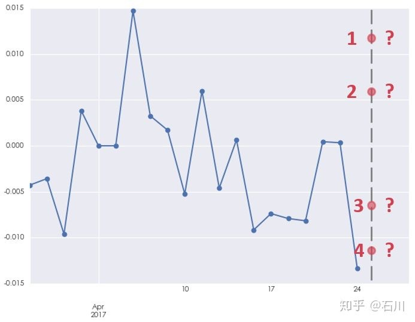
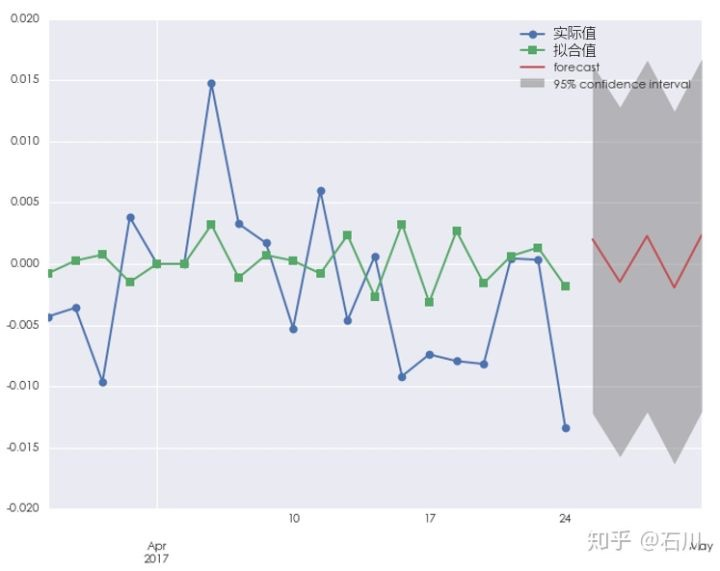
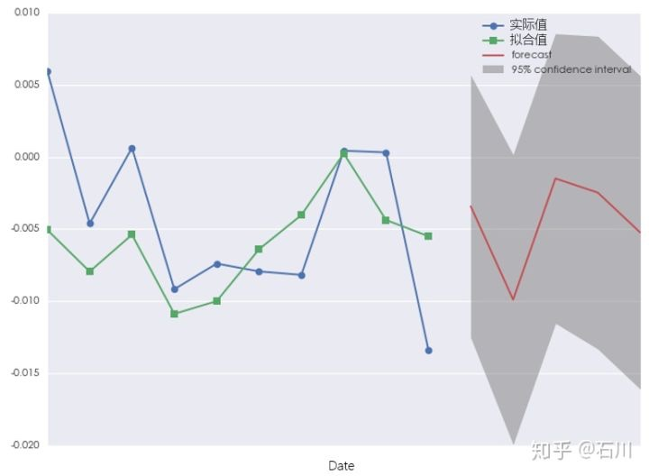
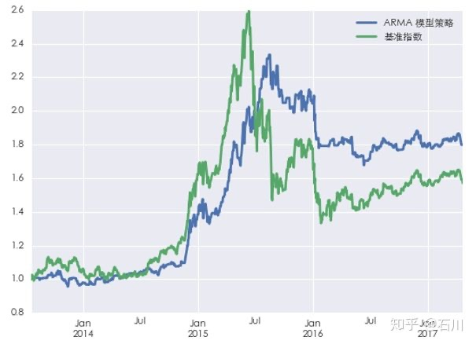
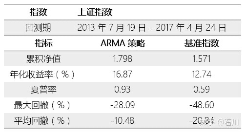
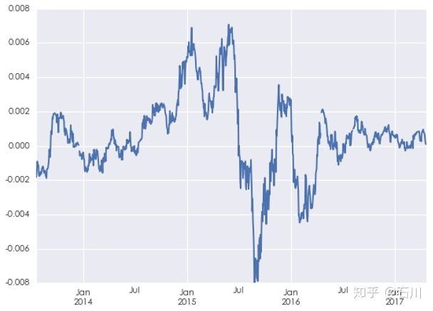
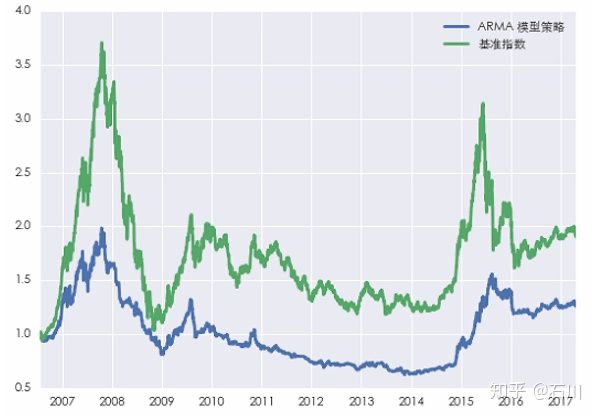

# 应用篇

[Source](https://zhuanlan.zhihu.com/p/38322638 "Permalink to 写给你的金融时间序列分析：应用篇")

## 1 书接前文

《写给你的金融时间序列分析》系列想通过一系列文章使读者**了解金融时间序列的特点、熟悉金融时间序列分析的目的、并使用线性但实用的时间序列分析模型对投资品收益率进行预测并以此制定量化投资策略。**

在本系列之前的三篇文章中，我们以对收益率建模为目标，按部就班的解释了为实现这个目标所需要的每一块“积木”。作为回顾，这三篇文章的结构为：

* **[基础篇](../01-basic/)：**介绍金融时间序列的特性和进行金融时间序列分析的目的；解释时间序列分析中的核心概念：自相关性。
* **[初级篇](../02-primer/)：**说明时间序列建模的过程；介绍时间序列分析中的最基本模型：白噪声和随机游走。
* **[进阶篇](../03-advance/))：**介绍时间序列分析中常用的线性模型：自回归模型、滑动平均模型、以及自回归滑动平均模型。

本文是系列的最后一篇：应用篇。我们将利用 ARMA 对上证指数收益率序列建模，并以此产生交易信号、构建投资策略，以此展示时间序列分析在量化投资领域的应用。

## 2 对时间序列模型预测的正确预期

通过本系列之前的文章的介绍，我们已经知道，时间序列建模的目的是挖掘收益率序列的内在“特性”（自相关性），并在“该特性可以在未来重复”的假设下，对未来的收益率做判断。**如果我们想要根据这个收益率预测来构建交易信号**——比如如果预测的收益率为正则买入；如果预测的收益率为负则空仓（因为不容易做空）——**那么就必须要对时间序列模型的预测效果有正确的认识。**

来看一个例子。下图是上证指数在 2017 年 4 月 24 日（含）之前 20 个交易日的收益率（注：为了建模，我们当然可以也应该使用更长的历史数据；这里为了绘图清晰仅显示 20 个历史交易日的数据）。那么一个时间序列模型对下一个交易日，即 2017 年 4 月 25 日，的收益率预测会是多少呢？该预测值会接近图中的点 1、2、3 或者 4 吗？

也许你已经注意到了，我故意挑选的这 4 个点都满足一个条件，就是她们的绝对值都大于 0.5%（其中 1 和 4 两个点的绝对值都高于 1%）。**±0.5% 或者 ±1% 的日收益率对于上证指数可以算是正常的取值，因此我们是否应该预期时间序列模型的预测值也有类似的量级呢？**

事实上，如果我们用 1 年的历史数据来构建 ARMA 模型，并对 2017 年 4 月 25 日的收益率预测时，得到的预测值和它的 95% 的置信区间如下图所示（下图中，模型同时对 2017 年 4 月 25 日之后的 5 个交易日进行预测）。

可以看到，收益率的预测值实际上非常接近 0%，远没有到达 ±0.5% 或者 ±1% 的量级。且它的 95% 的置信区间非常宽。这样的结果说明：

**当我们用较长的一段历史数据来对时间序列建模时，序列的内在自相关性相对于随机噪声来说非常微弱。模型能够解释的收益率的波动较随机噪声的波动来说微乎其微（上图中绿色的样本内拟合收益率和蓝色的实际收益率之间的残差很大很好的说明了这一点）。这样的结果就是，模型对于收益率的预测的绝对值将会非常接近 0，且该预测值的标准差会很大，造成很宽的置信区间。**

如果用白话来解释上面这一大段话那就是：**如果使用太长的历史数据建模，则序列中表现出来的自相关性非常微弱，时间序列建模“然并卵”。**

既然太长不行，那我们来看看少用点数据建模又如何。假如我们仅仅使用 10 个历史收益率数据建模，则预测结果如下：

这会我们看到，数据少了以后，拟合收益率和实际收益率更加接近；而预测出来的收益率似乎在量级上也更加符合我们 ±0.5% 或者 ±1% 的预期。但是，**对于这种预测结果我们敢相信吗？**

**当我们用很短的一段历史数据来对时间序列建模时，几乎“确定、一定以及肯定”的会发生过拟合。事实上，上面的模型是一个带有常数项的 AR(4) 模型，相当于用 10 个历史数据来确定 5 个模型的参数。过拟合的结果是，模型过分解读了样本内的随机扰动，以至于它对样本外数据的预测准确性会非常差（该模型在样本外有很大的方差）。我们无法肯定该模型捕捉到了多少收益率内在的特征，但可以肯定的是它刻画了样本内的很多无效噪声。**

如果用白话来解释上面这一大段话那就是：**如果使用太短的历史数据建模，则模型会过度关注样本内的随机扰动，因此时间序列建模依然“然并卵”。**

**归根结底，ARMA 模型是一个统计建模的方法。因此和所有统计模型一样，它在预测的时候既有偏差又有方差。此外，收益率序列中含有大量的随机扰动，且频率越高扰动越强**（比如日内高频数据比日数据的噪声更大；日数据比周数据的噪声更大）。这也为预测本身带来了巨大的困难。因此，在使用时有正确的预期就非常重要。

上面的分析说明，由于收益率的特殊性（特别是我们研究的 A 股收益率的特殊性），使用太长或者太短的数据建模都没什么太大的作用。但是，只要预期正确，这些困难仍然不妨碍我们来尝试一下。下面我们就用 ARMA 模型来为上证指数构建一个投资策略。

## 3 基于 ARMA 模型的投资策略

我们的投资标的为上证指数。回测期为 2013 年 7 月 19 日到 2017 年 4 月 24 日。基于时间序列建模的交易策略如下：

**对于每一个交易日，使用之前的 60 个历史日收益率（相当于 3 个月）滚动构建 ARMA 模型，并对该日的收益率预测。在选择模型参数时，ARMA 的阶数 p 和 q 的取值范围均为 1 到 4，并根据 AIC 准则确定最优参数。如果收益率预测为正则在下一个交易日持仓；反之则空仓。不考虑交易成本。**

上述策略在回测期的净值和上证指数自身的净值比较如下图所示：

净值曲线的具体参数如下：

从结果上看，基于 ARMA 建模的策略似乎还不错：它较上证指数本身取得了更高的收益和更低的回撤，因此有更高的夏普率（当然，这部分“得益于”我们没有考虑交易成本）。从净值曲线图上不难发现 ARMA 模型对收益率的预测满足以下几点：

1. 预测较好的捕捉到了 2014 年底到 2015 年中旬的大牛市；
2. 预测一定程度的躲过了 2015 年下半年开始到 2016 年初的几波下跌；
3. 从 2016 年 3 月份开始，ARMA 模型的走势和基准指数接近。

从 ARMA 的参数上不难解释出现上面结果的原因。下图是 ARMA 模型中的常数项随时间的变化。较 AR 或者 MA 部分的贡献，常数项（收益率的漂移率）的量级对收益率的预测贡献更大。显然，ARMA 模型在牛市时有显著为正的常数项，而在熊市的时候有显著为负的常数项。而自 2016 年 3 月开始，常数项接近 0 但是大部分时间仍然为证，这样的结果就是策略在大比例的时间中会持有上证指数，因此策略在这个时期的走势和指数接近。

**股灾 n.0 之后，随着监管的加强，除去随机扰动之后的收益率再难呈现大牛大熊市时的那种大幅波动。具有中国特色的 A 股生生变成了具有美国特色的美股（长期有一个正的小幅漂移率，此外就是随机扰动）。由于监管的变化，我国的股市已经悄然发生了结构性变化（regime change）。如果 A 股以后维持这种走势，那么最好的策略也许就是（量化）选股，即便是没有对冲的纯多头选股也大有可为。**

## 4 充满希望？长回测期内再看 ARMA 模型

上面的结果也许让人感到时间序列分析在量化投资中是充满希望的。但正如本文第二节说明的那样，时间序列分析有其自身存在的问题，且股票的收益率（尤其是高频的收益率）预测这件事本身几乎没有什么规律可循。

如果我们将回测期从过去 4 年拉长到过去 11 年（即考虑过去的两个牛熊周期），结果会怎样的？下图是策略和基准指数的净值曲线。策略可谓令人大跌眼镜。

在回测期内，在尚未考虑交易成本的前提下，策略就远远地跑输了指数。我们当然不能草草的下结论说 ARMA 模型没有用。但是这个结果也清楚的告诉我们，**如果想使用模型对收益率建模，我们必须对投资品和模型本身都非常了解，这样才能将二者较好的结合在一起、使模型尽可能的反应投资品的特点。如果仅仅是胡乱的尝试参数，结果往往是徒劳的。**

## 5 结语

作为系列的最终章，本文介绍了如何应用 ARMA 模型对上证指数收益率进行预测，并以此产生交易信号、构建交易策略。在上一篇最后，我们提出了这样一个问题：

**时间序列分析到底是纸上谈兵还是实战利器？**

也许通过本文中简单的实证我们仍然无法确切的回答这个问题。但是，相信通过今天的文章，你能对时间序列建模的预测效果有一个正确的预期，这对于进一步使用预测结果至关重要。我们看到，在过去 4 年的回测期内，ARMA 模型还是取得了不错的结果。更进一步的，即便时间序列模型的预测的准确性不足以使它被独立的用于产生交易信号，它所传达的信息也能够为我们理解投资品本身提供一些启发。

此外，我们当然可以尝试使用更高级的时间序列分析模型，比如用 ARMA 模型预测收益率并结合 GARCH 模型预测收益率波动率。这会取得比单纯的使用 ARMA 模型更加优异的效果。在海外，有人使用 ARMA + GARCH 模型对标普 500 建模并取得了不错的效果（当然那和美股自身的长期慢牛且在股灾时又可以做空有一定关系）。虽然困难重重，但是新模型的提出为我们对收益率建模提供了更广阔的空间和前所未有的可能。

正如这世上没有完美的模型一样，交易中也没有常胜的策略。我们要做的是找到适合自己投资标的以及符合自己交易风格的策略。努力提升交易水平的过程，也正是我们拓宽知识面、历练心性、提高人生修为的过程。

（全系列完）

**免责声明：** 文章内容不可视为投资意见。市场有风险，入市需谨慎。