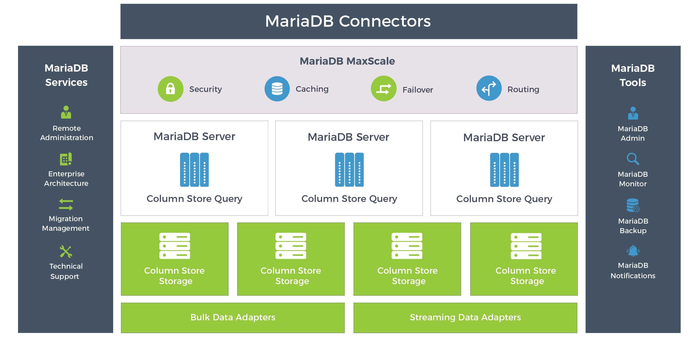
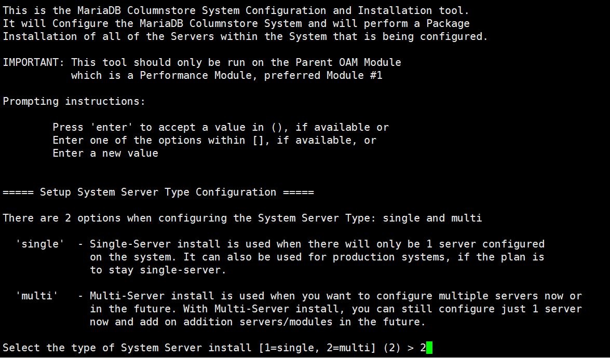
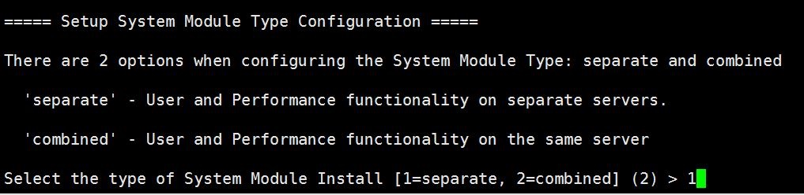
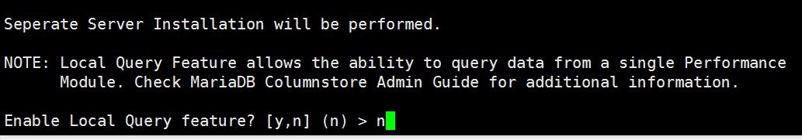
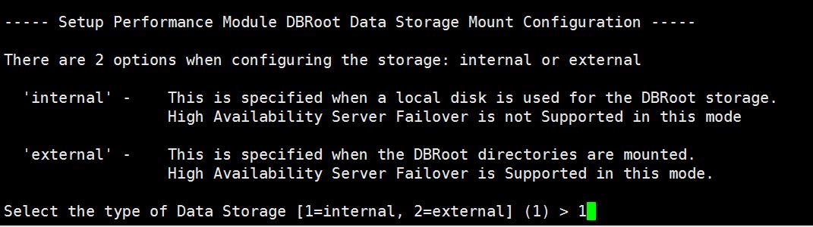
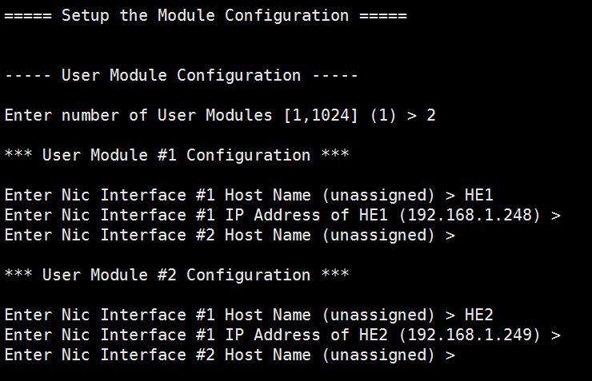
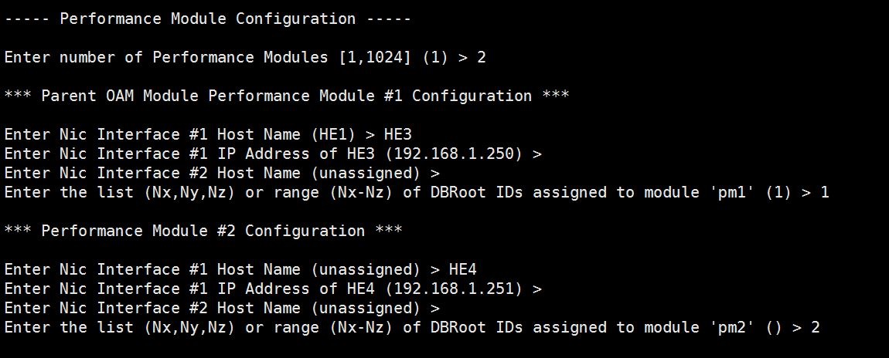
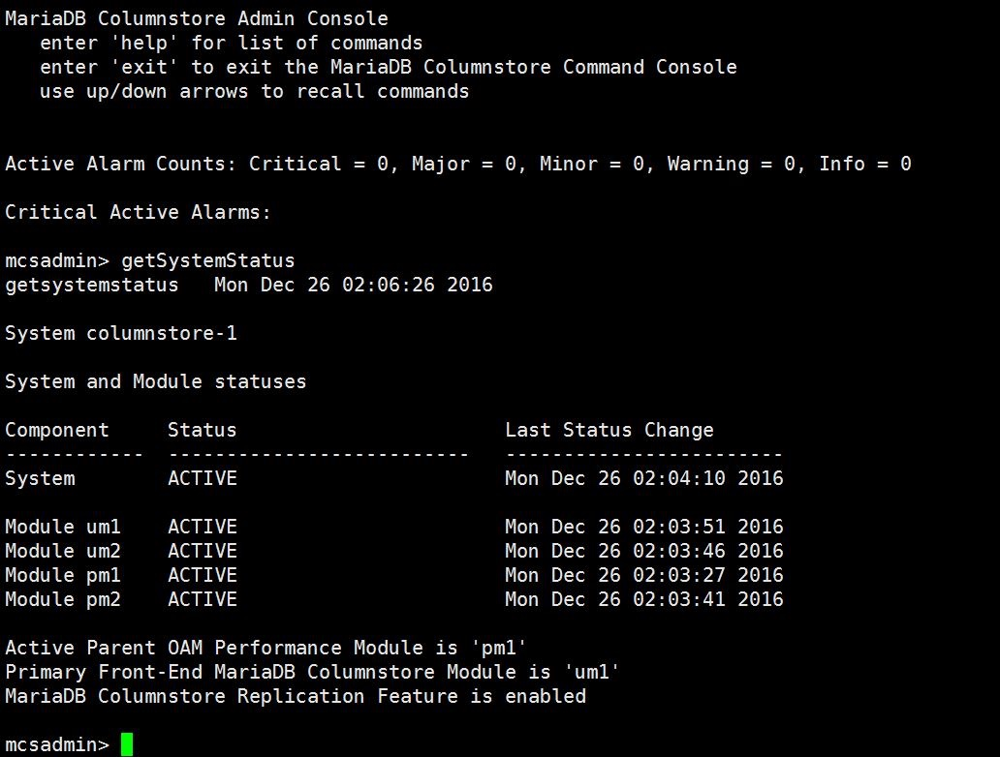
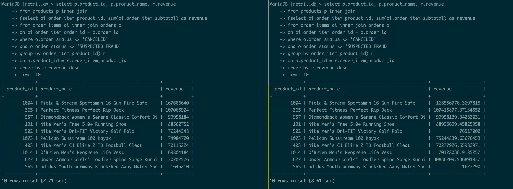
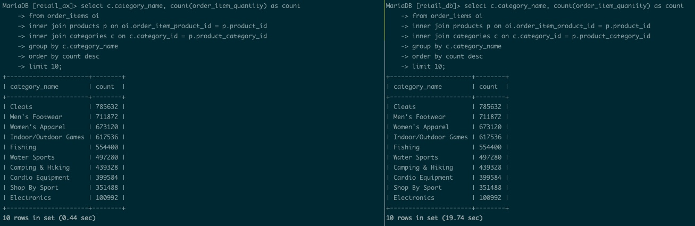

# MariaDB AX 安装测试简记

## MariaDB AX 架构

在官方给出的架构图中，我们可以看到分为三个组件构成：UM、PM、数据存储层。

**用户模块（UM）：**
用户模块管理和控制终端用户查询的操作，它维护每个查询的状态，向一个或多个性能模块发出请求以代为执行SQL查询工作，最后，用户模块汇集来自各个参与的性能模块的所有查询结果，以形成返回给用户的完整的查询结果集。

**性能模块（PM）：**
性能模块负责存储，检索和管理数据，处理对查询操作的块请求，并将其传递回用户模块以完成查询请求。性能模块将获取的数据缓存在其内存中计算。MPP是通过允许用户配置尽可能多的性能模块，以实现更高的处理能力。

**存储：**
MariaDB ColumnStore对于存储系统极为灵活。当在内部运行时，它可以使用本地存储或共享存储（例如SAN）来存储数据。在Amazon EC2环境中，它可以使用临时或弹性块存储（EBS）卷。当无共享部署需要数据冗余时，它被构建为与GlusterFS和Apache Hadoop分布式文件系统（HDFS）集成。

一句话总结：用户模块（UM）将客户端发出的SQL请求进行分配，分配到后端性能模块（PM），PM进行数据查询分析，将处理的结果返回给UM，UM再把PM分析的结果进行聚合，最后返回给客户端最终的查询结果。

## MariaDB 组件架构



其核心是 ColumnStore 这个组件，它就是最早的InfroBright，同时把原来支持HDFS的InfiniBand也移植过来了，因此底层的分布式存储是支持HDFS的（后面继续测试这一点）

# 安装

## 前提条件

1. 规划好哪些节点做UM，哪些节点做PM，存储是用内置的还是外部存储
2. 所有节点之间需要预先做好共享密钥SSH登陆
3. 所有节点必须先安装依赖的包，`yum install -y  expect perl perl-DBI openssl zlib   perl-DBD-MySQL boost`
4. 所有节点必须卸载mariadb相关的包 `yum remove -y mariadb mariadb-server`

## 安装

在一个节点上（一般是PM1）下载AX的压缩包，建议下载RPM的压缩包(`wget https://downloads.mariadb.com/ColumnStore/1.1.6/centos/x86_64/7/mariadb-columnstore-1.1.6-1-centos7.x86_64.rpm.tar.gz`) ，然后解压到`/root`目录下
首先在该节点上把所有的rpm包都安装上，然后执行下面的命令

```
/usr/local/mariadb/columnstore/bin/postConfigure
```

按照提示，并根据自己的规划进行配置（这里暂时借用别的图）















# 测试

这里使用Cloudera Tutorial中的retail_db库来做测试，不过为了使用`ColumnStore`引擎，建表语句需要进行一定的调整，目前该引擎不支持主键，索引等。因此简表语句如下：

```sql
create table products (
    product_id int(11) not null,
    `product_category_id` int(11) ,
    `product_name` varchar(45),
    `product_description` varchar(255) ,
    `product_price` float ,
    `product_image` varchar(255) 
) engine=ColumnStore;


CREATE TABLE `categories` (
  `category_id` int(11) ,
  `category_department_id` int(11) ,
  `category_name` varchar(45) 
)engine=ColumnStore;

CREATE TABLE `customers` (
  `customer_id` int(11) ,
  `customer_fname` varchar(45) ,
  `customer_lname` varchar(45) ,
  `customer_email` varchar(45) ,
  `customer_password` varchar(45) ,
  `customer_street` varchar(255) ,
  `customer_city` varchar(45) ,
  `customer_state` varchar(45) ,
  `customer_zipcode` varchar(45) 
) engine=ColumnStore;


CREATE TABLE `departments` (
`department_id` int(11) ,
`department_name` varchar(45) 
)engine=ColumnStore;


CREATE TABLE `order_items` (
`order_item_id` int(11) ,
`order_item_order_id` int(11) ,
`order_item_product_id` int(11) ,
`order_item_quantity` tinyint(4) ,
`order_item_subtotal` float ,
`order_item_product_price` float 
)engine=ColumnStore;

CREATE TABLE `orders` (
`order_id` int(11) ,
`order_date` datetime ,
`order_customer_id` int(11) ,
`order_status` varchar(45) 
)engine=ColumnStore;
```

其数据利用原始数据然后进行不断`insert into select `方式进行追加。这里我对了一个默认安装的MariaDB以及一个默认配置的MariaDB AX(1 um + 3 pm)，测试语句如下：

```sql
select p.product_id, p.product_name, r.revenue
from products p inner join
(select oi.order_item_product_id, sum(oi.order_item_subtotal) as revenue
from order_items oi inner join orders o
on oi.order_item_order_id = o.order_id
where o.order_status <> 'CANCELED'
and o.order_status <> 'SUSPECTED_FRAUD'
group by order_item_product_id) r
on p.product_id = r.order_item_product_id
order by r.revenue desc
limit 10;
```

测试结果如下：



下面是另外一个测试语句：

```sql
select c.category_name, count(order_item_quantity) as count
from order_items oi
inner join products p on oi.order_item_product_id = p.product_id
inner join categories c on c.category_id = p.product_category_id
group by c.category_name
order by count desc
limit 10;
```

测试结果如下：




左边是AX的查询时间，右边是mariadb的查询时间。

相关的记录条数如下：

```
+-------------+---------+
| table_name  | num     |
+-------------+---------+
| orders      | 2204256 |
| order_items | 5510336 |
| products    |    1345 |
+-------------+---------+
3 rows in set (0.14 sec)
```