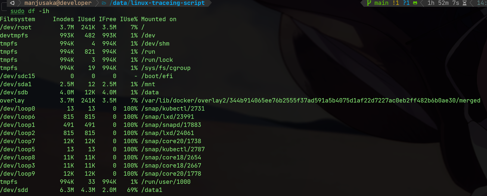

# Docker 运行容器报磁盘空间不足的错误

[Source](https://www.manjusaka.blog/posts/2023/01/07/special-case-no-space-left-on-device/)

## 问题

半夜接到群友求助，说自己的测试环境遇到了点问题，正好我还没睡，那就来看一下

问题的情况很简单，

> 用 `docker run -d --env-file .oss_env --mount type=bind,src=/data1,dst=/cache {image}` 启动了一个容器，然后发现在启动后业务代码报错，抛出 **OSError: [Errno 28] No space left on device** 的异常

这个问题其实很典型，但是最终排查出来的结果确实非典型的。不过排查思路其实应该是很典型的线上问题的一步步分析 root casue 的过程。希望能对看官就帮助

## 排查

首先群友提供了第一个关键信息，空间有余量，但是就 **OSError: [Errno 28] No space left on device** 。那么熟悉 Linux 的同学可能第一步的排查工作就是排查对应的 inode 情况

执行命令

```shell
df -ih
```

[](https://user-images.githubusercontent.com/7054676/211155731-c54b1146-2daa-48b3-8e1e-294040d73201.png)


我们能看到 /data1 实际上的 inode 和整机的 inode 数量都是足够的（备注：这里是我自己在我自己的机器上复现问题的截图，第一步由群友完成，然后给我提供了信息）

那么我们继续排查，我们看到了我们使用了 [mount bind](https://www.manjusaka.blog/posts/2023/01/07/special-case-no-space-left-on-device/#refer-anchor-1) 的方式将宿主机的 /data1 挂载到了容器内部的 /cache 目录下, mount bind 可以用下面一张图来表示和 volume 的区别

[](https://docs.docker.com/storage/images/types-of-mounts-bind.png)

都在不同版本的内核上，mount bind 的行为有一些特殊的情况，所以我们需要确认下 mount bind 的情况是否正确，我们用 [fallocate2](https://www.manjusaka.blog/posts/2023/01/07/special-case-no-space-left-on-device/#refer-anchor-2) 来创建一个 1G 的文件，然后在容器内部查看文件的大小

```shell
fallocate -l 10G /cache/test
```

文件创建没有问题，实际上我们就可以排除掉 mount bind 的缺陷了

接着，群友提供了这个盘是云厂商的云盘（经过扩容），我让群友确认下是具体的 ESSD 还是 NAS 这种走 NFS 挂载的 Block Device（这块也有坑）。确认是标准的 ESSD 后进入下一步（驱动的问题可以先排除）

接着，我们需要考虑 mount –bind 在跨文件系统情况下的问题。虽然前面一步我们成功创建了文件。但是为了保险起见，我们执行 `fdisk -l` 和 `tune2fs -l` 两个命令，来确认分区和文件系统的正确性，确认文件系统的类型都是 ext4，那么没有问题。具体两个命令的使用方式参见 [fdisk3](https://www.manjusaka.blog/posts/2023/01/07/special-case-no-space-left-on-device/#refer-anchor-3) 和 [tune2fs4](https://www.manjusaka.blog/posts/2023/01/07/special-case-no-space-left-on-device/#refer-anchor-4)

然后再回顾我们之前直接在 `/cache` 下创建问题没有问题，那么这个时候我们心里应该大概有底，这个应该不是代码问题，也不是权限问题（这一步我额外排除镜像的构建里没有额外的用户操作），那么我们需要排除一下扩容的问题。我们将 /data1 unmount 之后，重新 mount 后，再执行容器，发现问题依旧存在，那么我们就可以去排除扩容的问题了。

现在一些常见的问题已经基本排除，那么我们来考虑文件系统本身的问题。我登录到机器上，执行了以下两个操作

1. 在出问题的目录 `/cache/xxx/` 下，我用 `fallocate -l` 创建一个报错的文件（长文件名），失败
2. 在出问题的目录 `/cache/xxx/` 下，我用 `fallocate -l` 创建一个短文件名），成功 

OK，我们现在排查路径就往文件系统异常的方向上靠了，执行命令 [dmesg5](https://www.manjusaka.blog/posts/2023/01/07/special-case-no-space-left-on-device/#refer-anchor-5) 查看内核日志，发现了如下错误

```
[13155344.231942] EXT4-fs warning (device sdd): ext4_dx_add_entry:2461: Directory (ino: 3145729) index full, reach max htree level :2
[13155344.231944] EXT4-fs warning (device sdd): ext4_dx_add_entry:2465: Large directory feature is not enabled on this filesystem
```

OK，我们期待的异常信息找到了。原因是，ext4 基于的 BTree 索引，默认情况下只允许树的层高为2，实际上就大概限制了目录下的文件数量大概在 2k-3kw 以内。经过确认，这个问题目录下的确有大量小文件。我们再用 `tune2fs -l` 确认下是否是如我们猜想，得到结果

```
Filesystem revision #:    1 (dynamic)
Filesystem features:      has_journal ext_attr resize_inode dir_index filetype needs_recovery extent 64bit flex_bg sparse_super large_file huge_file dir_nlink extra_isize metadata_csum
Filesystem flags:         signed_directory_hash
```

bingo，的确没有开启 `large_dir` 的选项。那么我们执行 `tune2fs -O large_dir /dev/sdd`开启这个选项，然后再次执行 `tune2fs -l` 确认下，发现已经开启了。然后我们再次执行容器，发现问题已经解决。

## 验证

上面的问题排查看似告一段落。但是实际上并没有闭环。一个问题的闭环有两个特征

1. 定位到具体的异常代码
2. 有最小可复现版本确认我们找到 root cause 是符合预期的。

OK 这个问题就告一段落

## 总结

其实这个问题比较冷门，但是排查方式其实是挺典型的线上问题的排查方法。对于问题，不要预设结果，一步步的根据现象去逼近最终的结论。以及 eBPF 真的好东西，能帮助做很多内核的事。最后我的 Linux 文件系统方面的底子还是太薄弱了，希望后面能重点加强一下

差不多就这样

## Reference

- [1]. https://docs.docker.com/storage/bind-mounts/
- [2]. https://man7.org/linux/man-pages/man2/fallocate.2.html
- [3]. https://man7.org/linux/man-pages/man8/fdisk.8.html
- [4]. https://linux.die.net/man/8/tune2fs
- [5]. https://man7.org/linux/man-pages/man1/dmesg.1.html
- [6]. https://git.kernel.org/pub/scm/linux/kernel/git/tytso/ext4.git/commit/?h=dev&id=88a399955a97fe58ddb2a46ca5d988caedac731b