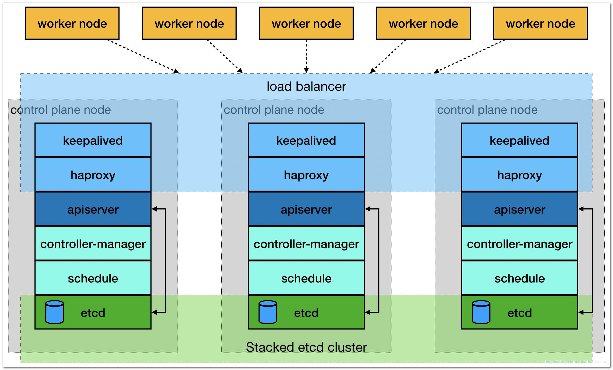

# 使用 kubeadm 安装 kubernetes

这里描述如何使用 kubeadm 工具来安装 kubernetes v1.23, 官方也有[类似文档](https://kubernetes.io/zh/docs/setup/production-environment/tools/kubeadm/create-cluster-kubeadm/) ，但觉得不够详细

## 主机列表

本次安装有如下服务器，信息如下：

| 主机名称            | IP 地址     | 操作系统     |
| ------------------- | ----------- | ---------- | 
| node27.k8s.wgzhao.com | 192.168.23.27 | CentOS 7.9 | 
| node28.k8s.wgzhao.com | 192.168.23.28 | CentOS 7.9 | 
| node29.k8s.wgzhao.com | 192.168.23.29 | CentOS 7.9 | 
| node30.k8s.wgzhao.com | 192.168.23.30 | CentOS 7.9 | 
| node31.k8s.wgzhao.com | 192.168.23.31 | CentOS 7.9 | 


## 操作系统及磁盘说明

1. 系统为最小安装模式进行安装，然后额外必要的软件包
2. 禁用了 `swap`， 这是 docker 要求的
3. 配置好 epel, docker-ce, kubernetes 仓库，这部分可以自行 Google
5. 开启 `node27` 到所有节点（包括自身) 的 ssh 密钥登录，使用root。


## keepalived + haproxy 安装

为了保证核心组件的高可用以及提供负载均衡能力，在`node27` - `node29` 三个节点上部署了 `keepalived` + `haproxy` 作为高可用方案。

其中浮动IP地址(VIP) 为 `192.168.23.32`, 配置说明如下：

### keepalived 

`node27` 节点作为 `keepalived` 的 master，配置文件在 `/etc/keepalived/keepalived.conf` ，内容如下：

```conf
! /etc/keepalived/keepalived.conf
! Configuration File for keepalived
global_defs {
    router_id k8s
}
vrrp_script check_haproxy {
  script "killall -0 haproxy"
  interval 3
  weight -2
  fall 10
  rise 2
}

vrrp_instance VI_1 {
    state MASTER
    interface bond0
    virtual_router_id 51
    priority 250
    authentication {
        auth_type PASS
        auth_pass ZAXRUlay
    }
    virtual_ipaddress {
        192.168.23.32
    }
    track_script {
        check_haproxy
    }
}
```

`node28`, `node29` 两个节点作为 keepalived 的 BACKUP， 其配置文件内如下：

```conf
! /etc/keepalived/keepalived.conf
! Configuration File for keepalived
global_defs {
    router_id k8s
}
vrrp_script check_haproxy {
  script "killall -0 haproxy"
  interval 3
  weight -2
  fall 10
  rise 2
}

vrrp_instance VI_1 {
    state BACKUP
    interface bond0
    virtual_router_id 51
    priority 200
    authentication {
        auth_type PASS
        auth_pass ZAXRUlay
    }
    virtual_ipaddress {
        192.168.23.32
    }
    track_script {
        check_haproxy
    }
}
```

注： 两个节点的配置仅有 `priority 200` 处不同，`node29` 的配置为 `priority 150`.

### haproxy 

`haproxy` 在三个节点上的配置都相同，配置文件位于 `/etc/haproxy/haproxy.cfg` 

```conf
global
  log 127.0.0.1    local2
  chroot /var/lib/haproxy
  pidfile /var/run/haproxy.pid
  maxconn 4000
  user haproxy
  group haproxy
  daemon

defaults
  log global
  mode http
  option dontlognull
  timeout connect 5000ms
  timeout client 600000ms
  timeout server 600000ms

listen stats
    bind :19090
    mode http
    balance
    stats uri /haproxy_stats
    stats auth admin:admin@123!
    stats admin if TRUE

frontend kube-apiserver
   mode tcp
   option tcplog
   bind *:8443
   default_backend kube-apiserver-backend

backend kube-apiserver-backend
    mode tcp
    balance roundrobin
    server node27.k8s.wgzhao.com node27:6443 check
    server node28.k8s.wgzhao.com node28:6443 check
    server node29.k8s.wgzhao.com node29:6443 check
```

## kubernetes 安装

### 部署环境说明

我们使用 `kubeadm` 搭建一个高可用的k8s集群，高可用主要体现在对 `master`节点组件及 `etcd` 存储的高可用，本次部署使用到的服务器 IP 及角色对应如下：

| 主机名称            | IP 地址     | 角色        |
| ------------------- | ----------- | ----------- |
| node.k8s.wgzhao.com   | 192.168.23.32 | VIP         |
| node27.k8s.wgzhao.com | 192.168.23.27 | master/node |
| node28.k8s.wgzhao.com | 192.168.23.28 | master/node |
| node29.k8s.wgzhao.com | 192.168.23.29 | master/node |
| node30.k8s.wgzhao.com | 192.168.23.30 | node        |
| node31.k8s.wgzhao.com | 192.168.23.31 | node        |

### 集群架构及部署准备

搭建三个 master 通过 `keepalived` 提供一个 `vip` 实现高可用，并且添加 `haproxy`来为 `apiserver` 提供反向代理的作用。
这样来自 `haproxy` 的所有请求都将轮询转发到后端的 `master` 节点上。应架构图如下所示：



在安装之前要提前做好以下事情：

1. 修改hosts文件，保证每个节点都能 ping 通设定的主机名
2. 所有主机的时间必须同步，配置并开启 `ntpd` 服务
3. 关闭防火墙
4. 关闭 selinux
5. 禁用 swap，并在 `/etc/fstab` 中注释相应的配置
6. 配置必要的系统参数
   1. 开启路由
        ```shell
        cat /etc/sysctl.d/k8s.conf
        net.ipv4.ip_forward = 1
        net.bridge.bridge-nf-call-ip6tables = 1
        net.bridge.bridge-nf-call-iptables = 1
        net.ipv4.ip_forward = 1
        net.bridge.bridge-nf-call-ip6tables = 1
        net.bridge.bridge-nf-call-iptables = 1
        ```
    2. 配置资源文件
        ```shell
        $ echo "* soft nofile 65536" >> /etc/security/limits.conf
        $ echo "* hard nofile 65536" >> /etc/security/limits.conf
        $ echo "* soft nproc 65536"  >> /etc/security/limits.conf
        $ echo "* hard nproc 65536"  >> /etc/security/limits.conf
        $ echo "* soft  memlock  unlimited"  >> /etc/security/limits.conf
        $ echo "* hard memlock  unlimited"  >> /etc/security/limits.conf
        ```
### 安装和配置 Docker

以下操作在所有节点上执行


```shell
yum install -y docker-ce 

cat -> /etc/docker/daemon.json <<EOF
{
  "exec-opts": ["native.cgroupdriver=systemd"],
  "log-driver": "json-file",
  "log-opts": {
    "max-size": "100m"
  },
  "storage-driver": "overlay2",
  "storage-opts": [
    "overlay2.override_kernel_check=true"
  ]
}
EOF

# systemctl daemon-realod
# systemctl enable --now docker
# systemctl start docker
```

检查 docker 信息

```shell
# docker info

Client:
 Context:    default
 Debug Mode: false
 Plugins:
  app: Docker App (Docker Inc., v0.9.1-beta3)
  buildx: Docker Buildx (Docker Inc., v0.7.1-docker)
  scan: Docker Scan (Docker Inc., v0.12.0)

Server:
 Containers: 14
  Running: 12
  Paused: 0
  Stopped: 2
 Images: 23
 Server Version: 20.10.12
 Storage Driver: overlay2
  Backing Filesystem: xfs
  Supports d_type: true
  Native Overlay Diff: true
  userxattr: false
 Logging Driver: json-file
 Cgroup Driver: systemd
 Cgroup Version: 1
 Plugins:
  Volume: local
  Network: bridge host ipvlan macvlan null overlay
  Log: awslogs fluentd gcplogs gelf journald json-file local logentries splunk syslog
  docker info
Client:
 Context:    default
 Debug Mode: false
 Plugins:
  app: Docker App (Docker Inc., v0.9.1-beta3)
  buildx: Docker Buildx (Docker Inc., v0.7.1-docker)
  scan: Docker Scan (Docker Inc., v0.12.0)
```

### 准备 kubernetes 所需的镜像

因为服务器无法直接联网，这部分需要先自行从网络上下载所需要的镜像，然后打包上传到每台服务器上，并加载镜像，需要的镜像大致如下：

> 上述只有一行话，但应该是整个部署里耗时最长的操作


```shell
# docker images |grep 'k8s.gcr.io'
k8s.gcr.io/kube-apiserver                        v1.23.1    b6d7abedde39   3 weeks ago    135MB
k8s.gcr.io/kube-proxy                            v1.23.1    b46c42588d51   3 weeks ago    112MB
k8s.gcr.io/kube-controller-manager               v1.23.1    f51846a4fd28   3 weeks ago    125MB
k8s.gcr.io/kube-scheduler                        v1.23.1    71d575efe628   3 weeks ago    53.5MB
k8s.gcr.io/controller                            v1.1.0     ae1a7201ec95   7 weeks ago    285MB
k8s.gcr.io/metrics-server                        v0.5.2     f73640fb5061   8 weeks ago    64.3MB
k8s.gcr.io/flannel                               v0.15.1    e6ea68648f0c   2 months ago   69.5MB
k8s.gcr.io/etcd                                  3.5.1-0    25f8c7f3da61   2 months ago   293MB
k8s.gcr.io/kube-webhook-certgen                  v1.1.1     c41e9fcadf5a   3 months ago   47.7MB
k8s.gcr.io/coredns/coredns                       v1.8.6     a4ca41631cc7   3 months ago   46.8MB
k8s.gcr.io/coredns                               v1.8.6     a4ca41631cc7   3 months ago   46.8MB
k8s.gcr.io/pause                                 3.6        6270bb605e12   4 months ago   683kB
k8s.gcr.io/defaultbackend-amd64                  1.5        b5af743e5984   3 years ago    5.13MB
```

### 安装 kubadm, kubelet, kubectl

```shell
# yum install -y kubeadm kubelet kubectl
# echo "source <(kubectl completion bash)" >> ~/.bashrc
```

### 安装 master

在具有 VIP 地址的服务器上进行操作，默认情况下，应该是在 `node27`  节点上

#### 创建kubeadm配置文件

```shell
# mkdir -p /etc/kubernetes/manifests`
```
创建  `/etc/kubernetes/manifests/kubeadm-config.yaml` 配置文件，内容如下：

```yaml
apiServer:
  certSANs:
    - node27.k8s.wgzhao.com
    - node28.k8s.wgzhao.com
    - node29.k8s.wgzhao.com
    - node.k8s.wgzhao.com
    - 192.168.23.27
    - 192.168.23.28
    - 192.168.23.29
    - 192.168.23.32
    - 127.0.0.1
  extraArgs:
    authorization-mode: Node,RBAC
  timeoutForControlPlane: 4m0s
apiVersion: kubeadm.k8s.io/v1beta3
certificatesDir: /etc/kubernetes/pki
clusterName: kubernetes
controlPlaneEndpoint: "node.k8s.wgzhao.com:8443"
controllerManager: {}
dns:
  type: CoreDNS
etcd:
  local:
    dataDir: /var/lib/etcd
kind: ClusterConfiguration
kubernetesVersion: v1.23.1
networking:
  dnsDomain: cluster.local
  podSubnet: 10.244.0.0/16
  serviceSubnet: 10.1.0.0/16
scheduler: {}
```

#### 初始化 master 节点

```shell
# kubeadm init --config /etc/kubernetes/manifests/kubeadm-config.yaml --upload-certs
```

上述操作如果成功的话，则应该看类似下面的输出


```shell
Your Kubernetes control-plane has initialized successfully!

To start using your cluster, you need to run the following as a regular user:

  mkdir -p $HOME/.kube
  sudo cp -i /etc/kubernetes/admin.conf $HOME/.kube/config
  sudo chown $(id -u):$(id -g) $HOME/.kube/config

Alternatively, if you are the root user, you can run:

  export KUBECONFIG=/etc/kubernetes/admin.conf

You should now deploy a pod network to the cluster.
Run "kubectl apply -f [podnetwork].yaml" with one of the options listed at:
  https://kubernetes.io/docs/concepts/cluster-administration/addons/

You can now join any number of the control-plane node running the following command on each as root:

  kubeadm join node.k8s.wgzhao.com:8443 --token ko0dqo.ia527mk472eibub9 \
        --discovery-token-ca-cert-hash sha256:050903b27c13a642064ea6298458be9d203bcf5def4c5d5af55597a506fd4949 \
        --control-plane --certificate-key 34c6b1b15c57c2acff76a99752ba65a11c7cb1593f67fa4f0383b126b5509658

Please note that the certificate-key gives access to cluster sensitive data, keep it secret!
As a safeguard, uploaded-certs will be deleted in two hours; If necessary, you can use
"kubeadm init phase upload-certs --upload-certs" to reload certs afterward.

Then you can join any number of worker nodes by running the following on each as root:

kubeadm join node.k8s.wgzhao.com:8443 --token ko0dqo.ia527mk472eibub9 \
        --discovery-token-ca-cert-hash sha256:050903b27c13a642064ea6298458be9d203bcf5def4c5d5af55597a506fd4949
```

保存上述输出内容到文本文件，后续要用到。

按照上述提示，进行操作

```shell
# mkdir -p $HOME/.kube
# sudo cp -i /etc/kubernetes/admin.conf $HOME/.kube/config
# sudo chown $(id -u):$(id -g) $HOME/.kube/config
```

查看集群状态

```shell
# kubectl get cs
NAME                 STATUS    MESSAGE                         ERROR
scheduler            Healthy   ok
controller-manager   Healthy   ok
etcd-0               Healthy   {"health":"true","reason":""}
```

### 安装集群网络

这里为了简单起见，没有使用 `calico` 网络组件，而是使用了较老的`flannel`网络组件，后续可以转换。

以下操作继续在 master 节点上执行。

####  获取 `flannel` 的配置文件 

```shell
# wget -c -O kube-flannel.yaml https://raw.githubusercontent.com/coreos/flannel/master/Documentation/kube-flannel.yml
```

这里注意节点：

1. 无法访问外网的情况下，先将文件复制到本地，然后粘贴或者上传到服务器
2. 查看该文件中涉及到哪些镜像，如果本地不存在，则需要先下载然后上传到所有服务器
3. 后续操作均需要考虑以上步骤

#### 安装

```shell
# kubectl apply -f kube-flannel.yml 
podsecuritypolicy.policy/psp.flannel.unprivileged created
clusterrole.rbac.authorization.k8s.io/flannel created
clusterrolebinding.rbac.authorization.k8s.io/flannel created
serviceaccount/flannel created
configmap/kube-flannel-cfg created
daemonset.apps/kube-flannel-ds-amd64 created
daemonset.apps/kube-flannel-ds-arm64 created
daemonset.apps/kube-flannel-ds-arm created
daemonset.apps/kube-flannel-ds-ppc64le created
daemonset.apps/kube-flannel-ds-s390x created
```

#### 检测安装是否成功

```shell
# kubectl get pods -n kube-system
NAME                                          READY   STATUS    RESTARTS      AGE
coredns-64897985d-6rnps                       1/1     Running   0             27h
coredns-64897985d-slpf2                       1/1     Running   0             27h
etcd-node27.k8s.wgzhao.com                      1/1     Running   6             29h
etcd-node28.k8s.wgzhao.com                      1/1     Running   0             27h
etcd-node29.k8s.wgzhao.com                      1/1     Running   0             27h
kube-apiserver-node27.k8s.wgzhao.com            1/1     Running   0             29h
kube-apiserver-node28.k8s.wgzhao.com            1/1     Running   0             27h
kube-apiserver-node29.k8s.wgzhao.com            1/1     Running   0             27h
kube-controller-manager-node27.k8s.wgzhao.com   1/1     Running   1 (27h ago)   29h
kube-controller-manager-node28.k8s.wgzhao.com   1/1     Running   0             27h
kube-controller-manager-node29.k8s.wgzhao.com   1/1     Running   0             27h
kube-flannel-ds-49j7s                         1/1     Running   0             27h
kube-flannel-ds-7vzqd                         1/1     Running   0             27h
kube-flannel-ds-bzkhs                         1/1     Running   0             27h
kube-flannel-ds-kc67m                         1/1     Running   0             27h
kube-flannel-ds-qn2v6                         1/1     Running   0             27h
kube-proxy-6whsp                              1/1     Running   0             29h
kube-proxy-cndmh                              1/1     Running   0             27h
kube-proxy-dgv4c                              1/1     Running   0             27h
kube-proxy-h55bd                              1/1     Running   0             27h
kube-proxy-jwc9l                              1/1     Running   0             27h
kube-scheduler-node27.k8s.wgzhao.com            1/1     Running   5 (27h ago)   29h
kube-scheduler-node28.k8s.wgzhao.com            1/1     Running   0             27h
kube-scheduler-node29.k8s.wgzhao.com            1/1     Running   0             27h
```

### 其他节点加入集群

首先将 master 节点上的密钥及相关文件拷贝到 `node28`, `node29` 两个节点上

```shell
[root@node27]# ssh root@node28 mkdir -p /etc/kubernetes/pki/etcd
[root@node27]# ssh root@node29 mkdir -p /etc/kubernetes/pki/etcd
[root@node27]# cd /etc/kubernetes
[root@node27]# scp admin.conf root@node28:/etc/kubernetes/admin.conf     
[root@node27]# scp admin.conf root@node29:/etc/kubernetes/admin.conf     
[root@node27]# scp pki/{ca.*,sa.*,front-proxy-ca.*} root@node28:/etc/kubernetes/pki
[root@node27]# scp pki/{ca.*,sa.*,front-proxy-ca.*} root@node29:/etc/kubernetes/pki
[root@node27]# scp pki/etcd/ca.* root@node28:/etc/kubernetes/pki/etcd
[root@node27]# scp pki/etcd/ca.* root@node29:/etc/kubernetes/pki/etcd
```

分别在 `node28`, `node29` 上执行下面的命令

```shell
[root@node28]# kubeadm join node.k8s.wgzhao.com:8443 --token ko0dqo.ia527mk472eibub9 \
        --discovery-token-ca-cert-hash sha256:050903b27c13a642064ea6298458be9d203bcf5def4c5d5af55597a506fd4949 \
        --control-plane --certificate-key 34c6b1b15c57c2acff76a99752ba65a11c7cb1593f67fa4f0383b126b5509658
```

```shell
[root@node29]# kubeadm join node.k8s.wgzhao.com:8443 --token ko0dqo.ia527mk472eibub9 \
        --discovery-token-ca-cert-hash sha256:050903b27c13a642064ea6298458be9d203bcf5def4c5d5af55597a506fd4949 \
        --control-plane --certificate-key 34c6b1b15c57c2acff76a99752ba65a11c7cb1593f67fa4f0383b126b5509658
```

同样根据命令的输出提示进行后续操作，主要是下面的操作


```shell
[root@node28]# mkdir -p $HOME/.kube
[root@node28]# cp -i /etc/kubernetes/admin.conf $HOME/.kube/config
[root@node28]# chown $(id -u):$(id -g) $HOME/.kube/config
```

#### 检查结果

```shell
[root@node27]# kubectl get node
NAME                  STATUS   ROLES                  AGE   VERSION
node27.k8s.wgzhao.com   Ready    control-plane,master   29h   v1.23.1
node28.k8s.wgzhao.com   Ready    control-plane,master   27h   v1.23.1
node29.k8s.wgzhao.com   Ready    control-plane,master   27h   v1.23.1
```

### node 加入集群

在剩下的 `node30`, `node31` 节点上执行下面的命令：


```shell
[root@node30]# kubeadm join node.k8s.wgzhao.com:8443 --token ko0dqo.ia527mk472eibub9 \
        --discovery-token-ca-cert-hash sha256:050903b27c13a642064ea6298458be9d203bcf5def4c5d5af55597a506fd4949
```

#### 检查结果

```shell
[root@node27]# kubectl get node
NAME                  STATUS   ROLES                  AGE   VERSION
node27.k8s.wgzhao.com   Ready    control-plane,master   29h   v1.23.1
node28.k8s.wgzhao.com   Ready    control-plane,master   27h   v1.23.1
node29.k8s.wgzhao.com   Ready    control-plane,master   27h   v1.23.1
node30.k8s.wgzhao.com   Ready    <none>                 27h   v1.23.1
node31.k8s.wgzhao.com   Ready    <none>                 27h   v1.23.1
```

###  master 节点也做为node 节点加入

默认情况下，master节点将来并不会分配 pod，这里我们希望所有的 master 也同时充当 node 角色。需要在任意 master 节点上执行下面的命令：

```shell
[root@node27]# kubectl taint nodes --all node-role.kubernetes.io/master-
node "node27" untainted
node "node28" untainted
node "node29" untainted
taint "node-role.kubernetes.io/master:" not found
taint "node-role.kubernetes.io/master:" not found
```

### 后续扩容

默认情况下，上述命令输出的 `token` 有效期是 24 小时，如果之后要加入集群，需要重新生成 token，命令如下：

```shell
# 显示获取token列表
$ kubeadm token list
# 生成新的token
$ kubeadm token create
```

除`token`外，`join`命令还需要一个`sha256`的值，通过以下方法计算

```shell
openssl x509 -pubkey -in /etc/kubernetes/pki/ca.crt | openssl rsa -pubin -outform der 2>/dev/null | openssl dgst -sha256 -hex | sed 's/^.* //'
```

用上面输出的`token`和`sha256`的值或者是利用`kubeadm token create --print-join-command`拼接`join`命令即可