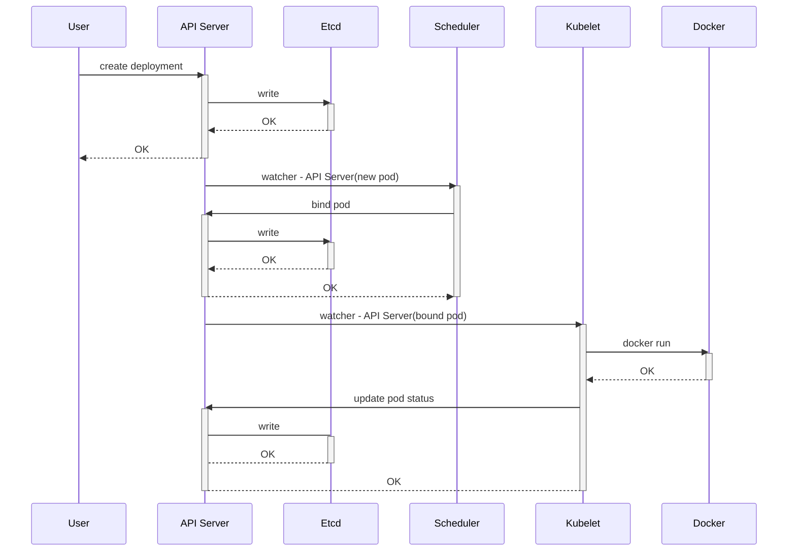

# 用奇怪的方式构建简单 k8s 集群

## 前言

这个帖子的创建来源于 youtube 的一个[视频](https://youtu.be/3KtEAa7_duA) ，这个视频介绍如何快速部署一个k8s集群很有新意，他没有使用常见的minkube或者kubeadm这种方式来创建完整的集群，也不是从源代码开始从头撸起，同时也没有说要先搭建一个完整的集群，然后演示基本操作。
他先套路式的用19张图说了创建一个deployment 时k8s集群的内部机制，一般到这里已经很清楚了解内部组件的互操作过程了。然后作者现场登录一台服务器，开始任意的从一个服务运行开始，比如他先运行 kube-apiserver，那肯定会报错，于是根据报错来解决问题，每启动一个服务，他就尝试创建 deployment ，然后继续根据报错来解决问题。直到最后搭建一个简单的单节点集群，这个演示工程让你对k8s 个组件节点的关系，有了更深刻的理解。

因为他是现场很快演示，于是我打算这复刻这个过程。作者用 19 张幻灯片演示了一个 deployment 的创建过程，我把这个演示过程整理成了一个时序图。



作者在构建该集群的目标是创建一个最小化的k8s的集群，这个集群可以实现：

- 创建 Deployment （`kubectl run`，`kubectl create deployment`)
- 用 Service 方式暴露出去
- 可以连接这个服务

这里的 “最小化” 意味着：

- 最少的组件
- 最少的命令行参数
- 最少的配置文件

同时，这个最小化集群不考虑以下因素：

- 集群安全性
- 集群可扩展性
- 集群高可用性

总而言之，就是要最简化


然后实际上并不是这样，因为新的版本已经直接废弃了非 TLS 通信模式，这就使得作者在演讲中提到的不考虑安全通信没法通过了，这部分是集群搭建中最为复杂的一部分，有了这部分的配置后，其实整个部署的具体操作就和作者演示的有相当大的不同了。

## 环境准备

作者在演示的过程中准备了两台普通配置的虚拟机，我这里找了两台限制的机器，配置如下：

- 机器型号： Dell R640
- CPU: Intel(R) Xeon(R) Silver 4216 CPU @ 2.10GHz
- 内存：64G
- OS: CentOS 7.6
- kernel: 5.19.11

两台机器的 IP 地址分别为 `10.90.23.41`,`10.90.23.42`

然后准备需要的软件，全部放在 `/opt/k8s` 目录下，主要包括：

- [docker ce 20.10.14](https://www.docker.com)
- [etcd 3.5.7](https://storage.googleapis.com/etcd/v3.5.7/etcd-v3.5.7-linux-amd64.tar.gz)
- [kubectl v1.23.17](https://dl.k8s.io/v1.23.17/bin/linux/amd64/kubectl)
- [kubelet v1.23.17](https://dl.k8s.io/v1.23.17/bin/linux/amd64/kubelet)
- [kube-controller-manager v1.23.17](https://dl.k8s.io/v1.23.17/bin/linux/amd64/kube-controller-manager)
- [kube-proxy v1.23.17](https://dl.k8s.io/v1.23.17/bin/linux/amd64/kube-proxy)
- [kube-apiserver v1.23.17](https://dl.k8s.io/v1.23.17/bin/linux/amd64/kube-apiserver)
- [kube-scheduler v1.23.17](https://dl.k8s.io/v1.23.17/bin/linux/amd64/kube-scheduler)
- [cfssl v1.6.3](https://github.com/cloudflare/cfssl/releases/download/v1.6.3/cfssl_1.6.3_linux_amd64)
- [cfssljson v1.6.3](https://github.com/cloudflare/cfssl/releases/download/v1.6.3/cfssljson_1.6.3_linux_amd64)

其中 `docker-ce` 是通过 yum 仓库安装的，其他是从给出的连接下载的。

```shell
# export ver="v1.23.17"
# for i in kubectl kubelet kube-proxy kube-apiserver kube-scheduler 
> do
> wget https://dl.k8s.io/${ver}/bin/linux/amd64/${i}
> done
# wget -O- https://storage.googleapis.com/etcd/v3.5.7/etcd-v3.5.7-linux-amd64.tar.gz |tar -xz
# chmod +x kube* etcd*
# tree /opt/k8s/
/opt/k8s/
├── etcd
├── etcdctl
├── etcdutl
├── kube-apiserver
├── kubectl
├── kubelet
├── kube-proxy
└── kube-scheduler

0 directories, 5 files
```

## 创建证书

从 `1.21` 开始，kubernetes 已经禁用了`insecure-port` 参数，因此集群必须使用 TLS 证书来进行通讯，因此必须先创建各组件需要的证书，为了简化创建过程，我们使用 cloudflare 提供的 cfssl 工具来创建。

#### 创建 CA 证书

```shell
mkdir -p pki/{admin,api,ca,clients,controller,front-proxy,proxy,scheduler,service-account,users}

export TLS_C="CN"
export TLS_L="TOWN"
export TLS_OU="localhost"
export TLS_ST="CITY"

cat > pki/ca/ca-config.json <<EOF
{
  "signing": {
    "default": {
      "expiry": "8760h"
    },
    "profiles": {
      "kubernetes": {
        "usages": ["signing", "key encipherment", "server auth", "client auth"],
        "expiry": "8760h"
      }
    }
  }
}
EOF

cat > pki/ca/ca-csr.json <<EOF
{
  "CN": "Kubernetes",
  "key": {
    "algo": "rsa",
    "size": 2048
  },
  "names": [
    {
      "C": "${TLS_C}",
      "L": "${TLS_L}",
      "O": "Kubernetes",
      "OU": "${TLS_OU}",
      "ST": "${TLS_ST}"
    }
  ]
}
EOF

cfssl gencert -initca pki/ca/ca-csr.json | cfssljson -bare pki/ca/ca
```


#### 创建 TLS 证书

##### 创建管理员配置文件和证书

```shell
cat > pki/admin/admin-csr.json <<EOF
{
  "CN": "admin",
  "key": {
    "algo": "rsa",
    "size": 2048
  },
  "names": [
    {
      "C": "${TLS_C}",
      "L": "${TLS_L}",
      "O": "system:masters",
      "OU": "${TLS_OU}",
      "ST": "${TLS_ST}"
    }
  ]
}
EOF
cfssl gencert \
  -ca=pki/ca/ca.pem \
  -ca-key=pki/ca/ca-key.pem \
  -config=pki/ca/ca-config.json \
  -profile=kubernetes \
  pki/admin/admin-csr.json | cfssljson -bare pki/admin/admin
```

##### 创建 节点证书

```shell
cat > pki/clients/node41-csr.json <<EOF
{
  "CN": "system:node:node41",
  "key": {
    "algo": "rsa",
    "size": 2048
  },
  "names": [
    {
      "C": "${TLS_C}",
      "L": "${TLS_L}",
      "O": "system:nodes",
      "OU": "${TLS_OU}",
      "ST": "${TLS_ST}"
    }
  ]
}
EOF
INTERNAL_IP=$(ip addr show bond0 | grep -Po 'inet \K[\d.]+')
cfssl gencert \
  -ca=pki/ca/ca.pem \
  -ca-key=pki/ca/ca-key.pem \
  -config=pki/ca/ca-config.json \
  -hostname=node41,${INTERNAL_IP} \
  -profile=kubernetes \
  pki/clients/node41-csr.json | cfssljson -bare pki/clients/node41

```

##### 床架 kube-controller-manager 组件证书

```shell
cat > pki/controller/kube-controller-manager-csr.json <<EOF
{
  "CN": "system:kube-controller-manager",
  "key": {
    "algo": "rsa",
    "size": 2048
  },
  "names": [
    {
      "C": "${TLS_C}",
      "L": "${TLS_L}",
      "O": "system:kube-controller-manager",
      "OU": "${TLS_OU}",
      "ST": "${TLS_ST}"
    }
  ]
}
EOF
cfssl gencert \
  -ca=pki/ca/ca.pem \
  -ca-key=pki/ca/ca-key.pem \
  -config=pki/ca/ca-config.json \
  -profile=kubernetes \
  pki/controller/kube-controller-manager-csr.json | cfssljson -bare pki/controller/kube-controller-manager
```

##### 创建 kube-proxy 证书

```shell
cat > pki/proxy/kube-proxy-csr.json <<EOF
{
  "CN": "system:kube-proxy",
  "key": {
    "algo": "rsa",
    "size": 2048
  },
  "names": [
    {
      "C": "${TLS_C}",
      "L": "${TLS_L}",
      "O": "system:node-proxier",
      "OU": "${TLS_OU}",
      "ST": "${TLS_ST}"
    }
  ]
}
EOF
cfssl gencert \
  -ca=pki/ca/ca.pem \
  -ca-key=pki/ca/ca-key.pem \
  -config=pki/ca/ca-config.json \
  -profile=kubernetes \
  pki/proxy/kube-proxy-csr.json | cfssljson -bare pki/proxy/kube-proxy
```

##### 创建 kube-scheduler 证书

```shell
cat > pki/scheduler/kube-scheduler-csr.json <<EOF
{
  "CN": "system:kube-scheduler",
  "key": {
    "algo": "rsa",
    "size": 2048
  },
  "names": [
    {
      "C": "${TLS_C}",
      "L": "${TLS_L}",
      "O": "system:kube-scheduler",
      "OU": "${TLS_OU}",
      "ST": "${TLS_ST}"
    }
  ]
}
EOF
cfssl gencert \
  -ca=pki/ca/ca.pem \
  -ca-key=pki/ca/ca-key.pem \
  -config=pki/ca/ca-config.json \
  -profile=kubernetes \
  pki/scheduler/kube-scheduler-csr.json | cfssljson -bare pki/scheduler/kube-scheduler
```

##### 创建 front-proxy 证书

```shell
cat > pki/front-proxy/front-proxy-csr.json <<EOF
{
  "CN": "front-proxy",
  "key": {
    "algo": "rsa",
    "size": 2048
  },
  "names": [
    {
      "C": "${TLS_C}",
      "L": "${TLS_L}",
      "O": "front-proxy",
      "OU": "${TLS_OU}",
      "ST": "${TLS_ST}"
    }
  ]
}
EOF
cfssl gencert \
  -ca=pki/ca/ca.pem \
  -ca-key=pki/ca/ca-key.pem \
  -config=pki/ca/ca-config.json \
  -profile=kubernetes \
  pki/front-proxy/front-proxy-csr.json | cfssljson -bare pki/front-proxy/front-proxy
```

##### 创建 kube-apiserver 证书

```shell
cat > pki/api/kubernetes-csr.json <<EOF
{
  "CN": "kubernetes",
  "key": {
    "algo": "rsa",
    "size": 2048
  },
  "names": [
    {
      "C": "${TLS_C}",
      "L": "${TLS_L}",
      "O": "Kubernetes",
      "OU": "${TLS_OU}",
      "ST": "${TLS_ST}"
    }
  ]
}
EOF
cfssl gencert \
  -ca=pki/ca/ca.pem \
  -ca-key=pki/ca/ca-key.pem \
  -config=pki/ca/ca-config.json \
  -hostname=10.90.23.41,10.90.23.42,127.0.0.1,kubernetes.default \
  -profile=kubernetes \
  pki/api/kubernetes-csr.json | cfssljson -bare pki/api/kubernetes
```

##### 创建 service-account 证书

```shell
cat > pki/service-account/service-account-csr.json <<EOF
{
  "CN": "service-accounts",
  "key": {
    "algo": "rsa",
    "size": 2048
  },
  "names": [
    {
      "C": "${TLS_C}",
      "L": "${TLS_L}",
      "O": "Kubernetes",
      "OU": "${TLS_OU}",
      "ST": "${TLS_ST}"
    }
  ]
}
EOF
cfssl gencert \
  -ca=pki/ca/ca.pem \
  -ca-key=pki/ca/ca-key.pem \
  -config=pki/ca/ca-config.json \
  -profile=kubernetes \
  pki/service-account/service-account-csr.json | cfssljson -bare pki/service-account/service-account
```


最后创建的的所有证书如下：

```shell
# tree /opt/k8s/pki
/opt/k8s/pki
├── admin
│   ├── admin.csr
│   ├── admin-csr.json
│   ├── admin-key.pem
│   └── admin.pem
├── api
│   ├── kubernetes.csr
│   ├── kubernetes-csr.json
│   ├── kubernetes-key.pem
│   └── kubernetes.pem
├── ca
│   ├── ca-config.json
│   ├── ca.csr
│   ├── ca-csr.json
│   ├── ca-key.pem
│   └── ca.pem
├── clients
│   ├── node41.csr
│   ├── node41-csr.json
│   ├── node41-key.pem
│   └── node41.pem
├── controller
│   ├── kube-controller-manager.csr
│   ├── kube-controller-manager-csr.json
│   ├── kube-controller-manager-key.pem
│   └── kube-controller-manager.pem
├── front-proxy
│   ├── front-proxy.csr
│   ├── front-proxy-csr.json
│   ├── front-proxy-key.pem
│   └── front-proxy.pem
├── proxy
│   ├── kube-proxy.csr
│   ├── kube-proxy-csr.json
│   ├── kube-proxy-key.pem
│   └── kube-proxy.pem
├── scheduler
│   ├── kube-scheduler.csr
│   ├── kube-scheduler-csr.json
│   ├── kube-scheduler-key.pem
│   └── kube-scheduler.pem
├── service-account
│   ├── service-account.csr
│   ├── service-account-csr.json
│   ├── service-account-key.pem
│   └── service-account.pem
└── users
```


## 开始搭建

部署的思路是这样的：

1. 尝试启动 `API Server`
2. 尝试创建 Deployment
3. 看是否报错
4. 如果有报错，尝试修复，跳到步骤 2， 直到创建成功

### 启动 kube-apiserver

```bash
# ./kube-apiserver
W0320 20:30:47.651537    3927 services.go:37] No CIDR for service cluster IPs specified. Default value which was 10.0.0.0/24 is deprecated and will be removed in future releases. Please specify it using --service-cluster-ip-range on kube-apiserver.
I0320 20:30:48.018907    3927 serving.go:342] Generated self-signed cert (/var/run/kubernetes/apiserver.crt, /var/run/kubernetes/apiserver.key)
I0320 20:30:48.018924    3927 server.go:555] external host was not specified, using 10.90.23.41
W0320 20:30:48.018931    3927 authentication.go:520] AnonymousAuth is not allowed with the AlwaysAllow authorizer. Resetting AnonymousAuth to false. You should use a different authorizer
E0320 20:30:48.019080    3927 run.go:74] "command failed" err="[--etcd-servers must be specified, service-account-issuer is a required flag, --service-account-signing-key-file and --service-account-issuer are required flags]"
```

报错了，看最行的报错信息，`--etcd-servers must be specified`，那就要先启动 `etcd`了

### 启动 etcd

```bash
# ./etcd
{"level":"info","ts":"2023-03-20T21:38:43.155+0800","caller":"etcdmain/etcd.go:73","msg":"Running: ","args":["./etcd"]}
...
{"level":"info","ts":"2023-03-20T21:38:43.960+0800","caller":"embed/serve.go:146","msg":"serving client traffic insecurely; this is strongly discouraged!","address":"127.0.0.1:2379"}
```

看来是成功了，注意最后一行的输出，我们知道 etcd 的地址为 `127.0.0.1:2379`

### 再次启动 API Server

```bash
# ./kube-apiserver --etcd-servers http://127.0.0.1:2379
W0320 21:42:49.655612    9431 services.go:37] No CIDR for service cluster IPs specified. Default value which was 10.0.0.0/24 is deprecated and will be removed in future releases. Please specify it using --service-cluster-ip-range on kube-apiserver.
I0320 21:42:49.655666    9431 server.go:555] external host was not specified, using 10.90.23.41
W0320 21:42:49.655676    9431 authentication.go:520] AnonymousAuth is not allowed with the AlwaysAllow authorizer. Resetting AnonymousAuth to false. You should use a different authorizer
E0320 21:42:49.655860    9431 run.go:74] "command failed" err="[service-account-issuer is a required flag, --service-account-signing-key-file and --service-account-issuer are required flags]"
```

看来新版本新增了必须的参数 ，按照最后一行的错误，我们要解决 `--service-account-signing-key-file`, `--service-account-issuer` 两个参数问题

同时我们启用 `AnonymousAuth` (`--anonymous-auth`)

#### 继续启动

```bash
# ./kube-apiserver --etcd-servers http://127.0.0.1:2379 \
  --authorization-mode=Node,RBAC \
  --anonymous-auth=false \
  --service-account-issuer=api \
  --client-ca-file=/opt/k8s/pki/ca/ca.pem \
  --service-account-key-file=/opt/k8s/pki/service-account/service-account.pem \
  --service-account-signing-key-file=/opt/k8s/pki/service-account/service-account-key.pem \
  --tls-cert-file=/opt/k8s/pki/api/kubernetes.pem \
  --tls-private-key-file=/opt/k8s/pki/api/kubernetes-key.pem \
  --v=2

W0320 22:38:19.001075   13586 services.go:37] No CIDR for service cluster IPs specified. Default value which was 10.0.0.0/24 is deprecated and will be removed in future releases. Please specify it using --service-cluster-ip-range on kube-apiserver.
I0320 22:38:19.001131   13586 server.go:555] external host was not specified, using 10.90.23.41
I0320 22:38:19.001706   13586 server.go:163] Version: v1.26.3
...
I0320 22:38:20.759381   13586 secure_serving.go:210] Serving securely on [::]:6443
I0320 22:38:21.491867   13586 controller.go:132] OpenAPI AggregationController: action for item k8s_internal_local_delegation_chain_0000000000: Nothing (removed from the queue).
I0320 22:38:21.763534   13586 storage_scheduling.go:111] all system priority classes are created successfully or already exist.
```

目前来看，启动成功，要注意，这里我们使用了 TLS，所以端口不是默认 `8080`，而是变成了 `6443`

因为启用了 TLS，所以还得创建可以可用的帐号

#### 创建帐号

```bash
$ mkdir /opt/k8s/client
$ openssl genrsa -out client-key.pem 4096
$ openssl req -new -x509 -days 365 -key client-key.pem -sha256 -batch -out client.pem
```


### 和 API Server 交互

首先配置需要必要的环境

```bash
kubectl config set-cluster localhost \
  --certificate-authority=pki/ca/ca.pem \
  --server=https://127.0.0.1:6443 

kubectl config set-credentials admin \
  --client-certificate=pki/admin/admin.pem \
  --client-key=pki/admin/admin-key.pem 


kubectl config set-context default \
  --cluster=localhost \
  --user=admin 

kubectl config use-context default
```

然后我们尝试执行一些最常用的命令 

```bash
# kubectl get nodes
No resources found
# kubectl get services
NAME         TYPE        CLUSTER-IP   EXTERNAL-IP   PORT(S)   AGE
kubernetes   ClusterIP   10.0.0.1     <none>        443/TCP   38m
```

从输出来看，我们还没有节点，但 `services` 资源到是创建了一个

## 创建 Deployment

我们尝试创建 Deployment

```bash
# kubectl create deployment web --image=nginx
deployment.apps/web created

# kubectl get all
NAME                 TYPE        CLUSTER-IP   EXTERNAL-IP   PORT(S)   AGE
service/kubernetes   ClusterIP   10.0.0.1     <none>        443/TCP   43m

NAME                  READY   UP-TO-DATE   AVAILABLE   AGE
deployment.apps/web   0/1     0            0           27s
```

从输出来看，目前还没有成功，这是因为目前集群还没有 `ReplicaSet` 服务，因为不会创建 Pod

所以，接下来，我们需要运行 controller manager

## 运行 controller manager

```bash
# ./kube-controller-manager
I0321 13:35:56.653517   17112 serving.go:348] Generated self-signed cert in-memory
W0321 13:35:56.653551   17112 client_config.go:617] Neither --kubeconfig nor --master was specified.  Using the inClusterConfig.  This might not work.
W0321 13:35:56.653557   17112 client_config.go:622] error creating inClusterConfig, falling back to default config: unable to load in-cluster configuration, KUBERNETES_SERVICE_HOST and KUBERNETES_SERVICE_PORT must be defined
invalid configuration: no configuration has been provided, try setting KUBERNETES_MASTER environment variable
```

根据报错信息，我们增加相应的参数，这里需要提供 `--kubeconfig`配置文件或者 `--master` 服务

```bash
mkdir configs
{
  kubectl config set-cluster localhost \
    --certificate-authority=/opt/k8s/pki/ca/ca.pem \
    --server=https://127.0.0.1:6443 \
    --kubeconfig=configs/kube-controller-manager.kubeconfig

  kubectl config set-credentials system:kube-controller-manager \
    --client-certificate=/opt/k8s/pki/controller/kube-controller-manager.pem \
    --client-key=/opt/k8s/pki/controller/kube-controller-manager-key.pem \
    --kubeconfig=configs/kube-controller-manager.kubeconfig

  kubectl config set-context default \
    --cluster=localhost \
    --user=system:kube-controller-manager \
    --kubeconfig=configs/kube-controller-manager.kubeconfig

  kubectl config use-context default --kubeconfig=configs/kube-controller-manager.kubeconfig
}
```

经过2个小时的调试以及疯狂寻找各类资源后，得到如下的参数

```bash
# ./kube-controller-manager \
  --master https://127.0.0.1:6443 \
  --root-ca-file=/opt/k8s/pki/ca/ca.pem \
  --client-ca-file=/opt/k8s/pki/ca/ca.pem \
  --cluster-name=localhost \
  --requestheader-client-ca-file=/opt/k8s/pki/front-proxy/front-proxy.pem \
  --cluster-signing-cert-file=/opt/k8s/pki/ca/ca.pem \
  --cluster-signing-key-file=/opt/k8s/pki/ca/ca-key.pem  \
  --service-account-private-key-file=/opt/k8s/pki/service-account/service-account-key.pem \
  --use-service-account-credentials=true  \
  --authentication-kubeconfig=/opt/k8s/configs/kube-controller-manager.kubeconfig \
  --authorization-kubeconfig=/opt/k8s/configs/kube-controller-manager.kubeconfig \
  --kubeconfig=/opt/k8s/configs/kube-controller-manager.kubeconfig \
  --v=2
```

我们继续观察 `Deployment` 部署得如何了

```bash
# kubectl get all
NAME                       READY   STATUS    RESTARTS   AGE
pod/web-76b56fd968-9hvvj   0/1     Pending   0          64s

NAME                 TYPE        CLUSTER-IP   EXTERNAL-IP   PORT(S)   AGE
service/kubernetes   ClusterIP   10.0.0.1     <none>        443/TCP   94m

NAME                  READY   UP-TO-DATE   AVAILABLE   AGE
deployment.apps/web   0/1     1            0           51m

NAME                             DESIRED   CURRENT   READY   AGE
replicaset.apps/web-76b56fd968   1         1         0       65s
```

可以看到，ReplicaSet 资源有了，但是 Pod 还是没有运行，但处于 `Pending` 状态。

这是因为我们没有还没有 work node，下面的命令也表明了这一点

```bash
# kubectl get nodes
No resources found
```

所以接下来，我们需要启动容器引擎(Dockerd) 以及 kubelet

## 启动容器引擎

我们这里继续使用 Docker 作为运行时容器

```bash
# systemctl start docker
```

## 启动 kubelet

注意，如果 `kubelet` 运行不带参数，他也可以正常运行，但他不会加入到现有的集群中，因此我们需要指定参数，同时理上前面步骤创建的 `$HOME/.kube/config` 文件

```bash
./kubelet --kubeconfig ~/.kube/config

I0321 15:20:10.623951   26194 server.go:446] "Kubelet version" kubeletVersion="v1.23.17"
I0321 15:20:10.626190   26194 container_manager_linux.go:975] "CPUAccounting not enabled for process" pid=26194
I0321 15:20:10.626211   26194 container_manager_linux.go:978] "MemoryAccounting not enabled for process" pid=26194
I0321 15:20:10.684392   26194 server.go:693] "--cgroups-per-qos enabled, but --cgroup-root was not specified.  defaulting to /"
E0321 15:20:10.684528   26194 server.go:302] "Failed to run kubelet" err="failed to run Kubelet: running with swap on is not supported, please disable swap! or set --fail-swap-on flag to false. /proc/swaps contained: [Filename\t\t\t\tType\t\tSize\t\tUsed\t\tPriority /dev/sda4                               partition\t32769020\t0\t\t-2]"
```

`kubelet` 检测到系统启用了 `swap` ，得先要禁用

```bash
swapoff -a
```

然后再次启用

```bash
./kubelet --kubeconfig ~/.kube/config

E0321 15:20:24.011779   26301 server.go:302] "Failed to run kubelet" err="failed to run Kubelet: misconfiguration: kubelet cgroup driver: \"cgroupfs\" is different from docker cgroup driver: \"systemd\""
```

kubelet 默认的 `cgroup` 驱动和 `docker` 的驱动不一致，可以通过指定参数保持一致

```bash
./kubelet --kubeconfig ~/.kube/config \
  --cgroup-driver=systemd
 
 .....
 E0321 15:25:18.969438   26778 summary_sys_containers.go:48] "Failed to get system container stats" err="failed to get cgroup stats for \"/user.slice/user-0.slice/session-30391.scope\": failed to get container info for \"/user.slice/user-0.slice/session-30391.scope\": unknown container \"/user.slice/user-0.slice/session-30391.scope\"" containerName="/user.slice/user-0.slice/session-30391.scope"
E0321 15:25:28.983576   26778 summary_sys_containers.go:48] "Failed to get system container stats" err="failed to get cgroup stats for \"/user.slice/user-0.slice/session-30391.scope\": failed to get container info for \"/user.slice/user-0.slice/session-30391.scope\": unknown container \"/user.slice/user-0.slice/session-30391.scope\"" containerName="/user.slice/user-0.slice/session-30391.scope"
```

看上去启动成功了，我们检查下

```bash
# kubectl get nodes
NAME     STATUS   ROLES    AGE   VERSION
node41   Ready    <none>   38s   v1.23.17
```

继续检测 pod 的状态

```bash
kubectl get all
NAME                       READY   STATUS    RESTARTS   AGE
pod/web-76b56fd968-9hvvj   0/1     Pending   0          63m

NAME                 TYPE        CLUSTER-IP   EXTERNAL-IP   PORT(S)   AGE
service/kubernetes   ClusterIP   10.0.0.1     <none>        443/TCP   157m

NAME                  READY   UP-TO-DATE   AVAILABLE   AGE
deployment.apps/web   0/1     1            0           114m

NAME                             DESIRED   CURRENT   READY   AGE
replicaset.apps/web-76b56fd968   1         1         0       63m
```

我们看到 Pod 依然处于 `Pending` 状态，这是因为目前还有调度组件，所以不知道应该把这个创建任务发送给那台 work node

## 启用调度服务

```bash
./kube-scheduler --kubeconfig ~/.kube/config

I0321 15:44:55.022774   31170 serving.go:348] Generated self-signed cert in-memory
W0321 15:44:55.393173   31170 authentication.go:316] No authentication-kubeconfig provided in order to lookup client-ca-file in configmap/extension-apiserver-authentication in kube-system, so client certificate authentication won't work.
W0321 15:44:55.393192   31170 authentication.go:340] No authentication-kubeconfig provided in order to lookup requestheader-client-ca-file in configmap/extension-apiserver-authentication in kube-system, so request-header client certificate authentication won't work.
W0321 15:44:55.393203   31170 authorization.go:194] No authorization-kubeconfig provided, so SubjectAccessReview of authorization tokens won't work.
I0321 15:44:55.408176   31170 server.go:139] "Starting Kubernetes Scheduler" version="v1.23.17"
I0321 15:44:55.409896   31170 secure_serving.go:200] Serving securely on [::]:10259
I0321 15:44:55.409967   31170 tlsconfig.go:240] "Starting DynamicServingCertificateController"
I0321 15:44:55.510724   31170 leaderelection.go:248] attempting to acquire leader lease kube-system/kube-scheduler...
I0321 15:44:55.519355   31170 leaderelection.go:258] successfully acquired lease kube-system/kube-scheduler
```

我们再看 Pod 的状态

```bash
# kubectl get pods

NAME                   READY   STATUS    RESTARTS   AGE
web-58bd5fd67c-rrhg7   1/1     Running   0          5m15s
```

成功了！

## 人工调度 Pod

如果不启用 `kube-scheduler` 服务，我们也可以通过创建一个 `Bind` 资源来人工进行调度

```shell
kubectl create -f- <<EOF
apiVersion: v1
kind: Binding
metadata:
  name: web-58bd5fd67c-rrhg7
target:
  apiVersion: v1
  kind: Node
  name: node41
EOF
```

这其实就是 `kube-scheduler` 的工作机制

## 连接到 Pod

检查 Pod 或获得的 IP 地址

```bash
# kubectl get pods -o wide
NAME                  READY   STATUS    RESTARTS   AGE     IP           NODE      
web-58bd5fd67c-rrhg7   1/1     Running   0        8m22s   172.17.0.2   node41  
```

尝试访问这个 pod

```bash
# curl http://172.17.0.2

<!DOCTYPE html>
<html>
<head>
<title>Welcome to nginx!</title>
<style>
html { color-scheme: light dark; }
body { width: 35em; margin: 0 auto;
font-family: Tahoma, Verdana, Arial, sans-serif; }
</style>
</head>
<body>
<h1>Welcome to nginx!</h1>
<p>If you see this page, the nginx web server is successfully installed and
working. Further configuration is required.</p>

<p>For online documentation and support please refer to
<a href="http://nginx.org/">nginx.org</a>.<br/>
Commercial support is available at
<a href="http://nginx.com/">nginx.com</a>.</p>

<p><em>Thank you for using nginx.</em></p>
</body>
</html>
```

能看到 Nginx 的欢迎页面

## 暴露 Deployment

接下来我们创建 Service 资源来关联该 Deployment

```bash
# kubectl expose deployment web --port=80
service/web exposed

# kubectl get svc
NAME         TYPE        CLUSTER-IP   EXTERNAL-IP   PORT(S)   AGE
kubernetes   ClusterIP   10.0.0.1     <none>        443/TCP   3h16m
web          ClusterIP   10.0.0.65    <none>        80/TCP    15s

# curl --connect-timeout  3  http://10.0.0.65
curl: (28) Connection timed out after 3001 milliseconds
```

我们看到访问创建的 Service 是超时的，说明此时网络还不通。

这是因为我们目前还有转发服务来承担

## 启动 kube-proxy

```bash
# ./kube-proxy --kubeconfig=$HOME/.kube/config

I0321 16:31:52.049688   10836 server.go:224] "Warning, all flags other than --config, --write-config-to, and --cleanup are deprecated, please begin using a config file ASAP"
I0321 16:31:52.067506   10836 node.go:163] Successfully retrieved node IP: 10.90.23.41
I0321 16:31:52.067529   10836 server_others.go:138] "Detected node IP" address="10.90.23.41"
I0321 16:31:52.067549   10836 server_others.go:572] "Unknown proxy mode, assuming iptables proxy" proxyMode=""
I0321 16:31:52.071891   10836 server_others.go:206] "Using iptables Proxier"
I0321 16:31:52.071913   10836 server_others.go:213] "kube-proxy running in dual-stack mode" ipFamily=IPv4
I0321 16:31:52.071925   10836 server_others.go:214] "Creating dualStackProxier for iptables"
I0321 16:31:52.071932   10836 server_others.go:486] "Detect-local-mode set to ClusterCIDR, but no cluster CIDR defined"
I0321 16:31:52.071940   10836 server_others.go:535] "Defaulting to no-op detect-local" detect-local-mode="ClusterCIDR"
I0321 16:31:52.072144   10836 server.go:656] "Version info" version="v1.23.17"
I0321 16:31:52.078767   10836 conntrack.go:100] "Set sysctl" entry="net/netfilter/nf_conntrack_max" value=1048576
I0321 16:31:52.078795   10836 conntrack.go:52] "Setting nf_conntrack_max" nf_conntrack_max=1048576
I0321 16:31:52.078834   10836 conntrack.go:100] "Set sysctl" entry="net/netfilter/nf_conntrack_tcp_timeout_close_wait" value=3600
I0321 16:31:52.078943   10836 config.go:317] "Starting service config controller"
I0321 16:31:52.078956   10836 shared_informer.go:240] Waiting for caches to sync for service config
I0321 16:31:52.078976   10836 config.go:444] "Starting node config controller"
I0321 16:31:52.078980   10836 shared_informer.go:240] Waiting for caches to sync for node config
I0321 16:31:52.078987   10836 config.go:226] "Starting endpoint slice config controller"
I0321 16:31:52.079003   10836 shared_informer.go:240] Waiting for caches to sync for endpoint slice config
I0321 16:31:52.179072   10836 shared_informer.go:247] Caches are synced for service config
I0321 16:31:52.179086   10836 shared_informer.go:247] Caches are synced for endpoint slice config
I0321 16:31:52.179081   10836 shared_informer.go:247] Caches are synced for node config
```

再尝试访问 Service

```bash
# curl --connect-timeout  3  http://10.0.0.65

<!DOCTYPE html>
<html>
<head>
<title>Welcome to nginx!</title>
<style>
html { color-scheme: light dark; }
body { width: 35em; margin: 0 auto;
font-family: Tahoma, Verdana, Arial, sans-serif; }
</style>
</head>
<body>
<h1>Welcome to nginx!</h1>
<p>If you see this page, the nginx web server is successfully installed and
working. Further configuration is required.</p>

<p>For online documentation and support please refer to
<a href="http://nginx.org/">nginx.org</a>.<br/>
Commercial support is available at
<a href="http://nginx.com/">nginx.com</a>.</p>

<p><em>Thank you for using nginx.</em></p>
</body>
</html>
```

可以看到，已经成功了

### kube-proxy 工作原理

默认情况下，kube-proxy 是通过创建 iptables 规则来进行转发的，我们可以检测节点的 OUTPUT 规则链看下情况

```bash
# iptables -t nat -L OUTPUT
Chain OUTPUT (policy ACCEPT)
target     prot opt source               destination
KUBE-SERVICES  all  --  anywhere             anywhere             /* kubernetes service portals */
DOCKER     all  --  anywhere            !loopback/8           ADDRTYPE match dst-type LOCAL
```

我们看到有 `KUBE-SERVICES` 链路

所有的流量都是走这个链路，我们继续观察

```bash
# iptables -t nat -L KUBE-SERVICES
Chain KUBE-SERVICES (2 references)
target     prot opt source               destination
KUBE-SVC-LOLE4ISW44XBNF3G  tcp  --  anywhere             10.0.0.65            /* default/web cluster IP */ tcp dpt:http
KUBE-SVC-NPX46M4PTMTKRN6Y  tcp  --  anywhere             10.0.0.1             /* default/kubernetes:https cluster IP */ tcp dpt:https
KUBE-NODEPORTS  all  --  anywhere             anywhere             /* kubernetes service nodeports; NOTE: this must be the last rule in this chain */ ADDRTYPE match dst-type LOCAL
```

针对每个 Service ，都会创建一条规则。

## 后续操作

接下来，我们打算在集群中再加入一个节点，同时会启用网络插件，看看这个过程又会遇到什么问题，以及怎么去解决。


参考资料

1. https://kubernetes.io/docs/reference/kubectl/cheatsheet/
2. https://kubernetes.io/docs/reference/command-line-tools-reference/kube-apiserver/
3. https://stackoverflow.com/questions/42170380/how-to-add-users-to-kubernetes-kubectl
4. https://medium.com/@DrewViles/install-cloudflares-pki-toolkit-and-generate-tls-certs-2e3fcedea8a0
5. https://github.com/kelseyhightower/kubernetes-the-hard-way/
6. https://s.itho.me/day/2017/k8s/1020-1100%20All%20The%20Troubles%20You%20Get%20Into%20When%20Setting%20Up%20a%20Production-ready%20Kubernetes%20Cluster.pdf