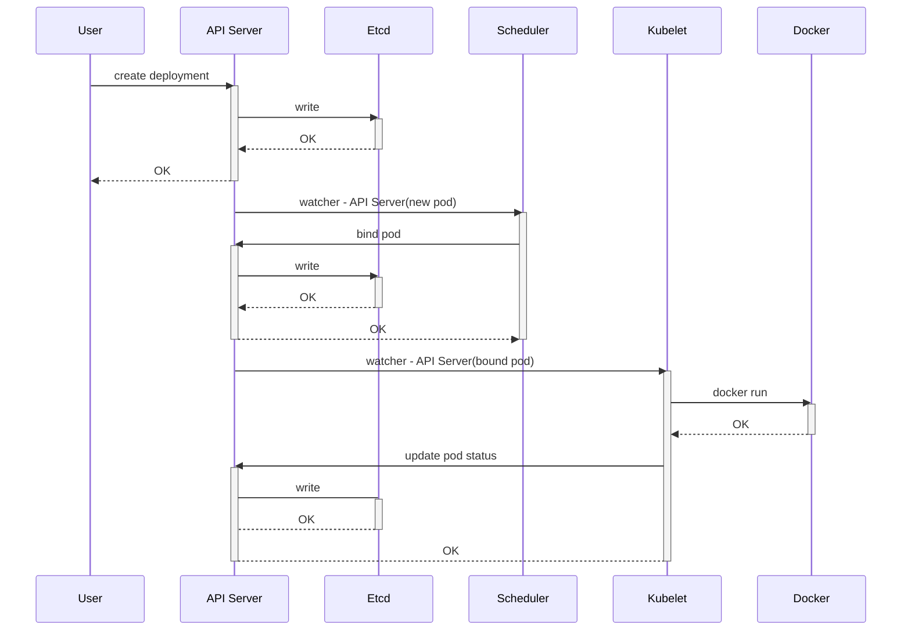

# 用奇怪的方式构建简单 k8s 集群

## 前言

这个帖子的创建来源于 youtube 的一个[视频](https://youtu.be/3KtEAa7_duA) ，这个视频介绍如何快速部署一个k8s集群很有新意，他没有使用常见的minkube或者kubeadm这种方式来创建完整的集群，也不是从源代码开始从头撸起，同时也没有说要先搭建一个完整的集群，然后演示基本操作。
他先套路式的用19张图说了创建一个deployment 时k8s集群的内部机制，一般到这里已经很清楚了解内部组件的互操作过程了。然后作者现场登录一台服务器，开始任意的从一个服务运行开始，比如他先运行 kube-apiserver，那肯定会报错，于是根据报错来解决问题，每启动一个服务，他就尝试创建 deployment ，然后继续根据报错来解决问题。直到最后搭建一个简单的单节点集群，这个演示工程让你对k8s 个组件节点的关系，有了更深刻的理解。

因为他是现场很快演示，于是我打算这复刻这个过程。作者用 19 张幻灯片演示了一个 deployment 的创建过程，我把这个演示过程整理成了一个时序图。



作者在构建该集群的目标是创建一个最小化的k8s的集群，这个集群可以实现：

- 创建 Deployment （`kubectl run`，`kubectl create deployment`)
- 用 Service 方式暴露出去
- 可以连接这个服务

这里的 “最小化” 意味着：

- 最少的组件
- 最少的命令行参数
- 最少的配置文件

同时，这个最小化集群不考虑以下因素：

- 集群安全性
- 集群可扩展性
- 集群高可用性

总而言之，就是要最简化

## 环境准备

作者在演示的过程中准备了两台普通配置的虚拟机，我这里找了两台限制的机器，配置如下：

- 机器型号： Dell R640
- CPU: Intel(R) Xeon(R) Silver 4216 CPU @ 2.10GHz
- 内存：64G
- OS: CentOS 7.6
- kernel: 5.19.11

两台机器的 IP 地址分别为 `10.90.23.41`,`10.90.23.42`

然后准备需要的软件，全部放在 `/opt/k8s` 目录下，主要包括：

- [docker ce 20.10.14](https://www.docker.com)
- [etcd 3.5.7](https://storage.googleapis.com/etcd/v3.5.7/etcd-v3.5.7-linux-amd64.tar.gz)
- [kubectl v1.26.3](https://dl.k8s.io/v1.26.3/bin/linux/amd64/kubectl)
- [kubelet v1.26.3](https://dl.k8s.io/v1.26.3/bin/linux/amd64/kubelet)
- [kube-proxy v1.26.3](https://dl.k8s.io/v1.26.3/bin/linux/amd64/kube-proxy)
- [kube-apiserver v1.26.3](https://dl.k8s.io/v1.26.3/bin/linux/amd64/kube-apiserver)
- [kube-scheduler v1.26.3](https://dl.k8s.io/v1.26.3/bin/linux/amd64/kube-scheduler)

其中 `docker-ce` 是通过 yum 仓库安装的，其他是从给出的连接下载的。

```shell
# tree /opt/k8s/
/opt/k8s/
├── etcd
├── etcdctl
├── etcdutl
├── kube-apiserver
├── kubectl
├── kubelet
├── kube-proxy
└── kube-scheduler

0 directories, 5 files
```

## 开始搭建

部署的思路是这样的：

1. 尝试启动 `API Server`
2. 尝试创建 Deployment
3. 看是否报错
4. 如果有报错，尝试修复，跳到步骤 2， 直到创建成功

### 启动 kube-apiserver

```shell
# ./kube-apiserver
W0320 20:30:47.651537    3927 services.go:37] No CIDR for service cluster IPs specified. Default value which was 10.0.0.0/24 is deprecated and will be removed in future releases. Please specify it using --service-cluster-ip-range on kube-apiserver.
I0320 20:30:48.018907    3927 serving.go:342] Generated self-signed cert (/var/run/kubernetes/apiserver.crt, /var/run/kubernetes/apiserver.key)
I0320 20:30:48.018924    3927 server.go:555] external host was not specified, using 10.90.23.41
W0320 20:30:48.018931    3927 authentication.go:520] AnonymousAuth is not allowed with the AlwaysAllow authorizer. Resetting AnonymousAuth to false. You should use a different authorizer
E0320 20:30:48.019080    3927 run.go:74] "command failed" err="[--etcd-servers must be specified, service-account-issuer is a required flag, --service-account-signing-key-file and --service-account-issuer are required flags]"
```

报错了，看最行的报错信息，`--etcd-servers must be specified`，那就要先启动 `etcd`了

### 启动 etcd

```shell
# ./etcd
{"level":"info","ts":"2023-03-20T21:38:43.155+0800","caller":"etcdmain/etcd.go:73","msg":"Running: ","args":["./etcd"]}
...
{"level":"info","ts":"2023-03-20T21:38:43.960+0800","caller":"embed/serve.go:146","msg":"serving client traffic insecurely; this is strongly discouraged!","address":"127.0.0.1:2379"}
```

看来是成功了，注意最后一行的输出，我们知道 etcd 的地址为 `127.0.0.1:2379`

### 再次启动 API Server

```shell
# ./kube-apiserver --etcd-servers http://127.0.0.1:2379
W0320 21:42:49.655612    9431 services.go:37] No CIDR for service cluster IPs specified. Default value which was 10.0.0.0/24 is deprecated and will be removed in future releases. Please specify it using --service-cluster-ip-range on kube-apiserver.
I0320 21:42:49.655666    9431 server.go:555] external host was not specified, using 10.90.23.41
W0320 21:42:49.655676    9431 authentication.go:520] AnonymousAuth is not allowed with the AlwaysAllow authorizer. Resetting AnonymousAuth to false. You should use a different authorizer
E0320 21:42:49.655860    9431 run.go:74] "command failed" err="[service-account-issuer is a required flag, --service-account-signing-key-file and --service-account-issuer are required flags]"
```

看来新版本新增了必须的参数 ，按照最后一行的错误，我们要解决 `--service-account-signing-key-file`, `--service-account-issuer` 两个参数问题

同时我们启用 `AnonymousAuth` (`--anonymous-auth`)

#### 创建自签名证书

```shell
$ openssl genrsa -out service-account-key.pem 4096
$ openssl req -new -x509 -days 365 -key service-account-key.pem -sha256 -batch -out service-account.pem
```

#### 继续启动

```shell
# ./kube-apiserver --etcd-servers http://127.0.0.1:2379 \
  --anonymous-auth \
  --service-account-issuer=api \
  --service-account-key-file=/opt/k8s/service-account.pem \
  --service-account-signing-key-file=/opt/k8s/service-account-key.pem

W0320 22:38:19.001075   13586 services.go:37] No CIDR for service cluster IPs specified. Default value which was 10.0.0.0/24 is deprecated and will be removed in future releases. Please specify it using --service-cluster-ip-range on kube-apiserver.
I0320 22:38:19.001131   13586 server.go:555] external host was not specified, using 10.90.23.41
W0320 22:38:19.001143   13586 authentication.go:520] AnonymousAuth is not allowed with the AlwaysAllow authorizer. Resetting AnonymousAuth to false. You should use a different authorizer
I0320 22:38:19.001706   13586 server.go:163] Version: v1.26.3
...
I0320 22:38:20.759381   13586 secure_serving.go:210] Serving securely on [::]:6443
I0320 22:38:21.491867   13586 controller.go:132] OpenAPI AggregationController: action for item k8s_internal_local_delegation_chain_0000000000: Nothing (removed from the queue).
I0320 22:38:21.763534   13586 storage_scheduling.go:111] all system priority classes are created successfully or already exist.
```

目前来看，启动成功，要注意，这里我们使用了 TLS，所以端口不是默认 `8080`，而是变成了 `6443`

### 和 API Server 交互

现在实现一些常用的命令，看看是否可以运行

```shell
```

