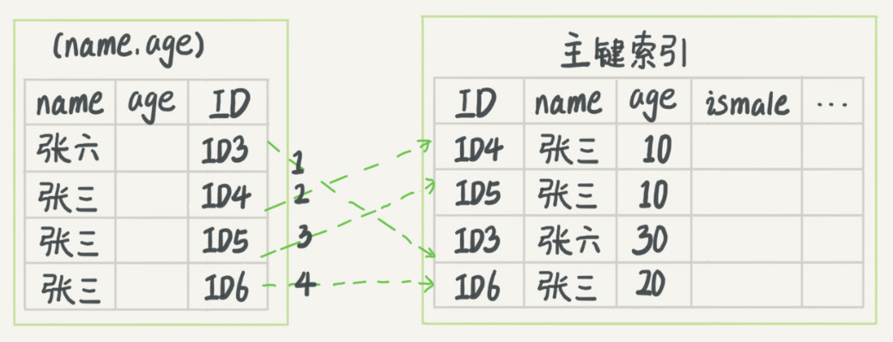
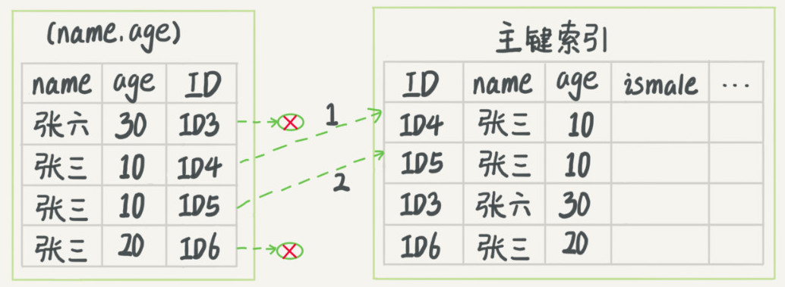

# 《MySQL 实战45讲》节选第一部分

[Source](http://learn.lianglianglee.com/%E6%9E%81%E5%AE%A2%E6%97%B6%E9%97%B4/MySQL%E5%AE%9E%E6%88%9845%E8%AE%B2.md "Permalink to MySQL实战45讲.md")

以下内容节选自 “丁奇” 在极客时间的 《MySQL实战45讲》的内容，这是第一部分

## 01 基础架构：一条SQL查询语句是如何执行的？

平时我们使用数据库，看到的通常都是一个整体。比如，你有个最简单的表，表里只有一个 ID 字段，在执行下面这个查询语句时：

```sql
mysql> select * from T where ID=10；
```

我们看到的只是输入一条语句，返回一个结果，却不知道这条语句在 MySQL 内部的执行过程。

所以今天我想和你一起把 MySQL 拆解一下，看看里面都有哪些“零件”，希望借由这个拆解过程，让你对 MySQL 有更深入的理解。这样当我们碰到 MySQL 的一些异常或者问题时，就能够直戳本质，更为快速地定位并解决问题。

下面我给出的是 MySQL 的基本架构示意图，从中你可以清楚地看到 SQL 语句在 MySQL 的各个功能模块中的执行过程。


大体来说，MySQL 可以分为 Server 层和存储引擎层两部分。

Server 层包括连接器、查询缓存、分析器、优化器、执行器等，涵盖 MySQL 的大多数核心服务功能，以及所有的内置函数（如日期、时间、数学和加密函数等），所有跨存储引擎的功能都在这一层实现，比如存储过程、触发器、视图等。

而存储引擎层负责数据的存储和提取。其架构模式是插件式的，支持 InnoDB、MyISAM、Memory 等多个存储引擎。现在最常用的存储引擎是 InnoDB，它从 MySQL 5.5.5 版本开始成为了默认存储引擎。

也就是说，你执行 create table 建表的时候，如果不指定引擎类型，默认使用的就是 InnoDB。不过，你也可以通过指定存储引擎的类型来选择别的引擎，比如在 create table 语句中使用 engine=memory, 来指定使用内存引擎创建表。不同存储引擎的表数据存取方式不同，支持的功能也不同，在后面的文章中，我们会讨论到引擎的选择。

从图中不难看出，不同的存储引擎共用一个**Server 层**，也就是从连接器到执行器的部分。你可以先对每个组件的名字有个印象，接下来我会结合开头提到的那条 SQL 语句，带你走一遍整个执行流程，依次看下每个组件的作用。

### 连接器

第一步，你会先连接到这个数据库上，这时候接待你的就是连接器。连接器负责跟客户端建立连接、获取权限、维持和管理连接。连接命令一般是这么写的：

```shell
mysql -h$ip -P$port -u$user -p
```

输完命令之后，你就需要在交互对话里面输入密码。虽然密码也可以直接跟在 -p 后面写在命令行中，但这样可能会导致你的密码泄露。如果你连的是生产服务器，强烈建议你不要这么做。

连接命令中的 mysql 是客户端工具，用来跟服务端建立连接。在完成经典的 TCP 握手后，连接器就要开始认证你的身份，这个时候用的就是你输入的用户名和密码。

* 如果用户名或密码不对，你就会收到一个"Access denied for user"的错误，然后客户端程序结束执行。
* 如果用户名密码认证通过，连接器会到权限表里面查出你拥有的权限。之后，这个连接里面的权限判断逻辑，都将依赖于此时读到的权限。

这就意味着，一个用户成功建立连接后，即使你用管理员账号对这个用户的权限做了修改，也不会影响已经存在连接的权限。修改完成后，只有再新建的连接才会使用新的权限设置。

连接完成后，如果你没有后续的动作，这个连接就处于空闲状态，你可以在 show processlist 命令中看到它。文本中这个图是 show processlist 的结果，其中的 Command 列显示为“Sleep”的这一行，就表示现在系统里面有一个空闲连接。

```sql
mysql> show processlist;
+----+-----------------+------------------+------+---------+------+------------------------+------------------+
| Id | User            | Host             | db   | Command | Time | State                  | Info             |
+----+-----------------+------------------+------+---------+------+------------------------+------------------+
|  4 | event_scheduler | localhost        | NULL | Daemon  |    7 | Waiting on empty queue | NULL             |
|  8 | root            | localhost        | NULL | Query   |    0 | starting               | show processlist |
| 10 | my              | 192.168.1.2:24691| test | Sleep   |   53 |                        | NULL             |
+----+-----------------+------------------+------+---------+------+------------------------+------------------+
2 rows in set (0.00 sec)
```

客户端如果太长时间没动静，连接器就会自动将它断开。这个时间是由参数 wait\_timeout 控制的，默认值是 8 小时。

如果在连接被断开之后，客户端再次发送请求的话，就会收到一个错误提醒： Lost connection to MySQL server during query。这时候如果你要继续，就需要重连，然后再执行请求了。

数据库里面，长连接是指连接成功后，如果客户端持续有请求，则一直使用同一个连接。短连接则是指每次执行完很少的几次查询就断开连接，下次查询再重新建立一个。

建立连接的过程通常是比较复杂的，所以我建议你在使用中要尽量减少建立连接的动作，也就是尽量使用长连接。

但是全部使用长连接后，你可能会发现，有些时候 MySQL 占用内存涨得特别快，这是因为 MySQL 在执行过程中临时使用的内存是管理在连接对象里面的。这些资源会在连接断开的时候才释放。所以如果长连接累积下来，可能导致内存占用太大，被系统强行杀掉（OOM），从现象看就是 MySQL 异常重启了。

怎么解决这个问题呢？你可以考虑以下两种方案。

1. 定期断开长连接。使用一段时间，或者程序里面判断执行过一个占用内存的大查询后，断开连接，之后要查询再重连。
2. 如果你用的是 MySQL 5.7 或更新版本，可以在每次执行一个比较大的操作后，通过执行 `mysql_reset_connection` 来重新初始化连接资源。这个过程不需要重连和重新做权限验证，但是会将连接恢复到刚刚创建完时的状态。

### 查询缓存

连接建立完成后，你就可以执行 select 语句了。执行逻辑就会来到第二步：查询缓存。

MySQL 拿到一个查询请求后，会先到查询缓存看看，之前是不是执行过这条语句。之前执行过的语句及其结果可能会以 key-value 对的形式，被直接缓存在内存中。key 是查询的语句，value 是查询的结果。如果你的查询能够直接在这个缓存中找到 key，那么这个 value 就会被直接返回给客户端。

如果语句不在查询缓存中，就会继续后面的执行阶段。执行完成后，执行结果会被存入查询缓存中。你可以看到，如果查询命中缓存，MySQL 不需要执行后面的复杂操作，就可以直接返回结果，这个效率会很高。

**但是大多数情况下我会建议你不要使用查询缓存，为什么呢？因为查询缓存往往弊大于利。**

查询缓存的失效非常频繁，只要有对一个表的更新，这个表上所有的查询缓存都会被清空。因此很可能你费劲地把结果存起来，还没使用呢，就被一个更新全清空了。对于更新压力大的数据库来说，查询缓存的命中率会非常低。除非你的业务就是有一张静态表，很长时间才会更新一次。比如，一个系统配置表，那这张表上的查询才适合使用查询缓存。

好在 MySQL 也提供了这种“按需使用”的方式。你可以将参数 query\_cache\_type 设置成 DEMAND，这样对于默认的 SQL 语句都不使用查询缓存。而对于你确定要使用查询缓存的语句，可以用 SQL\_CACHE 显式指定，像下面这个语句一样：

```sql
mysql> select SQL_CACHE * from T where ID=10；
```

需要注意的是，MySQL 8.0 版本直接将查询缓存的整块功能删掉了，也就是说 8.0 开始彻底没有这个功能了。

### 分析器

如果没有命中查询缓存，就要开始真正执行语句了。首先，MySQL 需要知道你要做什么，因此需要对 SQL 语句做解析。

分析器先会做“词法分析”。你输入的是由多个字符串和空格组成的一条 SQL 语句，MySQL 需要识别出里面的字符串分别是什么，代表什么。

MySQL 从你输入的"select"这个关键字识别出来，这是一个查询语句。它也要把字符串“T”识别成“表名 T”，把字符串“ID”识别成“列 ID”。

做完了这些识别以后，就要做“语法分析”。根据词法分析的结果，语法分析器会根据语法规则，判断你输入的这个 SQL 语句是否满足 MySQL 语法。

如果你的语句不对，就会收到“You have an error in your SQL syntax”的错误提醒，比如下面这个语句 select 少打了开头的字母“s”。

```sql
mysql> elect * from t where ID=1; 
ERROR 1064 (42000): You have an error in your SQL syntax; check the manual that corresponds to your MySQL server version for the right syntax to use near 'elect * from t where ID=1' at line 1
```

一般语法错误会提示第一个出现错误的位置，所以你要关注的是紧接“use near”的内容。

### 优化器

经过了分析器，MySQL 就知道你要做什么了。在开始执行之前，还要先经过优化器的处理。

优化器是在表里面有多个索引的时候，决定使用哪个索引；或者在一个语句有多表关联（join）的时候，决定各个表的连接顺序。比如你执行下面这样的语句，这个语句是执行两个表的 join：

```sql
mysql> select * from t1 join t2 using(ID)  where t1.c=10 and t2.d=20;
```

* 既可以先从表 t1 里面取出 c=10 的记录的 ID 值，再根据 ID 值关联到表 t2，再判断 t2 里面 d 的值是否等于 20。
* 也可以先从表 t2 里面取出 d=20 的记录的 ID 值，再根据 ID 值关联到 t1，再判断 t1 里面 c 的值是否等于 10。

这两种执行方法的逻辑结果是一样的，但是执行的效率会有不同，而优化器的作用就是决定选择使用哪一个方案。

优化器阶段完成后，这个语句的执行方案就确定下来了，然后进入执行器阶段。如果你还有一些疑问，比如优化器是怎么选择索引的，有没有可能选择错等等，没关系，我会在后面的文章中单独展开说明优化器的内容。

### 执行器

MySQL 通过分析器知道了你要做什么，通过优化器知道了该怎么做，于是就进入了执行器阶段，开始执行语句。

开始执行的时候，要先判断一下你对这个表 T 有没有执行查询的权限，如果没有，就会返回没有权限的错误，如下所示 (在工程实现上，如果命中查询缓存，会在查询缓存返回结果的时候，做权限验证。查询也会在优化器之前调用 precheck 验证权限)。

```sql
mysql> select * from T where ID=10; 
ERROR 1142 (42000): SELECT command denied to user 'b'@'localhost' for table 'T'
```

如果有权限，就打开表继续执行。打开表的时候，执行器就会根据表的引擎定义，去使用这个引擎提供的接口。

比如我们这个例子中的表 T 中，ID 字段没有索引，那么执行器的执行流程是这样的：

1. 调用 InnoDB 引擎接口取这个表的第一行，判断 ID 值是不是 10，如果不是则跳过，如果是则将这行存在结果集中；
2. 调用引擎接口取“下一行”，重复相同的判断逻辑，直到取到这个表的最后一行。
3. 执行器将上述遍历过程中所有满足条件的行组成的记录集作为结果集返回给客户端。

至此，这个语句就执行完成了。

对于有索引的表，执行的逻辑也差不多。第一次调用的是“取满足条件的第一行”这个接口，之后循环取“满足条件的下一行”这个接口，这些接口都是引擎中已经定义好的。

你会在数据库的慢查询日志中看到一个 rows\_examined 的字段，表示这个语句执行过程中扫描了多少行。这个值就是在执行器每次调用引擎获取数据行的时候累加的。

在有些场景下，执行器调用一次，在引擎内部则扫描了多行，因此 **引擎扫描行数跟 rows_examined 并不是完全相同的**。我们后面会专门有一篇文章来讲存储引擎的内部机制，里面会有详细的说明。

### 小结

我给你留一个问题吧，如果表 T 中没有字段 k，而你执行了这个语句 `select * from T where k=1`, 那肯定是会报“不存在这个列”的错误： `Unknown column ‘k’ in ‘where clause`。你觉得这个错误是在我们上面提到的哪个阶段报出来的呢？


## 02 日志系统：一条SQL更新语句是如何执行的？

我们还是从一个表的一条更新语句说起，下面是这个表的创建语句，这个表有一个主键 ID 和一个整型字段 c：

```sql
mysql> create table T(ID int primary key, c int);
```

如果要将 ID=2 这一行的值加 1，SQL 语句就会这么写：

```sql
mysql> update T set c=c+1 where ID=2;
```

前面我有跟你介绍过 SQL 语句基本的执行链路，这里我再把那张图拿过来，你也可以先简单看看这个图回顾下。首先，可以确定的说，查询语句的那一套流程，更新语句也是同样会走一遍。


你执行语句前要先连接数据库，这是连接器的工作。

前面我们说过，在一个表上有更新的时候，跟这个表有关的查询缓存会失效，所以这条语句就会把表 T 上所有缓存结果都清空。这也就是我们一般不建议使用查询缓存的原因。

接下来，分析器会通过词法和语法解析知道这是一条更新语句。优化器决定要使用 ID 这个索引。然后，执行器负责具体执行，找到这一行，然后更新。

与查询流程不一样的是，更新流程还涉及两个重要的日志模块，它们正是我们今天要讨论的主角：redo log（重做日志）和 binlog（归档日志）。如果接触 MySQL，那这两个词肯定是绕不过的，我后面的内容里也会不断地和你强调。不过话说回来，redo log 和 binlog 在设计上有很多有意思的地方，这些设计思路也可以用到你自己的程序里。

### 重要的日志模块：redo log

不知道你还记不记得《孔乙己》这篇文章，酒店掌柜有一个粉板，专门用来记录客人的赊账记录。如果赊账的人不多，那么他可以把顾客名和账目写在板上。但如果赊账的人多了，粉板总会有记不下的时候，这个时候掌柜一定还有一个专门记录赊账的账本。

如果有人要赊账或者还账的话，掌柜一般有两种做法：

* 一种做法是直接把账本翻出来，把这次赊的账加上去或者扣除掉；
* 另一种做法是先在粉板上记下这次的账，等打烊以后再把账本翻出来核算。

在生意红火柜台很忙时，掌柜一定会选择后者，因为前者操作实在是太麻烦了。首先，你得找到这个人的赊账总额那条记录。你想想，密密麻麻几十页，掌柜要找到那个名字，可能还得带上老花镜慢慢找，找到之后再拿出算盘计算，最后再将结果写回到账本上。

这整个过程想想都麻烦。相比之下，还是先在粉板上记一下方便。你想想，如果掌柜没有粉板的帮助，每次记账都得翻账本，效率是不是低得让人难以忍受？

同样，在 MySQL 里也有这个问题，如果每一次的更新操作都需要写进磁盘，然后磁盘也要找到对应的那条记录，然后再更新，整个过程 IO 成本、查找成本都很高。为了解决这个问题，MySQL 的设计者就用了类似酒店掌柜粉板的思路来提升更新效率。

而粉板和账本配合的整个过程，其实就是 MySQL 里经常说到的 WAL 技术，WAL 的全称是 Write-Ahead Logging，它的关键点就是先写日志，再写磁盘，也就是先写粉板，等不忙的时候再写账本。

具体来说，当有一条记录需要更新的时候，InnoDB 引擎就会先把记录写到 redo log（粉板）里面，并更新内存，这个时候更新就算完成了。同时，InnoDB 引擎会在适当的时候，将这个操作记录更新到磁盘里面，而这个更新往往是在系统比较空闲的时候做，这就像打烊以后掌柜做的事。

如果今天赊账的不多，掌柜可以等打烊后再整理。但如果某天赊账的特别多，粉板写满了，又怎么办呢？这个时候掌柜只好放下手中的活儿，把粉板中的一部分赊账记录更新到账本中，然后把这些记录从粉板上擦掉，为记新账腾出空间。

与此类似，InnoDB 的 redo log 是固定大小的，比如可以配置为一组 4 个文件，每个文件的大小是 1GB，那么这块“粉板”总共就可以记录 4GB 的操作。从头开始写，写到末尾就又回到开头循环写，如下面这个图所示。


write pos 是当前记录的位置，一边写一边后移，写到第 3 号文件末尾后就回到 0 号文件开头。checkpoint 是当前要擦除的位置，也是往后推移并且循环的，擦除记录前要把记录更新到数据文件。

write pos 和 checkpoint 之间的是“粉板”上还空着的部分，可以用来记录新的操作。如果 write pos 追上 checkpoint，表示“粉板”满了，这时候不能再执行新的更新，得停下来先擦掉一些记录，把 checkpoint 推进一下。

有了 redo log，InnoDB 就可以保证即使数据库发生异常重启，之前提交的记录都不会丢失，这个能力称为**crash-safe**。

要理解 crash-safe 这个概念，可以想想我们前面赊账记录的例子。只要赊账记录记在了粉板上或写在了账本上，之后即使掌柜忘记了，比如突然停业几天，恢复生意后依然可以通过账本和粉板上的数据明确赊账账目。

### 重要的日志模块：binlog

前面我们讲过，MySQL 整体来看，其实就有两块：一块是 Server 层，它主要做的是 MySQL 功能层面的事情；还有一块是引擎层，负责存储相关的具体事宜。上面我们聊到的粉板 redo log 是 InnoDB 引擎特有的日志，而 Server 层也有自己的日志，称为 binlog（归档日志）。

我想你肯定会问，为什么会有两份日志呢？

因为最开始 MySQL 里并没有 InnoDB 引擎。MySQL 自带的引擎是 MyISAM，但是 MyISAM 没有 crash-safe 的能力，binlog 日志只能用于归档。而 InnoDB 是另一个公司以插件形式引入 MySQL 的，既然只依靠 binlog 是没有 crash-safe 能力的，所以 InnoDB 使用另外一套日志系统——也就是 redo log 来实现 crash-safe 能力。

这两种日志有以下三点不同。

1. redo log 是 InnoDB 引擎特有的；binlog 是 MySQL 的 Server 层实现的，所有引擎都可以使用。
2. redo log 是物理日志，记录的是“在某个数据页上做了什么修改”；binlog 是逻辑日志，记录的是这个语句的原始逻辑，比如“给 ID=2 这一行的 c 字段加 1 ”。
3. redo log 是循环写的，空间固定会用完；binlog 是可以追加写入的。“追加写”是指 binlog 文件写到一定大小后会切换到下一个，并不会覆盖以前的日志。

有了对这两个日志的概念性理解，我们再来看执行器和 InnoDB 引擎在执行这个简单的 update 语句时的内部流程。

1. 执行器先找引擎取 ID=2 这一行。ID 是主键，引擎直接用树搜索找到这一行。如果 ID=2 这一行所在的数据页本来就在内存中，就直接返回给执行器；否则，需要先从磁盘读入内存，然后再返回。
2. 执行器拿到引擎给的行数据，把这个值加上 1，比如原来是 N，现在就是 N+1，得到新的一行数据，再调用引擎接口写入这行新数据。
3. 引擎将这行新数据更新到内存中，同时将这个更新操作记录到 redo log 里面，此时 redo log 处于 prepare 状态。然后告知执行器执行完成了，随时可以提交事务。
4. 执行器生成这个操作的 binlog，并把 binlog 写入磁盘。
5. 执行器调用引擎的提交事务接口，引擎把刚刚写入的 redo log 改成提交（commit）状态，更新完成。

这里我给出这个 update 语句的执行流程图，图中浅色框表示是在 InnoDB 内部执行的，深色框表示是在执行器中执行的。


你可能注意到了，最后三步看上去有点“绕”，将 redo log 的写入拆成了两个步骤：prepare 和 commit，这就是"两阶段提交"。

### 两阶段提交

为什么必须有“两阶段提交”呢？这是为了让两份日志之间的逻辑一致。要说明这个问题，我们得从文章开头的那个问题说起：**怎样让数据库恢复到半个月内任意一秒的状态？**

前面我们说过了，binlog 会记录所有的逻辑操作，并且是采用“追加写”的形式。如果你的 DBA 承诺说半个月内可以恢复，那么备份系统中一定会保存最近半个月的所有 binlog，同时系统会定期做整库备份。这里的“定期”取决于系统的重要性，可以是一天一备，也可以是一周一备。

当需要恢复到指定的某一秒时，比如某天下午两点发现中午十二点有一次误删表，需要找回数据，那你可以这么做：

* 首先，找到最近的一次全量备份，如果你运气好，可能就是昨天晚上的一个备份，从这个备份恢复到临时库；
* 然后，从备份的时间点开始，将备份的 binlog 依次取出来，重放到中午误删表之前的那个时刻。

这样你的临时库就跟误删之前的线上库一样了，然后你可以把表数据从临时库取出来，按需要恢复到线上库去。

好了，说完了数据恢复过程，我们回来说说，为什么日志需要“两阶段提交”。这里不妨用反证法来进行解释。

由于 redo log 和 binlog 是两个独立的逻辑，如果不用两阶段提交，要么就是先写完 redo log 再写 binlog，或者采用反过来的顺序。我们看看这两种方式会有什么问题。

仍然用前面的 update 语句来做例子。假设当前 ID=2 的行，字段 c 的值是 0，再假设执行 update 语句过程中在写完第一个日志后，第二个日志还没有写完期间发生了 crash，会出现什么情况呢？

1. **先写 redo log 后写 binlog**。假设在 redo log 写完，binlog 还没有写完的时候，MySQL 进程异常重启。由于我们前面说过的，redo log 写完之后，系统即使崩溃，仍然能够把数据恢复回来，所以恢复后这一行 c 的值是 1。 但是由于 binlog 没写完就 crash 了，这时候 binlog 里面就没有记录这个语句。因此，之后备份日志的时候，存起来的 binlog 里面就没有这条语句。 然后你会发现，如果需要用这个 binlog 来恢复临时库的话，由于这个语句的 binlog 丢失，这个临时库就会少了这一次更新，恢复出来的这一行 c 的值就是 0，与原库的值不同。
2. **先写 binlog 后写 redo log**。如果在 binlog 写完之后 crash，由于 redo log 还没写，崩溃恢复以后这个事务无效，所以这一行 c 的值是 0。但是 binlog 里面已经记录了“把 c 从 0 改成 1”这个日志。所以，在之后用 binlog 来恢复的时候就多了一个事务出来，恢复出来的这一行 c 的值就是 1，与原库的值不同。

可以看到，如果不使用“两阶段提交”，那么数据库的状态就有可能和用它的日志恢复出来的库的状态不一致。

你可能会说，这个概率是不是很低，平时也没有什么动不动就需要恢复临时库的场景呀？

其实不是的，不只是误操作后需要用这个过程来恢复数据。当你需要扩容的时候，也就是需要再多搭建一些备库来增加系统的读能力的时候，现在常见的做法也是用全量备份加上应用 binlog 来实现的，这个“不一致”就会导致你的线上出现主从数据库不一致的情况。

简单说，redo log 和 binlog 都可以用于表示事务的提交状态，而两阶段提交就是让这两个状态保持逻辑上的一致。

### 小结

今天，我介绍了 MySQL 里面最重要的两个日志，即物理日志 redo log 和逻辑日志 binlog。

redo log 用于保证 crash-safe 能力。`innodb_flush_log_at_trx_commit` 这个参数设置成 1 的时候，表示每次事务的 redo log 都直接持久化到磁盘。这个参数我建议你设置成 1，这样可以保证 MySQL 异常重启之后数据不丢失。

sync\_binlog 这个参数设置成 1 的时候，表示每次事务的 binlog 都持久化到磁盘。这个参数我也建议你设置成 1，这样可以保证 MySQL 异常重启之后 binlog 不丢失。


## 03 事务隔离：为什么你改了我还看不见？

提到事务，你肯定不陌生，和数据库打交道的时候，我们总是会用到事务。最经典的例子就是转账，你要给朋友小王转 100 块钱，而此时你的银行卡只有 100 块钱。

转账过程具体到程序里会有一系列的操作，比如查询余额、做加减法、更新余额等，这些操作必须保证是一体的，不然等程序查完之后，还没做减法之前，你这 100 块钱，完全可以借着这个时间差再查一次，然后再给另外一个朋友转账，如果银行这么整，不就乱了么？这时就要用到“事务”这个概念了。

简单来说，事务就是要保证一组数据库操作，要么全部成功，要么全部失败。在 MySQL 中，事务支持是在引擎层实现的。你现在知道，MySQL 是一个支持多引擎的系统，但并不是所有的引擎都支持事务。比如 MySQL 原生的 MyISAM 引擎就不支持事务，这也是 MyISAM 被 InnoDB 取代的重要原因之一。

今天的文章里，我将会以 InnoDB 为例，剖析 MySQL 在事务支持方面的特定实现，并基于原理给出相应的实践建议，希望这些案例能加深你对 MySQL 事务原理的理解。

### 事务隔离的实现

理解了事务的隔离级别，我们再来看看事务隔离具体是怎么实现的。这里我们展开说明“可重复读”。

在 MySQL 中，实际上每条记录在更新的时候都会同时记录一条回滚操作。记录上的最新值，通过回滚操作，都可以得到前一个状态的值。

假设一个值从 1 被按顺序改成了 2、3、4，在回滚日志里面就会有类似下面的记录。

当前值是 4，但是在查询这条记录的时候，不同时刻启动的事务会有不同的 read-view。如图中看到的，在视图 A、B、C 里面，这一个记录的值分别是 1、2、4，同一条记录在系统中可以存在多个版本，就是数据库的多版本并发控制（MVCC）。对于 read-view A，要得到 1，就必须将当前值依次执行图中所有的回滚操作得到。

同时你会发现，即使现在有另外一个事务正在将 4 改成 5，这个事务跟 read-view A、B、C 对应的事务是不会冲突的。

你一定会问，回滚日志总不能一直保留吧，什么时候删除呢？答案是，在不需要的时候才删除。也就是说，系统会判断，当没有事务再需要用到这些回滚日志时，回滚日志会被删除。

什么时候才不需要了呢？就是当系统里没有比这个回滚日志更早的 read-view 的时候。

基于上面的说明，我们来讨论一下为什么建议你尽量不要使用长事务。

长事务意味着系统里面会存在很老的事务视图。由于这些事务随时可能访问数据库里面的任何数据，所以这个事务提交之前，数据库里面它可能用到的回滚记录都必须保留，这就会导致大量占用存储空间。

在 MySQL 5.5 及以前的版本，回滚日志是跟数据字典一起放在 ibdata 文件里的，即使长事务最终提交，回滚段被清理，文件也不会变小。我见过数据只有 20GB，而回滚段有 200GB 的库。最终只好为了清理回滚段，重建整个库。

除了对回滚段的影响，长事务还占用锁资源，也可能拖垮整个库，这个我们会在后面讲锁的时候展开。

### 事务的启动方式

如前面所述，长事务有这些潜在风险，我当然是建议你尽量避免。其实很多时候业务开发同学并不是有意使用长事务，通常是由于误用所致。MySQL 的事务启动方式有以下几种：

1. 显式启动事务语句， begin 或 start transaction。配套的提交语句是 commit，回滚语句是 rollback。
2. `set autocommit=0`，这个命令会将这个线程的自动提交关掉。意味着如果你只执行一个 select 语句，这个事务就启动了，而且并不会自动提交。这个事务持续存在直到你主动执行 commit 或 rollback 语句，或者断开连接。

有些客户端连接框架会默认连接成功后先执行一个 `set autocommit=0` 的命令。这就导致接下来的查询都在事务中，如果是长连接，就导致了意外的长事务。

因此，我会建议你总是使用 `set autocommit=1`, 通过显式语句的方式来启动事务。

但是有的开发同学会纠结“多一次交互”的问题。对于一个需要频繁使用事务的业务，第二种方式每个事务在开始时都不需要主动执行一次 “begin”，减少了语句的交互次数。如果你也有这个顾虑，我建议你使用 `commit work and chain` 语法。

在 autocommit 为 1 的情况下，用 begin 显式启动的事务，如果执行 commit 则提交事务。如果执行 commit work and chain，则是提交事务并自动启动下一个事务，这样也省去了再次执行 begin 语句的开销。同时带来的好处是从程序开发的角度明确地知道每个语句是否处于事务中。

你可以在 information\_schema 库的 innodb\_trx 这个表中查询长事务，比如下面这个语句，用于查找持续时间超过 60s 的事务。

```sql
select * from information_schema.INNODB_TRX where TIME_TO_SEC(timediff(now(),trx_started))>60
```

### 小结

这篇文章里面，我介绍了 MySQL 的事务隔离级别的现象和实现，根据实现原理分析了长事务存在的风险，以及如何用正确的方式避免长事务。希望我举的例子能够帮助你理解事务，并更好地使用 MySQL 的事务特性。

## 04 深入浅出索引（上）

提到数据库索引，我想你并不陌生，在日常工作中会经常接触到。比如某一个 SQL 查询比较慢，分析完原因之后，你可能就会说“给某个字段加个索引吧”之类的解决方案。但到底什么是索引，索引又是如何工作的呢？今天就让我们一起来聊聊这个话题吧。

数据库索引的内容比较多，我分成了上下两篇文章。索引是数据库系统里面最重要的概念之一，所以我希望你能够耐心看完。在后面的实战文章中，我也会经常引用这两篇文章中提到的知识点，加深你对数据库索引的理解。

一句话简单来说，索引的出现其实就是为了提高数据查询的效率，就像书的目录一样。一本 500 页的书，如果你想快速找到其中的某一个知识点，在不借助目录的情况下，那我估计你可得找一会儿。同样，对于数据库的表而言，索引其实就是它的“目录”。

### InnoDB 的索引模型

在 InnoDB 中，表都是根据主键顺序以索引的形式存放的，这种存储方式的表称为索引组织表。又因为前面我们提到的，InnoDB 使用了 B+ 树索引模型，所以数据都是存储在 B+ 树中的。

每一个索引在 InnoDB 里面对应一棵 B+ 树。

假设，我们有一个主键列为 ID 的表，表中有字段 k，并且在 k 上有索引。

这个表的建表语句是：

```sql
mysql> create table T(
id int primary key, 
k int not null, 
name varchar(16),
index (k))engine=InnoDB;
```

表中 R1~R5 的 (ID,k) 值分别为 (100,1)、(200,2)、(300,3)、(500,5) 和 (600,6)，两棵树的示例示意图如下。


从图中不难看出，根据叶子节点的内容，索引类型分为主键索引和非主键索引。

主键索引的叶子节点存的是整行数据。在 InnoDB 里，主键索引也被称为聚簇索引（clustered index）。

非主键索引的叶子节点内容是主键的值。在 InnoDB 里，非主键索引也被称为二级索引（secondary index）。

根据上面的索引结构说明，我们来讨论一个问题：**基于主键索引和普通索引的查询有什么区别？**

* 如果语句是 `select * from T where ID=500`，即主键查询方式，则只需要搜索 ID 这棵 B+ 树；
* 如果语句是 `select * from T where k=5`，即普通索引查询方式，则需要先搜索 k 索引树，得到 ID 的值为 500，再到 ID 索引树搜索一次。这个过程称为回表。

也就是说，基于非主键索引的查询需要多扫描一棵索引树。因此，我们在应用中应该尽量使用主键查询。

### 索引维护

B+ 树为了维护索引有序性，在插入新值的时候需要做必要的维护。以上面这个图为例，如果插入新的行 ID 值为 700，则只需要在 R5 的记录后面插入一个新记录。如果新插入的 ID 值为 400，就相对麻烦了，需要逻辑上挪动后面的数据，空出位置。

而更糟的情况是，如果 R5 所在的数据页已经满了，根据 B+ 树的算法，这时候需要申请一个新的数据页，然后挪动部分数据过去。这个过程称为页分裂。在这种情况下，性能自然会受影响。

除了性能外，页分裂操作还影响数据页的利用率。原本放在一个页的数据，现在分到两个页中，整体空间利用率降低大约 50%。

当然有分裂就有合并。当相邻两个页由于删除了数据，利用率很低之后，会将数据页做合并。合并的过程，可以认为是分裂过程的逆过程。

基于上面的索引维护过程说明，我们来讨论一个案例：

> 你可能在一些建表规范里面见到过类似的描述，要求建表语句里一定要有自增主键。当然事无绝对，我们来分析一下哪些场景下应该使用自增主键，而哪些场景下不应该。

自增主键是指自增列上定义的主键，在建表语句中一般是这么定义的： NOT NULL PRIMARY KEY AUTO\_INCREMENT。

插入新记录的时候可以不指定 ID 的值，系统会获取当前 ID 最大值加 1 作为下一条记录的 ID 值。

也就是说，自增主键的插入数据模式，正符合了我们前面提到的递增插入的场景。每次插入一条新记录，都是追加操作，都不涉及到挪动其他记录，也不会触发叶子节点的分裂。

而有业务逻辑的字段做主键，则往往不容易保证有序插入，这样写数据成本相对较高。

除了考虑性能外，我们还可以从存储空间的角度来看。假设你的表中确实有一个唯一字段，比如字符串类型的身份证号，那应该用身份证号做主键，还是用自增字段做主键呢？

由于每个非主键索引的叶子节点上都是主键的值。如果用身份证号做主键，那么每个二级索引的叶子节点占用约 20 个字节，而如果用整型做主键，则只要 4 个字节，如果是长整型（bigint）则是 8 个字节。

**显然，主键长度越小，普通索引的叶子节点就越小，普通索引占用的空间也就越小。**

所以，从性能和存储空间方面考量，自增主键往往是更合理的选择。

有没有什么场景适合用业务字段直接做主键的呢？还是有的。比如，有些业务的场景需求是这样的：

1. 只有一个索引；
2. 该索引必须是唯一索引。

你一定看出来了，这就是典型的 KV 场景。

由于没有其他索引，所以也就不用考虑其他索引的叶子节点大小的问题。

这时候我们就要优先考虑上一段提到的“尽量使用主键查询”原则，直接将这个索引设置为主键，可以避免每次查询需要搜索两棵树。

### 小结

今天，我跟你分析了数据库引擎可用的数据结构，介绍了 InnoDB 采用的 B+ 树结构，以及为什么 InnoDB 要这么选择。B+ 树能够很好地配合磁盘的读写特性，减少单次查询的磁盘访问次数。

由于 InnoDB 是索引组织表，一般情况下我会建议你创建一个自增主键，这样非主键索引占用的空间最小。但事无绝对，我也跟你讨论了使用业务逻辑字段做主键的应用场景。

## 05 深入浅出索引（下）

在上一篇文章中，我和你介绍了 InnoDB 索引的数据结构模型，今天我们再继续聊聊跟 MySQL 索引有关的概念。

在开始这篇文章之前，我们先来看一下这个问题：

在下面这个表 T 中，如果我执行 `select * from T where k between 3 and 5`，需要执行几次树的搜索操作，会扫描多少行？

下面是这个表的初始化语句。

```sql
mysql> create table T (
ID int primary key,
k int NOT NULL DEFAULT 0, 
s varchar(16) NOT NULL DEFAULT '',
index k(k))
engine=InnoDB; 
mysql> insert into T values(100,1, 'aa'),(200,2,'bb'),(300,3,'cc'),(500,5,'ee'),(600,6,'ff'),(700,7,'gg');
```


现在，我们一起来看看这条 SQL 查询语句的执行流程：

1. 在 k 索引树上找到 k=3 的记录，取得 ID = 300；
2. 再到 ID 索引树查到 ID=300 对应的 R3；
3. 在 k 索引树取下一个值 k=5，取得 ID=500；
4. 再回到 ID 索引树查到 ID=500 对应的 R4；
5. 在 k 索引树取下一个值 k=6，不满足条件，循环结束。

在这个过程中，**回到主键索引树搜索的过程，我们称为回表**。可以看到，这个查询过程读了 k 索引树的 3 条记录（步骤 1、3 和 5），回表了两次（步骤 2 和 4）。

在这个例子中，由于查询结果所需要的数据只在主键索引上有，所以不得不回表。那么，有没有可能经过索引优化，避免回表过程呢？

### 覆盖索引

如果执行的语句是 `select ID from T where k between 3 and 5`，这时只需要查 ID 的值，而 ID 的值已经在 k 索引树上了，因此可以直接提供查询结果，不需要回表。也就是说，在这个查询里面，索引 k 已经“覆盖了”我们的查询需求，我们称为覆盖索引。

**由于覆盖索引可以减少树的搜索次数，显著提升查询性能，所以使用覆盖索引是一个常用的性能优化手段。**

需要注意的是，在引擎内部使用覆盖索引在索引 k 上其实读了三个记录，R3~R5（对应的索引 k 上的记录项），但是对于 MySQL 的 Server 层来说，它就是找引擎拿到了两条记录，因此 MySQL 认为扫描行数是 2。

基于上面覆盖索引的说明，我们来讨论一个问题：**在一个市民信息表上，是否有必要将身份证号和名字建立联合索引？**

假设这个市民表的定义是这样的：

```sql
CREATE TABLE `tuser` (
  `id` int(11) NOT NULL,
  `id_card` varchar(32) DEFAULT NULL,
  `name` varchar(32) DEFAULT NULL,
  `age` int(11) DEFAULT NULL,
  `ismale` tinyint(1) DEFAULT NULL,
  PRIMARY KEY (`id`),
  KEY `id_card` (`id_card`),
  KEY `name_age` (`name`,`age`)
) ENGINE=InnoDB;
```

我们知道，身份证号是市民的唯一标识。也就是说，如果有根据身份证号查询市民信息的需求，我们只要在身份证号字段上建立索引就够了。而再建立一个（身份证号、姓名）的联合索引，是不是浪费空间？

如果现在有一个高频请求，要根据市民的身份证号查询他的姓名，这个联合索引就有意义了。它可以在这个高频请求上用到覆盖索引，不再需要回表查整行记录，减少语句的执行时间。

当然，索引字段的维护总是有代价的。因此，在建立冗余索引来支持覆盖索引时就需要权衡考虑了。这正是业务 DBA，或者称为业务数据架构师的工作。

### 最左前缀原则

看到这里你一定有一个疑问，如果为每一种查询都设计一个索引，索引是不是太多了。如果我现在要按照市民的身份证号去查他的家庭地址呢？虽然这个查询需求在业务中出现的概率不高，但总不能让它走全表扫描吧？反过来说，单独为一个不频繁的请求创建一个（身份证号，地址）的索引又感觉有点浪费。应该怎么做呢？

这里，我先和你说结论吧。**B+ 树这种索引结构，可以利用索引的“最左前缀”，来定位记录。**

为了直观地说明这个概念，我们用 `(name，age)`  这个联合索引来分析。


可以看到，索引项是按照索引定义里面出现的字段顺序排序的。

当你的逻辑需求是查到所有名字是“张三”的人时，可以快速定位到 ID4，然后向后遍历得到所有需要的结果。

如果你要查的是所有名字第一个字是“张”的人，你的 SQL 语句的条件是  `where name like '张%'`。这时，你也能够用上这个索引，查找到第一个符合条件的记录是 ID3，然后向后遍历，直到不满足条件为止。

可以看到，不只是索引的全部定义，只要满足最左前缀，就可以利用索引来加速检索。这个最左前缀可以是联合索引的最左 N 个字段，也可以是字符串索引的最左 M 个字符。

基于上面对最左前缀索引的说明，我们来讨论一个问题：**在建立联合索引的时候，如何安排索引内的字段顺序。**

这里我们的评估标准是，索引的复用能力。因为可以支持最左前缀，所以当已经有了 (a,b) 这个联合索引后，一般就不需要单独在 a 上建立索引了。因此，**第一原则是，如果通过调整顺序，可以少维护一个索引，那么这个顺序往往就是需要优先考虑采用的。**

所以现在你知道了，这段开头的问题里，我们要为高频请求创建 (身份证号，姓名）这个联合索引，并用这个索引支持“根据身份证号查询地址”的需求。

那么，如果既有联合查询，又有基于 a、b 各自的查询呢？查询条件里面只有 b 的语句，是无法使用 (a,b) 这个联合索引的，这时候你不得不维护另外一个索引，也就是说你需要同时维护 (a,b)、(b) 这两个索引。

这时候，我们要**考虑的原则就是空间**了。比如上面这个市民表的情况，name 字段是比 age 字段大的 ，那我就建议你创建一个（name,age) 的联合索引和一个 (age) 的单字段索引。

### 索引下推

上一段我们说到满足最左前缀原则的时候，最左前缀可以用于在索引中定位记录。这时，你可能要问，那些不符合最左前缀的部分，会怎么样呢？

我们还是以市民表的联合索引（name, age）为例。如果现在有一个需求：检索出表中“名字第一个字是张，而且年龄是 10 岁的所有男孩”。那么，SQL 语句是这么写的：

```sql
mysql> select * from tuser where name like '张%' and age=10 and ismale=1;
```

你已经知道了前缀索引规则，所以这个语句在搜索索引树的时候，只能用 “张”，找到第一个满足条件的记录 ID3。当然，这还不错，总比全表扫描要好。

然后呢？

当然是判断其他条件是否满足。

在 MySQL 5.6 之前，只能从 ID3 开始一个个回表。到主键索引上找出数据行，再对比字段值。

而 MySQL 5.6 引入的索引下推优化（index condition pushdown)， 可以在索引遍历过程中，对索引中包含的字段先做判断，直接过滤掉不满足条件的记录，减少回表次数。

图 3 和图 4，是这两个过程的执行流程图。



图 3 无索引下推执行流程



图 4 索引下推执行流程

在图 3 和 4 这两个图里面，每一个虚线箭头表示回表一次。

图 3 中，在 `(name,age)` 索引里面我特意去掉了 age 的值，这个过程 InnoDB 并不会去看 age 的值，只是按顺序把“name 第一个字是’张’”的记录一条条取出来回表。因此，需要回表 4 次。

图 4 跟图 3 的区别是，InnoDB 在 (name,age) 索引内部就判断了 age 是否等于 10，对于不等于 10 的记录，直接判断并跳过。在我们的这个例子中，只需要对 ID4、ID5 这两条记录回表取数据判断，就只需要回表 2 次。

### 小结

今天这篇文章，我和你继续讨论了数据库索引的概念，包括了覆盖索引、前缀索引、索引下推。你可以看到，在满足语句需求的情况下， 尽量少地访问资源是数据库设计的重要原则之一。我们在使用数据库的时候，尤其是在设计表结构时，也要以减少资源消耗作为目标。

接下来我给你留下一个问题吧。

实际上主键索引也是可以使用多个字段的。DBA 小吕在入职新公司的时候，就发现自己接手维护的库里面，有这么一个表，表结构定义类似这样的：

```sql
CREATE TABLE `geek` (
  `a` int(11) NOT NULL,
  `b` int(11) NOT NULL,
  `c` int(11) NOT NULL,
  `d` int(11) NOT NULL,
  PRIMARY KEY (`a`,`b`),
  KEY `c` (`c`),
  KEY `ca` (`c`,`a`),
  KEY `cb` (`c`,`b`)
) ENGINE=InnoDB;
```

公司的同事告诉他说，由于历史原因，这个表需要 a、b 做联合主键，这个小吕理解了。

但是，学过本章内容的小吕又纳闷了，既然主键包含了 a、b 这两个字段，那意味着单独在字段 c 上创建一个索引，就已经包含了三个字段了呀，为什么要创建“ca”“cb”这两个索引？

同事告诉他，是因为他们的业务里面有这样的两种语句：

```sql
select * from geek where c=N order by a limit 1;
select * from geek where c=N order by b limit 1;
```

我给你的问题是，这位同事的解释对吗，为了这两个查询模式，这两个索引是否都是必须的？为什么呢？

回答：索引` ca` 可以去掉，`cb` 需要保留

## 06 全局锁和表锁 ：给表加个字段怎么有这么多阻碍？

今天我要跟你聊聊 MySQL 的锁。数据库锁设计的初衷是处理并发问题。作为多用户共享的资源，当出现并发访问的时候，数据库需要合理地控制资源的访问规则。而锁就是用来实现这些访问规则的重要数据结构。

**根据加锁的范围，MySQL 里面的锁大致可以分成全局锁、表级锁和行锁三类**。今天这篇文章，我会和你分享全局锁和表级锁。而关于行锁的内容，我会留着在下一篇文章中再和你详细介绍。

这里需要说明的是，锁的设计比较复杂，这两篇文章不会涉及锁的具体实现细节，主要介绍的是碰到锁时的现象和其背后的原理。

### 全局锁

顾名思义，全局锁就是对整个数据库实例加锁。MySQL 提供了一个加全局读锁的方法，命令是 Flush tables with read lock (FTWRL)。当你需要让整个库处于只读状态的时候，可以使用这个命令，之后其他线程的以下语句会被阻塞：数据更新语句（数据的增删改）、数据定义语句（包括建表、修改表结构等）和更新类事务的提交语句。

**全局锁的典型使用场景是，做全库逻辑备份**。也就是把整库每个表都 select 出来存成文本。

以前有一种做法，是通过 FTWRL 确保不会有其他线程对数据库做更新，然后对整个库做备份。注意，在备份过程中整个库完全处于只读状态。

但是让整库都只读，听上去就很危险：

* 如果你在主库上备份，那么在备份期间都不能执行更新，业务基本上就得停摆；
* 如果你在从库上备份，那么备份期间从库不能执行主库同步过来的 binlog，会导致主从延迟。

看来加全局锁不太好。但是细想一下，备份为什么要加锁呢？我们来看一下不加锁会有什么问题。

假设你现在要维护“极客时间”的购买系统，关注的是用户账户余额表和用户课程表。

现在发起一个逻辑备份。假设备份期间，有一个用户，他购买了一门课程，业务逻辑里就要扣掉他的余额，然后往已购课程里面加上一门课。

如果时间顺序上是先备份账户余额表 (u\_account)，然后用户购买，然后备份用户课程表 (u\_course)，会怎么样呢？你可以看一下这个图：


图 1 业务和备份状态图

可以看到，这个备份结果里，用户 A 的数据状态是“账户余额没扣，但是用户课程表里面已经多了一门课”。如果后面用这个备份来恢复数据的话，用户 A 就发现，自己赚了。

作为用户可别觉得这样可真好啊，你可以试想一下：如果备份表的顺序反过来，先备份用户课程表再备份账户余额表，又可能会出现什么结果？

也就是说，不加锁的话，备份系统备份的得到的库不是一个逻辑时间点，这个视图是逻辑不一致的。

说到视图你肯定想起来了，我们在前面讲事务隔离的时候，其实是有一个方法能够拿到一致性视图的，对吧？

是的，就是在可重复读隔离级别下开启一个事务。

> 备注：如果你对事务隔离级别的概念不是很清晰的话，可以再回顾一下第 3 篇文章[《事务隔离：为什么你改了我还看不见？》]中的相关内容。

官方自带的逻辑备份工具是 mysqldump。当 mysqldump 使用参数–single-transaction 的时候，导数据之前就会启动一个事务，来确保拿到一致性视图。而由于 MVCC 的支持，这个过程中数据是可以正常更新的。

你一定在疑惑，有了这个功能，为什么还需要 FTWRL 呢？\*\*一致性读是好，但前提是引擎要支持这个隔离级别。\*\*比如，对于 MyISAM 这种不支持事务的引擎，如果备份过程中有更新，总是只能取到最新的数据，那么就破坏了备份的一致性。这时，我们就需要使用 FTWRL 命令了。

所以，**single-transaction 方法只适用于所有的表使用事务引擎的库**。如果有的表使用了不支持事务的引擎，那么备份就只能通过 FTWRL 方法。这往往是 DBA 要求业务开发人员使用 InnoDB 替代 MyISAM 的原因之一。

你也许会问，**既然要全库只读，为什么不使用 set global readonly=true 的方式呢**？确实 readonly 方式也可以让全库进入只读状态，但我还是会建议你用 FTWRL 方式，主要有两个原因：

* 一是，在有些系统中，readonly 的值会被用来做其他逻辑，比如用来判断一个库是主库还是备库。因此，修改 global 变量的方式影响面更大，我不建议你使用。
* 二是，在异常处理机制上有差异。如果执行 FTWRL 命令之后由于客户端发生异常断开，那么 MySQL 会自动释放这个全局锁，整个库回到可以正常更新的状态。而将整个库设置为 readonly 之后，如果客户端发生异常，则数据库就会一直保持 readonly 状态，这样会导致整个库长时间处于不可写状态，风险较高。

业务的更新不只是增删改数据（DML)，还有可能是加字段等修改表结构的操作（DDL）。不论是哪种方法，一个库被全局锁上以后，你要对里面任何一个表做加字段操作，都是会被锁住的。

但是，即使没有被全局锁住，加字段也不是就能一帆风顺的，因为你还会碰到接下来我们要介绍的表级锁。

### 表级锁

MySQL 里面表级别的锁有两种：一种是表锁，一种是元数据锁（meta data lock，MDL)。

表锁的语法是 `lock tables … read/write`。与 FTWRL 类似，可以用 unlock tables 主动释放锁，也可以在客户端断开的时候自动释放。需要注意，lock tables 语法除了会限制别的线程的读写外，也限定了本线程接下来的操作对象。

举个例子, 如果在某个线程 A 中执行 `lock tables t1 read, t2 write;` 这个语句，则其他线程写 t1、读写 t2 的语句都会被阻塞。同时，线程 A 在执行 unlock tables 之前，也只能执行读 t1、读写 t2 的操作。连写 t1 都不允许，自然也不能访问其他表。

在还没有出现更细粒度的锁的时候，表锁是最常用的处理并发的方式。而对于 InnoDB 这种支持行锁的引擎，一般不使用 lock tables 命令来控制并发，毕竟锁住整个表的影响面还是太大。

另一类表级的锁是 MDL（metadata lock)。MDL 不需要显式使用，在访问一个表的时候会被自动加上。MDL 的作用是，保证读写的正确性。你可以想象一下，如果一个查询正在遍历一个表中的数据，而执行期间另一个线程对这个表结构做变更，删了一列，那么查询线程拿到的结果跟表结构对不上，肯定是不行的。

因此，在 MySQL 5.5 版本中引入了 MDL，当对一个表做增删改查操作的时候，加 MDL 读锁；当要对表做结构变更操作的时候，加 MDL 写锁。

* 读锁之间不互斥，因此你可以有多个线程同时对一张表增删改查。
* 读写锁之间、写锁之间是互斥的，用来保证变更表结构操作的安全性。因此，如果有两个线程要同时给一个表加字段，其中一个要等另一个执行完才能开始执行。

虽然 MDL 锁是系统默认会加的，但却是你不能忽略的一个机制。比如下面这个例子，我经常看到有人掉到这个坑里：给一个小表加个字段，导致整个库挂了。

你肯定知道，给一个表加字段，或者修改字段，或者加索引，需要扫描全表的数据。在对大表操作的时候，你肯定会特别小心，以免对线上服务造成影响。而实际上，即使是小表，操作不慎也会出问题。我们来看一下下面的操作序列，假设表 t 是一个小表。

> 备注：这里的实验环境是 MySQL 5.6。


我们可以看到 session A 先启动，这时候会对表 t 加一个 MDL 读锁。由于 session B 需要的也是 MDL 读锁，因此可以正常执行。

之后 session C 会被 blocked，是因为 session A 的 MDL 读锁还没有释放，而 session C 需要 MDL 写锁，因此只能被阻塞。

如果只有 session C 自己被阻塞还没什么关系，但是之后所有要在表 t 上新申请 MDL 读锁的请求也会被 session C 阻塞。前面我们说了，所有对表的增删改查操作都需要先申请 MDL 读锁，就都被锁住，等于这个表现在完全不可读写了。

如果某个表上的查询语句频繁，而且客户端有重试机制，也就是说超时后会再起一个新 session 再请求的话，这个库的线程很快就会爆满。

你现在应该知道了，事务中的 MDL 锁，在语句执行开始时申请，但是语句结束后并不会马上释放，而会等到整个事务提交后再释放。

基于上面的分析，我们来讨论一个问题，**如何安全地给小表加字段？**

首先我们要解决长事务，事务不提交，就会一直占着 MDL 锁。在 MySQL 的 information\_schema 库的 innodb\_trx 表中，你可以查到当前执行中的事务。如果你要做 DDL 变更的表刚好有长事务在执行，要考虑先暂停 DDL，或者 kill 掉这个长事务。

但考虑一下这个场景。如果你要变更的表是一个热点表，虽然数据量不大，但是上面的请求很频繁，而你不得不加个字段，你该怎么做呢？

这时候 kill 可能未必管用，因为新的请求马上就来了。比较理想的机制是，在 alter table 语句里面设定等待时间，如果在这个指定的等待时间里面能够拿到 MDL 写锁最好，拿不到也不要阻塞后面的业务语句，先放弃。之后开发人员或者 DBA 再通过重试命令重复这个过程。

MariaDB 已经合并了 AliSQL 的这个功能，所以这两个开源分支目前都支持 DDL NOWAIT/WAIT n 这个语法。

```sql
ALTER TABLE tbl_name NOWAIT add column ...
ALTER TABLE tbl_name WAIT N add column ... 
```

### 小结

今天，我跟你介绍了 MySQL 的全局锁和表级锁。

全局锁主要用在逻辑备份过程中。对于全部是 InnoDB 引擎的库，我建议你选择使用–single-transaction 参数，对应用会更友好。

表锁一般是在数据库引擎不支持行锁的时候才会被用到的。如果你发现你的应用程序里有 lock tables 这样的语句，你需要追查一下，比较可能的情况是：

* 要么是你的系统现在还在用 MyISAM 这类不支持事务的引擎，那要安排升级换引擎；
* 要么是你的引擎升级了，但是代码还没升级。我见过这样的情况，最后业务开发就是把 lock tables 和 unlock tables 改成 begin 和 commit，问题就解决了。

MDL 会直到事务提交才释放，在做表结构变更的时候，你一定要小心不要导致锁住线上查询和更新。

## 07 行锁功过：怎么减少行锁对性能的影响？

在上一篇文章中，我跟你介绍了 MySQL 的全局锁和表级锁，今天我们就来讲讲 MySQL 的行锁。

MySQL 的行锁是在引擎层由各个引擎自己实现的。但并不是所有的引擎都支持行锁，比如 MyISAM 引擎就不支持行锁。不支持行锁意味着并发控制只能使用表锁，对于这种引擎的表，同一张表上任何时刻只能有一个更新在执行，这就会影响到业务并发度。InnoDB 是支持行锁的，这也是 MyISAM 被 InnoDB 替代的重要原因之一。

我们今天就主要来聊聊 InnoDB 的行锁，以及如何通过减少锁冲突来提升业务并发度。

顾名思义，行锁就是针对数据表中行记录的锁。这很好理解，比如事务 A 更新了一行，而这时候事务 B 也要更新同一行，则必须等事务 A 的操作完成后才能进行更新。

当然，数据库中还有一些没那么一目了然的概念和设计，这些概念如果理解和使用不当，容易导致程序出现非预期行为，比如两阶段锁。

#### 从两阶段锁说起

我先给你举个例子。在下面的操作序列中，事务 B 的 update 语句执行时会是什么现象呢？假设字段 id 是表 t 的主键。

这个问题的结论取决于事务 A 在执行完两条 update 语句后，持有哪些锁，以及在什么时候释放。你可以验证一下：实际上事务 B 的 update 语句会被阻塞，直到事务 A 执行 commit 之后，事务 B 才能继续执行。

知道了这个答案，你一定知道了事务 A 持有的两个记录的行锁，都是在 commit 的时候才释放的。

也就是说，**在 InnoDB 事务中，行锁是在需要的时候才加上的，但并不是不需要了就立刻释放，而是要等到事务结束时才释放。这个就是两阶段锁协议。**

知道了这个设定，对我们使用事务有什么帮助呢？那就是，如果你的事务中需要锁多个行，要把最可能造成锁冲突、最可能影响并发度的锁尽量往后放。我给你举个例子。

假设你负责实现一个电影票在线交易业务，顾客 A 要在影院 B 购买电影票。我们简化一点，这个业务需要涉及到以下操作：

1. 从顾客 A 账户余额中扣除电影票价；
2. 给影院 B 的账户余额增加这张电影票价；
3. 记录一条交易日志。

也就是说，要完成这个交易，我们需要 update 两条记录，并 insert 一条记录。当然，为了保证交易的原子性，我们要把这三个操作放在一个事务中。那么，你会怎样安排这三个语句在事务中的顺序呢？

试想如果同时有另外一个顾客 C 要在影院 B 买票，那么这两个事务冲突的部分就是语句 2 了。因为它们要更新同一个影院账户的余额，需要修改同一行数据。

根据两阶段锁协议，不论你怎样安排语句顺序，所有的操作需要的行锁都是在事务提交的时候才释放的。所以，如果你把语句 2 安排在最后，比如按照 3、1、2 这样的顺序，那么影院账户余额这一行的锁时间就最少。这就最大程度地减少了事务之间的锁等待，提升了并发度。

好了，现在由于你的正确设计，影院余额这一行的行锁在一个事务中不会停留很长时间。但是，这并没有完全解决你的困扰。

如果这个影院做活动，可以低价预售一年内所有的电影票，而且这个活动只做一天。于是在活动时间开始的时候，你的 MySQL 就挂了。你登上服务器一看，CPU 消耗接近 100%，但整个数据库每秒就执行不到 100 个事务。这是什么原因呢？

这里，我就要说到死锁和死锁检测了。

### 死锁和死锁检测

当并发系统中不同线程出现循环资源依赖，涉及的线程都在等待别的线程释放资源时，就会导致这几个线程都进入无限等待的状态，称为死锁。这里我用数据库中的行锁举个例子。

这时候，事务 A 在等待事务 B 释放 id=2 的行锁，而事务 B 在等待事务 A 释放 id=1 的行锁。 事务 A 和事务 B 在互相等待对方的资源释放，就是进入了死锁状态。当出现死锁以后，有两种策略：

* 一种策略是，直接进入等待，直到超时。这个超时时间可以通过参数 innodb\_lock\_wait\_timeout 来设置。
* 另一种策略是，发起死锁检测，发现死锁后，主动回滚死锁链条中的某一个事务，让其他事务得以继续执行。将参数 innodb\_deadlock\_detect 设置为 on，表示开启这个逻辑。

在 InnoDB 中，`innodb_lock_wait_timeout` 的默认值是 50s，意味着如果采用第一个策略，当出现死锁以后，第一个被锁住的线程要过 50s 才会超时退出，然后其他线程才有可能继续执行。对于在线服务来说，这个等待时间往往是无法接受的。

但是，我们又不可能直接把这个时间设置成一个很小的值，比如 1s。这样当出现死锁的时候，确实很快就可以解开，但如果不是死锁，而是简单的锁等待呢？所以，超时时间设置太短的话，会出现很多误伤。

所以，正常情况下我们还是要采用第二种策略，即：主动死锁检测，而且 `innodb_deadlock_detect` 的默认值本身就是 on。主动死锁检测在发生死锁的时候，是能够快速发现并进行处理的，但是它也是有额外负担的。

你可以想象一下这个过程：每当一个事务被锁的时候，就要看看它所依赖的线程有没有被别人锁住，如此循环，最后判断是否出现了循环等待，也就是死锁。

那如果是我们上面说到的所有事务都要更新同一行的场景呢？

每个新来的被堵住的线程，都要判断会不会由于自己的加入导致了死锁，这是一个时间复杂度是 O(n) 的操作。假设有 1000 个并发线程要同时更新同一行，那么死锁检测操作就是 100 万这个量级的。虽然最终检测的结果是没有死锁，但是这期间要消耗大量的 CPU 资源。因此，你就会看到 CPU 利用率很高，但是每秒却执行不了几个事务。

根据上面的分析，我们来讨论一下，怎么解决由这种热点行更新导致的性能问题呢？问题的症结在于，死锁检测要耗费大量的 CPU 资源。

一种头痛医头的方法，就是如果你能确保这个业务一定不会出现死锁，可以临时把死锁检测关掉。但是这种操作本身带有一定的风险，因为业务设计的时候一般不会把死锁当做一个严重错误，毕竟出现死锁了，就回滚，然后通过业务重试一般就没问题了，这是业务无损的。而关掉死锁检测意味着可能会出现大量的超时，这是业务有损的。

另一个思路是控制并发度。根据上面的分析，你会发现如果并发能够控制住，比如同一行同时最多只有 10 个线程在更新，那么死锁检测的成本很低，就不会出现这个问题。一个直接的想法就是，在客户端做并发控制。但是，你会很快发现这个方法不太可行，因为客户端很多。我见过一个应用，有 600 个客户端，这样即使每个客户端控制到只有 5 个并发线程，汇总到数据库服务端以后，峰值并发数也可能要达到 3000。

因此，这个并发控制要做在数据库服务端。如果你有中间件，可以考虑在中间件实现；如果你的团队有能修改 MySQL 源码的人，也可以做在 MySQL 里面。基本思路就是，对于相同行的更新，在进入引擎之前排队。这样在 InnoDB 内部就不会有大量的死锁检测工作了。

可能你会问，**如果团队里暂时没有数据库方面的专家，不能实现这样的方案，能不能从设计上优化这个问题呢？**

你可以考虑通过将一行改成逻辑上的多行来减少锁冲突。还是以影院账户为例，可以考虑放在多条记录上，比如 10 个记录，影院的账户总额等于这 10 个记录的值的总和。这样每次要给影院账户加金额的时候，随机选其中一条记录来加。这样每次冲突概率变成原来的 1/10，可以减少锁等待个数，也就减少了死锁检测的 CPU 消耗。

这个方案看上去是无损的，但其实这类方案需要根据业务逻辑做详细设计。如果账户余额可能会减少，比如退票逻辑，那么这时候就需要考虑当一部分行记录变成 0 的时候，代码要有特殊处理。

### 小结

今天，我和你介绍了 MySQL 的行锁，涉及了两阶段锁协议、死锁和死锁检测这两大部分内容。

其中，我以两阶段协议为起点，和你一起讨论了在开发的时候如何安排正确的事务语句。这里的原则 / 我给你的建议是：如果你的事务中需要锁多个行，要把最可能造成锁冲突、最可能影响并发度的锁的申请时机尽量往后放。

但是，调整语句顺序并不能完全避免死锁。所以我们引入了死锁和死锁检测的概念，以及提供了三个方案，来减少死锁对数据库的影响。减少死锁的主要方向，就是控制访问相同资源的并发事务量。

最后，我给你留下一个问题吧。如果你要删除一个表里面的前 10000 行数据，有以下三种方法可以做到：

* 第一种，直接执行 `delete from T limit 10000`
* 第二种，在一个连接中循环执行 20 次 delete from T limit 500`
* 第三种，在 20 个连接中同时执行 `delete from T limit 500`

你会选择哪一种方法呢？为什么呢？

回答：

第二种方式是相对较好的。

第一种方式（即：直接执行 `delete from T limit 10000`）里面，单个语句占用时间长，锁的时间也比较长；而且大事务还会导致主从延迟。

第三种方式（即：在 20 个连接中同时执行 `delete from T limit 500`），会人为造成锁冲突。

## 08 事务到底是隔离的还是不隔离的？

我在第 3 篇文章和你讲事务隔离级别的时候提到过，如果是可重复读隔离级别，事务 T 启动的时候会创建一个视图 read-view，之后事务 T 执行期间，即使有其他事务修改了数据，事务 T 看到的仍然跟在启动时看到的一样。也就是说，一个在可重复读隔离级别下执行的事务，好像与世无争，不受外界影响。

但是，我在上一篇文章中，和你分享行锁的时候又提到，一个事务要更新一行，如果刚好有另外一个事务拥有这一行的行锁，它又不能这么超然了，会被锁住，进入等待状态。问题是，既然进入了等待状态，那么等到这个事务自己获取到行锁要更新数据的时候，它读到的值又是什么呢？

我给你举一个例子吧。下面是一个只有两行的表的初始化语句。

```sql
mysql> CREATE TABLE `t` (
  `id` int(11) NOT NULL,
  `k` int(11) DEFAULT NULL,
  PRIMARY KEY (`id`)
) ENGINE=InnoDB;
insert into t(id, k) values(1,1),(2,2);
```

| 事务A                                             | 事务B                                                        | 事务C                           |
| ------------------------------------------------- | ------------------------------------------------------------ | ------------------------------- |
| start transaction with <br />consistent snapshot; |                                                              |                                 |
|                                                   | start transaction with <br />consistent snapshot;            |                                 |
|                                                   |                                                              | `update t set k=k+1 where id=1` |
|                                                   | update set k=k+1 where id=1;<br />select k from t where id=1; |                                 |
| select k from t where id=1;<br />commit;          |                                                              |                                 |
|                                                   | commit;                                                      |                                 |

图 1 事务 A、B、C 的执行流程

这里，我们需要注意的是事务的启动时机。

begin/start transaction 命令并不是一个事务的起点，在执行到它们之后的第一个操作 InnoDB 表的语句（第一个快照读语句），事务才真正启动。如果你想要马上启动一个事务，可以使用 `start transaction with consistent snapshot` 这个命令。

还需要注意的是，在整个专栏里面，我们的例子中如果没有特别说明，都是默认 autocommit=1。

在这个例子中，事务 C 没有显式地使用 begin/commit，表示这个 update 语句本身就是一个事务，语句完成的时候会自动提交。事务 B 在更新了行之后查询 ; 事务 A 在一个只读事务中查询，并且时间顺序上是在事务 B 的查询之后。

这时，如果我告诉你事务 B 查到的 k 的值是 3，而事务 A 查到的 k 的值是 1，你是不是感觉有点晕呢？

所以，今天这篇文章，我其实就是想和你说明白这个问题，希望借由把这个疑惑解开的过程，能够帮助你对 InnoDB 的事务和锁有更进一步的理解。

在 MySQL 里，有两个“视图”的概念：

* 一个是 view。它是一个用查询语句定义的虚拟表，在调用的时候执行查询语句并生成结果。创建视图的语法是 create view ... ，而它的查询方法与表一样。
* 另一个是 InnoDB 在实现 MVCC 时用到的一致性读视图，即 consistent read view，用于支持 RC（Read Committed，读提交）和 RR（Repeatable Read，可重复读）隔离级别的实现。

它没有物理结构，作用是事务执行期间用来定义“我能看到什么数据”。

### 小结

InnoDB 的行数据有多个版本，每个数据版本有自己的 row trx\_id，每个事务或者语句有自己的一致性视图。普通查询语句是一致性读，一致性读会根据 row trx\_id 和一致性视图确定数据版本的可见性。

* 对于可重复读，查询只承认在事务启动前就已经提交完成的数据；
* 对于读提交，查询只承认在语句启动前就已经提交完成的数据；

而当前读，总是读取已经提交完成的最新版本。

你也可以想一下，为什么表结构不支持“可重复读”？这是因为表结构没有对应的行数据，也没有 row trx\_id，因此只能遵循当前读的逻辑。

当然，MySQL 8.0 已经可以把表结构放在 InnoDB 字典里了，也许以后会支持表结构的可重复读。

## 09 普通索引和唯一索引，应该怎么选择？

在前面的基础篇文章中，我给你介绍过索引的基本概念，相信你已经了解了唯一索引和普通索引的区别。今天我们就继续来谈谈，在不同的业务场景下，应该选择普通索引，还是唯一索引？

假设你在维护一个市民系统，每个人都有一个唯一的身份证号，而且业务代码已经保证了不会写入两个重复的身份证号。如果市民系统需要按照身份证号查姓名，就会执行类似这样的 SQL 语句：

```sql
select name from CUser where id_card = 'xxxxxxxyyyyyyzzzzz';
```

所以，你一定会考虑在 id\_card 字段上建索引。

由于身份证号字段比较大，我不建议你把身份证号当做主键，那么现在你有两个选择，要么给 id\_card 字段创建唯一索引，要么创建一个普通索引。如果业务代码已经保证了不会写入重复的身份证号，那么这两个选择逻辑上都是正确的。

现在我要问你的是，从性能的角度考虑，你选择唯一索引还是普通索引呢？选择的依据是什么呢？

简单起见，我们还是用第 4 篇文章[《深入浅出索引（上）》]中的例子来说明，假设字段 k 上的值都不重复。


图 1 InnoDB 的索引组织结构

接下来，我们就从这两种索引对查询语句和更新语句的性能影响来进行分析。

### 查询过程

假设，执行查询的语句是 `select id from T where k=5`。这个查询语句在索引树上查找的过程，先是通过 B+ 树从树根开始，按层搜索到叶子节点，也就是图中右下角的这个数据页，然后可以认为数据页内部通过二分法来定位记录。

* 对于普通索引来说，查找到满足条件的第一个记录 (5,500) 后，需要查找下一个记录，直到碰到第一个不满足 k=5 条件的记录。
* 对于唯一索引来说，由于索引定义了唯一性，查找到第一个满足条件的记录后，就会停止继续检索。

那么，这个不同带来的性能差距会有多少呢？答案是，微乎其微。

你知道的，InnoDB 的数据是按数据页为单位来读写的。也就是说，当需要读一条记录的时候，并不是将这个记录本身从磁盘读出来，而是以页为单位，将其整体读入内存。在 InnoDB 中，每个数据页的大小默认是 16KB。

因为引擎是按页读写的，所以说，当找到 k=5 的记录的时候，它所在的数据页就都在内存里了。那么，对于普通索引来说，要多做的那一次“查找和判断下一条记录”的操作，就只需要一次指针寻找和一次计算。

当然，如果 k=5 这个记录刚好是这个数据页的最后一个记录，那么要取下一个记录，必须读取下一个数据页，这个操作会稍微复杂一些。

但是，我们之前计算过，对于整型字段，一个数据页可以放近千个 key，因此出现这种情况的概率会很低。所以，我们计算平均性能差异时，仍可以认为这个操作成本对于现在的 CPU 来说可以忽略不计。

### 更新过程

为了说明普通索引和唯一索引对更新语句性能的影响这个问题，我需要先跟你介绍一下 change buffer。

当需要更新一个数据页时，如果数据页在内存中就直接更新，而如果这个数据页还没有在内存中的话，在不影响数据一致性的前提下，InooDB 会将这些更新操作缓存在 change buffer 中，这样就不需要从磁盘中读入这个数据页了。在下次查询需要访问这个数据页的时候，将数据页读入内存，然后执行 change buffer 中与这个页有关的操作。通过这种方式就能保证这个数据逻辑的正确性。

需要说明的是，虽然名字叫作 change buffer，实际上它是可以持久化的数据。也就是说，change buffer 在内存中有拷贝，也会被写入到磁盘上。

将 change buffer 中的操作应用到原数据页，得到最新结果的过程称为 merge。除了访问这个数据页会触发 merge 外，系统有后台线程会定期 merge。在数据库正常关闭（shutdown）的过程中，也会执行 merge 操作。

显然，如果能够将更新操作先记录在 change buffer，减少读磁盘，语句的执行速度会得到明显的提升。而且，数据读入内存是需要占用 buffer pool 的，所以这种方式还能够避免占用内存，提高内存利用率。

那么，**什么条件下可以使用 change buffer 呢？**

对于唯一索引来说，所有的更新操作都要先判断这个操作是否违反唯一性约束。比如，要插入 (4,400) 这个记录，就要先判断现在表中是否已经存在 k=4 的记录，而这必须要将数据页读入内存才能判断。如果都已经读入到内存了，那直接更新内存会更快，就没必要使用 change buffer 了。

因此，唯一索引的更新就不能使用 change buffer，实际上也只有普通索引可以使用。

change buffer 用的是 buffer pool 里的内存，因此不能无限增大。change buffer 的大小，可以通过参数 `innodb_change_buffer_max_size` 来动态设置。这个参数设置为 50 的时候，表示 change buffer 的大小最多只能占用 buffer pool 的 50%。

现在，你已经理解了 change buffer 的机制，那么我们再一起来看看**如果要在这张表中插入一个新记录 (4,400) 的话，InnoDB 的处理流程是怎样的。**

第一种情况是，**这个记录要更新的目标页在内存中**。这时，InnoDB 的处理流程如下：

* 对于唯一索引来说，找到 3 和 5 之间的位置，判断到没有冲突，插入这个值，语句执行结束；
* 对于普通索引来说，找到 3 和 5 之间的位置，插入这个值，语句执行结束。

这样看来，普通索引和唯一索引对更新语句性能影响的差别，只是一个判断，只会耗费微小的 CPU 时间。

但，这不是我们关注的重点。

第二种情况是，**这个记录要更新的目标页不在内存中**。这时，InnoDB 的处理流程如下：

* 对于唯一索引来说，需要将数据页读入内存，判断到没有冲突，插入这个值，语句执行结束；
* 对于普通索引来说，则是将更新记录在 change buffer，语句执行就结束了。

将数据从磁盘读入内存涉及随机 IO 的访问，是数据库里面成本最高的操作之一。change buffer 因为减少了随机磁盘访问，所以对更新性能的提升是会很明显的。

之前我就碰到过一件事儿，有个 DBA 的同学跟我反馈说，他负责的某个业务的库内存命中率突然从 99% 降低到了 75%，整个系统处于阻塞状态，更新语句全部堵住。而探究其原因后，我发现这个业务有大量插入数据的操作，而他在前一天把其中的某个普通索引改成了唯一索引。

### change buffer 的使用场景

通过上面的分析，你已经清楚了使用 change buffer 对更新过程的加速作用，也清楚了 change buffer 只限于用在普通索引的场景下，而不适用于唯一索引。那么，现在有一个问题就是：普通索引的所有场景，使用 change buffer 都可以起到加速作用吗？

因为 merge 的时候是真正进行数据更新的时刻，而 change buffer 的主要目的就是将记录的变更动作缓存下来，所以在一个数据页做 merge 之前，change buffer 记录的变更越多（也就是这个页面上要更新的次数越多），收益就越大。

因此，对于写多读少的业务来说，页面在写完以后马上被访问到的概率比较小，此时 change buffer 的使用效果最好。这种业务模型常见的就是账单类、日志类的系统。

反过来，假设一个业务的更新模式是写入之后马上会做查询，那么即使满足了条件，将更新先记录在 change buffer，但之后由于马上要访问这个数据页，会立即触发 merge 过程。这样随机访问 IO 的次数不会减少，反而增加了 change buffer 的维护代价。所以，对于这种业务模式来说，change buffer 反而起到了副作用。

### 索引选择和实践

回到我们文章开头的问题，普通索引和唯一索引应该怎么选择。其实，这两类索引在查询能力上是没差别的，主要考虑的是对更新性能的影响。所以，我建议你尽量选择普通索引。

如果所有的更新后面，都马上伴随着对这个记录的查询，那么你应该关闭 change buffer。而在其他情况下，change buffer 都能提升更新性能。

在实际使用中，你会发现，普通索引和 change buffer 的配合使用，对于数据量大的表的更新优化还是很明显的。

特别地，在使用机械硬盘时，change buffer 这个机制的收效是非常显著的。所以，当你有一个类似“历史数据”的库，并且出于成本考虑用的是机械硬盘时，那你应该特别关注这些表里的索引，尽量使用普通索引，然后把 change buffer 尽量开大，以确保这个“历史数据”表的数据写入速度。

### change buffer 和 redo log

理解了 change buffer 的原理，你可能会联想到我在前面文章中和你介绍过的 redo log 和 WAL。

在前面文章的评论中，我发现有同学混淆了 redo log 和 change buffer。WAL 提升性能的核心机制，也的确是尽量减少随机读写，这两个概念确实容易混淆。所以，这里我把它们放到了同一个流程里来说明，便于你区分这两个概念。

> 备注：这里，你可以再回顾下第 2 篇文章[《日志系统：一条 SQL 更新语句是如何执行的？》]中的相关内容。

现在，我们要在表上执行这个插入语句：

```sql
mysql> insert into t(id,k) values(id1,k1),(id2,k2);
```

这里，我们假设当前 k 索引树的状态，查找到位置后，k1 所在的数据页在内存 (InnoDB buffer pool) 中，k2 所在的数据页不在内存中。如图 2 所示是带 change buffer 的更新状态图。


图 2 带 change buffer 的更新过程

分析这条更新语句，你会发现它涉及了四个部分：内存、redo log（ib\_log\_fileX）、 数据表空间（t.ibd）、系统表空间（ibdata1）。

这条更新语句做了如下的操作（按照图中的数字顺序）：

1. Page 1 在内存中，直接更新内存；
2. Page 2 没有在内存中，就在内存的 change buffer 区域，记录下“我要往 Page 2 插入一行”这个信息
3. 将上述两个动作记入 redo log 中（图中 3 和 4）。

做完上面这些，事务就可以完成了。所以，你会看到，执行这条更新语句的成本很低，就是写了两处内存，然后写了一处磁盘（两次操作合在一起写了一次磁盘），而且还是顺序写的。

同时，图中的两个虚线箭头，是后台操作，不影响更新的响应时间。

那在这之后的读请求，要怎么处理呢？

比如，我们现在要执行 `select * from t where k in (k1, k2)`。这里，我画了这两个读请求的流程图。

如果读语句发生在更新语句后不久，内存中的数据都还在，那么此时的这两个读操作就与系统表空间（ibdata1）和 redo log（ib\_log\_fileX）无关了。所以，我在图中就没画出这两部分。


图 3 带 change buffer 的读过程

从图中可以看到：

1. 读 Page 1 的时候，直接从内存返回。有几位同学在前面文章的评论中问到，WAL 之后如果读数据，是不是一定要读盘，是不是一定要从 redo log 里面把数据更新以后才可以返回？其实是不用的。你可以看一下图 3 的这个状态，虽然磁盘上还是之前的数据，但是这里直接从内存返回结果，结果是正确的。
2. 要读 Page 2 的时候，需要把 Page 2 从磁盘读入内存中，然后应用 change buffer 里面的操作日志，生成一个正确的版本并返回结果。

可以看到，直到需要读 Page 2 的时候，这个数据页才会被读入内存。

所以，如果要简单地对比这两个机制在提升更新性能上的收益的话，**redo log 主要节省的是随机写磁盘的 IO 消耗（转成顺序写），而 change buffer 主要节省的则是随机读磁盘的 IO 消耗。**

### 小结

今天，我从普通索引和唯一索引的选择开始，和你分享了数据的查询和更新过程，然后说明了 change buffer 的机制以及应用场景，最后讲到了索引选择的实践。

由于唯一索引用不上 change buffer 的优化机制，因此如果业务可以接受，从性能角度出发我建议你优先考虑非唯一索引。

最后，又到了思考题时间。

通过图 2 你可以看到，change buffer 一开始是写内存的，那么如果这个时候机器掉电重启，会不会导致 change buffer 丢失呢？change buffer 丢失可不是小事儿，再从磁盘读入数据可就没有了 merge 过程，就等于是数据丢失了。会不会出现这种情况呢？

你可以把你的思考和观点写在留言区里，我会在下一篇文章的末尾和你讨论这个问题。感谢你的收听，也欢迎你把这篇文章分享给更多的朋友一起阅读。

回答：

这个问题的答案是不会丢失，留言区的很多同学都回答对了。虽然是只更新内存，但是在事务提交的时候，我们把 change buffer 的操作也记录到 redo log 里了，所以崩溃恢复的时候，change buffer 也能找回来。

在评论区有同学问到，merge 的过程是否会把数据直接写回磁盘，这是个好问题。这里，我再为你分析一下。

merge 的执行流程是这样的：

1. 从磁盘读入数据页到内存（老版本的数据页）；
2. 从 change buffer 里找出这个数据页的 change buffer 记录 (可能有多个），依次应用，得到新版数据页；
3. 写 redo log。这个 redo log 包含了数据的变更和 change buffer 的变更。

到这里 merge 过程就结束了。这时候，数据页和内存中 change buffer 对应的磁盘位置都还没有修改，属于脏页，之后各自刷回自己的物理数据，就是另外一个过程了。