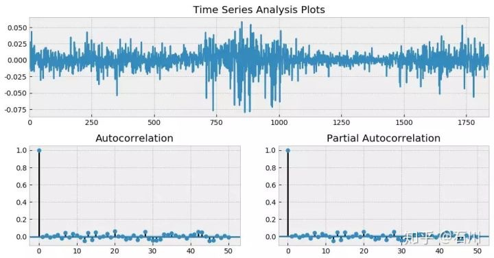
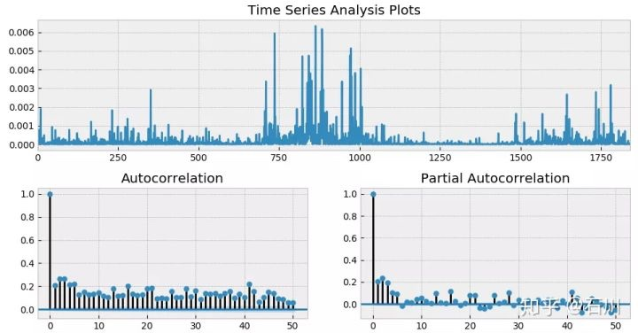
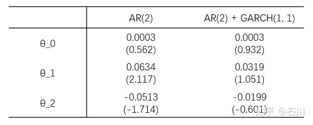
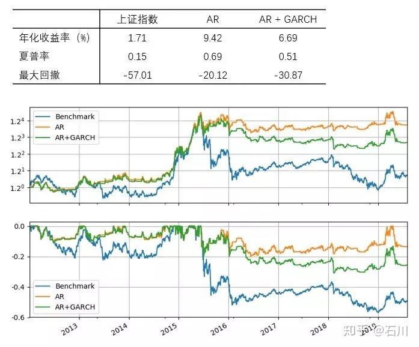
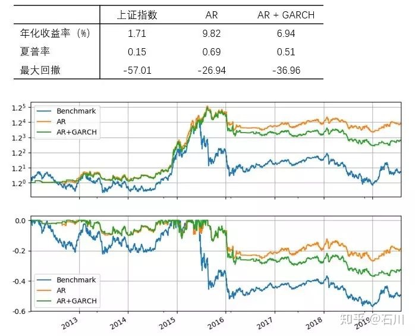

# 补完篇

[Source](https://zhuanlan.zhihu.com/p/77307871 "Permalink to 写给你的金融时间序列分析：补完篇")

摘要

本文介绍时间序列分析中的 GARCH 模型，阐述使用 mean model 和 volatility model 对收益率序列联合建模的方法。

## 1 引言

两年前，我们推出了《写给你的金融时间序列分析》系列，通过四篇文章介绍了金融数据时序分析建模的基础知识。这四篇文章的内容分别为：

* **[基础篇](../01-basic/)** 介绍金融时序特性和进行时间序列分析的目的；解释时间序列分析中的核心概念：自相关性。
* **[初级篇](../02-primer/)** 说明时间序列建模的过程；介绍时间序列分析中的最基本模型：白噪声和随机游走。
* **[进阶篇](../03-advance/)** 介绍时间序列分析中常用的线性模型：AR、MA 以及 ARMA。
* **[应用篇](../04-practices/)** 利用 ARMA 对上证指数收益率序列建模，并以此产生交易信号、构建投资策略，以此说明时间序列分析在量化投资领域的应用。

通过前述四篇文章的介绍可知，金融时间序列分析的核心是找到资产收益率序列的自相关性，并利用它。以 2012 年 1 月 1 日到 2019 年 7 月 31 日上证指数日频对数收益率为例，假设使用 ARMA(3, 2) 对其建模，并考察其残差。下图展示了残差时序以及它的 ACF 和 Partial ACF（PACF）。

从 ACF 和 PACF 上不难看出，在很多 lags 上，自相关系数是超过 95% 的置信区间的；而从最上面一副图中也能明显看出收益率序列的一大特征 —— 波动率聚类。如果把残差取平方，并再次作图，上述波动率聚类则会变得更加直观。它在数学上被称为条件异方差（conditional heteroskedasticity）。

上述结果意味着，仅使用 ARMA 对收益率序列建模是不够的，它对条件异方差无能为力。为了解决这个问题需要对波动率建模，即使用 **Generalized Autoregressive Conditional Heteroskedasticity（GARCH）模型**。

不介绍 GARCH 的时间序列分析系列大抵是不完整的；此外也有小伙伴留言说能不能写写 GARCH。所以今天就来补作业了，也因此给这篇文章起了个“补完篇”的名字。

考虑到本系列前四篇“狠狠”的参考了 [https://quantstart.com](https://quantstart.com) 上相关文章的“优良传统”，我在本文第 3 小节介绍 GARCH 的数学模型时也会再次借鉴（参考文献中有链接）。最后，再给 [https://quantstart.com](https://quantstart.com) 打个 call（必须给足它 credits），它上面的所有文章都非常值得一读。

下文以资产收益率序列作为研究对象，介绍相关概念：第 2 节解释模型的结构；第 3 节介绍 ARCH 和 GARCH 的数学背景知识；第 4 节说明如何使用 ARMA 和 GARCH 对收益率的条件均值和条件方差进行联合建模；第 5 节针对上证指数做简单实证；第 6 节总结全文。

## 2 模型的结构

首先来看看“条件异方差”一词。

波动率聚类说明不同阶段收益率的方差是不同的，这就是异方差性（heteroskedastic）。而很多时候，资产收益率表现出高波动伴随着高波动时期（大牛市或者股灾的时候），而低波动又往往伴随着低波动，因此**波动率之间是存在序列相关性的**，这就是“条件”一词的来源。将二者结合就有了条件异方差。

**使用 GARCH 建模，是为了在 $r_t$ 的线性自相关性之上考虑其方差之间的相关性，即把均值模型和波动率模型放在一个整体框架中考虑（Tsay 2010）。** 假设 $t – 1$ 时刻所有已知的信息为$F_{t-1}$ ，则当给定 $F_{t-1}$ 时，t 时刻收益率的条件均值和条件方差可写为：

$$
\begin{align}
\mu_t & = E[r_t|F_{t-1}] \\
\sigma_t^2 & = var(r_t|F_{t-1}) = E[(r_t -\mu_t)^2|F_{t-1}]
\end{align}
$$

对于条件均值 $\mu_t$ ，它可以是一个常数，也可以使用我们已经掌握的 ARMA 模型对其建模。一旦有了$\mu_t$ 的模型，$r_t$ 可以写作：

$$ r_t = \mu_t + \epsilon_t $$ 

上式中 $\epsilon_t$ 是 $t$ 时刻的扰动或者新息。结合上式和条件方差的定义可知，$t$ 时刻收益率 $r\_t$ 的条件方差由 $\epsilon_t$ 的方差决定：

$$ \sigma_t^2 = var(r_t|F_{t-1}) = var(\epsilon_t|F_{t-1})$$

从模型结构不难看出，为了考虑条件异方差则需要对$\epsilon_t$建模，而这正是 GARCH 的目标。

## 3 ARCH 和 GARCH

在介绍 GARCH 之前不妨先来看看 ARCH，毕竟 GARCH 只是在它前面加了一个 G（generalized）从而将其推广了。ARCH 由 Engle (1982) 提出，它是第一个对波动率建模的系统性框架。

对于 $\epsilon_t$，考虑如下模型（其中 $w_t$ 表示均值为 0、方差为 1 的白噪声）：

$$
\begin{align}
\epsilon_t & =  \sigma_tw_t \\
\sigma_t^2 & =  \alpha_0 + \alpha_1\epsilon_{t-1}^2
\end{align}
$$

把 $\sigma_t$ 的表达式带回到 $\epsilon_t$ 中可得：

$$ \epsilon_t = w_t \sqrt{\alpha_0 + \alpha_1\epsilon_{t-1}^2}$$

**这个关于序列 $\{\epsilon_t\}$的模型称作一阶自回归条件异方差模型，也就是最简单的 ARCH(1) 过程** —— 括号里的系数 1 表明自回归模型中只考虑了 lag = 1 阶。为了直观看出方差序列之间的关系，将上式两边平方：

$$
\begin{array}{rll}
\mbox{var}(\epsilon_t) & = & \mbox{E}[\epsilon_t^2]-(\mbox{E}[\epsilon_t])^2 \\
                       & = & \mbox{E}[\epsilon_t^2]\\
                       & = & \mbox{E}[\omega_t^2]\mbox{E}[\alpha_0 + \alpha_1\epsilon_{t-1}^2]\\
                       & = & \mbox{E}[\alpha_0+\alpha_1\epsilon_{t-1}^2]\\
                       & = & \alpha_0 + \alpha_1\mbox{var}(\epsilon_{t-1})
\end{array})
$$

上式清晰的显示了$var(\epsilon_t)$ 和 $var(\epsilon_{t-1})$ 之间的关系。前面我们提到， $\{\epsilon_t)\}$ 的模型是一个 ARCH(1) 过程。从 $var(\epsilon_t)$ 和$var(\epsilon_{t-1})$ 的关系可知，**一个 ARCH(1) 过程的方差 —— 即 $var(\epsilon_t)$ —— 正是一个 AR(1)，即一阶自回归过程。**

接下来我们照猫画虎，将 ARCH(1) 简单推广到多阶 lags，就得到 ARCH(p) 过程：

$$
\displaystyle\epsilon_t=\omega_t\sqrt{\alpha_0+\sum_{i=1}^p\alpha_i\epsilon_{t-i}^2}
$$

类似的，我们可以说一个 ARCH(p) 过程的方差是一个 AR(p)，即 p 阶自回归过程；这相当于对方差使用 AR(p) 来建模。**既然能对方差用 AR(p) 来建模，那么很自然的一个问题就是，为什么不把 MA(q) 也加上得到方差的 ARMA(p, q) 模型呢？如此便引出了 GARCH(p, q)。**

对于 $\epsilon_t$ ，考虑如下模型：

$$
\begin{array}{rll}
\epsilon_t&=&\sigma_t\omega_t\\
\sigma_t^2&=&\displaystyle\alpha_0+\sum_{i=1}^{p}\alpha_i\epsilon_{t-i}^2+\sum_{j=1}^{q}\beta_j\sigma_{t-j}^2+\end{array}
$$

这就是大名鼎鼎的 **GARCH(p, q) 模型 —— (p, q) 阶的广义自回归条件异方差模型。**有了 GARCH 我们就可以用它对收益率建模了。

## 4 使用 ARMA + GARCH 对收益率建模

本小节来看看如何在第二节介绍的体系下使用 $\text{ARMA}(p, q)$ 和 $\text{GARCH}(p', q')$ 来对 $r_t$ 进行联合建模。为了区分条件均值模型和条件方差模型中的自回归阶数，我特意用了 $(p, q)$ 和 $(p', q')$ 表示。

将前面的内容整合到一起得到关于$r_t$ 的模型如下：

$$
\begin{array}{rll}
r_t & = & \mu_t\epsilon_t\\
\mu_t & = & \displaystyle\theta_0\sum_{i=1}^p\theta_ir_{t-i}\sum_{j=1}^q\eta_j\epsilon_{t-j}\\
\epsilon_t  & = & \sigma_t\omega_t\\
\sigma_t^2  & = & \displaystyle\alpha_0\sum_{i=1}^{p^\prime}\alpha_i\epsilon_{t-i}^2
\sum_{j=1}^{q^\prime}\beta_j\sigma_{t-j}^2
\end{array}
$$

**当我们对 **![[公式]](https://www.zhihu.com/equation?tex=r_t)** 建模时，需要同时指定** **mean model（对 **![[公式]](https://www.zhihu.com/equation?tex=%CE%BC_t)** 建模）以及 volatility model（对 **![[公式]](https://www.zhihu.com/equation?tex=%CE%B5_t)** 建模）。**上式使用了 ARMA(p, q) 作为 mean model，但根据实际问题也可以使用更简单的模型，比如 ![[公式]](https://www.zhihu.com/equation?tex=%CE%BC_t) = 常数；使用了 GARCH(p', q') 作为 volatility model。最后使用已有的数据对这两个模型的参数进行联合估计。

在实际应用中，无论使用 python 还是 R 的相关 package，在调用时都要指定 mean model 和 volatility model。举个例子，在 [https://quantstart.com](https://quantstart.com/articles/ARIMA-GARCH-Trading-Strategy-on-the-SP500-Stock-Market-Index-Using-R) 上一篇使用 ARMA 对 mean 建模、用 GARCH 对 volatility 建模来交易 S&P500 指数的例子中，作者对两个模型同时进行了设定。

> Once we have chosen the specification we carry out the actual fitting of ARMA+GARCH using the ugarchfit command, which takes the specification object, the k
 returns of the S&P500 and a numerical optimisation solver. We have chosen to use hybrid, which tries different solvers in order to increase the likelihood of convergence:

>     spec = ugarchspec(
>                 variance.model=list(garchOrder=c(1,1)),
>                 mean.model=list(armaOrder=c(final.order[1], final.order[3]), include.mean=T),
>                 distribution.model="sged")
>     
>     fit = tryCatch(
>       ugarchfit(
>         spec, spReturnsOffset, solver = 'hybrid'
>       ), error=function(e) e, warning=function(w) w
>     )

在具体 GARCH 建模时可以遵如下步骤（Tsay 2010）：

1. 使用 ARMA 对 $r_t$ 建模以消除任何线性依赖，确定最优参数 $p$ 和 $q$（可以利用 AIC/BIC 来确定）；
2. 对上述模型的残差进行 GARCH 分析；
3. 如果残差中表现出显著的条件异方差，则给定一个波动模型 $ \text{GARCH}(p', q') $；
4. 使用历史数据对第一步中的 $\text{ARMA}(p, q)$ 和第三步中的 $ \text{GARCH}(p', q') $ 进行联合参数估计；
5. 仔细检验第四步中拟合出的模型，如有必要则对其进行修改。

以上五步构成了对条件均值和条件方差的联合建模，使用得到的模型就可以对未来的 $r_t$ 以及 $\mbox{var(r_t)}$ 进行预测。

在离开本节之前，我们再来介绍两个使用 GARCH 建模时**不十分正确**的做法（希望能帮你排雷）。

**错误做法一：用 $ARMA(p, q)$ 的阶数作为 $GARCH(p', q')$ 的阶数**

网上一些资料中提过这样的做法：首先是用 ARMA 对 $r\_t$ 建模、确定最优的参数 p 和 q；然后将它们作为波动率模型的阶数，即 $GARCH(p, q)$，同时在联合建模时仅假设 mean model $\mu_t = \text{constant} $。这种做法使用从 $r_t$ 线性关系找到的 p 和 q 去对 $r_t$ 的波动率的关系建模，然后又假设 mean model 是常数，着实令人费解。

**错误做法二：将 mean model 和 volatility model 拆开估计**

这种做法听上去更“靠谱”一些。首先是用 ARMA 对 $r_t$ 建模，确定最优参数 p 和 q；然后使用 ARMA 模型的残差为被解释变量，对其进行 GARCH(p', q') 建模；第二步中因为被解释变量是残差，因此 GARCH 模型的 mean model $\mu_t = 0 $，即假设残差均值为零。

这种做法看似合理，但是从条件均值角度来说，它也仅仅是利用了 ARMA 这一步（第二步的 GARCH 建模由于假设 mean model$\mu_t = 0$ 因此对条件均值不再有影响），而没有利用 ARMA + GARCH 的联合估计考察异方差对收益率序列的影响。通常来说，就 ARMA 的参数而言，仅使用 ARMA 和联合使用 ARMA + GARCH 的结果是有差异的。

举个例子：使用 AR(2) 和 AR(2) + GARCH(1, 1) 两种方法对收益率建模。

插播一句：有小伙伴可能会问，为什么用 AR 不用 ARMA。这是因为 python 中的 arch package 目前所支持的 mean model 中不包括 ARMA 模型，但包括 AR 模型。R 在这方面支持的更强大一些。

OK，回到例子。下表展示了两种方法建模时，AR(2) 的参数，可以看出它们之间的差异。

所以，GARCH 模型虽好，但是 use with care。我们应时刻搞清楚是在对什么建模、怎么建模，mean model 是什么、volatility model 又是什么。

## 5 简单实证

最后通过一个 toy example 来介绍 ARMA + GARCH 的应用。

以下对上证指数自 2012 年 1 月到 2019 年 7 月的日频对数收益率进行时间序列建模，并使用该模型预测下一个交易的收益率。如果预测为正则选择持有上证指数，反之则空仓；假设以收盘价成交且不考虑任何交易成本。

在构建策略时，采用长度为 T 的滚动窗口历史数据。首先是用 AR 对收益率建模（因为 python arch package 不支持 ARMA 作为 mean model，所以仅使用 AR(p) 模型），并根据 AIC 选择最优 p 值（p 取值范围为 0 到 5）；然后以该 AR(p) 作为 mean model，并使用 GARCH(1, 1) 模型为 volatility model，进行联合参数估计。使用最终的模型预测下一个交易日收益率。此外作为比较，我们也考虑仅采用 AR(p) 来对收益率建模，而不考虑条件异方差的影响。

首先来看 T = 60 个交易日的情况。下图展示了 AR 和 AR + GARCH 两种策略的净值和回撤曲线。就表现而言，它们均战胜了上证指数本身（benchmark）。但是在股灾之后（波动率变大了），这两种模型的表现发生了分化，就这个简单实证而言，AR 的效果比 AR + GARCH 更好。

再来看看把滚动窗口长度换到 T = 252 的情况。结果和上面接近，依然是 AR 战胜了 AR + GARCH 的组合。

从本小节的例子来看，加入了 GARCH 的策略似乎并没有仅使用 AR 的策略优异。我在最后的结语部分对此做简单评价。

## 6 结语

作为“补完篇”，本文填了《写给你的金融时间序列分析》最后一个大坑 —— GARCH；写作的重点在于阐述使用 mean model 和 volatility model 对收益率序列联合建模，以及在一个整合的框架下对两种模型的参数进行联合估计。

本文的第 5 节给出了一个简单实证。因 python arch package 的功能所限，实证中的 mean model 仅采用了 AR 模型。感兴趣的小伙伴不妨尝试 R 的相关 packages。

从实证结果来看，加入 GARCH 似乎没什么效果。但不要忘了，我们并没有对 GARCH 的参数进行任何优化，也没有额外利用其对波动率的建模来添加更加复杂的规则 —— 比如 volatility scaling。因此，仅仅基于这个简单的例子难以对 GARCH 的贡献做出任何正确的评判。

对于量化投资的研究来说，构建出策略并看到回测出来的净值曲线无疑是最令人激动的。然而，真正研究工作的核心却在于搞懂每个模型的原理以及它的作用，而这个过程注定是枯燥的。Quantstart Team 在其时间序列分析系列文章（以及其他系列）中不厌其烦的介绍每个基础模型，从简单到复杂，像搭积木一样为读者构建知识体系，令人敬佩。

现在，我们有了时间序列分析的各个 building blocks。但是，能够用它们做什么、如何去更科学的对收益率分析、预测，还需有经验的积累。最后，我想以下面这段出自 Quantstart 的话作为本系列的结束，也希望与各位共勉。

> True quantitative trading research is careful, measured and takes significant time to get right. There is no quick fix or "get rich scheme" in quant trading.

## 参考文献

* Engle, R. F. (1982). Autoregressive conditional heteroscedasticity with estimates of the variance of United Kingdom inflation. *Econometrica*, Vol. 50(4), 987 – 1008.
* Tsay, R. S. (2010). *Analysis of Financial Time Series* (3rd ed). Wiley.
* [Generalised Autoregressive Conditional Heteroskedasticity GARCH-p-q Models for Time-Series analysis](https://www.quantstart.com/articles/Generalised-Autoregressive-Conditional-Heteroskedasticity-GARCH-p-q-Models-for-Time-Series-Analysis)

**免责声明：** 文章内容不可视为投资意见。市场有风险，入市需谨慎。