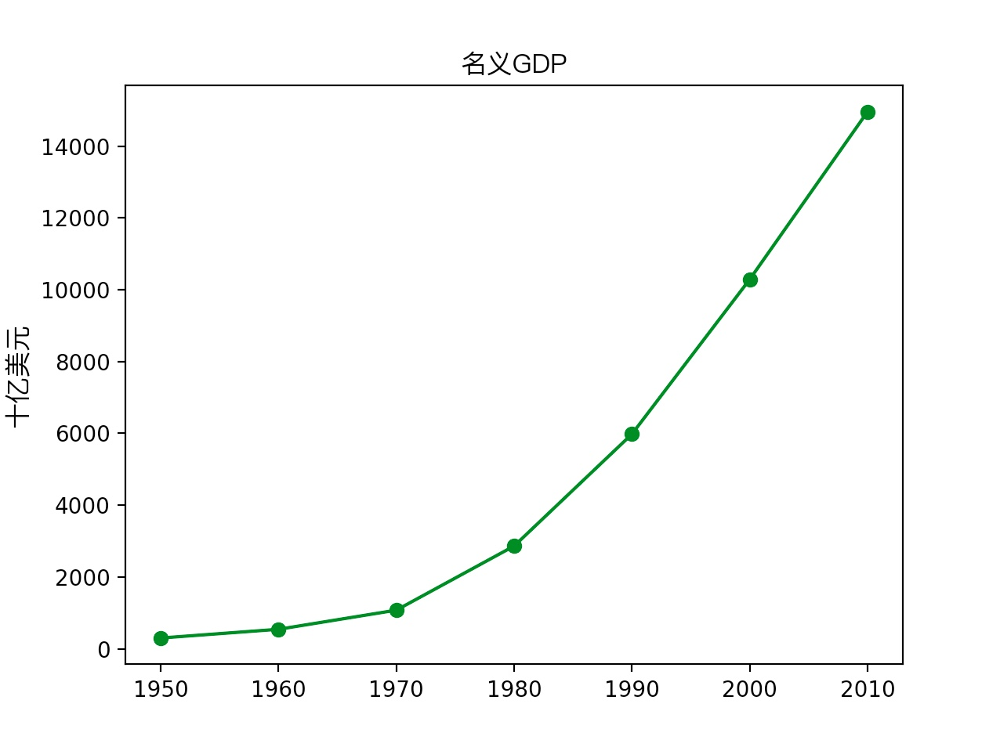

# 让 Python 中 matplotlib 图支持中文

默认情况下， mtaplotlib 不支持中文显示标题，轴标等。如果需要中文支持，则需要显式的引入字体管理，并指定使用何种字体显示，这里给出一个例子

```python
from matplotlib import pyplot as plt
from matplotlib.font_manager import FontProperties

years = [1950, 1960, 1970, 1980, 1990, 2000, 2010]
gdp = [300.2, 543.3, 1075.9, 2862.5, 5979.6, 10289.7, 14958.3] 
font = FontProperties(fname=r'/System/Library/Fonts/PingFang.ttc', size=12)
# 创建一幅线图，x轴是年份，y轴是gdp
plt.plot(years, gdp, color='green', marker='o', linestyle='solid') 
# 添加一个标题
plt.title(u"名义GDP", fontproperties=font)
# 给y轴加标记 
plt.ylabel(u"十亿美元", fontproperties=font)
plt.show()
```

显示的图如下：



如果设置的中文较多，上述代码显得啰嗦，可以先预先设定画图时的默认字体及相关属性，类似如下：

```python
from matplotlib import pyplot as plt
from matplotlib import rcParams
from matplotlib.font_manager import FontProperties


# 如果你想要的字体不在 matplotlib 库里，则需要将字体（转换），然后拷贝到它可以寻找他的位置，
#下面的代码可以打印它能获取的所有字体
#否则只需要指定字符集就好了
#from  matplotlib.font_manager import fontManager as ft
#print([f.name for f in ft.ttflist])
#
rcParams['font.family'] = "FZHei-B01, Input Mono"

years = [1950, 1960, 1970, 1980, 1990, 2000, 2010]
gdp = [300.2, 543.3, 1075.9, 2862.5, 5979.6, 10289.7, 14958.3] 

plt.plot(years, gdp, color='green', marker='o', linestyle='solid') 
plt.title(u"名义GDP")

plt.ylabel(u"十亿美元")
plt.show()
```