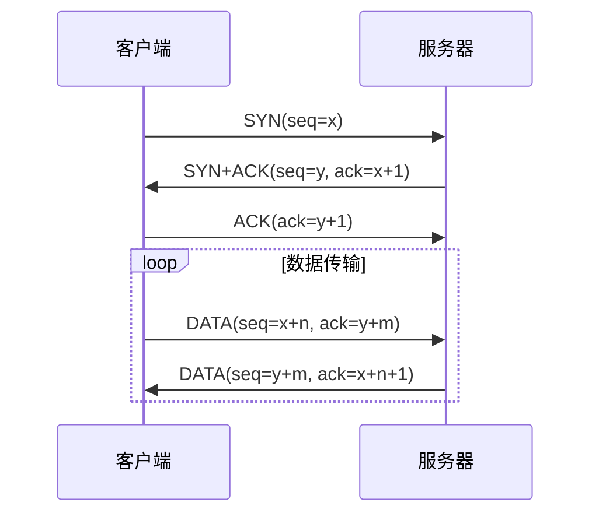
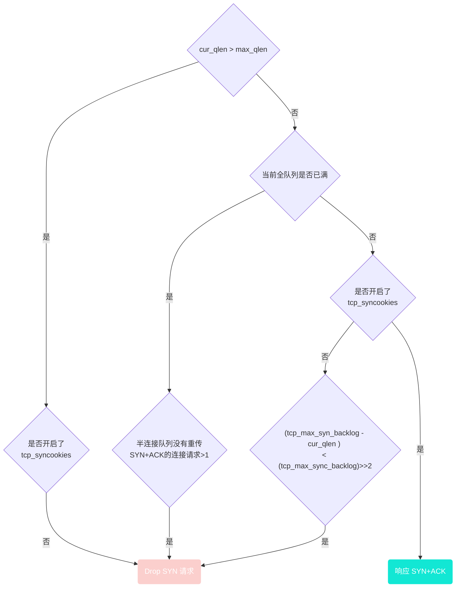

# 详解 TCP 半连接队列与全连接队列

[Source](https://www.51cto.com/article/687595.html)

这篇文档的原始来源为 <https://www.51cto.com/article/687595.html> ，我按照文档的思路，自己进行了实现并根据实际的实际情况进行了调整。

以下实验的配置环境为：

- 服务端: 
  - CPU:  11th Gen Intel(R) Core(TM) i5-1135G7 @ 2.40GHz
  - OS: Ubuntu 22.10 x86_64
  - IP: 192.168.31.76
- 客户端：
  - CPU:  3.4 GHz 四核Intel Core i5
  - OS: macOS Ventura 13.2.1
  - IP: 192.168.31.205

## 前言

某次大促值班 ing，对系统稳定性有着充分信心、心态稳如老狗的笔者突然收到上游反馈有万分几的概率请求我们 endpoint 会出现 Connection timeout 。此时系统侧的 apiserver 集群水位在 40%，离极限水位还有着很大的距离，当时通过紧急扩容 apiserver 集群后错误率降为了 0。事后进行了详细的问题排查，定位分析到问题根因出现在系统连接队列被打满导致，之前笔者对 TCP 半连接队列、全连接队列不太了解，只依稀记得 《TCP/IP 详解》中好像有好像提到过这两个名词。

本篇文章将结合理论知识、内核代码、操作实验为你呈现如下内容：

- 半连接队列、全连接队列介绍
- 常用命令介绍
- 全连接队列实战 —— 最大长度控制、全连接队列溢出实验、实验结果分析
- 半连接队列实战 —— 最大长度控制、半连接队列溢出实验、实验结果分析

## 半连接队列、全连接队列




[](https://s3.51cto.com/oss/202110/27/3d05f574867b70d1134e685e5f5ac137.jpg)

在 TCP 三次握手的过程中，Linux 内核会维护两个队列，分别是：

- 半连接队列 (SYN Queue)
- 全连接队列 (Accept Queue)

正常的 TCP 三次握手过程：

1、Client 端向 Server 端发送 SYN 发起握手，Client 端进入 SYN_SENT 状态

2、Server 端收到 Client 端的 SYN 请求后，Server 端进入 SYN_RECV 状态，此时内核会将连接存储到半连接队列(SYN Queue)，并向 Client 端回复 SYN+ACK

3、Client 端收到 Server 端的 SYN+ACK 后，Client 端回复 ACK 并进入 ESTABLISHED 状态

4、Server 端收到 Client 端的 ACK 后，内核将连接从半连接队列(SYN Queue)中取出，添加到全连接队列(Accept Queue)，Server 端进入 ESTABLISHED 状态

5、Server 端应用进程调用 accept 函数时，将连接从全连接队列(Accept Queue)中取出

半连接队列和全连接队列都有长度大小限制，超过限制时内核会将连接 Drop 丢弃或者返回 RST 包。

## 相关指标查看

### ss 命令

通过 ss 命令可以查看到全连接队列的信息

复制

```shell
# -n 不解析服务名称 
# -t 只显示 tcp sockets 
# -l 显示正在监听(LISTEN)的 sockets 
 
$ ss -lnt 
State      Recv-Q Send-Q    Local Address:Port         Peer Address:Port 
LISTEN     0      128       [::]:2380                  [::]:* 
LISTEN     0      128       [::]:80                    [::]:* 
LISTEN     0      128       [::]:8080                  [::]:* 
LISTEN     0      128       [::]:8090                  [::]:* 
 
$ ss -nt 
State      Recv-Q Send-Q    Local Address:Port         Peer Address:Port 
ESTAB      0      0         [::ffff:33.9.95.134]:80                   [::ffff:33.51.103.59]:47452 
ESTAB      0      536       [::ffff:33.9.95.134]:80                  [::ffff:33.43.108.144]:37656 
ESTAB      0      0         [::ffff:33.9.95.134]:80                   [::ffff:33.51.103.59]:38130 
ESTAB      0      536       [::ffff:33.9.95.134]:80                   [::ffff:33.51.103.59]:38280 
ESTAB      0      0         [::ffff:33.9.95.134]:80                   [:: 
```

### 对于 LISTEN 状态的 socket

- Recv-Q：当前全连接队列的大小，即已完成三次握手等待应用程序 accept() 的 TCP 链接
- Send-Q：全连接队列的最大长度，即全连接队列的大小

### 对于非 LISTEN 状态的 socket

- Recv-Q：已收到但未被应用程序读取的字节数
- Send-Q：已发送但未收到确认的字节数

相关内核代码：

```c
// https://github.com/torvalds/linux/blob/master/net/ipv4/tcp_diag.c 
static void tcp_diag_get_info(struct sock *sk, struct inet_diag_msg *r, 
            void *_info) 
{ 
  struct tcp_info *info = _info; 
 
  if (inet_sk_state_load(sk) == TCP_LISTEN) { // socket 状态是 LISTEN 时 
    r->idiag_rqueue = READ_ONCE(sk->sk_ack_backlog);  // 当前全连接队列大小 
    r->idiag_wqueue = READ_ONCE(sk->sk_max_ack_backlog); // 全连接队列最大长度 
  } else if (sk->sk_type == SOCK_STREAM) {    // socket 状态不是 LISTEN 时 
    const struct tcp_sock *tp = tcp_sk(sk); 
    r->idiag_rqueue = max_t(int, READ_ONCE(tp->rcv_nxt) - 
               READ_ONCE(tp->copied_seq), 0);    // 已收到但未被应用程序读取的字节数 
    r->idiag_wqueue = READ_ONCE(tp->write_seq) - tp->snd_una;   // 已发送但未收到确认的字节数 
  } 
  if (info) 
    tcp_get_info(sk, info); 
} 
```

**netstat 命令**

通过 netstat -s 命令可以查看 TCP 半连接队列、全连接队列的溢出情况

复制

```shell
$ netstat -s | grep -i "listen" 
    189088 times the listen queue of a socket overflowed 
    30140232 SYNs to LISTEN sockets dropped 
```

上面输出的数值是累计值，分别表示有多少 TCP socket 链接因为全连接队列、半连接队列满了而被丢弃

- `189088 times the listen queue of a socket overflowed` 代表有 189088 次全连接队列溢出
- `30140232 SYNs to LISTEN sockets dropped` 代表有 30140232 次半连接队列溢出

在排查线上问题时，如果一段时间内相关数值一直在上升，则表明半连接队列、全连接队列有溢出情况

## 全连接队列实战

### 最大长度控制

TCP 全连接队列的最大长度由 $min(somaxconn, backlog)$ 控制，其中：

- somaxconn 是 Linux 内核参数，由 `/proc/sys/net/core/somaxconn` 指定
- backlog 是 TCP 协议中 listen 函数的参数之一，即 `int listen(int sockfd, int backlog)` 函数中的 backlog 大小。在 Golang 中，listen 的 backlog 参数使用的是 `/proc/sys/net/core/somaxconn` 文件中的值。

相关内核代码：

```c
// https://github.com/torvalds/linux/blob/master/net/socket.c 
 
/* 
 *  Perform a listen. Basically, we allow the protocol to do anything 
 *  necessary for a listen, and if that works, we mark the socket as 
 *  ready for listening. 
 */ 
int __sys_listen(int fd, int backlog) 
{ 
  struct socket *sock; 
  int err, fput_needed; 
  int somaxconn; 
 
  sock = sockfd_lookup_light(fd, &err, &fput_needed); 
  if (sock) { 
    somaxconn = sock_net(sock->sk)->core.sysctl_somaxconn;  // /proc/sys/net/core/somaxconn 
    if ((unsigned int)backlog > somaxconn) 
      backlog = somaxconn;   // TCP 全连接队列最大长度 min(somaxconn, backlog) 
 
    err = security_socket_listen(sock, backlog); 
    if (!err) 
      err = sock->ops->listen(sock, backlog); 
 
    fput_light(sock->file, fput_needed); 
  } 
  return err; 
} 
```

### 实验

服务端 server 代码

```go
// server.go
// go build server.go
// ./server
package main 
 
import ( 
  "log" 
  "net" 
  "time" 
) 
 
func main() { 
  l, err := net.Listen("tcp", ":8888") 
  if err != nil { 
    log.Printf("failed to listen due to %v", err) 
  } 
  defer l.Close() 
  log.Println("listen :8888 success") 
 
  for { 
    time.Sleep(time.Second * 100) 
  } 
} 
```

在测试环境查看 somaxconn 的值为 128

```shell
$ cat /proc/sys/net/core/somaxconn 
128 
```

启动服务端，通过 `ss -lnt | grep :8888` 确认全连接队列大小

```shell
LISTEN     0      128       [::]:8888                  [::]:* 
```

全连接队列最大长度为 128

现在更新 somaxconn 值为 1024，再重新启动服务端。

1. 更新 `/etc/sysctl.conf` 文件，该文件为内核参数配置文件
   1. 新增一行 `net.core.somaxconn=1024`
2. 执行 `sysctl -p` 使配置生效
  ```shell
  $ sudo sysctl -p 
  net.core.somaxconn = 1024 
  ```

3. 检查 ` /proc/sys/net/core/somaxconn` 文件，确认 somaxconn 为更新后的 1024
  ```shell
  $ cat /proc/sys/net/core/somaxconn 
  1024 
  ```

重新启动服务端， 通过 `ss -lnt | grep :8888` 确认全连接队列大小

```shell
$ ss -lnt | grep 8888 
LISTEN     0      1024      [::]:8888                  [::]:* 
```

可以看到，现在全链接队列最大长度为 1024，成功更新。

### 全连接队列溢出

下面来验证下全连接队列溢出会发生什么情况，可以通过让服务端应用只负责 Listen 对应端口而不执行 accept() TCP 连接，使 TCP 全连接队列溢出。

**实验物料**

服务端 server 代码

```go
// server 端监听 8888 tcp 端口 
 
package main 
 
import ( 
  "log" 
  "net" 
  "time" 
) 
 
func main() { 
  l, err := net.Listen("tcp", ":8888") 
  if err != nil { 
    log.Printf("failed to listen due to %v", err) 
  } 
  defer l.Close() 
  log.Println("listen :8888 success") 
 
  for { 
    time.Sleep(time.Second * 100) 
  } 
} 
```

客户端 client 代码

```go
// client 端并发请求 10 次 server 端，成功建立 tcp 连接后向 server 端发送数据 
package main 
 
import ( 
  "context" 
  "log" 
  "net" 
  "os" 
  "os/signal" 
  "sync" 
  "syscall" 
  "time" 
) 
 
var wg sync.WaitGroup 
 
func establishConn(ctx context.Context, i int) { 
  defer wg.Done() 
  conn, err := net.DialTimeout("tcp", ":8888", time.Second*5) 
  if err != nil { 
    log.Printf("%d, dial error: %v", i, err) 
    return 
  } 
  log.Printf("%d, dial success", i) 
  _, err = conn.Write([]byte("hello world")) 
  if err != nil { 
    log.Printf("%d, send error: %v", i, err) 
    return 
  } 
  select { 
  case <-ctx.Done(): 
    log.Printf("%d, dail close", i) 
  } 
} 
 
func main() { 
  ctx, cancel := context.WithCancel(context.Background()) 
  for i := 0; i < 10; i++ { 
    wg.Add(1) 
    go establishConn(ctx, i) 
  } 
 
  go func() { 
    sc := make(chan os.Signal, 1) 
    signal.Notify(sc, syscall.SIGINT) 
    select { 
    case <-sc: 
      cancel() 
    } 
  }() 
 
  wg.Wait() 
  log.Printf("client exit") 
} 
```

为了方便实验，将 somaxconn 全连接队列最大长度更新为 5：

1. 更新 `/etc/sysctl.conf`文件，将 `net.core.somaxconn` 更新为 5

2. 执行 sysctl -p 使配置生效

```shell
$ sudo sysctl -p 
net.core.somaxconn = 5 
```

**实验结果**

客户端日志输出

```shell
2021/10/11 17:24:48 8, dial success 
2021/10/11 17:24:48 3, dial success 
2021/10/11 17:24:48 4, dial success 
2021/10/11 17:24:48 6, dial success 
2021/10/11 17:24:48 5, dial success 
2021/10/11 17:24:48 2, dial success 
2021/10/11 17:24:48 1, dial success 
2021/10/11 17:24:48 0, dial success 
2021/10/11 17:24:48 7, dial success 
2021/10/11 17:24:53 9, dial error: dial tcp 33.9.192.157:8888: i/o timeout 
```

客户端 socket 情况

```shell
tcp        0      0 33.9.192.155:40372      33.9.192.157:8888       ESTABLISHED 
tcp        0      0 33.9.192.155:40376      33.9.192.157:8888       ESTABLISHED 
tcp        0      0 33.9.192.155:40370      33.9.192.157:8888       ESTABLISHED 
tcp        0      0 33.9.192.155:40366      33.9.192.157:8888       ESTABLISHED 
tcp        0      0 33.9.192.155:40374      33.9.192.157:8888       ESTABLISHED 
tcp        0      0 33.9.192.155:40368      33.9.192.157:8888       ESTABLISHED 
```

服务端 socket 情况

```shell
tcp6      11      0 33.9.192.157:8888       33.9.192.155:40376      ESTABLISHED 
tcp6      11      0 33.9.192.157:8888       33.9.192.155:40370      ESTABLISHED 
tcp6      11      0 33.9.192.157:8888       33.9.192.155:40368      ESTABLISHED 
tcp6      11      0 33.9.192.157:8888       33.9.192.155:40372      ESTABLISHED 
tcp6      11      0 33.9.192.157:8888       33.9.192.155:40374      ESTABLISHED 
tcp6      11      0 33.9.192.157:8888       33.9.192.155:40366      ESTABLISHED 
 
tcp    LISTEN     6      5      [::]:8888               [::]:*                   users:(("main",pid=84244,fd=3)) 
```

抓包结果

对客户端、服务端抓包后，发现出现了三种情况，分别是：

- client 成功与 server 端建立 tcp socket 连接，发送数据成功
- client 认为成功与 server 端建立 tcp socket 连接，发送数据失败，一直在 RETRY;server 端认为 tcp 连接未建立，一直在发送 SYN+ACK
- client 向 server 发送 SYN 未得到响应，一直在 RETRY

**全连接队列实验结果分析**

上述实验结果出现了三种情况，我们分别对抓包内容进行分析

抓包程序使用 [tshark]( https://www.wireshark.org/)，抓包命令如下：

```shell
$ sudo  tshark -Eheader=y -l   -f "tcp port 8888" -i any
```

**情况一：Client 成功与 Server 端建立 tcp socket 链接，发送数据成功**


| No.  | Source         | Destination    | Protocol | length | info                                                         |
| :--- | -------------- | -------------- | -------- | ------ | ------------------------------------------------------------ |
| 1    | 192.168.31.205 | 192.168.31.76  | TCP      | 80     | 61170 → 8888 [<font color='red'>SYN</font>] Seq=0 Win=65535 Len=0 MSS=1460 WS=64 TSval=1184189553 TSecr=0 SACK_PERM=1 |
| 9    | 192.168.31.76  | 192.168.31.205 | TCP      | 76     | 8888 → 61170 [<font color='red'>SYN, ACK</font>] Seq=0 Ack=1 Win=65160 Len=0 MSS=1460 SACK_PERM=1 TSval=648136459 TSecr=1184189553 WS=128 |
| 29   | 192.168.31.205 | 192.168.31.76  | TCP      | 68     | 61170 → 8888 [<font color='red'>ACK</font>] Seq=1 Ack=1 Win=131712 Len=0 TSval=1184189706 TSecr=648136459 |
| 32   | 192.168.31.205 | 192.168.31.76  | TCP      | 79     | 61170 → 8888 [<font color='red'>PSH, ACK</font>] Seq=1 Ack=1 Win=131712 Len=11 TSval=1184189706 TSecr=648136459 |
| 38   | 192.168.31.76  | 192.168.31.205 | TCP      | 68     | 8888 → 61170 [<font color='red'>ACK</font>] Seq=1 Ack=12 Win=65152 Len=0 TSval=648136464 TSecr=1184189706 |

上面的表格是通过抓包数据后进行了整理，`No.` 列是抓包中实际的序号，我这里把一个连接所涉及的包整理在一块，方便分析。

上表可以看到如下请求：

- Client 端(192.168.31.205)  向 Server 端(192.168.31.76) 发送 SYN 发起握手
- Server 端收到 Client 端 SYN 后，向 Client 端回复 `SYN+ACK`，socket 连接存储到半连接队列(SYN Queue)
- Client 端收到 Server 端 `SYN+ACK` 后，向 Server 端回复 ACK，Client 端进入 ESTABLISHED 状态
- Server 端收到 Client 端 ACK 后，进入 ESTABLISHED 状态，socket 连接存储到全连接队列(Accept Queue)
- Client 端向 Server 端发送数据 [PSH, ACK]，Server 端确认接收到数据 [ACK]

这种情况就是正常的请求，即全连接队列、半连接队列未满，client 成功与 server 建立了 tcp 链接，并成功发送数据。

**情况二：Client 认为成功与 Server 端建立 tcp socket 连接，后续发送数据失败，持续 RETRY;Server 端认为 TCP 连接未建立，一直在发送SYN+ACK**


| No. | Source         | Destination    | info                                                                                                             |
| :-- | -------------- | -------------- | ---------------------------------------------------------------------------------------------------------------- |
| 8 |   192.168.31.205 |  192.168.31.76 | 61177 → 8888 [SYN] Seq=0 Win=65535 Len=0 MSS=1460 WS=64 TSval=4039865585 TSecr=0 SACK_PERM=1|
| 11 |  192.168.31.76 |  192.168.31.205 | 8888 → 61177 [SYN, ACK] Seq=0 Ack=1 Win=65160 Len=0 MSS=1460 SACK_PERM=1 TSval=648136459 TSecr=4039865585 WS=128|
| 39 |  192.168.31.205 |  192.168.31.76 | 61177 → 8888 [ACK] Seq=1 Ack=1 Win=131712 Len=0 TSval=4039865738 TSecr=648136459|
| 40 |  192.168.31.205 |  192.168.31.76 | 61177 → 8888 [PSH, ACK] Seq=1 Ack=1 Win=131712 Len=11 TSval=4039865738 TSecr=648136459|
| 47 |  192.168.31.205 |  192.168.31.76 | [TCP Retransmission] 61177 → 8888 [PSH, ACK] Seq=1 Ack=1 Win=131712 Len=11 TSval=4039865969 TSecr=648136459|
| 51 |  192.168.31.205 |  192.168.31.76 | [TCP Retransmission] 61177 → 8888 [PSH, ACK] Seq=1 Ack=1 Win=131712 Len=11 TSval=4039866438 TSecr=648136459|
| 55 | 192.168.31.76 | 192.168.31.205 | [TCP Retransmission] 8888 → 61177 [SYN, ACK] Seq=0 Ack=1 Win=65160 Len=0 MSS=1460 SACK_PERM=1 TSval=648137479 TSecr=4039866438 WS=128 |
| 63 |  192.168.31.205 |  192.168.31.76 | [TCP Retransmission] 61177 → 8888 [PSH, ACK] Seq=1 Ack=1 Win=131712 Len=11 TSval=4039868453 TSecr=648136459|
| 65 | 192.168.31.76 | 192.168.31.205 | [TCP Retransmission] 8888 → 61177 [SYN, ACK] Seq=0 Ack=1 Win=65160 Len=0 MSS=1460 SACK_PERM=1 TSval=648139495 TSecr=4039868453 WS=128 |

上表可以看到如下请求：

- Client 端向 Server 端发送 SYN 发起握手
- Server 端收到 Client 端 SYN 后，向 Client 端回复 `SYN+ACK`，socket 连接存储到半连接队列(SYN Queue)
- Client 端收到 Server 端 `SYN+ACK` 后，向 Server 端回复 ACK，Client 端进入 ESTABLISHED状态(重要：此时仅仅是 Client 端认为 tcp 连接建立成功)
- 由于 Client 端认为 TCP 连接已经建立完成，所以向 Server 端发送数据 `[PSH，ACK]`，但是一直未收到 Server 端的确认 ACK，所以一直在 RETRY
- Server 端一直在 RETRY 发送 `SYN+ACK`

为什么会出现上述情况？

Server 端为什么一直在 RETRY 发送 `SYN+ACK`?

Server 端不是已经收到了 Client 端的 ACK 确认了吗?

上述情况是由于 Server 端 socket 连接进入了半连接队列，在收到 Client 端 ACK 后，本应将 socket 连接存储到全连接队列，但是全连接队列已满，所以 Server 端 DROP 了该 ACK 请求。

之所以 Server 端一直在 RETRY 发送 `SYN+ACK`，是因为 DROP 了 client 端的 ACK 请求，所以 socket 连接仍旧在半连接队列中，等待 Client 端回复 ACK。

全连接队列满 DROP 请求是默认行为，可以通过设置 `/proc/sys/net/ipv4/tcp_abort_on_overflow` 使 Server 端在全连接队列满时，向 Client 端发送 RST 报文。

`tcp_abort_on_overflow` 有两种可选值：

- 0：如果全连接队列满了，Server 端 DROP Client 端回复的 ACK
- 1：如果全连接队列满了，Server 端向 Client 端发送 RST 报文，终止 TCP socket 链接 

**为什么实验结果中当前全连接队列大小 > 全连接队列最大长度配置?**

上述结果中可以看到 Listen 状态的 socket 链接：

- Recv-Q 当前全连接队列的大小是 6
- Send-Q 全连接队列最大长度是 5

```shell
$ ss -ln | egrep '(State|:8888)'
State      Recv-Q Send-Q    Local Address:Port         Peer Address:Port 
LISTEN     6      5         [::]:8888                  [::]:* 
```

为什么全连接队列大小 > 全连接队列最大长度配置呢?

经过多次实验发现，能够进入全连接队列的 Socket 最大数量始终比配置的全连接队列最大长度 + 1。

结合其他文章以及内核代码，发现内核在判断全连接队列是否满的情况下，使用的是 `>` 而非 `>=` 。

相关内核代码：

```c
/* Note: If you think the test should be: 
 *  return READ_ONCE(sk->sk_ack_backlog) >= READ_ONCE(sk->sk_max_ack_backlog); 
 * Then please take a look at commit 64a146513f8f ("[NET]: Revert incorrect accept queue backlog changes.") 
 */ 
static inline bool sk_acceptq_is_full(const struct sock *sk) 
{ 
  return READ_ONCE(sk->sk_ack_backlog) > READ_ONCE(sk->sk_max_ack_backlog); 
} 
```

**情况三：Client 向 Server 发送 SYN 未得到相应，一直在 RETRY**

图片上图可以看到如下请求：

- Client 端向 Server 端发送 SYN 发起握手，未得到 Server 回应，一直在 RETRY

(这种情况涉及到半连接队列，这里先给上述情况发生的原因结论，具体内容将在下文半连接队列中展开。)

发生上述情况的原因由以下两方面导致：

1、开启了 `/proc/sys/net/ipv4/tcp_syncookies` 功能

2、全连接队列满了

## 半连接队列实战

### 半连接队列最大长度控制

翻阅了很多博文，查找关于半连接队列最大长度控制的相关内容，大多含糊其辞或不准确，经过不懈努力，最终找到了比较确切的内容(相关博文链接在附录中)。

很多博文中说半连接队列最大长度由 `/proc/sys/net/ipv4/tcp_max_syn_backlog` 参数指定，实际上只有在 linux 内核版本小于 `2.6.20` 时，半连接队列才等于 backlog 的大小。

这块的源码比较复杂，这里给一下大体的计算方式，详细的内容可以参考附录中的相关博文。半连接队列长度的计算过程：

$$
\begin{align}
qlen &= max(min(somaxconn, backlog, sysctl\_max\_syn\_backlog), 8)  \\ 
&// roundup\_pow\_of\_two: 将参数向上取整到最小的 2^n，注意这里存在一个 +1  \\
qlen &= roundup\_pow\_of\_two(qlen + 1)  \\ 
max\_qlen\_log &= max(3, log_2(qlen))  \\
max\_queue\_length &= 2^{max\_qlen\_log} \\
\end{align}
$$

可以看到，半连接队列的长度由三个参数指定：

- 调用 listen 时，传入的 backlog
- `/proc/sys/net/core/somaxconn` 默认值为 128
- `/proc/sys/net/ipv4/tcp_max_syn_backlog` 默认值为 1024

我们假设 listen 传入的 `backlog = 128` (Golang 中调用 listen 时传递的 backlog 参数使用的是 `/proc/sys/net/core/somaxconn`)，其他配置采用默认值，来计算下半连接队列的最大长度

$$
\begin{align}
qlen &= max(min(somaxconn, backlog, sysctl\_max\_syn\_backlog), 8) \\
		 &= max(min(128, 128, 1024), 8) \\
		 &= 128 \\ 
qlen &= roundup\_pow\_of\_two(qlen + 1) \\
			&= roundup\_pow\_of\_two(128 + 1) \\
		 &= 256 \\ 
max\_qlen\_log &= max(3, log_2{qlen}) \\
  &= max(3, 8) \\
  & = 8 \\ 
max\_queue\_length &= 2^{max\_qlen\_log} \\
   &= 2^8 \\
   &= 256 \\ 
\end{align}
$$

可以得到半队列大小是 256。

### **判断是否 Drop SYN 请求**

当 Client 端向 Server 端发送 SYN 报文后，Server 端会将该 socket 连接存储到半连接队列(SYN Queue)，如果 Server 端判断半连接队列满了则会将连接 Drop 丢弃。

那么 Server 端是如何判断半连接队列是否满的呢?除了上面一小节提到的半连接队列最大长度控制外，还和 `/proc/sys/net/ipv4/tcp_syncookies` 参数有关。(`tcp_syncookies` 的作用是为了防止 SYN Flood 攻击的，下文会给出相关链接介绍)

**流程图**

判断是否 Drop SYN 请求的流程图：




上图是整理了多份资料后，整理出来的判断是否 Drop SYN 请求的流程图。

注意：第一个判断条件 「当前半连接队列是否已超过半连接队列最大长度」在不同内核版本中的判断不一样，Linux 5.9.10 内核判断的是当前半连接队列长度是否 >= 全连接队列最大长度。

相关内核代码：

```c
// include/net/inet_connection_sock.h 
// line: 281
static inline int inet_csk_reqsk_queue_is_full(const struct sock *sk) 
{ 
  return inet_csk_reqsk_queue_len(sk) >= sk->sk_max_ack_backlog; 
} 
```

我们假设如下参数，来计算下当 Client 端只发送 SYN 包，理论上 Server 端何时会 Drop SYN 请求：

- 调用 listen 时传入的 backlog = 1024
- `/proc/sys/net/core/somaxconn` 值为 1024
- `/proc/sys/net/ipv4/tcp_max_syn_backlog` 值为 128

当 `/proc/sys/net/ipv4/tcp_syncookies` 值为 0 时

- 计算出的半连接队列最大长度为 256
- 当半连接队列长度增长至 96 后，再新增 SYN 请求，就会触发 Drop SYN 请求

当 `/proc/sys/net/ipv4/tcp_syncookies` 值为 1 时

1.计算出的半连接队列最大长度为 256

2.由于开启了 `tcp_syncookies`

- 当全连接队列未满时，永远不会 Drop 请求 (注意：经实验发现这个理论是错误的，实验发现只要半连接队列的大小 > 全连接队列最大长度就会触发 Drop SYN 请求)
- 当全连接队列满了后，即全连接队列大小到 1024 后，就会触发 Drop SYN 请求

PS：`/proc/sys/net/ipv4/tcp_syncookies` 的取值还可以为 2，笔者没有详细实验。

**回顾全连接队列实验结果**

在上文全连接队列实验中，有一类实验结果是：client 向 Server 发送 SYN 未得到响应，一直在 RETRY。

发生上述情况的原因由以下两方面导致：

1. 开启了 `/proc/sys/net/ipv4/tcp_syncookies` 功能
2. 全连接队列满了

**半连接队列溢出实验**

上文我们已经知道如何计算理论上半连接队列何时会溢出，下面我们来具体实验下

(Golang 调用 listen 时传入的 backlog 值为 somaxconn)

### 实验一

将相关参数的配置更新

```shell
$ sudo sysctl -w net.core.somaxconn=1024 
$ sudo sysctl -w net.ipv4.tcp_max_syn_backlog=128 
$ sudo sysctl -w net.ipv4.tcp_syncookies=0 
```

理论上：

- 计算出的半连接队列最大长度为 256
- 当半连接队列长度增长至 96 后，后续 SYN 请求就会触发 Drop

启动服务端 Server 监听 8888 端口

客户端 Client 发起 SYN Flood 攻击：

复制

```shell
$ sudo hping3 -S 192.168.31.76 -p 8888 --flood 
HPING 192.168.31.76 (wlp0s20f3 192.168.31.76): S set, 40 headers + 0 data bytes
hping in flood mode, no replies will be shown 
```

查看服务端 Server 8888端口处于 `SYN_RECV` 状态的 socket 最大个数：

```shell
$ sudo netstat -nat | grep :8888 | grep 'SYN_RECV'  | wc -l 
98
$ sudo netstat -nat | grep :8888 | grep 'SYN_RECV'  | wc -l 
98
```

我这里实验结果（98）和预期（96）有相差，具体原因还没有找到，当半连接队列长度增长至 98 后，后续 SYN 请求就会触发 Drop。

### 实验二

将相关参数的配置更新

```shell
$ sudo sysctl -w net.core.somaxconn=128 
$ sudo sysctl -w net.ipv4.tcp_max_syn_backlog=512 
$ sudo sysctl -w net.ipv4.tcp_syncookies=0 
```

理论上：

- 计算出的半连接队列最大长度为 256，由于笔者实验机器上的内核版本是 5.19.0，所以当半连接队列长度 >= 全连接队列最大长度时，内核就认为半连接队列溢出了
- 所以当半连接队列长度增长至 128 后，后续 SYN 请求就会触发 DROP

启动服务端 Server 监听 8888 端口(代码参考全连接队列实验物料)

客户端 Client 发起 SYN Flood 攻击：

```shell
$ sudo hping3 -S 192.168.31.76 -p 8888 --flood 
HPING 192.168.31.76 (en1 192.168.31.76): S set, 40 headers + 0 data bytes
hping in flood mode, no replies will be shown
```

查看服务端 Server 8888 端口处于 SYN_RECV 状态的 socket 最大个数：

```shell
$ sudo netstat -nat | grep :8888 | grep SYN_RECV  | wc -l 
128 

$ sudo netstat -nat | grep :8888 | grep SYN_RECV  | wc -l 
128 
```

实验结果符合预期，当半连接队列长度增长至 128 后，后续 SYN 请求就会触发 Drop

### 实验三

将相关参数的配置更新

```shell
$ sudo sysctl -w net.core.somaxconn=128 
$ sudo sysctl -w net.ipv4.tcp_max_syn_backlog=512 
$ sudo sysctl -w net.ipv4.tcp_syncookies=1
```

理论上：

- 当全连接队列未满，`syncookies = 1`，理论上 SYN 请求永远不会被 Drop

启动服务端 Server 监听 8888 端口

客户端 Client 发起 SYN Flood 攻击：

```shell
$ sudo hping3 -S 192.168.31.76 -p 8888 --flood
HPING 192.168.31.76 (en1 192.168.31.76): S set, 40 headers + 0 data bytes
hping in flood mode, no replies will be shown
```

查看服务端 Server 8888端口处于 `SYN_RECV` 状态的 socket 最大个数：

```shell
$ sudo netstat -nat | grep :8888 | grep SYN_RECV  | wc -l 
128 
 
$ sudo netstat -nat | grep :8888 | grep SYN_RECV  | wc -l 
128 
```

实验发现即使 `syncookies=1`，当半连接队列长度 > 全连接队列最大长度时，就会触发 DROP SYN 请求。与理论不符合，需要继续研究。

### 实验四

将相关参数的配置更新

```shell
$ sudo sysctl -w net.core.somaxconn=5
$ sudo sysctl -w net.ipv4.tcp_max_syn_backlog=512 
$ sudo sysctl -w net.ipv4.tcp_syncookies=1
```

发起 SYN Flood 攻击后，查看服务端 Server 8888端口处于 `SYN_RECV` 状态的 socket 最大个数：

```shell
$ sudo netstat -nat | grep :8888 | grep SYN_RECV  | wc -l 
5 
 
$ sudo netstat -nat | grep :8888 | grep SYN_RECV  | wc -l 
6 
```

确实 即使 `syncookies=1`，当半连接队列长度 > 全连接最大长度时，就会触发 DROP SYN 请求。

### 实验五：

理论上：

- 当半连接队列大小到 256 后，后触发 DROP SYN 请求

将相关参数的配置更新

```shell
$ sudo sysctl -w net.core.somaxconn=256
$ sudo sysctl -w net.ipv4.tcp_max_syn_backlog=512 
$ sudo sysctl -w net.ipv4.tcp_syncookies=1
```

启动服务端 Server 监听 8888 端口。

客户端 Client 发起 SYN Flood 攻击:

```shell
$ sudo hping3 -S 192.168.31.76 -p 8888 --flood
HPING 192.168.31.76 (en1 192.168.31.76): S set, 40 headers + 0 data bytes
hping in flood mode, no replies will be shown
```

查看服务端 Server 8888 端口处于 `SYN_RECV` 状态的 socket 最大个数：

```shell
$ sudo netstat -nat | grep :8888 | grep SYN_RECV  | wc -l 
256 

$ sudo netstat -nat | grep :8888 | grep SYN_RECV  | wc -l 
256 
```

实验结果符合预期，当半连接队列长度增长至 256 后，后续 SYN 请求就会触发 Drop。

## 回顾线上问题

再回顾值班时遇到的 Connection timeout 问题，当时相关系统参数配置为：

- net.core.somaxconn = 128
- net.ipv4.tcp_max_syn_backlog = 512
- net.ipv4.tcp_syncookies = 1
- net.ipv4.tcp_abort_on_overflow = 0

所以出现 Connection timeout 有两种可能情况：

1、半连接队列未满，全连接队列满，Client 端向 Server 端发起 SYN 被 DROP (参考全连接队列实验结果情况三分析、半连接队列溢出实验情况三)

2、全连接队列未满，半连接队列大小超过全链接队列最大长度(参考半连接队列溢出实验情况三、半连接队列溢出实验情况四)

问题的最快修复方式是将 `net.core.somaxconn` 调大，以及 `net.ipv4.tcp_abort_on_overflow` 设置为 1，`net.ipv4.tcp_abort_on_overflow` 设置为 1 是为了让 client fail fast。

## 总结

半连接队列溢出、全连接队列溢出这类问题很容易被忽略，同时这类问题又很致命。当半连接队列、全连接队列溢出时 Server 端，从监控上来看系统 cpu 水位、内存水位、网络连接数等一切正常，然而却会持续影响 Client 端业务请求。对于高负载上游使用短连接的情况，出现这类问题的可能性更大。

本文详细梳理了 TCP 半连接队列、全连接队列的理论知识，同时结合 Linux 相关内核代码以及详细的动手实验，讲解了 TCP 半连接队列、全连接队列的相关原理、溢出判断、问题分析等内容，希望大家在阅读后可以对 TCP 半连接队列、全连接队列有更充分的认识。

PS：可以去线上检查下服务器的相关参数哟~

附录

这里罗列下相关参考博文资料：

Linux 源码

- https://github.com/torvalds/linux

Linux 诡异的半连接队列长度

- https://www.cnblogs.com/zengkefu/p/5606696.html

TCP 半连接队列和全连接队列满了会发生什么

- https://www.cnblogs.com/xiaolincoding/p/12995358.html

一次 HTTP connect-timeout 排查

- https://www.jianshu.com/p/3b9c4216b822

Connection Reset 排查

- https://cjting.me/2019/08/28/tcp-queue/

深入浅出 TCP 中的 SYN-Cookies

- https://segmentfault.com/a/1190000019292140

《TCP/IP 详解 卷一：协议》第十八章
- https://flylib.com/books/en/3.223.1.193/1/